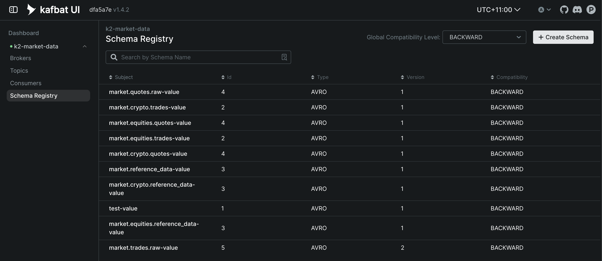
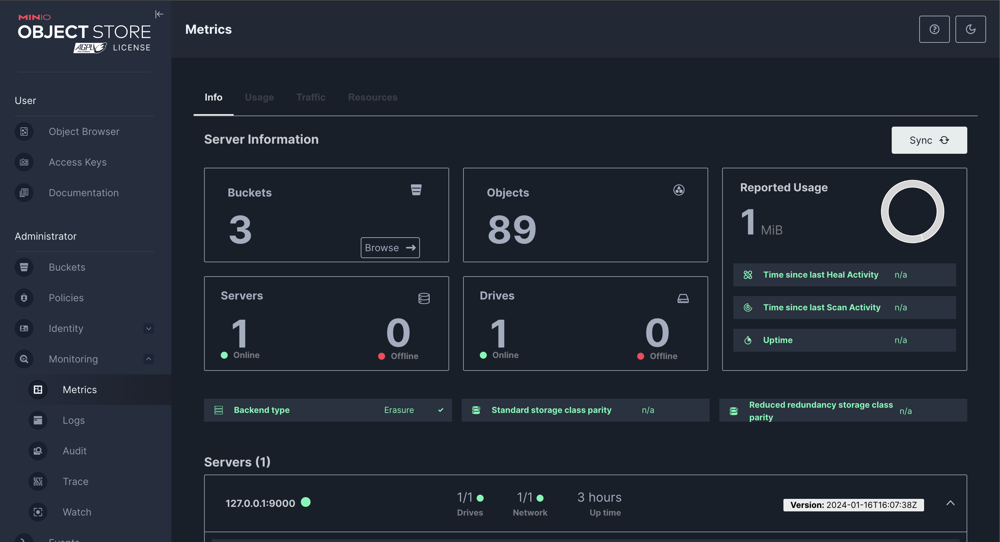
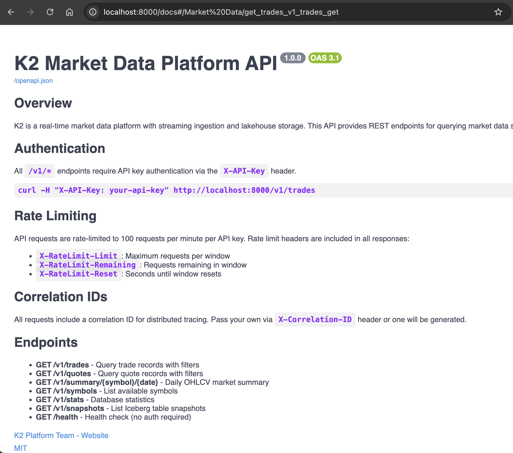
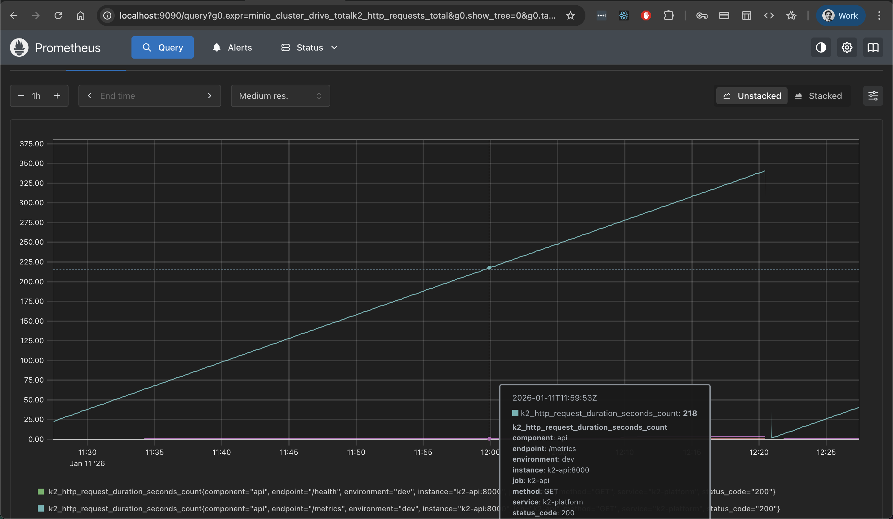

# K2 Market Data Platform

A distributed market data lakehouse for quantitative research, compliance, and analytics.

**Stack**: Kafka (KRaft) → Iceberg → DuckDB → FastAPI
**Data**: ASX equities (200K+ trades, March 2014) + Binance crypto streaming (live BTC/ETH/BNB)
**Python**: 3.13+ with uv package manager  

---

## Platform Positioning

K2 is a **Market Data Platform** designed for:
- **Quantitative Research**: Backtest trading strategies on historical tick data
- **Compliance & Audit**: Time-travel queries for regulatory investigations
- **Market Analytics**: OHLCV aggregations, microstructure analysis

### What K2 Is NOT

- ❌ **Execution infrastructure** (requires <100μs latency, FPGA/kernel bypass)
- ❌ **Real-time risk systems** (requires <10ms in-memory streaming)
- ✅ **K2 targets <500ms p99 latency** for analytical workloads

### Tiered Architecture Context

```
L1 Hot Path  (<10μs)   │ Execution, Order Routing      │ Shared memory, FPGAs
L2 Warm Path (<10ms)   │ Risk, Position Management     │ In-memory streaming
L3 Cold Path (<500ms)  │ Analytics, Compliance         │ ← K2 Platform
```

For alternative production infrastructure, see [HFT Architecture Patterns](./docs/architecture/alternatives.md).

---

## Architecture

```
┌─────────────────────────────────────────────────────────────────┐
│                        Data Sources                             │
│                    CSV files (ASX equities)                     │
└─────────────────────────────┬───────────────────────────────────┘
                              │ Batch ingestion
                              ▼
┌─────────────────────────────────────────────────────────────────┐
│                     Ingestion Layer                             │
│  ┌──────────────┐    ┌─────────────────┐                        │
│  │    Kafka     │◄───│ Schema Registry │  BACKWARD compatibility│
│  │   (KRaft)    │    │   (Avro, HA)    │                        │
│  └──────┬───────┘    └─────────────────┘                        │
│         │ Topics: market.equities.{trades,quotes}.asx           │
│         │ Partitioning: hash(symbol)                            │
└─────────┼───────────────────────────────────────────────────────┘
          │
          ▼
┌─────────────────────────────────────────────────────────────────┐
│                   Storage Layer (Iceberg)                       │
│  ┌──────────────────┐        ┌────────────────┐                 │
│  │  Apache Iceberg  │◄───────│   PostgreSQL   │  Catalog        │
│  │  (ACID, Parquet) │        │      16        │  metadata       │
│  └────────┬─────────┘        └────────────────┘                 │
│           ▼                                                     │
│  ┌──────────────────┐                                           │
│  │  MinIO (S3 API)  │  Parquet + Zstd compression               │
│  │                  │  Daily partitions (exchange_date)         │
│  └──────────────────┘                                           │
└─────────┼───────────────────────────────────────────────────────┘
          │
          ▼
┌─────────────────────────────────────────────────────────────────┐
│                      Query Layer                                │
│  ┌────────────────────────────────────────────────────────────┐ │
│  │  DuckDB Engine                                             │ │
│  │  • Vectorized execution                                    │ │
│  │  • Direct Parquet/Iceberg scan (no staging)                │ │
│  │  • Time-travel via Iceberg snapshots                       │ │
│  └────────────────────────────────────────────────────────────┘ │
│  ┌────────────────────────────────────────────────────────────┐ │
│  │  FastAPI REST                                              │ │
│  │  • API key authentication                                  │ │
│  │  • Rate limiting (slowapi)                                 │ │
│  │  • JSON / CSV / Parquet output                             │ │
│  └────────────────────────────────────────────────────────────┘ │
└─────────────────────────────────────────────────────────────────┘
          │
          ▼
┌─────────────────────────────────────────────────────────────────┐
│                    Observability                                │
│  Prometheus (40+ metrics) → Grafana (15-panel dashboard)        │
│  Structured logging (structlog) with correlation IDs            │
└─────────────────────────────────────────────────────────────────┘
```

**Key Design Decisions**:
- **Kafka with KRaft**: Sub-1s broker failover (no ZooKeeper dependency)
- **Iceberg ACID**: Time-travel queries, schema evolution, hidden partitioning
- **DuckDB Embedded**: Sub-second queries without cluster management overhead
- **Schema Registry HA**: BACKWARD compatibility enforcement across all producers

For detailed architecture:
- [System Design](./docs/architecture/system-design.md) - Component diagrams, data flow
- [Platform Principles](./docs/architecture/platform-principles.md) - Core design philosophy
- [Technology Decisions](./docs/architecture/README.md#technology-stack) - Why we chose each tool

---

## Quick Start

**Prerequisites**: Docker Desktop (8GB RAM), Python 3.13+, [uv](https://docs.astral.sh/uv/)

### 1. Start Infrastructure

```bash
git clone https://github.com/rjdscott/k2-market-data-platform.git
cd k2-market-data-platform
docker-compose up -d
```

### 2. Set Up Python Environment

```bash
# Install uv if needed
curl -LsSf https://astral.sh/uv/install.sh | sh

# Create virtual environment and install dependencies
uv venv
uv sync --all-extras
```

### 3. Initialize Platform

```bash
uv run python scripts/init_infra.py
```

### 4. Start API Server

```bash
make api   # Starts FastAPI on http://localhost:8000
```

### 5. Run Demo (Optional)

```bash
make demo-quick   # Interactive CLI demo (~1 min)
make notebook     # Jupyter notebook exploration
```

### 6. Reset Between Demos

```bash
make demo-reset           # Full reset with confirmation
make demo-reset-dry-run   # Preview what will be reset
make demo-reset-custom KEEP_METRICS=1  # Preserve Prometheus/Grafana
```

### Verify Services

**Infrastructure** (started by docker-compose):

| Service | URL | Credentials |
|---------|-----|-------------|
| Grafana | http://localhost:3000 | admin / admin |
| Kafka UI | http://localhost:8080 | - |
| MinIO | http://localhost:9001 | admin / password |
| Prometheus | http://localhost:9090 | - |

| Kafka UI (Kafbat) | MinIO Console |
|-------------------|---------------|
|  |  |

**Application** (started by `make api`):

| Service | URL | Credentials |
|---------|-----|-------------|
| API Docs | http://localhost:8000/docs | `X-API-Key: k2-dev-api-key-2026` |
| Health Check | http://localhost:8000/health | - |

---

## Technology Stack

| Layer | Technology | Version | Why This Choice |
|-------|------------|---------|-----------------|
| Streaming | Apache Kafka | 3.7 (KRaft) | No ZooKeeper, sub-1s failover |
| Schema | Confluent Schema Registry | 7.6 | BACKWARD compatibility enforcement |
| Storage | Apache Iceberg | 1.4 | ACID + time-travel for compliance |
| Object Store | MinIO | Latest | S3-compatible local development |
| Catalog | PostgreSQL | 16 | Proven Iceberg metadata store |
| Query | DuckDB | 0.10 | Zero-ops for Phase 1, migration path to Presto documented |
| API | FastAPI | 0.111 | Async + auto-docs, Python ecosystem integration |
| Metrics | Prometheus | 2.51 | Pull-based metrics, industry standard |
| Dashboards | Grafana | 10.4 | Visualization + alerting |

**Philosophy**: [Boring Technology](./docs/architecture/platform-principles.md#boring-technology) - Choose proven tools over bleeding-edge.

**Key Trade-offs**:
- DuckDB vs Presto: Single-node simplicity for Phase 1, scales to ~10TB dataset
- At-least-once vs Exactly-once: Market data duplicates acceptable, simpler implementation

See [Architecture Decision Records](./docs/phases/phase-1-single-node-implementation/DECISIONS.md) for 26 detailed decisions.

---

## API Reference

Base URL: `http://localhost:8000` | Auth: `X-API-Key: k2-dev-api-key-2026`

**Full API documentation**: http://localhost:8000/docs (when running)

**API design patterns**: [Technology Decisions](./docs/architecture/README.md#technology-stack)



### Read Endpoints

| Method | Endpoint | Description |
|--------|----------|-------------|
| GET | `/v1/trades` | Query trades by symbol, exchange, time range |
| GET | `/v1/quotes` | Query quotes (bid/ask) |
| GET | `/v1/summary/{symbol}/{date}` | OHLCV daily summary |
| GET | `/v1/symbols` | List available symbols |
| GET | `/v1/stats` | Database statistics |
| GET | `/v1/snapshots` | List Iceberg snapshots |

### Advanced Query Endpoints

| Method | Endpoint | Description |
|--------|----------|-------------|
| POST | `/v1/trades/query` | Multi-symbol, field selection, CSV/Parquet output |
| POST | `/v1/quotes/query` | Multi-symbol quotes with format options |
| POST | `/v1/replay` | Historical replay with cursor pagination |
| POST | `/v1/snapshots/{id}/query` | Point-in-time (time-travel) query |
| POST | `/v1/aggregations` | VWAP, TWAP, OHLCV buckets (1m/5m/15m/1h/1d) |

### System Endpoints (No Auth)

| Method | Endpoint | Description |
|--------|----------|-------------|
| GET | `/health` | Liveness check |
| GET | `/metrics` | Prometheus exposition format |
| GET | `/docs` | OpenAPI documentation |

---

## Operations

K2 is designed for operational simplicity with comprehensive observability and runbooks.

### Service Level Objectives

*Note: SLOs will be validated in Phase 2 production benchmarking*

| Metric | Target | Measurement Window |
|--------|--------|-------------------|
| API Availability | 99.9% | 30 days |
| Query p99 Latency | < 5s | 7 days |
| Data Freshness | < 5 minutes | Real-time |
| Consumer Lag | < 1000 messages | Real-time |

See [Operations Guide](./docs/operations/README.md) for current operational targets.

### Observability

**Metrics**: 50+ Prometheus metrics across ingestion, storage, query, and API layers.



**Key Dashboards**:
- [System Overview](http://localhost:3000) - Throughput, latency p99, error rates
- [Per-Exchange Drill-down](http://localhost:3000) - ASX-specific metrics
- [Query Performance](http://localhost:3000) - Latency breakdown by query mode

**Prometheus Metrics** (50+):

| Category | Examples |
|----------|----------|
| **Ingestion** | `k2_kafka_messages_produced_total`, `k2_sequence_gaps_detected_total` |
| **Storage** | `k2_iceberg_rows_written_total`, `k2_iceberg_write_duration_seconds` |
| **Query** | `k2_query_executions_total`, `k2_query_duration_seconds` |
| **API** | `k2_http_requests_total`, `k2_http_request_duration_seconds` |
| **System** | `k2_circuit_breaker_state`, `k2_degradation_level` |

**Grafana Dashboard** (15 panels):
- API request rate and latency (p99)
- Kafka consumer lag
- Iceberg write performance
- Query cache hit ratio
- System degradation level

**Structured Logging**: JSON logs with correlation IDs (`structlog`), propagated via `X-Correlation-ID` header.

See [Monitoring Guide](./docs/operations/monitoring/) for dashboard configuration.

### Runbooks

Operational procedures for common scenarios:

- [Failure Recovery](./docs/operations/runbooks/failure-recovery.md) - Service restarts, rollbacks, health checks
- [Disaster Recovery](./docs/operations/runbooks/disaster-recovery.md) - Full system recovery, RTO/RPO targets
- [Kafka Operations](./docs/operations/kafka-runbook.md) - Topic management, troubleshooting
- [Performance Tuning](./docs/operations/performance/latency-budgets.md) - Optimization guides

### Scaling Strategy

**Current State (Single-Node)**:
- **Throughput**: ~10K msg/sec per consumer
- **Storage**: <10GB (MinIO local)
- **Query**: DuckDB embedded (single-node)
- **Kafka**: 1 broker, 20 partitions per topic

**100x Scale (Distributed)**:
- **Throughput**: 1M msg/sec → Add Kafka brokers, increase partitions
- **Storage**: TBs → MinIO distributed cluster or S3
- **Query**: Concurrent users → Migrate to Presto/Trino cluster
- **HA**: 99.9% → Multi-AZ deployment

See [Scaling Strategy](./docs/architecture/system-design.md#scaling-considerations) for detailed projections.

### Cost Model (Phase 2)

*Cost modeling and FinOps analysis will be added in Phase 2 to demonstrate business awareness.*

**Estimated monthly cost at 100x scale**: ~$15K/month AWS (ap-southeast-2).

See [Phase 2: Cost Model](./docs/phases/phase-2-demo-enhancements/steps/step-08-cost-model.md) for planned analysis.

---

## Data

ASX equities tick data from March 10-14, 2014.

| Symbol | Company | Trades | Notes |
|--------|---------|--------|-------|
| BHP | BHP Billiton | 91,630 | High liquidity |
| RIO | Rio Tinto | 108,670 | High liquidity |
| DVN | Devine Ltd | 231 | Low liquidity |
| MWR | MGM Wireless | 10 | Sparse |

**Location**: `data/sample/{trades,quotes,bars-1min,reference-data}/`

```bash
# Explore data
head data/sample/trades/7078_trades.csv   # BHP trades
k2-query trades --symbol BHP --limit 5    # Via CLI (requires services running)
```

See [Data Dictionary](./docs/reference/data-dictionary.md) for complete schema definitions.

---

## Schema Evolution

✅ **V2 Schema Operational** - Validated E2E across ASX equities (batch CSV) and Binance crypto (live streaming)

K2 uses **industry-standard hybrid schemas** (v2) that support multiple data sources and asset classes.

### V1 → V2 Migration

**V1 (Legacy ASX-specific)**:
```
volume (int64)             → quantity (Decimal 18,8)
exchange_timestamp (millis) → timestamp (micros)
company_id, qualifiers, venue → vendor_data (map)
```

**V2 (Multi-source standard)**:
- **Core fields**: message_id, trade_id, symbol, exchange, asset_class, timestamp, price, quantity, currency
- **Trading fields**: side (BUY/SELL enum), trade_conditions (array)
- **Vendor extensions**: vendor_data (map<string, string>) for exchange-specific fields

### Why V2?

| Feature | V1 | V2 |
|---------|----|----|
| Multi-source support | ❌ ASX only | ✅ ASX, Binance, FIX |
| Asset classes | ❌ Equities only | ✅ Equities, crypto, futures |
| Decimal precision | 18,6 | 18,8 (micro-prices) |
| Timestamp precision | milliseconds | microseconds |
| Deduplication | ❌ | ✅ message_id (UUID) |
| Standardization | ❌ Vendor-specific | ✅ FIX-inspired |

### Usage

```python
# Producer (v2 default)
from k2.ingestion.message_builders import build_trade_v2

trade = build_trade_v2(
    symbol="BHP",
    exchange="ASX",
    asset_class="equities",
    timestamp=datetime.utcnow(),
    price=Decimal("45.67"),
    quantity=Decimal("1000"),
    currency="AUD",
    side="BUY",
    vendor_data={"company_id": "123", "qualifiers": "0"}  # ASX-specific
)

# Query engine (v2 default)
engine = QueryEngine(table_version="v2")
trades = engine.query_trades(symbol="BHP")  # Queries trades_v2 table

# Batch loader (v2 default)
loader = BatchLoader(asset_class="equities", exchange="asx",
                      schema_version="v2", currency="AUD")
```

### E2E Validation Results

**Phase 2 Prep Complete** (2026-01-13):
- ✅ 69,666+ Binance trades ingested via WebSocket → Kafka
- ✅ 5,000 trades written to Iceberg trades_v2 table
- ✅ 5,000 trades queried successfully (sub-second performance)
- ✅ 138 msg/s consumer throughput
- ✅ All 15 v2 schema fields validated
- ✅ Vendor data preserved (7 Binance-specific fields in JSON)
- ✅ Performance: sub-second queries, 138 msg/s throughput

See [E2E Demo Success Summary](./docs/operations/e2e-demo-success-summary.md) for complete validation results.
See [Schema Design V2](./docs/architecture/schema-design-v2.md) for complete specification.

---

## Testing

180+ tests across all modules (unit, integration, E2E).

### Coverage

| Type | Count | Command |
|------|-------|---------|
| Unit | 120+ | `make test-unit` |
| Integration | 40+ | `make test-integration` |
| E2E | 7 | `make test-integration` |

### Test Organization

```
tests/
├── unit/                # Fast, no Docker required
│   ├── test_api.py
│   ├── test_producer.py
│   ├── test_query_engine.py
│   └── ...
├── integration/         # Requires Docker services
│   ├── test_e2e_flow.py
│   ├── test_iceberg_storage.py
│   └── ...
└── performance/         # Benchmarks
```

### Run Tests

```bash
make test-unit          # Fast unit tests (~10s)
make test-integration   # Full integration (~60s, requires Docker)
make coverage           # Generate coverage report
```

See [Testing Guide](./docs/TESTING.md) for comprehensive testing procedures and patterns.

---

## Project Structure

```
src/k2/
├── api/                 # REST API (1,400 lines)
│   ├── main.py          # FastAPI app, middleware stack
│   ├── v1/endpoints.py  # All /v1/ routes
│   ├── middleware.py    # Auth, rate limiting, CORS
│   └── models.py        # Pydantic request/response models
├── ingestion/           # Data ingestion (2,300 lines)
│   ├── producer.py      # Idempotent Kafka producer
│   ├── consumer.py      # Kafka → Iceberg writer
│   ├── batch_loader.py  # CSV batch ingestion
│   └── sequence_tracker.py  # Gap detection
├── storage/             # Iceberg lakehouse (900 lines)
│   ├── catalog.py       # Table management
│   └── writer.py        # Batch writes
├── query/               # Query engine (1,700 lines)
│   ├── engine.py        # DuckDB + Iceberg connector
│   ├── replay.py        # Time-travel queries
│   └── cli.py           # k2-query CLI
├── kafka/               # Kafka utilities (800 lines)
├── schemas/             # Avro schemas (trade, quote, reference)
└── common/              # Config, logging, metrics (1,300 lines)
```

**Total**: ~8,400 lines of Python

---

## CLI Reference

### k2-query

```bash
k2-query trades --symbol BHP --limit 10
k2-query quotes --symbol BHP
k2-query summary DVN 2014-03-10
k2-query symbols
k2-query snapshots
k2-query stats
```

### Make Targets

```bash
# Infrastructure
make docker-up          # Start all services
make docker-down        # Stop services
make init-infra         # Initialize Kafka, schemas, Iceberg

# Development
make api                # Start API (dev mode with reload)
make demo-quick         # Run demo (CI-friendly)
make notebook           # Jupyter notebook

# Testing
make test-unit          # Unit tests only
make test-integration   # Requires Docker
make coverage           # Coverage report

# Quality
make format             # Black + isort
make lint-fix           # Ruff with auto-fix
make quality            # All checks
```

---

## Documentation

Comprehensive documentation organized by audience and purpose.

### For Engineers

- [Architecture](./docs/architecture/README.md) - System design, platform principles, technology decisions
- [Design](./docs/design/README.md) - Component-level design, data guarantees, query architecture
- [Testing](./docs/TESTING.md) - Test organization, running tests, writing tests

### For Operators

- [Operations](./docs/operations/README.md) - Runbooks, monitoring, performance tuning
- [Runbooks](./docs/operations/runbooks/) - Incident response procedures
- [Monitoring](./docs/operations/monitoring/) - Dashboards, alerts, SLOs

### For Implementation

- [Phase 1: Single-Node](./docs/phases/phase-1-single-node-implementation/) - Implementation plan, progress, decisions
- [Phase 2: Enhancements](./docs/phases/phase-2-demo-enhancements/) - Production readiness steps

### Reference

- [Data Dictionary](./docs/reference/data-dictionary.md) - Schema definitions, field types
- [Glossary](./docs/reference/glossary.md) - Terminology and concepts
- [Configuration](./docs/reference/configuration.md) - All configurable parameters

---

## Platform Evolution

K2 is developed in phases, each with clear business drivers and validation criteria.

### Phase 1: Single-Node Implementation ✅ Complete

**Business Driver**: Demonstrate reference data lakehouse architecture with production patterns.

**Delivered** (2026-01-11):
- ✅ Kafka ingestion with Avro schemas (idempotent, sequence tracking)
- ✅ Iceberg lakehouse with time-travel (ACID, snapshot isolation)
- ✅ DuckDB query engine (sub-second OLAP)
- ✅ REST API with FastAPI (authentication, rate limiting)
- ✅ Prometheus + Grafana observability (50+ metrics, 15 panels)
- ✅ 180+ tests (unit, integration, E2E)
- ✅ Comprehensive documentation (26 ADRs, runbooks, architecture docs)

**Metrics**:
- 6,500+ lines of production Python
- 180+ tests passing
- 50+ Prometheus metrics
- 8 REST endpoints
- 7 CLI commands

See [Phase 1 Status](./docs/phases/phase-1-single-node-implementation/STATUS.md) for detailed completion report.

### Phase 2 Prep: Schema Evolution + Binance Streaming ✅ Complete

**Business Driver**: Establish foundation for multi-source, multi-asset class platform before production enhancements.

**Delivered** (2026-01-13):
- ✅ V2 industry-standard schemas (hybrid approach with vendor_data map)
- ✅ Multi-source ingestion (ASX batch CSV + Binance live WebSocket)
- ✅ Multi-asset class support (equities + crypto)
- ✅ Binance streaming (69,666+ trades received, 5,000 written to Iceberg)
- ✅ E2E pipeline validated (Binance → Kafka → Iceberg → Query)
- ✅ Production-grade resilience (SSL handling, metrics, error handling)
- ✅ 17 bugs fixed during implementation + E2E validation
- ✅ Comprehensive documentation (checkpoint, success summary, operational runbooks)

**Metrics**:
- 15/15 steps complete (100%)
- Completed in 5.5 days vs 13-18 day estimate (61% faster)
- 138 msg/s consumer throughput
- Sub-second query performance
- All 15 v2 schema fields validated

See [Phase 2 Prep Status](./docs/phases/phase-2-prep/STATUS.md) for detailed completion report.

### Phase 2: Demo Enhancements 🟡 Ready to Start

**Business Driver**: Address principal engineer review feedback to demonstrate Staff+ level thinking.

**Focus Areas** ([Principal Review](./docs/reviews/2026-01-11-principal-data-engineer-demo-review.md)):
1. **Platform Positioning** - Clear L3 cold path positioning vs HFT execution
2. **Graceful Degradation** - Circuit breaker with demonstrable backpressure handling
3. **Scalable State Management** - Redis-backed sequence tracking (>1M msg/sec)
4. **Production Deduplication** - Bloom filter + Redis hybrid (24hr window)
5. **Hybrid Query Path** - Merge real-time Kafka + historical Iceberg
6. **Compelling Demo** - 10-minute CTO narrative with load testing
7. **Cost Awareness** - FinOps model showing business acumen

**Deliverables**:
- Redis integration for stateful components
- Circuit breaker with 4-level degradation cascade
- Hybrid query engine (Kafka tail + Iceberg)
- Enhanced demo script with architectural storytelling
- Cost model (AWS pricing at 1M msg/sec scale)

See [Phase 2 Implementation Plan](./docs/phases/phase-2-demo-enhancements/IMPLEMENTATION_PLAN.md) for 9-step roadmap.

### Phase 3: Multi-Region & Scale (Future)

**Business Driver**: Demonstrate distributed systems expertise at global scale.

**Planned**:
- Multi-region replication (MirrorMaker 2.0)
- Kubernetes deployment (Helm charts)
- Presto/Trino distributed query cluster
- RBAC and row-level security
- Auto-scaling and cost optimization

See [Architecture Alternatives](./docs/architecture/alternatives.md) for scaling patterns.

---

## Contributors

**Project Lead**: Rob Scott

### Contributing

Contributions welcome. See [Contributing Guide](./CONTRIBUTING.md) for development setup and guidelines.

### Questions?

- **Documentation**: See [docs/](./docs/)
- **Issues**: [GitHub Issues](https://github.com/rjdscott/k2-market-data-platform/issues)
- **Architecture Questions**: [Architecture Decision Records](./docs/phases/phase-1-single-node-implementation/DECISIONS.md)

---

## License

MIT License - see [LICENSE](./LICENSE) for details.
