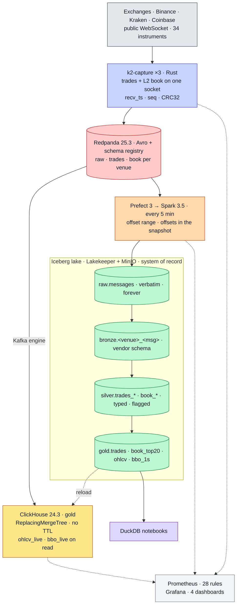

# K2 Market Data Platform

A crypto market-data platform for quantitative research: three exchanges captured verbatim, an
Iceberg lake as the system of record, ClickHouse as a derived serving tier — on one host, inside a
16 CPU / 40 GB budget. Public WebSocket feeds over the internet; **not a trading path**.

[](https://github.com/rjdscott/k2-market-data-platform/actions/workflows/ci.yml)
[](./LICENSE)
[](https://www.rust-lang.org/)
[](https://clickhouse.com/)

## What it does

- **Captures everything, once, with provenance.** One Rust `k2-capture` process per exchange holds a
  single WebSocket carrying trades and L2 book, stamps `recv_ts_ns` before parsing, verifies Kraken's
  CRC32 book checksum on every update, and tracks each venue's sequence numbers. Every frame is
  published verbatim; decoded records use fixed-point `int64` at 1e-8, never floats.
- **Keeps the record in the lake, not the database.** Every 5 min a Spark batch reads Redpanda by
  offset range into Iceberg: `raw` (verbatim, never expired) → `bronze` (per venue, vendor schema) →
  `silver` (typed, flagged, every delivery kept) → `gold` (one row per trade, OHLCV, BBO). Each layer
  is derived only from the one above it and rebuilt from raw on demand; consumed offsets are committed
  in the same snapshot as the rows, so a killed run resumes rather than duplicates.
- **Serves from ClickHouse, which can be thrown away.** `gold.*` in ClickHouse is fed live from the
  Avro topics and reloaded from the lake; the lake wins on conflict. OHLCV over deduplicated trades is a
  view, so a venue replay cannot corrupt a candle.
- **Proves it.** Nightly audits per layer (offset continuity, parity, duplicates, checksum),
  three-way OHLCV parity at a pinned snapshot, chaos scripts with measured recovery times, and a
  fresh-clone release check before every tag.

## Architecture


```mermaid
flowchart TB
  E["Exchanges · Binance · Kraken · Coinbase<br/>public WebSocket · 34 instruments"]:::ex
  F["k2-capture ×3 · Rust<br/>trades + L2 book on one socket<br/>recv_ts · seq · CRC32"]:::rs
  R[("Redpanda 25.3 · Avro + schema registry<br/>raw · trades · book per venue")]:::rp
  C["ClickHouse 24.3 · gold<br/>ReplacingMergeTree · no TTL<br/>ohlcv_live · bbo_live on read"]:::ch
  S["Prefect 3 → Spark 3.5 · every 5 min<br/>offset range · offsets in the snapshot"]:::sp
  subgraph L["Iceberg lake · Lakekeeper + MinIO · system of record"]
    direction TB
    RAW[("raw.messages · verbatim · forever")]:::lk
    BR[("bronze.&lt;venue&gt;_&lt;msg&gt; · vendor schema")]:::lk
    SV[("silver.trades_* · book_* · typed · flagged")]:::lk
    GD[("gold.trades · book_top20 · ohlcv · bbo_1s")]:::lk
    RAW --> BR --> SV --> GD
  end
  N["DuckDB notebooks"]:::nb
  O["Prometheus · 28 rules<br/>Grafana · 4 dashboards"]:::ob

  E --> F --> R
  R -->|Kafka engine| C
  R --> S --> RAW
  GD -.->|reload| C
  GD --> N
  F & S & C -.-> O

  classDef ex fill:#e5e7eb,stroke:#374151,color:#111827
  classDef rs fill:#c7d2fe,stroke:#4338ca,color:#111827
  classDef rp fill:#fecaca,stroke:#b91c1c,color:#111827
  classDef lk fill:#bbf7d0,stroke:#15803d,color:#111827
  classDef sp fill:#fed7aa,stroke:#c2410c,color:#111827
  classDef ch fill:#fde68a,stroke:#b45309,color:#111827
  classDef nb fill:#ddd6fe,stroke:#6d28d9,color:#111827
  classDef ob fill:#f3f4f6,stroke:#6b7280,color:#111827
```

15 long-running services (+4 one-shot init) at 14.60 CPU / 25.625 GiB of limits
(`docker compose --env-file .env.example config`, limits summed —
[docker-resources.md](./docs/operations/docker-resources.md#how-these-numbers-are-produced)).
Component deep dives: [`docs/architecture/README.md`](./docs/architecture/README.md).

## Decisions that shaped it

| ADR | Decision | Why |
|---|---|---|
| [018](./docs/adr/ADR-018-v3-lake-first-rust-capture.md) | Lake is the system of record; everything else derived | v2's lake was a JDBC copy of the serving DB — it inherited its TTL, normalisation and dropped columns |
| [019](./docs/adr/ADR-019-rust-capture-tier.md) | Rust capture replaces three JVM handlers | One connection per venue carrying trades *and* book; `recv_ts` before parse; retired on a measured parity gate |
| [020](./docs/adr/ADR-020-avro-fixed-point-contracts.md) | Avro + registry, `int64` @1e-8, `BACKWARD_TRANSITIVE` | v2 stored prices as strings and its registry proved nothing |
| [022](./docs/adr/ADR-022-exactly-once-via-snapshot-offsets.md) | Kafka offsets committed inside the Iceberg snapshot | One atomic commit replaces a watermark table and its failure modes |
| [026](./docs/adr/ADR-026-four-layer-lake-and-gold-served-from-clickhouse.md) | raw / bronze-per-venue / silver-per-venue / gold-canonical; ClickHouse serves gold with no TTL | Typed venue fields survive; OHLCV on read fixes v2's `SummingMergeTree` candles resolving open/close arbitrarily |
| [027](./docs/adr/ADR-027-book-snapshot-and-sequencing.md) | Top-20 snapshots at 1 Hz; per-venue sequencing and resync policy | Raw holds the deltas; the product is what research joins against |
| [008](./docs/adr/ADR-008-eliminate-prefect-orchestration.md) | Remove Prefect — **reversed** | Wrong call, kept on the record with its Outcome |

All 27 ADRs and their supersession chain: [`docs/adr/`](./docs/adr/README.md).

## Measured

From [`docs/benchmarks/2026-08-27.md`](./docs/benchmarks/2026-08-27.md), a 6.5 h capture window
across three venues; each row there carries the command that produced it.

| Measure | Binance | Kraken | Coinbase |
|---|---:|---:|---:|
| Frames/s, window average | 187 | 606 | 130 |
| Exchange → receive p50 / p99 (ms, per frame) | 42 / 207 | 177 / 459 | 184 / see note |
| Sequence gaps · checksum failures · produce errors | 0 · — · 0 | 0 · 0 of 14.1 M · 0 | 0 · — · 0 |

Coinbase's p99 is dominated by the venue's on-subscribe trade snapshot, not transit; the capture now
excludes it from the histogram. Lake bronze rebuild from raw: 61.9 M rows in 520 s; per-venue bronze
stores at 0.59× the raw archive; lake growth ≈ 9.8 GB/day. ClickHouse pull of 10.4 M gold trades from
the lake: 4.4 s. Chaos recovery: lake ingest killed 42 s, MinIO stopped 38 s, Lakekeeper stopped 37 s,
ClickHouse stopped 160 s to healthy, corrupt feed record isolated in 4 s
([failure-modes.md](./docs/architecture/failure-modes.md)).

## Quick start

Needs a Docker engine with ≥ 24 GB memory (`docker info --format '{{.MemTotal}}'`) so every limit is
honoured; measured usage is far lower.

```bash
git clone https://github.com/rjdscott/k2-market-data-platform.git && cd k2-market-data-platform
cp .env.example .env            # set every change-me value; LAKEKEEPER_ENCRYPTION_KEY: openssl rand -base64 32
set -a && . ./.env && set +a
docker compose up -d            # first run builds capture, prefect and spark images
docker compose ps               # all 15 healthy within ~3 min
docker exec k2-redpanda rpk topic consume market.crypto.v3.trades.binance --num 1
```

Every layer is populated within five minutes on a fresh clone (release check, 2026-08-27).

| Service | URL |
|---|---|
| Grafana | http://localhost:3000 (`admin` / `$GRAFANA_PASSWORD`) |
| Redpanda Console | http://localhost:8080 |
| ClickHouse HTTP | http://localhost:8123 |
| Prefect | http://localhost:4200 |
| Lakekeeper | http://localhost:18181 |
| MinIO Console | http://localhost:9001 |
| Prometheus | http://localhost:9090 |

Research: `make notebooks` starts JupyterLab with DuckDB over the lake
([`notebooks/`](./notebooks/README.md)).

## Tests and CI

| Suite | Run |
|---|---|
| Rust capture — 60 (unit, binary, replay over recorded sessions) | `make test-rust` |
| Python — 334 (contracts, wire format, lake offsets, bronze/silver decode, book replay, parity) | `make test-python` |
| ClickHouse schema — 9 assertions incl. the v2 OHLCV regression | `make test-clickhouse` |
| Prometheus rule unit tests + doc checks | `bash scripts/check-docs.sh` |
| Live stack: per-layer parity, three-way OHLCV parity, chaos | `make lake-verify`, `make parity-ohlcv`, `make chaos` |

CI ([`ci.yml`](./.github/workflows/ci.yml)): rust (fmt, clippy `-D warnings`, test), python (Ruff,
pytest), clickhouse-schema, docker build matrix, compose config, docs checks, Trivy.

## Repository layout

```
services/capture-rust/     k2-capture: one binary, three exchanges
docker/lake/               Spark ingest, layer builders, audits, DDL, Prefect flows
docker/clickhouse/ddl/     gold contract (CI-tested) + Kafka feeds
docker/prometheus/rules/   28 alert rules with unit tests
schemas/avro/              raw-message, trade, book-snapshot-l2
config/instruments.yaml    instrument registry — single source of truth
scripts/chaos/             failure injection, timed
notebooks/                 DuckDB research notebooks
docs/                      architecture, ADRs, runbooks, benchmarks, plans
legacy/                    v1 (Python), v2 Kotlin handlers, v2 ClickHouse DDL, v2 offload — archived, unmodified
```

## Not built

No query API; no replication or failover — one broker, one ClickHouse, one host; no Alertmanager
routing; no load test above 1×; pcap capture and a cross-venue security master are designed
([ADR-026](./docs/adr/ADR-026-four-layer-lake-and-gold-served-from-clickhouse.md),
[data-strategy.md](./docs/architecture/data-strategy.md)) and not started.

## Documentation

[`docs/README.md`](./docs/README.md) is the map: architecture and component deep dives, ADRs,
runbooks, dated benchmarks and audits, the v3 plan, and
[`MIGRATION-JOURNEY.md`](./docs/MIGRATION-JOURNEY.md) for the v1 → v2 → v3 story.

## License

MIT — see [`LICENSE`](./LICENSE). © Rob Scott.
