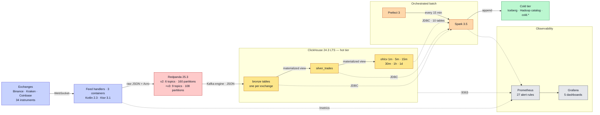
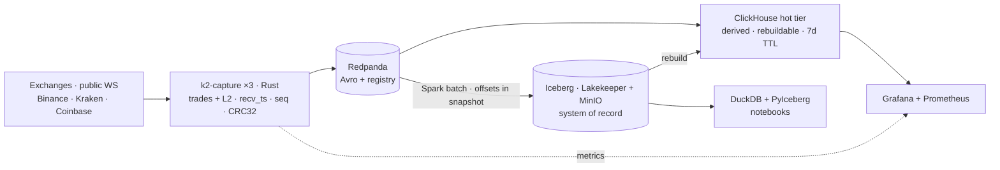

# K2 Market Data Platform

A crypto market-data lakehouse that ingests live trades from three exchanges and turns them into
queryable OHLCV candles in under a second — on a single host, inside a 16-core / 40 GB budget.

[](https://github.com/rjdscott/k2-market-data-platform/actions/workflows/ci.yml)
[](./LICENSE)
[](https://kotlinlang.org/)
[](https://clickhouse.com/)

## What this demonstrates

- **A rewrite justified by numbers, not taste.** v1: 18–20 containers, 35–40 CPU / 45–50 GB, 5–15 min
  trade-to-queryable. v2 baseline: 14 services (+2 one-shot), 15.1 CPU / 21.875 GB, measured p99
  170–197 ms. This branch runs **Phase C**: Rust `k2-capture` alongside the Kotlin handlers for a
  labelled parity window ([ADR-019](./docs/adr/ADR-019-rust-capture-tier.md)) — steady state
  18 long-running services (+4 one-shot), 16.10 CPU / 23.125 GB; Kotlin retires once parity is clean.
  Each move is an ADR.
- **Deleting the stream processor.** Five always-on Spark Structured Streaming jobs (~14 CPU / 20 GB)
  replaced by ClickHouse Kafka engine tables and materialized views — **zero stream-processing code**.
- **Exchange-native ingestion.** Three Kotlin/Ktor feed handlers, one container per exchange, each
  owning one WebSocket dialect and emitting a shared Avro record. Adding an exchange is additive.
- **A cold tier with real semantics.** Prefect drives Spark batch offload into Apache Iceberg (Hadoop catalog)
  every 15 min, with PostgreSQL watermarks for idempotent appends and nightly compaction + audit.
- **Operability as a deliverable.** 27 Prometheus alert rules (17 v2 + 10 v3 capture), 5 Grafana
  dashboards, and six failure modes deliberately induced and timed — max MTTR 32 s.
- **A reversed decision, kept in the record.** ADR-008 argued for removing Prefect. It was wrong, and
  the record says so rather than being quietly deleted.

## Architecture


```mermaid
flowchart LR
  E["Exchanges<br/>Binance · Kraken · Coinbase<br/>34 instruments"]:::kt
  F["Feed handlers · 3 containers<br/>Kotlin 2.3 · Ktor 3.1"]:::kt
  R["Redpanda 25.3<br/>v2: 6 topics · 160 partitions<br/>+v3: 9 topics · 108 partitions"]:::rp
  subgraph CH["ClickHouse 24.3 LTS — hot tier"]
    B["bronze tables<br/>one per exchange"]:::ch
    S["silver_trades"]:::ch
    G["ohlcv 1m · 5m · 15m<br/>30m · 1h · 1d"]:::ch
  end
  subgraph BATCH["Orchestrated batch"]
    P["Prefect 3"]:::sp
    K["Spark 3.5"]:::sp
  end
  I["Cold tier<br/>Iceberg · Hadoop catalog · cold.*"]:::st
  subgraph OBS["Observability"]
    M["Prometheus<br/>27 alert rules"]:::ob
    D["Grafana<br/>5 dashboards"]:::ob
  end

  E -->|WebSocket| F
  F -->|"raw JSON + Avro"| R
  R -->|"Kafka engine · JSON"| B
  B -->|materialized view| S
  S -->|materialized view| G
  P -->|every 15 min| K
  B -.->|JDBC| K
  S -.->|JDBC| K
  G -.->|"JDBC · 10 tables"| K
  K -->|append| I
  F -.->|/metrics| M
  CH -.->|:9363| M
  K -.-> M
  M --> D

  classDef kt fill:#c7d2fe,stroke:#4338ca,color:#111827
  classDef rp fill:#fecaca,stroke:#b91c1c,color:#111827
  classDef ch fill:#fde68a,stroke:#b45309,color:#111827
  classDef sp fill:#fed7aa,stroke:#c2410c,color:#111827
  classDef st fill:#bbf7d0,stroke:#15803d,color:#111827
  classDef ob fill:#e5e7eb,stroke:#374151,color:#111827
```

Each handler holds one WebSocket and produces every trade twice to Redpanda: the raw exchange JSON
and a normalized Avro record registered in the built-in schema registry.
ClickHouse consumes with Kafka engine tables; materialized views carry rows from per-exchange bronze into
a unified `silver_trades` and on into six OHLCV tables — no scheduler, no streaming job, no application
code in the hot path. Every 15 min a Prefect flow runs Spark to read ClickHouse over JDBC and append to
Iceberg, with per-table watermarks in PostgreSQL so a failed run resumes rather than duplicates. The
Iceberg warehouse is a Hadoop catalog on a local volume; MinIO is provisioned for the S3 path but the
offload does not write to it yet ([ADR-013](./docs/adr/ADR-013-pragmatic-iceberg-version-strategy.md)).

## v1 → v2

| | v1 | v2 |
|---|---|---|
| CPU / RAM (limits) | 35–40 cores / 45–50 GB | **15.1 cores / 21.875 GB** |
| Services | 18–20 | **14** (+2 one-shot init containers) |
| Always-on Spark | 5 streaming jobs, ~14 CPU / 20 GB | **none** — batch only |
| Trade → queryable | 5–15 min | **p99 170–197 ms** |
| Stack | Python · Kafka · Spark Streaming · DuckDB · FastAPI | Kotlin/Ktor · Redpanda · ClickHouse · Spark batch · Iceberg |

This branch runs Phase C's parallel run — Rust `k2-capture` alongside the Kotlin handlers above,
plus Lakekeeper and 4 one-shot init containers: **16.10 CPU / 23.125 GB across 18 long-running
services (+4 one-shot) as deployed here**. Kotlin retires at the end of Phase C, once per-symbol
parity is clean ([ADR-019](./docs/adr/ADR-019-rust-capture-tier.md)).

v1 is preserved unmodified in [`legacy/v1/`](./legacy/v1/); the narrative is in
[`docs/MIGRATION-JOURNEY.md`](./docs/MIGRATION-JOURNEY.md).

## Key decisions

| ADR | Decision | Why it mattered |
|---|---|---|
| [ADR-001](./docs/adr/ADR-001-replace-kafka-with-redpanda.md) | Kafka → Redpanda | One binary, built-in schema registry and console; −1.5 CPU / −1.8 GB |
| [ADR-003](./docs/adr/ADR-003-clickhouse-warm-storage.md) | ClickHouse as the hot tier | Made real-time aggregation a view instead of a job |
| [ADR-004](./docs/adr/ADR-004-eliminate-spark-streaming.md) | Kill Spark Structured Streaming | The single largest win: ~14 CPU / 20 GB reclaimed |
| [ADR-009](./docs/adr/ADR-009-medallion-in-clickhouse.md) | Medallion layers as ClickHouse MVs | Bronze → Silver → Gold becomes DDL, not a codebase |
| [ADR-011](./docs/adr/ADR-011-multi-exchange-bronze-architecture.md) | Per-exchange bronze tables | Exchange quirks stay isolated; adding Coinbase touched no existing table |
| [ADR-008](./docs/adr/ADR-008-eliminate-prefect-orchestration.md) | **Planned to remove Prefect — kept it** | Reversed in practice: retries, scheduling, and run history were worth 1.5 CPU. The ADR stands as written, with the outcome recorded. |

## Quick start

Requires a Docker engine with ≥ 24 GB memory so every `deploy.resources.limits` can be honoured
(`docker info --format '{{.MemTotal}}'`); measured steady-state usage is far lower
(see [docs/operations/docker-resources.md](./docs/operations/docker-resources.md)), so the stack runs
on less, but limits then exceed the engine and ClickHouse's 8 GB cap is not real.

```bash
git clone https://github.com/rjdscott/k2-market-data-platform.git
cd k2-market-data-platform
cp .env.example .env      # set CLICKHOUSE_PASSWORD, MINIO_*, GRAFANA_PASSWORD, PREFECT_DB_*,
                           # LAKEKEEPER_ENCRYPTION_KEY (generate: openssl rand -base64 32)
set -a && . ./.env && set +a   # export for the verify commands below
docker compose up -d      # or: make up
```

First run builds three images (Gradle + two Python images — about a minute on a fast machine, plus
image pulls); all 15 services report healthy roughly three minutes after `up`. Subsequent starts take
under a minute. Measured on a clean clone, 2026-08-26.

**Verify it's flowing:**

```bash
docker compose ps
docker logs k2-feed-handler-binance --tail 5
docker exec k2-clickhouse clickhouse-client --password "$CLICKHOUSE_PASSWORD" \
  --query "SELECT exchange, count() FROM k2.silver_trades GROUP BY exchange"
```

| Service | URL | Notes |
|---|---|---|
| Redpanda Console | http://localhost:8080 | topics, consumer lag, schema registry |
| ClickHouse | http://localhost:8123 | HTTP interface; native on 9002 |
| Prefect | http://localhost:4200 | offload + maintenance deployments |
| MinIO Console | http://localhost:9001 | S3 endpoint (provisioned, not yet used by v2 offload) |
| Lakekeeper | http://localhost:18181 | v3 Iceberg REST catalog (ADR-018) — not yet wired to the v2 offload |
| Prometheus | http://localhost:9090 | targets and alert rules |
| Grafana | http://localhost:3000 | `admin` / `$GRAFANA_PASSWORD` |
| Spark Master | http://localhost:18080 | batch jobs |

## Observability

Five provisioned Grafana dashboards: pipeline overview (`k2-pipeline-overview`), ClickHouse
(`clickhouse-v2`), Iceberg offload (`iceberg-offload`), v2 migration tracker (`k2-v2-migration`),
K2 Capture v3 (`k2-l2-capture`).


27 alert rules in [`docker/prometheus/rules/`](./docker/prometheus/rules/): 3 feed handler (down, error
rate, reconnect churn), 5 ClickHouse (down, memory, query failures, bronze insert
rate, merge queue), 9 Iceberg offload (lag, consecutive failures, cycle time, watermark staleness,
scheduler down), 10 v3 capture (down, feed stale, sequence gaps, checksum failure, produce errors/stalled,
resync storm, ingress latency, book depth, precision loss). Handlers expose Micrometer metrics on
`:8082/metrics` plus a `/health` endpoint used as the container healthcheck; ClickHouse exposes its own
on `:9363`. Details: [`docs/operations/observability.md`](./docs/operations/observability.md).

## Reliability testing

Six failure modes induced against the running stack, 2026-02-19 — all recovered without loss or corruption.

| Failure injected | Recovery | Observed |
|---|---|---|
| Redpanda restart | ~10 s | All 3 ClickHouse consumers resumed from committed offsets |
| ClickHouse restart | **~32 s** | `silver_trades` resumed; no gaps in bronze or gold |
| Feed handler killed | ~30 s | Other two exchanges unaffected — isolation confirmed |
| Spark killed mid-offload | next 15-min run | Watermark held; no duplicates on resume |
| MinIO stopped | ~5 s | Hot tier kept ingesting; cold tier deferred cleanly |
| Network partition | ~20–30 s | Consumers resumed from last committed offset, no corruption |

Runbook: [`docs/runbooks/failure-recovery.md`](./docs/runbooks/failure-recovery.md).

**Latency caveat:** the p99 figures (Binance 191 ms, Coinbase 197 ms, Kraken 170 ms, measured 2026-02-19
as `ingestion_timestamp - exchange timestamp` on `silver_trades`) come from a cold-start sample of only
12–13 trades per exchange — directionally valid, not statistically strong. A 24 h burn-in and 5×/10× load
tests remain on the roadmap.

## Tests & CI

| Suite | Count | Run |
|---|---|---|
| Kotlin feed handler | 20 (`TradeNormalizer` 7, `InstrumentsLoader` 13) | `make test-kotlin` |
| Rust capture | 52 (46 lib unit + 6 replay integration) | `make test-rust` |
| Python — Iceberg maintenance flow + v3 data contracts + parity | 109 (28 + 41 in `tests/test_contracts.py` + 40 in `tests/test_parity.py`) | `make test-python` |
| Legacy v1 (reference only) | ~180 unit | `cd legacy/v1 && uv run pytest` |

[`.github/workflows/ci.yml`](./.github/workflows/ci.yml) runs six jobs per PR: **kotlin** (`gradlew build`),
**rust** (`cargo test`), **python** (Ruff + pytest), **docker** (4-way matrix: feed-handler, prefect,
spark, capture), **docs** (`check-docs.sh`), **security** (Trivy → SARIF). Strategy:
[`docs/development/testing.md`](./docs/development/testing.md).

## Repository layout

```
services/feed-handler-kotlin/   Kotlin/Ktor feed handler (one image, three containers; v2, retiring)
services/capture-rust/          Rust k2-capture: trades + L2 book, one binary per exchange (v3, Phase C)
docker/clickhouse/ddl/          Bronze → Silver → Gold DDL and materialized views (auto-applied)
docker/offload/                 Spark offload job + Prefect flows (offload, maintenance)
docker/prometheus/rules/        27 alert rules
docker/grafana/dashboards/      5 provisioned dashboards
docker/spark/  docker/prefect/  Custom images
config/instruments.yaml         Instrument registry — single source of truth
schemas/avro/                   v3 contracts (trade, book-snapshot-l2, raw-message); normalized-trade.avsc stays for the v2 Kotlin handlers
tests/                          Python tests (maintenance flow, v3 data contracts)
docs/                           Architecture, ADRs, operations, development
legacy/v1/                      Archived v1 platform
docker-compose.yml              The whole stack
```

## Where v2 falls short — and the v3 roadmap

v2 is complete and running: three exchanges, medallion in ClickHouse, Iceberg cold tier, 17 v2 alert rules,
13 runbooks. It is a good streaming pipeline and a poor research archive. This is a **quantitative-research**
platform reading public WebSocket feeds over the open internet — it is **not a trading path**, and no number
here should be read as one. What a quant actually needs from it — completeness they can prove, aggregations
that are correct, and the ability to reproduce a figure from six months ago — v2 cannot deliver, for
structural reasons rather than missing polish. An audit of the code (not the docs) found these:

| Gap | Why it matters to a quant | v3 fix | ADR |
|---|---|---|---|
| Lake is a JDBC copy of ClickHouse, not the system of record — [`offload_generic.py:172`](./docker/offload/offload_generic.py#L172) | The archive inherits the serving DB's normalisation, its 7-day TTL, and the driver's dropped `Array`/`Map` columns. Nothing is reproducible | Spark batch reads Redpanda by offset range → Iceberg `raw.messages` (verbatim, never expired) → `bronze.*`; ClickHouse becomes derived | [018](./docs/adr/ADR-018-v3-lake-first-rust-capture.md), 021, 022 |
| OHLCV open/high/low/close resolve **arbitrarily** across merges — [`01-k2-schema.sql:178`](./docker/clickhouse/ddl/01-k2-schema.sql#L178) | `SummingMergeTree` sums volume correctly and picks non-summed columns at random. A candle can carry a close that never traded last. This is a real bug | OHLCV computed on read over deduplicated trades, plus a CI regression test across two insert blocks | 026 |
| Bronze is plain `MergeTree` — [`01-k2-schema.sql:88`](./docker/clickhouse/ddl/01-k2-schema.sql#L88) | Replaying a topic duplicates every row. No key, no version, no dedup — so recovery corrupts history | `ReplacingMergeTree` hot tier with an explicit dedup contract; the lake holds truth | 025, 026 |
| No receive timestamp before parse — [`TradeNormalizer.kt:28`](./services/feed-handler-kotlin/src/main/kotlin/com/k2/feedhandler/TradeNormalizer.kt#L28) | Exchange-clock skew and platform latency are not separable in any stored row, so no honest latency distribution exists | `recv_ts_ns` taken as the first statement on frame receipt, carried in the record body and a Kafka header | 019, 020 |
| Kraken on WS v1 with synthesised trade IDs — [`TradeNormalizer.kt:60`](./services/feed-handler-kotlin/src/main/kotlin/com/k2/feedhandler/TradeNormalizer.kt#L60) | `KRAKEN-${ms}-${pair.hashCode()}` collides for two trades in the same millisecond — dedup and joins are unsound | Kraken WS v2: real `trade_id`, plus CRC32 book checksum verified on every update | 019, 027 |
| Coinbase `sequence_num` parsed and never checked — [`CoinbaseWebSocketClient.kt:178`](./services/feed-handler-kotlin/src/main/kotlin/com/k2/feedhandler/CoinbaseWebSocketClient.kt#L178) | A dropped message is silent. Completeness is assumed, never measured | Per-exchange sequencing with gap counters, resync on gap, and audits over the lake | 019, 027 |
| Avro contract broken and unused — [`normalized-trade.avsc:60`](./schemas/avro/normalized-trade.avsc#L60), [`01-k2-schema.sql:39`](./docker/clickhouse/ddl/01-k2-schema.sql#L39) | `logicalType` sits as a sibling of `type` (Avro ignores it) and prices are strings; ClickHouse reads raw JSON instead. The registry proves nothing | One wire format: Avro + registry, fixed-point `int64` @1e-8, `BACKWARD_TRANSITIVE` compatibility | 020 |
| Trades only, no order book; raw topics keyed by exchange name — [`KafkaProducerService.kt:155`](./services/feed-handler-kotlin/src/main/kotlin/com/k2/feedhandler/KafkaProducerService.kt#L155) | No L2 means no spread, no imbalance, no microprice — most of what research wants. Single-key topics also pin two exchanges to one partition | Rust `k2-capture` does trades + L2 on one connection, top-20 snapshots at 1 Hz, symbol-keyed topics | 019, 027 |

### v3 target architecture


```mermaid
flowchart LR
  EX["Exchanges · public WS<br/>Binance · Kraken · Coinbase"]
  CAP["k2-capture ×3 · Rust<br/>trades + L2 · recv_ts · seq · CRC32"]
  RP[("Redpanda<br/>Avro + registry")]
  IB[("Iceberg · Lakekeeper + MinIO<br/>system of record")]
  CH["ClickHouse hot tier<br/>derived · rebuildable · 7d TTL"]
  DD["DuckDB + PyIceberg<br/>notebooks"]
  GR["Grafana + Prometheus"]
  EX --> CAP --> RP
  RP -->|"Spark batch · offsets in snapshot"| IB
  RP --> CH
  IB -->|rebuild| CH
  IB --> DD
  CH --> GR
  CAP -.metrics.-> GR
```

Everything except the lake is derived and rebuildable. Same 16 CPU / 40 GB single host.

**Phases** ([full plan](./docs/plans/2026-08-26-v3-quant-research-platform/README.md)):

- **A — public now.** v2 shipped as-is, honestly labelled; v3 built in the open.
- **B — foundations. Landed** (tag `v3-phase-b`). Verify-first spikes, Avro contracts, Lakekeeper + MinIO, Spark image bump.
- **C — Rust capture. In progress on this branch.** `k2-capture` per exchange, trades + L2, parallel run
  against Kotlin for a labelled parity window; Kotlin retires once parity is clean.
- **D — lake tier.** Raw + bronze Iceberg tables, exactly-once ingest, completeness audits.
- **E — hot tier.** ClickHouse rebuilt as derived: `ReplacingMergeTree`, OHLCV on read.
- **F — notebooks & numbers.** DuckDB research notebooks, 24 h burn-in, published measurements.

Design and rejected alternatives: [ADR-018](./docs/adr/ADR-018-v3-lake-first-rust-capture.md) (Proposed).
Phase C detail: [`services/capture-rust/README.md`](./services/capture-rust/README.md),
[`docs/architecture/capacity-model.md`](./docs/architecture/capacity-model.md),
[`docs/architecture/failure-modes.md`](./docs/architecture/failure-modes.md).
The first measured window (throughput, latency, reconnects, RSS/CPU vs the Kotlin handlers) is that
first README's "Measured" section.

**Still true of v2 today:** Phase 7 is 4 of 5 (24 h resource burn-in outstanding); there is no query API
([ADR-005](./docs/adr/ADR-005-kotlin-spring-boot-api.md), deferred); no Alertmanager routing and no load
testing above 1×; Coinbase can lose a schema-registration race on cold start (fix:
`docker compose up -d --force-recreate --no-deps feed-handler-coinbase`).

## Documentation

- [`docs/README.md`](./docs/README.md) — start here
- [`docs/architecture/README.md`](./docs/architecture/README.md) — system design
- [`docs/adr/`](./docs/adr/) — all 21 ADRs, including [ADR-018](./docs/adr/ADR-018-v3-lake-first-rust-capture.md) (v3, Proposed)
- [`docs/plans/2026-08-26-v3-quant-research-platform/`](./docs/plans/2026-08-26-v3-quant-research-platform/README.md) — the v3 plan
- [`docs/operations/`](./docs/operations/) — runbooks, observability, cost model
- [`docs/development/setup.md`](./docs/development/setup.md) — local development
- [`docs/MIGRATION-JOURNEY.md`](./docs/MIGRATION-JOURNEY.md) — the v1 → v2 story

## License

MIT — see [`LICENSE`](./LICENSE). © Rob Scott.
