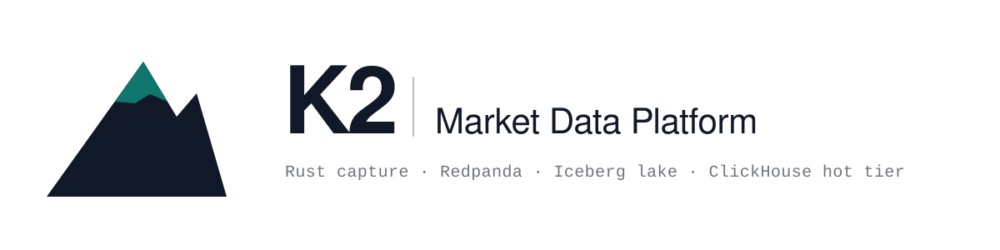
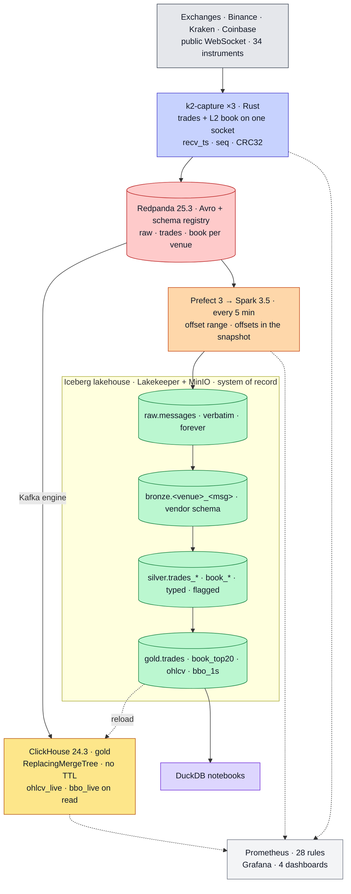

<p align="center">
  <picture>
    <source media="(prefers-color-scheme: dark)" srcset="docs/assets/banner-dark.svg">
    
  </picture>
</p>

# K2 Market Data Platform

A market data platform for quantitative research. Three crypto exchanges are captured
verbatim over public WebSocket feeds, archived to an Iceberg lakehouse that is the system of
record, and served from ClickHouse as a derived tier. One host, 16 CPU / 40 GB. Not a
trading path.

[](https://github.com/rjdscott/k2-market-data-platform/actions/workflows/ci.yml)
[](./LICENSE)
[](https://www.rust-lang.org/)
[](https://clickhouse.com/)

## Overview

| Property | How |
|---|---|
| Complete | One Rust process per venue holds a single socket carrying trades and L2 book, stamps `recv_ts_ns` before parsing, verifies Kraken's CRC32 on every update, tracks each venue's sequence numbers, and publishes every frame verbatim. |
| Reproducible | Every 5 minutes Spark reads Redpanda by offset range into Iceberg: `raw` (never expired) to `bronze` (per venue, vendor schema) to `silver` (typed, flagged) to `gold` (one row per trade, OHLCV, BBO). Consumed offsets are committed in the same snapshot as the rows; any layer rebuilds from the one above. |
| Disposable serving | ClickHouse `gold` is fed live from the topics and reloaded from the lake. Dedup is a `ReplacingMergeTree` key; candles are computed on read, so a replay cannot corrupt one. |
| Proven | Nightly audits per layer, three-way OHLCV parity at a pinned snapshot, 28 alert rules as code, chaos scripts with measured recovery, a fresh-clone release check before every tag. |

## Architecture


```mermaid
flowchart TB
  E["Exchanges · Binance · Kraken · Coinbase<br/>public WebSocket · 34 instruments"]:::ex
  F["k2-capture ×3 · Rust<br/>trades + L2 book on one socket<br/>recv_ts · seq · CRC32"]:::rs
  R[("Redpanda 25.3 · Avro + schema registry<br/>raw · trades · book per venue")]:::rp
  C["ClickHouse 24.3 · gold<br/>ReplacingMergeTree · no TTL<br/>ohlcv_live · bbo_live on read"]:::ch
  S["Prefect 3 → Spark 3.5 · every 5 min<br/>offset range · offsets in the snapshot"]:::sp
  subgraph L["Iceberg lakehouse · Lakekeeper + MinIO · system of record"]
    direction TB
    RAW[("raw.messages · verbatim · forever")]:::lk
    BR[("bronze.&lt;venue&gt;_&lt;msg&gt; · vendor schema")]:::lk
    SV[("silver.trades_* · book_* · typed · flagged")]:::lk
    GD[("gold.trades · book_top20 · ohlcv · bbo_1s")]:::lk
    RAW --> BR --> SV --> GD
  end
  N["DuckDB notebooks"]:::nb
  O["Prometheus · 28 rules<br/>Grafana · 4 dashboards"]:::ob

  E --> F --> R
  R -->|Kafka engine| C
  R --> S --> RAW
  GD -.->|reload| C
  GD --> N
  F & S & C -.-> O

  classDef ex fill:#e5e7eb,stroke:#374151,color:#111827
  classDef rs fill:#c7d2fe,stroke:#4338ca,color:#111827
  classDef rp fill:#fecaca,stroke:#b91c1c,color:#111827
  classDef lk fill:#bbf7d0,stroke:#15803d,color:#111827
  classDef sp fill:#fed7aa,stroke:#c2410c,color:#111827
  classDef ch fill:#fde68a,stroke:#b45309,color:#111827
  classDef nb fill:#ddd6fe,stroke:#6d28d9,color:#111827
  classDef ob fill:#f3f4f6,stroke:#6b7280,color:#111827
```

15 long-running services and 4 one-shot init containers, 14.60 CPU / 25.625 GiB of declared
limits ([how the numbers are produced](./docs/operations/docker-resources.md#how-these-numbers-are-produced)).

**Read the book.** [`docs/architecture/`](./docs/architecture/README.md) is written as numbered
chapters: what the platform is and is not, the market data and data engineering concepts it
rests on, then one chapter per component with the problem, the options, the decision, how it
works, and the practices that enforce it.

## Key decisions

| ADR | Decision | Why |
|---|---|---|
| [018](./docs/adr/ADR-018-v3-lake-first-rust-capture.md) | The lake is the system of record; everything else is derived | v2's lake was a JDBC copy of the serving database and inherited its TTL and dropped columns |
| [019](./docs/adr/ADR-019-rust-capture-tier.md) | One Rust process per venue replaces three JVM handlers | Trades and book on one connection, `recv_ts` before parse, retired on a measured parity gate |
| [020](./docs/adr/ADR-020-avro-fixed-point-contracts.md) | Avro with registry, `int64` at 1e-8, `BACKWARD_TRANSITIVE` | v2 stored prices as strings and never read its own Avro topic |
| [022](./docs/adr/ADR-022-exactly-once-via-snapshot-offsets.md) | Kafka offsets committed inside the Iceberg snapshot | One atomic commit replaces a watermark table and its failure modes |
| [026](./docs/adr/ADR-026-four-layer-lake-and-gold-served-from-clickhouse.md) | Four lake layers; ClickHouse serves gold with no TTL | Venue fields survive to silver; candles on read fix v2's per-block open/close bug |
| [027](./docs/adr/ADR-027-book-snapshot-and-sequencing.md) | Top-20 snapshots at 1 Hz; per-venue sequencing and resync | Raw keeps the deltas; the product is what research joins against |
| [008](./docs/adr/ADR-008-eliminate-prefect-orchestration.md) | Remove Prefect: reversed | A wrong call kept on the record with its outcome |

All 27 ADRs: [`docs/adr/`](./docs/adr/README.md).

## Measured

From [`docs/benchmarks/2026-08-27.md`](./docs/benchmarks/2026-08-27.md), a 6.5 h capture
window; every row there carries the command that produced it.

| | Binance | Kraken | Coinbase |
|---|---:|---:|---:|
| Frames/s, window average | 187 | 606 | 130 |
| Exchange to receive, p50 / p99 (ms) | 42 / 207 | 177 / 459 | 184 / see note |
| Sequence gaps | 0 | 0 | 0 |
| Checksum failures | n/a | 0 of 14.1 M | n/a |
| Produce errors | 0 | 0 | 0 |

Coinbase's p99 was the venue's on-subscribe trade snapshot, not transit; the capture now
excludes it from the histogram.

| Operation | Result |
|---|---|
| Lake bronze rebuild from raw | 61.9 M rows in 520 s |
| Per-venue bronze vs raw archive | 0.59× |
| Lake growth | about 9.8 GB/day |
| ClickHouse pull of gold trades from the lake | 10.4 M rows in 4.4 s |
| Chaos: lake ingest killed / MinIO stopped / Lakekeeper stopped | 42 s / 38 s / 37 s |
| Chaos: ClickHouse stopped 150 s | alert at 160 s, healthy 7 s after restart |
| Chaos: corrupt feed record | isolated in 4 s |

Detail per failure: [failure modes](./docs/architecture/16-failure-modes.md).

## Quick start

Requires a Docker engine with at least 24 GB of memory so every declared limit is honoured;
measured usage is far lower.

Two lines of `.env` are host-specific and are the whole first-run gotcha:
`K2_CAPTURE_CPUSET` and `K2_HEAVY_CPUSET` ship empty (no CPU pinning, starts anywhere) —
uncomment the 15-core layout in `.env.example` only on a host that has those cores, or six
containers fail at start with `invalid argument`. `K2_PREFECT_PORT` (default 4200) is
Prefect's host port, and it moves the UI's own API URL with it.

```bash
git clone https://github.com/rjdscott/k2-market-data-platform.git && cd k2-market-data-platform
cp .env.example .env            # set every change-me value; LAKEKEEPER_ENCRYPTION_KEY: openssl rand -base64 32
set -a && . ./.env && set +a
docker compose up -d            # first run builds the capture, prefect and spark images
make health                     # every service healthy, a message on every venue in the last
                                # 2 min, and a lake that is still committing
docker exec k2-redpanda rpk topic consume market.crypto.v3.trades.binance --num 1
```

Step by step, with the measured timeline: [fresh install](./docs/runbooks/fresh-install.md).

Every lake layer is populated within five minutes of a fresh clone (release check, 2026-08-27).
To write the first query, start at the
[data catalog](./docs/operations/data-catalog.md): every table's grain, time columns,
symbol conventions and a runnable example.

| Service | URL | First thing to look at |
|---|---|---|
| Grafana | http://localhost:3000 (`admin` / `$GRAFANA_PASSWORD`) | the capture and lake dashboards |
| Redpanda Console | http://localhost:8080 | `market.crypto.v3.trades.binance`, values decoded as Avro |
| Prefect | `http://localhost:$K2_PREFECT_PORT` (default 4200) | Deployments: `lake-ingest-5min`, `lake-maintenance-daily` |

Every other URL, credential and port — ClickHouse, Lakekeeper, MinIO, Prometheus, Spark,
the notebooks — is on one page:
[quick reference](./docs/operations/quick-reference.md#urls-and-credentials).

Research: `make notebooks` starts JupyterLab with DuckDB over the lake
([`notebooks/`](./notebooks/README.md)).

## Tests and CI

| Suite | Run |
|---|---|
| Rust capture: 60 tests, including replay over recorded sessions | `make test-rust` |
| Python: 229 tests over contracts, wire format, offsets, decoders, book replay, parity | `make test-python` |
| ClickHouse schema: 9 assertions, including the v2 OHLCV regression | `make test-clickhouse` |
| Prometheus rule unit tests and documentation gates | `bash scripts/check-docs.sh` |
| Live stack: per-layer parity, three-way OHLCV parity, chaos | `make lake-verify`, `make parity-ohlcv`, `make chaos` |

CI ([`ci.yml`](./.github/workflows/ci.yml)) runs rust (fmt, clippy `-D warnings`, test),
python (Ruff, pytest), clickhouse-schema, a docker build matrix, compose validation, the
documentation gates and Trivy on every pull request.

## Repository layout

```
services/capture-rust/     k2-capture: one binary, three exchanges
docker/lake/               Spark ingest, layer builders, audits, DDL, Prefect flows
docker/clickhouse/ddl/     gold contract (CI-tested) and Kafka feeds
docker/prometheus/rules/   28 alert rules with unit tests
schemas/avro/              raw-message, trade, book-snapshot-l2
config/instruments.yaml    instrument registry, the single source of truth
scripts/chaos/             failure injection, timed
notebooks/                 DuckDB research notebooks
docs/                      the architecture book, ADRs, runbooks, benchmarks, plans
legacy/                    v1, v2 Kotlin handlers, v2 ClickHouse DDL, v2 offload: archived, unmodified
```

## Not built

No query API. No replication or failover: one broker, one ClickHouse, one host. No
Alertmanager routing. No load test above 1×. A pcap sidecar and a cross-venue security
master are designed ([ADR-026](./docs/adr/ADR-026-four-layer-lake-and-gold-served-from-clickhouse.md),
[data strategy](./docs/architecture/12-data-strategy.md)) and not started.

## Documentation

- [`docs/`](./docs/README.md): the map — which surface answers which kind of question
- [`docs/operations/data-catalog.md`](./docs/operations/data-catalog.md): every table,
  its grain, its clocks, and which engine is authoritative. Start here to query the data
- [`docs/operations/`](./docs/operations/README.md): running, inspecting and recovering the stack
- [`docs/architecture/`](./docs/architecture/README.md): the book, start at chapter 00
- [`docs/adr/`](./docs/adr/README.md): why, one decision per file, never edited once accepted
- [`docs/runbooks/`](./docs/runbooks/README.md): how, one per alert family, with measured recovery
- [`docs/benchmarks/`](./docs/benchmarks/README.md): every published number and its command
- [`docs/MIGRATION-JOURNEY.md`](./docs/MIGRATION-JOURNEY.md): v1 to v2 to v3, with what each phase measured

## License

MIT, see [`LICENSE`](./LICENSE). © Rob Scott.
