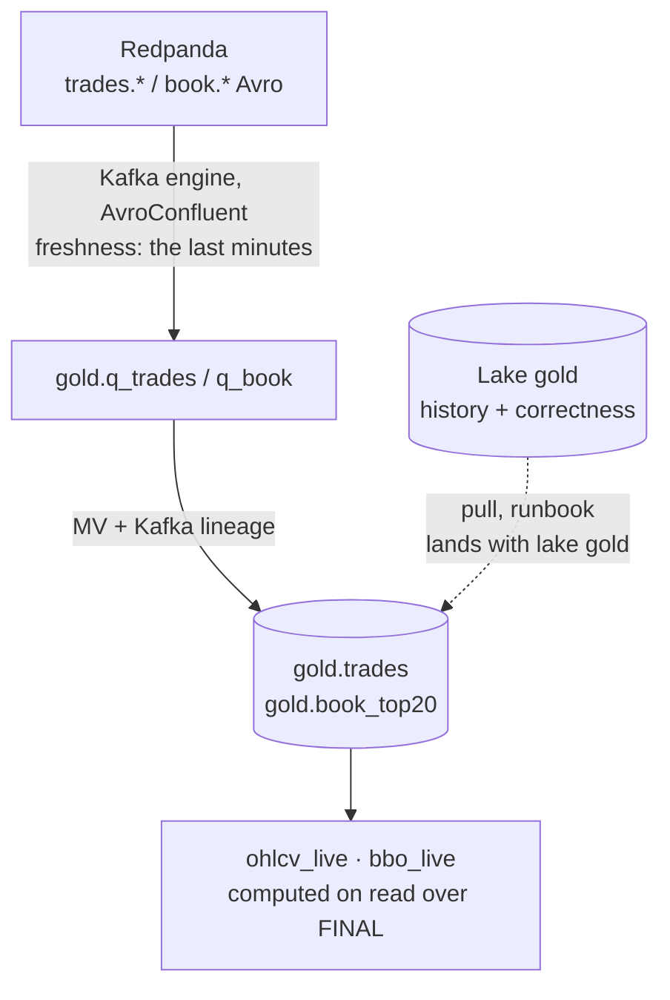

# `docker/clickhouse/` — the served tier

ClickHouse 24.3 serves **gold** — the canonical, deduplicated, cross-venue tables a
backtest reads — indefinitely, with no TTL ([ADR-026](../../docs/adr/ADR-026-four-layer-lake-and-gold-served-from-clickhouse.md)).
It is derived: everything in it is rebuildable from the lake, and the lake wins on
conflict. The v2 `k2` database is frozen beside it until the Phase E cutover drops it.

| File | What it does |
|---|---|
| `ddl/01-k2-schema.sql` | v2 medallion, frozen (ADR-019). Dropped at cutover |
| `ddl/10-gold-tables.sql` | **The contract.** `gold.trades`, `gold.book_top20`, `gold.feed_errors`, the lake-loaded `gold.ohlcv_{1m,5m,1h,1d}` and `gold.bbo_1s`, the on-read views `gold.ohlcv_live(bucket)` and `gold.bbo_live`. The only DDL CI applies |
| `ddl/20-gold-kafka.sql` | The feeds: AvroConfluent Kafka-engine tables over the three `trades.*` / `book.*` topics and the MVs into gold. Boot only |
| `config.xml` | Server limits sized to the 4 CPU / 8 GiB container: 6.5 GiB server-wide, 32 queries, 8 merge threads |
| `users.xml` | Profiles: `default` 6 GB/query; `quant` read-only, 3 GiB, 2 threads, `gold` only, password from `K2_QUANT_PASSWORD` |
| `schema/`, `validation/` | v1→v2 migration trail, kept for the record; not executed |

## How gold is fed



Two feeds, one contract. The topics give the head start (7 days of retention on
first boot, then live); the lake gives history and is the source of truth on a
reload. `ReplacingMergeTree` makes the overlap idempotent: a trade delivered by both
paths, or replayed by the venue, is one row under `FINAL`, and the row that survives
is the **earliest delivery** (`first_seen` = inverted receive time), matching what
the lake's gold layer will decide.

**OHLCV is computed on read, not materialised here** — that is the v2 post-mortem
made structural. v2 kept candles in a `SummingMergeTree` whose open/close were
`argMin`/`argMax` *within each insert block*; a minute spanning two blocks kept
whichever block's open survived the merge. `gold.ohlcv_live(bucket = 60)` sees the
whole minute under `FINAL` every time, and `scripts/clickhouse-schema-test.sh`
inserts one minute in two blocks — the earliest trade in the *later* block — and
asserts the open is that trade. The materialised `gold.ohlcv_*` / `gold.bbo_1s`
tables arrive with the lake's gold layer and are loaded from it.

## The test

```bash
make test-clickhouse       # ~40 s; also the CI job "ClickHouse (gold schema)"
```

A throwaway `clickhouse:24.3-alpine` with `10-gold-tables.sql`, `config.xml` and
`users.xml` mounted, `tests/clickhouse/*.jsonl` loaded, `tests/clickhouse/assertions.sql`
run: OHLCV across two blocks, `FINAL` count vs delivery count, earliest-delivery
winner, exact `Decimal` aliases, book downsampling keeps the later snapshot, BBO
arithmetic (mid, spread bps, imbalance, microprice), no TTL, the config applied;
then that `quant` can read `gold` with a 3 GiB cap and cannot write.

Two things this test found on 2026-08-27, both now in the files' comments: a
`<profiles>` block in `config.d` is logged as an error and ignored (v2's 10 GB cap
never applied), and `background_pool_size 8` needs two merge-tree pool floors
lowered or the server refuses to start.

## Applying it to a running server

The entrypoint runs `ddl/*.sql` only on a fresh volume. On a live stack:

```bash
set -a && . ./.env && set +a
docker compose up -d --force-recreate --no-deps clickhouse      # config.xml, users.xml, K2_QUANT_PASSWORD
docker exec -i k2-clickhouse clickhouse-client --password "$CLICKHOUSE_PASSWORD" --multiquery < docker/clickhouse/ddl/10-gold-tables.sql
docker exec -i k2-clickhouse clickhouse-client --password "$CLICKHOUSE_PASSWORD" --multiquery < docker/clickhouse/ddl/20-gold-kafka.sql
docker exec k2-clickhouse clickhouse-client --password "$CLICKHOUSE_PASSWORD" -q "SELECT * FROM system.kafka_consumers FORMAT Vertical"
```

**A bad record does not stop the feed — it goes to `gold.feed_errors`.**
`kafka_handle_error_mode = 'stream'` delivers a record the decoder cannot read with
`_error` and `_raw_message` set; the data MVs filter on `_error = ''` and a second
pair of MVs writes the rest, bytes included, to `gold.feed_errors`. Found the hard
way on 2026-08-27, twice: a JSON frame a chaos script had produced onto
`trades.kraken` stalled partition 0 permanently under the default mode (Kraken gold
72,195 rows against 164,467 in the lake); then, with `kafka_skip_broken_messages`
set instead, a second chaos record with schema id 0 still stalled partition 10 —
that failure is a registry 404 while fetching the schema, which "skip broken
messages" does not cover. Stream mode caught it in 10 s and left one row in
`feed_errors`. The lake archives the bytes and its audit counts them;
`ClickHouseKafkaMessagesFailed` says it happened.

## Measured, 2026-08-27 (first live apply, commit of PR #98)

The feeds were attached at 06:0xZ to topics holding the 7-day retention; the head
start drained in **≈ 8 minutes** on 2 consumers per feed while the container sat at
9 % CPU / 2.26 GiB (`docker stats`). Captures had stopped at 05:15:21Z, so the
tables end there.

| What | Value | Command |
|---|---:|---|
| `gold.trades` rows (deliveries = `FINAL`, merges done) | 10,419,176 · 2026-08-26 12:04:00 → 2026-08-27 05:15:21Z | `SELECT count(), (SELECT count() FROM gold.trades FINAL), min(exchange_ts), max(exchange_ts) FROM gold.trades` |
| `gold.book_top20` rows | 2,008,914 | same shape |
| on disk, compression | trades 278.34 MiB (4.63×), book_top20 329.87 MiB (4.65×) | `SELECT table, formatReadableSize(sum(bytes_on_disk)), round(sum(data_uncompressed_bytes)/sum(data_compressed_bytes),2) FROM system.parts WHERE database='gold' AND active GROUP BY table` |
| **parity with the lake**, 2026-08-27 00:00–05:00Z by `exchange_ts`: binance / coinbase / kraken | **1,978,901 / 273,060 / 33,246 — equal** to `count(DISTINCT symbol, trade_id)` over `lake.bronze.trades` on the same window (Coinbase's 12,805 venue replays in that window collapsed by `ReplacingMergeTree`) | `SELECT exchange, count() FROM gold.trades FINAL WHERE exchange_ts >= '2026-08-27 00:00:00' AND exchange_ts < '2026-08-27 05:00:00' GROUP BY exchange` vs the Spark query in the lake |
| `gold.feed_errors` | 1 row: `trades.kraken` partition 10 offset 1895, schema id 0, the chaos record | `SELECT * FROM gold.feed_errors` |
| `quant`: `ohlcv_live(bucket=60)`, BTC/USDT, last 6 h → 361 candles | 0.133 / 0.132 / 0.133 s | `clickhouse-client --user quant --time -q "SELECT count() FROM gold.ohlcv_live(bucket=60) WHERE canonical_symbol='BTC/USDT' AND window_start >= toDateTime64('2026-08-26 23:15:00', 6)"` |
| `quant`: `ohlcv_live(bucket=3600)`, every symbol, whole table → 612 rows | 0.500 / 0.481 / 0.483 s | same, `bucket=3600`, no WHERE |
| `quant`: `bbo_live`, BTC/USDT, last 75 min → 4,521 rows | 0.012 / 0.012 / 0.017 s | `SELECT count() FROM gold.bbo_live WHERE canonical_symbol='BTC/USDT' AND second >= '2026-08-27 04:00:00'` |
| `quant`: `count() FROM gold.trades FINAL` | 0.365 s | as written |

## Alerts

`docker/prometheus/rules/clickhouse-alerts.yml`, group `clickhouse_gold`:
`ClickHouseGoldFeedStale` (consumers silent 10 min while capture reports fresh
trades — both conditions, so a stopped capture is not a broken feed) and
`ClickHouseKafkaMessagesFailed` (a record AvroConfluent could not decode — it is in
`gold.feed_errors`; a schema moved or a foreign producer). promtool cases in `rules/tests/clickhouse-gold-alerts_test.yml`,
run by `make check-alerts`.
