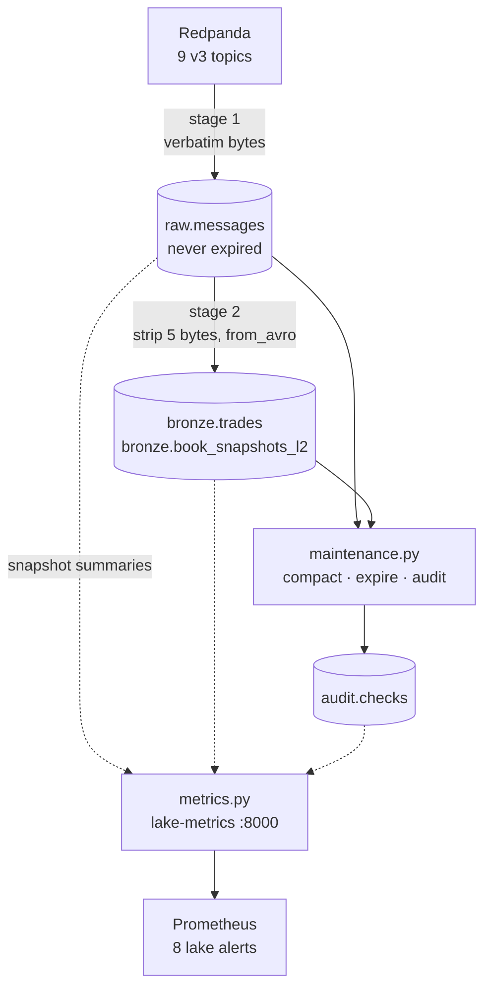

# `docker/lake/` — the v3 Iceberg lake

Redpanda to Iceberg, in two stages, with the Kafka offsets stored inside the
same commit as the data. This directory is the whole lake tier: the table
definitions, the ingest, the nightly maintenance and the metrics exporter.

It replaces `docker/offload/`, which copied ClickHouse into Iceberg over JDBC.
Both are present right now — the parallel-run window
([003-phase-d](../../docs/plans/2026-08-26-v3-quant-research-platform/003-phase-d-lake-tier.md))
compares them before the old path is deleted.

---

## The files

| File | What it does |
|---|---|
| `ddl/lake.sql` | The four tables: `raw.messages`, both `bronze.*`, and `audit.checks` |
| `apply_ddl.py` | Applies that file. The `lake-ddl` one-shot runs it; idempotent, so a re-run is a no-op |
| `spark_conf.py` | The one Spark session builder. Every catalog and S3 setting lives here, env-driven |
| `init-lake.sh` | The `lake-init` one-shot: MinIO bucket, Lakekeeper bootstrap, warehouse, namespaces |
| `offsets.py` | Pure offset bookkeeping. The exactly-once contract, and the only file with no Spark import |
| `wire.py` | The Confluent framing, as a Python parser and as the Spark SQL the executors run |
| `ingest.py` | Stage 1 Kafka → `raw.messages`, stage 2 `raw.messages` → `bronze.*` |
| `maintenance.py` | Nightly compaction, snapshot expiry, and the audits. Non-zero exit on a failure |
| `metrics.py` | The `lake-metrics` exporter. Reads snapshot summaries over the catalog's REST API |
| `flows/` | The two Prefect deployments: `lake-ingest-5min`, `lake-maintenance-daily` |

---

## How it fits together



Stage 1 archives all nine topics. Stage 2 decodes only `trades.*` and `book.*` —
the `raw.*` frames stay verbatim, because rebuilding a book from deltas is a
different job with different failure modes, and `raw.messages` keeps every delta
so it stays possible.

---

## Running it by hand

```bash
# one full cycle: Kafka -> raw.messages -> bronze.*
docker exec k2-spark-iceberg python3 /home/iceberg/lake/ingest.py

# one stage at a time
docker exec k2-spark-iceberg python3 /home/iceberg/lake/ingest.py --stage raw
docker exec k2-spark-iceberg python3 /home/iceberg/lake/ingest.py --stage bronze

# a backlog, one slice at a time, so a week of catch-up is not one Spark job
docker exec k2-spark-iceberg python3 /home/iceberg/lake/ingest.py \
    --end-timestamp 2026-08-27T02:00:00Z

# what is on the topics, without a table or a commit
docker exec k2-spark-iceberg python3 /home/iceberg/lake/ingest.py --probe

# compaction, expiry, audits
docker exec k2-spark-iceberg python3 /home/iceberg/lake/maintenance.py
docker exec k2-spark-iceberg python3 /home/iceberg/lake/maintenance.py --audit-only

# tables, idempotently
docker exec k2-spark-iceberg python3 /home/iceberg/lake/apply_ddl.py

# the exit criteria, end to end, against the live stack
make lake-verify
```

Under Prefect the same commands run on a schedule — `lake-ingest-5min` every
five minutes at concurrency 1, `lake-maintenance-daily` at 03:00 UTC. The flows
add no logic; see `flows/lake_flows.py` for why.

---

## The exactly-once contract

**The offsets a run consumed are written into the Iceberg snapshot summary by
the same commit that writes the data.** Stage 1 commits with
`k2.kafka-offsets`, `k2.max-kafka-ts` and `k2.job=ingest`; stage 2 commits with
`k2.src-snapshot-id` and `k2.job=decode`. Resuming is "read the latest ingest
snapshot's summary".

```bash
docker exec k2-spark-iceberg python3 -c "
import sys; sys.path.insert(0, '/home/iceberg/lake')
from ingest import RAW_TABLE, snapshot_history
from spark_conf import lake_session
import offsets as O
s = lake_session('peek')
print(O.latest_summary(snapshot_history(s, RAW_TABLE), O.JOB_INGEST)[O.KAFKA_OFFSETS])
s.stop()"
```

**Why not a watermark table.** v2 kept its position in a PostgreSQL
`offload_watermarks` row (`docker/offload/watermark_pg.py`). That is two facts
in two systems, and every failure between writing one and writing the other is
a duplicate or a hole — a job that commits its data and then dies re-reads the
same range on the next run, a job that updates the watermark first and then
dies skips it. There is no ordering of the two writes that removes the window,
only orderings that choose which way it fails.

An Iceberg commit is a single atomic swap of the table's metadata pointer, and
a summary property rides inside that swap. So the position and the rows it
describes land together or not at all, and the third state a watermark table
can reach — rows present, bookkeeping absent — does not exist here. That is
what `scripts/chaos/lake-ingest-kill.sh` asserts by killing a run mid-write.

Two consequences worth knowing:

- **Concurrency must be 1, and the script enforces it.** Two ingests at once
  both read the same committed offsets and both write the same records — and
  Iceberg will not stop them: measured on a scratch table with the DDL's
  `commit.retry.num-retries=10`, two identical 5-row appends raised nothing and
  left 10 rows in two append snapshots, because the retry re-applies the loser
  on the new base. The summary makes a *sequence* of runs exactly-once, not a
  pair of concurrent ones. `ingest.py` takes an exclusive `flock` on
  `/tmp/k2-lake-ingest.lock` (`$K2_LAKE_LOCK`) in `main()` and exits 2 if it is
  held; `lake-ingest-5min`'s `concurrency_limit=1` sits behind that and covers
  only the runs Prefect launched, which is not the ones in these runbooks.
- **Snapshot expiry must not outrun stage 2.** Bronze resumes from the
  `raw.messages` snapshot id it last decoded, so expiring that snapshot turns
  the next run into an error. `maintenance.py` refuses `--retain-days` under 7.

Reading back skips compaction and expiry snapshots by the `k2.job` property the
jobs set — not by Iceberg's own `operation` field. After a nightly rewrite the
newest snapshot on `raw.messages` carries no offsets, and a job that took it
would restart from the beginning of every topic.

---

## Recovery

Full procedures are in the runbooks; the pointers:

| Symptom | Start at |
|---|---|
| Ingest stopped committing | [lake-recovery.md](../../docs/runbooks/lake-recovery.md) |
| Data arriving late, commits still landing | [lake-ingest-lag.md](../../docs/runbooks/lake-ingest-lag.md) |
| An audit failed | [lake-audit-failed.md](../../docs/runbooks/lake-audit-failed.md) |
| Disk over 80% | [lake-disk-usage-high.md](../../docs/runbooks/lake-disk-usage-high.md) |
| What is lost vs delayed, per failure | [failure-modes.md](../../docs/architecture/failure-modes.md) |

Three things worth stating here because they shape every one of those:

- **`raw.messages` is the system of record and nothing deletes from it.** Every
  bronze table is a function of it. If bronze is wrong, drop it and replay;
  `apply_ddl.py` recreates it and the next stage-2 run rebuilds from the whole
  archive, because a table with no `k2.src-snapshot-id` reads everything.
- **Redpanda holds 48 h of the raw topics.** That is the real deadline on any
  ingest outage. Past it the gap is permanent — public feeds do not replay.
- **A failed run leaves the table untouched, but may leave orphan files.** A
  write that died after uploading Parquet and before committing leaves data
  files no manifest references. They are invisible to every reader and cost only
  disk. `remove_orphan_files` clears them and it IS on the nightly path, with a
  24-hour floor: the procedure decides "unreferenced" from the metadata at the
  instant it runs, so a shorter cutoff can delete a file a concurrent writer has
  staged and not yet committed. Iceberg enforces the same floor itself.

  It cannot use the procedure's own listing. That goes through the Hadoop
  FileSystem, this Spark image has no `hadoop-aws`, and the call answers
  `UnsupportedFileSystemException: No FileSystem for scheme "s3"` and does
  nothing. Rather than bake `hadoop-aws` plus a ~190 MB `aws-java-sdk-bundle`
  into the image so a second S3 client can list what the first one already can,
  `maintenance.file_list_view()` lists the prefix with Iceberg's own `S3FileIO`
  and hands it to the procedure through `file_list_view`. There is no forcing it
  sooner: 24 h is the only horizon `maintenance.py` and Iceberg 1.8.1 both
  accept, so the first nightly run after an orphan turns 24 h old clears it and
  nothing clears it before that.

---

## What the disk metric actually measures

`k2_lake_disk_used_ratio` comes from `os.statvfs` on the MinIO data volume as
mounted into the `lake-metrics` container, and the path it measured is a label
on the metric rather than an assumption in the docs. That matters here.

**On this host, Docker runs inside a VM** (`docker context ls` shows
`desktop-linux`, `docker info` reports `Operating System: Docker Desktop`), and
the VM's disk is a thin-provisioned image on the machine's real disk. The two
disagree. Both readings below are from the same instant, and this is the ONE
free-space figure this repo publishes — everything else that needs a number
quotes it and its timestamp:

```console
$ df -h /                                        # 2026-08-26T14:43Z, on the host
Filesystem      Size  Used Avail Use% Mounted on
/dev/nvme0n1p5  961G  715G  197G  79% /

$ docker run --rm -v k2-market-data-platform_minio-data:/minio-data:ro \
    python:3.12-slim python -c \
    "import os; s=os.statvfs('/minio-data'); t=s.f_blocks*s.f_frsize; f=s.f_bavail*s.f_frsize; \
     print(f'total={t/2**30:.1f}G free={f/2**30:.1f}G used_ratio={(t-f)/t:.3f}')"
total=944.0G free=619.6G used_ratio=0.344
```

0.344 inside, 0.79 outside — 45 points against a 0.80 threshold — and only the
second number is the one that runs out. Anything measured from inside a
container sees the VM, not the machine; ClickHouse's
`ClickHouseAsyncMetrics_FilesystemMainPath*` series reports the same VM disk and
is no better.

So on a Docker Desktop host **`LakeDiskUsageHigh` will not fire before the real
disk fills**, and the honest reading is that the alert is correct on bare metal
and on AWS and blind here. The *rule* is proven either way:
`docker/prometheus/rules/tests/lake-alerts_test.yml` asserts it fires at 0.81,
stays quiet at 0.79, and that `LakeDiskUsageCritical` takes over at 0.95. What
is missing on this host is a truthful input, and closing that needs a host-side
exporter — a maintainer decision rather than something a container can fix.
Until then the check is manual and it is `df -h /` on the host, which the
[disk runbook](../../docs/runbooks/lake-disk-usage-high.md) carries.

`mc du k2/k2-lake` answers a different question — what the buckets hold, rather
than what is left — and both belong in the days-remaining arithmetic.

---

## Configuration

Every endpoint, region, path-style flag and catalog URI is an environment
variable with today's single-host value as its default
([Q9](../../docs/research/2026-08-26-v3-requirements-clarification.md#q9--scale-target):
pointing this lake at real S3 must be a config change, not a rewrite).

| Variable | Default | Read by |
|---|---|---|
| `K2_LAKE_CATALOG_URI` | `http://lakekeeper:8181/catalog` | `spark_conf.py`, `metrics.py` |
| `K2_LAKEKEEPER_URL` | `http://lakekeeper:8181` | `init-lake.sh` |
| `K2_LAKE_WAREHOUSE` | `k2` | all three |
| `K2_LAKE_BUCKET` | `k2-lake` | `init-lake.sh` |
| `K2_S3_ENDPOINT` | `http://minio:9000` | `spark_conf.py`, `init-lake.sh` |
| `K2_S3_REGION` | `local-01` | `spark_conf.py`, `init-lake.sh` |
| `K2_S3_PATH_STYLE` | `true` | `spark_conf.py`, `init-lake.sh` |
| `K2_BROKERS` | `redpanda:9092` | `ingest.py` |
| `K2_SCHEMA_REGISTRY_URL` | `http://redpanda:8081` | `ingest.py` |
| `K2_V3_PREFIX` | `market.crypto.v3` | `ingest.py` |
| `K2_LAKE_DISK_PATH` | `/minio-data` | `metrics.py` |

`spark_conf.py` and `init-lake.sh` must agree: that script creates what these
jobs connect to, so overriding one side alone points every job at a catalog
nothing bootstrapped.

---

## Design notes that are not obvious from the code

- **Copy-on-write, everywhere, and no merge-on-read.** Nothing in the ingest
  path deletes or updates a row. Merge-on-read would put positional delete files
  in front of DuckDB 1.4.4 and ClickHouse 24.3's `iceberg()` reader, neither of
  which has been shown to handle them on this stack. Flipping one of those
  properties is a spike first, recorded under
  `docs/research/2026-08-26-v3-spikes/s13-mor-delete/`, then an edit.
- **Column metrics default to `none`.** Iceberg's default writes per-file bounds
  for every column, which for a 5.2 MB Coinbase `payload` is bytes nothing will
  ever filter on. Each table turns metrics back on for the columns its readers
  actually prune by, named in the comment above it in `lake.sql`.
- **`schema_id` is nullable.** A payload that is not Confluent-framed is still
  archived byte for byte, with a null id; stage 2 skips it and the audit counts
  it. Making it required would let one foreign record block every following
  ingest on the same offset — a poison pill in an append-only archive.
- **`bronze.trades` identifier fields include `conn_id`, and
  `bronze.book_snapshots_l2` keys on `snapshot_ts_ns` rather than
  `conn_msg_seq`.** Both were measurements, not preferences; the arithmetic and
  the counts are in the comments above each `SET IDENTIFIER FIELDS` in
  `lake.sql`. Coinbase replays trades after a reconnect, and a quiet book gives
  two consecutive 1 Hz samples the same `conn_msg_seq`.
- **The sequence audit checks monotonicity, not `+1` continuity.** Kraken and
  Binance trades write `seq=0`, and Coinbase's `sequence_num` is shared with
  heartbeats that never reach bronze — so a `+1` check would report a gap for
  every correct capture. The docstring in `maintenance.py` has the per-venue
  detail.
- **`metrics.py` does not use PyIceberg.** `load_table` needs a FileIO to fetch
  `metadata.json` from S3, `FsspecFileIO` needs `s3fs` (absent), and
  `import pyiceberg.io.pyarrow` alone costs more RSS than the exporter's whole
  128 MB limit. Both numbers, with the commands that produced them
  (2026-08-26, pyiceberg 0.7.1):

  ```console
  $ docker exec k2-spark-iceberg python3 -c \
      "import resource; import pyiceberg.io.pyarrow; \
       print(resource.getrusage(resource.RUSAGE_SELF).ru_maxrss/1024)"
  121.9                       # MiB peak RSS, from a 10.9 MiB bare interpreter

  # metrics.py against the live Lakekeeper, five full refreshes over four tables
  $ docker exec k2-prefect-worker python /tmp/rss.py
  5 full refreshes over 4 tables, 0 errors; peak RSS 26.6 MiB
  ```

  One REST GET returns the same summaries at a fifth of the cost. The 26.6 MiB
  run was measured against four scratch tables created with
  `apply_ddl.py --namespace-map`, because the real `raw`/`bronze`/`audit` tables
  do not exist on this host yet.

---

## The Spark image

`docker/spark/Dockerfile` already carries `spark-sql-kafka-0-10_2.12:3.5.5`,
`spark-token-provider-kafka-0-10`, `kafka-clients:3.4.1`, `commons-pool2:2.11.1`
and `spark-avro_2.12:3.5.5`, each pinned by sha256. Nothing needed adding for
Phase D — verified present in the running image:

```bash
docker exec k2-spark-iceberg ls /opt/spark/jars | grep -iE 'kafka|avro'
```

---

## Related

- [ADR-018](../../docs/adr/ADR-018-v3-lake-first-rust-capture.md) — lake-first, and why
- [ADR-021](../../docs/adr/ADR-021-raw-first-archive-and-lineage.md) — the raw archive
- [ADR-022](../../docs/adr/ADR-022-exactly-once-via-snapshot-offsets.md) — the contract above
- [ADR-023](../../docs/adr/ADR-023-lakekeeper-rest-catalog.md) — the catalog
- [ADR-024](../../docs/adr/ADR-024-unified-bronze-tables-in-the-lake.md) — one table per record type
- [partitioning-strategy.md](../../docs/architecture/partitioning-strategy.md) — specs and rejects
- [scale-out-path.md](../../docs/architecture/scale-out-path.md) — what changes on AWS, and what does not
