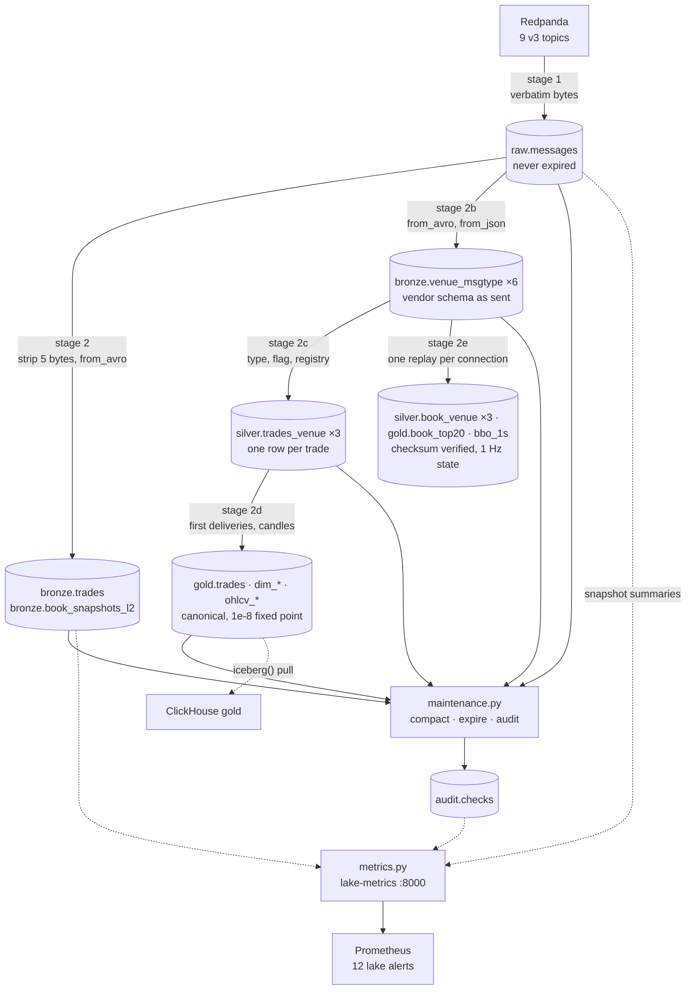

# `docker/lake/`: the v3 Iceberg lake

Redpanda to Iceberg, in two stages, with the Kafka offsets stored inside the
same commit as the data. This directory is the whole lake tier: the table
definitions, the ingest, the nightly maintenance and the metrics exporter.

It replaces `docker/offload/`, which copied ClickHouse into Iceberg over JDBC.
Both are present right now, the parallel-run window
([003-phase-d](../../docs/plans/2026-08-26-v3-quant-research-platform/003-phase-d-lake-tier.md))
compares them before the old path is deleted.

---

## The files

| File | What it does |
|---|---|
| `ddl/lake.sql` | Every table: `raw.messages`, the unified `bronze.*` pair, the six per-venue `bronze.<venue>_<msgtype>`, and `audit.checks` |
| `apply_ddl.py` | Applies that file. The `lake-ddl` one-shot runs it; idempotent, so a re-run is a no-op |
| `spark_conf.py` | The one Spark session builder. Every catalog and S3 setting lives here, env-driven |
| `init-lake.sh` | The `lake-init` one-shot: MinIO bucket, Lakekeeper bootstrap, warehouse, namespaces |
| `offsets.py` | Pure offset bookkeeping. The exactly-once contract, and the only file with no Spark import |
| `wire.py` | The Confluent framing, as a Python parser and as the Spark SQL the executors run |
| `catalog.py` | Snapshot bookkeeping, the registry fetch by id, and how a running job files an audit row. Shared by the next three |
| `ingest.py` | Stage 1 Kafka → `raw.messages`, stage 2 `raw.messages` → unified `bronze.*`, stage 2b → per venue |
| `bronze.py` | Stage 2b: the six per-venue tables, decoded from the venue JSON in `raw.*`, vendor field names and types as sent |
| `silver.py` | Stage 2c: `silver.trades_<venue>`, bronze frames typed, one row per trade, canonical symbol from the registry, replay / gap / precision flags |
| `instruments.py` | The registry (`config/instruments.yaml`) as silver needs it: native → canonical, failing loudly on an unknown symbol |
| `book.py` | Pure: an L2 book replayed from frames, Kraken's CRC32 at the pair's precision, truncation to the subscription depth. Unit-tested against Kraken's published example |
| `books.py` | Stage 2e: `silver.book_<venue>` typed (Kraken `checksum_ok` by replay) and, from the same replay, `gold.book_top20` per second and `gold.bbo_1s`; `gold.book_state` carries a connection's book between ticks |
| `gold.py` | Stage 2d: `gold.trades` (one row per logical trade = silver's first deliveries), `gold.dim_*` from the registry, `gold.ohlcv_{1m,5m,1h,1d}` recomputed per touched bucket and MERGEd |
| `rebuild.py` | `make lake-rebuild LAYER=bronze|silver|gold`: drop, recreate and re-decode a layer from its parent, one day per venue at a time |
| `maintenance.py` | Nightly compaction, snapshot expiry, and the audits. Non-zero exit on a failure |
| `metrics.py` | The `lake-metrics` exporter. Reads snapshot summaries over the catalog's REST API |
| `flows/` | The two Prefect deployments: `lake-ingest-5min`, `lake-maintenance-daily` |

---

## How it fits together



Stage 1 archives all nine topics. Stage 2 decodes `trades.*` and `book.*` into
the unified pair; stage 2b decodes the `raw.*` JSON frames into six per-venue
tables; stage 2c types the bronze trade frames into three silver tables; stage 2d
projects gold from silver and materialises the candles. `raw.messages` keeps every
frame verbatim either way.

---

## Bronze per venue (Phase E, ADR-026)

Six tables, one per (venue, message type), decoded by `bronze.py` from the
venue's own JSON in `raw.messages`, never from the Avro `trades.*`/`book.*`
topics, so a bug in the Rust parser is repairable here without a replay:

| Table | Source stream | Row = | Numbers |
|---|---|---|---|
| `bronze.binance_trade` | `raw.binance`, `trade` | one `<sym>@trade` frame | strings as sent |
| `bronze.binance_depth20` | `raw.binance`, `depth20` | one `@depth20@100ms` frame, `bids`/`asks` as `[["px","qty"],…]` | strings as sent |
| `bronze.kraken_trade` | `raw.kraken`, `trade` | one frame, N trades in `data[]` | `DECIMAL(28,10)`, the digits of the JSON number, not a re-rounded double |
| `bronze.kraken_book` | `raw.kraken`, `book` | one snapshot or update frame, `checksum` as sent | `DECIMAL(28,10)` |
| `bronze.coinbase_market_trades` | `raw.coinbase`, `market_trades` | one frame, N trades under `events[].trades[]` | strings as sent |
| `bronze.coinbase_level2` | `raw.coinbase`, `l2_data` | one frame; a snapshot is the whole book, up to 4.9 MB | strings as sent |

Every table adds the same lineage: `symbol` (the capture's attribution),
`recv_ts_ns` / `recv_ts`, `conn_id`, `conn_msg_seq`, `src_topic` / `src_partition` /
`src_offset` (the identifier, one row per archived frame), `ingest_ts`. Partition
`days(recv_ts)`, sorted `(symbol, recv_ts_ns)`.

**What stays in raw only.** Control frames, `heartbeat`, `subscriptions`, `status`,
`instrument`, `control`, are counted, not decoded. Every run prints the balance
per venue and files `bronze_parity` if it does not hold:

```
stage 2b: binance: 9725802 frames = 9725802 decoded + 0 control (none)
```

**Parsing is PERMISSIVE, and the audit is strict.** A frame that does not match the
declared shape lands with lineage and NULL venue columns rather than blocking the
snapshot range for every run after it; the nightly `bronze_unparseable` audit fails
on any such row, and `bronze_schema_drift` samples 0.1 % of the last day's raw
frames to catch the one thing a PERMISSIVE parse loses silently, a key the venue
added that has no column. Both in `docs/runbooks/lake-audit-failed.md` §6–§7.

**Why `spark.sql.caseSensitive=true`.** Binance's trade payload carries both `e`
and `E`. The session builder sets it for every lake job; every other column is
lowercase and referenced as written.

Measured 2026-08-27: the whole archive (61,888,291 rows, six tables) rebuilt in
**520 s** at the 2g heap, peak driver RSS 2,643 MiB; the nightly audit set, now
23 checks plus the informational replay rate, ran in 290 s including lock wait,
all green; every slice balanced (`docs/benchmarks/2026-08-27.md` § Lake).
One day of `raw.binance` (2026-08-26) at the 768m ingest heap,
2026-08-27: 9,725,802 frames → 6,619,758 `binance_trade` + 3,106,044
`binance_depth20` rows in 321 s, peak driver RSS 1,220 MiB (`ps -o rss=` in the
container). The full-archive rebuild runs at the 2g maintenance heap, one day
per venue at a time:

```bash
docker exec k2-prefect-server prefect deployment schedule pause lake-ingest/lake-ingest-5min <schedule-id>   # id from: prefect deployment schedule ls lake-ingest/lake-ingest-5min
make lake-rebuild LAYER=bronze            # or EXCHANGE=kraken for one venue
docker exec k2-prefect-server prefect deployment schedule resume lake-ingest/lake-ingest-5min <schedule-id>
```

---

## Running it by hand

```bash
# one full cycle: Kafka -> raw.messages -> bronze.*
docker exec k2-spark-iceberg python3 /home/iceberg/lake/ingest.py

# one stage at a time
docker exec k2-spark-iceberg python3 /home/iceberg/lake/ingest.py --stage raw
docker exec k2-spark-iceberg python3 /home/iceberg/lake/ingest.py --stage bronze

# a backlog, one slice at a time, so a week of catch-up is not one Spark job
docker exec k2-spark-iceberg python3 /home/iceberg/lake/ingest.py \
    --end-timestamp 2026-08-27T02:00:00Z

# or drain it faster than the 200,000-offset default, with someone watching
docker exec k2-spark-iceberg python3 /home/iceberg/lake/ingest.py \
    --max-offsets-per-partition 200000

# what is on the topics, without a table or a commit
docker exec k2-spark-iceberg python3 /home/iceberg/lake/ingest.py --probe

# records were evicted before the lake read them: record the gap and resume past
# it. Pause the schedule first; the runbook is not optional here.
# docs/runbooks/lake-ingest-lag.md §3
docker exec k2-spark-iceberg python3 /home/iceberg/lake/ingest.py --accept-data-loss

# compaction, expiry, audits
docker exec k2-spark-iceberg python3 /home/iceberg/lake/maintenance.py
docker exec k2-spark-iceberg python3 /home/iceberg/lake/maintenance.py --audit-only

# tables, idempotently
docker exec k2-spark-iceberg python3 /home/iceberg/lake/apply_ddl.py

# the exit criteria, end to end, against the live stack
make lake-verify
```

Under Prefect the same commands run on a schedule, `lake-ingest-5min` every
five minutes at concurrency 1, `lake-maintenance-daily` at 03:00 UTC. The flows
add no logic; see `flows/lake_flows.py` for why.

---

## Silver per venue: trades (Phase E, ADR-026)

`silver.py` turns each venue's bronze trade frames into one typed row per trade:

| Table | From | Row = | Adds |
|---|---|---|---|
| `silver.trades_binance` | `bronze.binance_trade` | the frame's one trade | `event_time`, `buyer_is_maker`, `ignore_flag`, `stream` kept as sent |
| `silver.trades_kraken` | `bronze.kraken_trade` | `data[i]` | `ord_type`, `frame_type` |
| `silver.trades_coinbase` | `bronze.coinbase_market_trades` | `events[i].trades[j]` | `envelope_ts`, `sequence_num`, `event_type` (`snapshot` = history replayed on subscribe) |

Shared columns are ours: `price` / `qty` `DECIMAL(28,10)` (exact from the bronze
value), `exchange_ts` `TIMESTAMP` UTC micros, `side` normalised to `buy` / `sell`
beside `side_native`, `canonical_symbol` from **`config/instruments.yaml`** (mounted
into the container; an unknown native symbol stops the run, the registry's own
rule), lineage to the bronze row plus `src_index`, the position in the frame.

**Three flags, all measurements, none of them drops a row:**

- `venue_replay`, an earlier delivery of the same `(symbol, trade_id)` exists
  (lower `recv_ts_ns`, or equal and earlier lineage). Every delivery is kept; gold
  keeps the first.
- `seq_gap` / `missing_before`, the previous `trade_seq` for the symbol is not
  adjacent. All three venues number trades sequentially per symbol (measured
  2026-08-27 over the archive: Binance 8,667,843 consecutive ids vs 144 jumps,
  Coinbase 1,586,733 vs 72, Kraken 155,303 vs 141), so a jump is trades the archive
  never received, a capture restart, a produce-error drop, a retention eviction , 
  and `missing_before` counts them. `NULL` when no earlier trade is inside the
  lookback: unknown is not intact.
- `precision_loss`, more than 8 decimals in `price` or `qty`, which the wire's and
  gold's 1e-8 fixed point cannot carry.

The flags need history, so each batch is scored against **`batch ∪ silver rows of
the last day`** (two window functions) and only the batch is written; replays are
excluded from the gap window so a re-sent old trade is not a jump backwards. The
rebuild replays bronze one `recv_ts` day at a time, oldest first, so day N's lookback
is day N−1's freshly written rows.

Nightly (`maintenance.py`): `duplicate_identifiers` on the lineage + `src_index`,
`silver_parity` (rows == the exploded trade count of the bronze snapshot silver last
read), and the informational `silver_flags` line (replay, gap, missing-id and
precision counts) so a change in any rate is visible.

**Measured 2026-08-27, first rebuild** (`make lake-rebuild LAYER=silver`, whole
archive, 2g heap): **99 s** for 10,439,378 rows across the three tables, peak driver
RSS 2,548 MiB; the incremental tick after it reported every table level with its
bronze source in 6 s; the nightly audit set (now 29 checks + 4 informational) all
green. The flags against an independent baseline, a `lag()` over distinct trade
ids per symbol, computed straight from bronze before silver existed:

| Venue | Rows | Replays (`venue_replay`) | Gaps / ids never received | Baseline gaps / ids | Beyond 8 dp |
|---|---:|---:|---:|---:|---:|
| Binance | 8,668,587 | 588, all in 16:56:31–16:56:54Z on 2026-08-26, 3 symbols, one connection, identical `recv_ts_ns`: the producer re-sent frames during the `redpanda-stop` chaos, not a venue replay | 144 / 200,280 | 144 / 200,280 | 0 |
| Kraken | 155,455 | 0 | 141 / 8,013 | 141 / 8,013 | 0 |
| Coinbase | 1,615,336 | 28,520 (= rows − distinct `(symbol, trade_id)`) | 72 / 41,424 | 72 / 41,424 | 0 |

`seq_gap IS NULL` on 12 / 11 / 11 rows, the first trade of each symbol in the archive,
where "intact" is unknowable.

## Gold: canonical trades, dims, candles (Phase E, ADR-026)

`gold.py` is a projection plus a materialisation, and deliberately nothing more:

- **`gold.trades`**, silver's `venue_replay = false` rows, all three venues, one
  schema, `price_e8` / `qty_e8` as 1e-8 fixed point (the wire's and ClickHouse gold's
  representation; exact because silver's `precision_loss` guards the 8-decimal
  assumption). The identifier `(exchange, canonical_symbol, trade_id)` is unique by
  construction, silver already chose the earliest delivery, and the nightly audit
  asserts it. `seq_gap` / `missing_before` ride along; `venue_replay` does not (false
  by construction). Per venue, incrementally by silver snapshot; the position of each
  venue is a separate `k2.src-snapshot-id.<venue>` property carried forward on every
  commit.
- **`gold.dim_instrument`, `gold.dim_venue`**, `config/instruments.yaml`, overwritten
  each run: a dimension is a statement about now, the file is its history.
- **`gold.ohlcv_{1m,5m,1h,1d}`**, every bucket a batch of trades touches is
  recomputed over **all** of `gold.trades` for that bucket and `MERGE`d in, so a late
  trade replaces its candle rather than adding a second partial row, v2's
  `SummingMergeTree` failure closed at the source. `open`/`close` are decided by
  `(exchange_ts, recv_ts_ns)`, the rule ClickHouse's `gold.ohlcv_live` applies, and
  each row carries the `gold.trades` snapshot it was computed from. Copy-on-write
  `MERGE`, so no delete files ever face DuckDB or `iceberg()`.

Nightly: `duplicate_identifiers` on the logical key, `gold_parity` (gold rows per
venue == silver first deliveries at the snapshot gold read), `ohlcv_parity` (yesterday's
stored 1m candles == candles recomputed from `gold.trades`, tolerance zero).

ClickHouse's `gold` database is loaded from these tables by pull
(`docs/runbooks/clickhouse-rebuild-from-lake.md`) and fed live from the topics for the
head; `scripts/parity-ohlcv.sh` is the three-way check, ClickHouse on-read, lake
materialised, DuckDB over silver, at a pinned snapshot (`tests/parity/pinned.json`).

**Measured 2026-08-27, first rebuild** (`make lake-rebuild LAYER=gold`, 2g heap): **60 s**
for 10,410,270 trades + 31,324 / 6,733 / 609 / 68 candles, peak driver RSS 2,472 MiB;
the incremental tick after it: every venue level, dims reloaded, 6 s. Nightly audits
34/34 green including `gold_parity` (8,667,999 / 155,455 / 1,586,816 rows == silver's
first deliveries per venue) and `ohlcv_parity` (21,458 stored 1m candles == recomputed
for 2026-08-26). Three-way parity for 2026-08-27: **9,866 buckets, 0 differ**, after two
findings the first run produced: DuckDB bucketing in the host's time zone (all 29,407
buckets off against ClickHouse) and open/close ties inside one frame (3,829 buckets),
both fixed at the source and recorded in the scripts.

## Books: silver per venue, gold top-20 per second (Phase E, ADR-026)

The book is a state machine over a connection's frames, and `books.py` walks it **once**
per connection (`book.py` is the pure core: apply, truncate, top-N, Kraken CRC32, tested
against the venue's published example, `3310070434`). One walk, two outputs:

| Output | Table | What |
|---|---|---|
| per frame | `silver.book_kraken.checksum_ok` | the replayed book, truncated to the subscription depth (25), hashed at the pair's precision (`bronze.kraken_instrument`) equals the CRC32 the venue attached, the HFT-grade integrity check, per frame, over the whole archive |
| per second | `gold.book_top20` | the book at the end of every second while the connection is alive, top 20 per side as the wire's four `*_e8` arrays (ClickHouse `gold.book_top20` loads it column for column); a quiet second repeats the state, as the capture's 1 Hz sampler does |
| per second | `gold.bbo_1s` | a SQL projection of the above: bid/ask, mid, spread bps, imbalance, microprice |

`silver.book_binance` needs no replay (each depth20 frame *is* the top-20 book; gold takes
the last frame per second) and carries `seq_gap` when `lastUpdateId` fails to advance;
`silver.book_coinbase` is one row per `events[i]`, updates typed with `side` normalised
beside the venue's `bid | offer`, replayed full-depth (the subscribe snapshot is the whole
book) and sampled to the top 20.

**Streamed, stateful.** Frames are repartitioned by `(symbol, conn_id)`, sorted by
`conn_msg_seq`, and walked by a generator over the partition iterator, one book dict per
open connection, never a whole connection in memory (a BTC/USD Kraken connection can be
half a day of frames). The book after the last frame of every connection is written to
`gold.book_state` so a 5-minute tick resumes from it; a frame that precedes its
connection's snapshot is typed into silver with `checksum_ok = NULL` and yields no book,
exactly as the capture treats it. Rebuild replays bronze one day per venue in order, the
state carrying across days.

Nightly: `duplicate_identifiers` and `silver_parity` per book table, **`kraken_checksum`**
(frames whose replayed book failed the venue's checksum, zero is the bar; unverifiable
frames are counted separately), duplicates on `gold.book_top20`'s `(exchange, symbol, second)`.

**Measured 2026-08-27, first rebuild** (`make lake-rebuild LAYER=books`, whole archive,
2g heap): **2,367 s**, peak driver RSS 2,685 MiB. Kraken replayed at ~35 k frames/s
(29,060,920 frames in 830 s); Coinbase, whose subscribe snapshots are the whole book,
5,688,236 events in 726 s.

| Table | Rows | Note |
|---|---:|---|
| `silver.book_kraken` | 40,207,065 | `checksum_ok`: **39,288,012 verified, 386,962 failed, 532,091 unverifiable** |
| `silver.book_binance` | 4,432,079 | `seq_gap` true on 467 frames (lastUpdateId did not advance), NULL on 168 (first of a connection) |
| `silver.book_coinbase` | 7,894,742 | one row per `events[i]` |
| `gold.book_top20` | 1,951,135 | 670,815 / 632,405 / 647,915 seconds for binance / kraken / coinbase; depth 20 throughout |
| `gold.bbo_1s` | 1,951,129 | 6 fewer: seconds with an empty side; median spread 0.99 / 1.64 / 1.36 bps (binance / kraken / coinbase, 2026-08-27) |
| `gold.book_state` | 277 Kraken + 160 Coinbase connections | Coinbase carries 688,746 resting levels across them (full depth) |

**Every one of the 386,962 checksum failures is explained, and none is the replay's.**
By hour they fall entirely in 16:00–18:00 UTC on 2026-08-26, the window of the
`capture-kill`, `capture-queue-full` and `redpanda-stop` chaos runs
(`scripts/chaos/results/2026-08-26.tsv`), when the producer dropped 31,464 Kraken records
on a full queue, and every other hour of ~40 M frames has zero. A dropped frame desyncs
the replayed book, and the failures then run to the end of the connection because the
capture's own book never missed the frame, so it never resubscribed. The 532,091
unverifiable frames are two connections (`a90d3104…`, `25650038…`) whose subscribe snapshot
fell inside the `raw.kraken` retention eviction of the same day: no snapshot, no book, NULL
rather than a guess. **Capture follow-up:** after a produce-error drop on a book stream,
resubscribe for a fresh snapshot so the archive's book becomes verifiable again.

**Two samplers, one book.** ClickHouse's feed-fed `gold.book_top20` is the capture's own
1 Hz sample taken at a fixed sub-second offset; the lake's is the state at the *end* of the
second. Over 2026-08-27 00:00–05:00 the two agree on the best bid and ask in 88.6 % of
Binance seconds, 66.8 % Kraken, 65.9 % Coinbase (`docs/runbooks/clickhouse-rebuild-from-lake.md`);
the rest are seconds in which the top of book moved between the two instants. The
venue-attested checksum above, not this comparison, is what validates the replay.

## The exactly-once contract

**The offsets a run consumed are written into the Iceberg snapshot summary by
the same commit that writes the data.** Stage 1 commits with
`k2.kafka-offsets`, `k2.max-kafka-ts`, `k2.kafka-backlog` and `k2.job=ingest`; stage 2 commits with
`k2.src-snapshot-id` and `k2.job=decode`. Resuming is "read the latest ingest
snapshot's summary".

```bash
docker exec k2-spark-iceberg python3 -c "
import sys; sys.path.insert(0, '/home/iceberg/lake')
from ingest import RAW_TABLE, snapshot_history
from spark_conf import lake_session
import offsets as O
s = lake_session('peek')
print(O.latest_summary(snapshot_history(s, RAW_TABLE), O.JOB_INGEST)[O.KAFKA_OFFSETS])
s.stop()"
```

**Why not a watermark table.** v2 kept its position in a PostgreSQL watermark
row, written separately from the data (ADR-014, deleted in Phase D). That is two facts
in two systems, and every failure between writing one and writing the other is
a duplicate or a hole, a job that commits its data and then dies re-reads the
same range on the next run, a job that updates the watermark first and then
dies skips it. There is no ordering of the two writes that removes the window,
only orderings that choose which way it fails.

An Iceberg commit is a single atomic swap of the table's metadata pointer, and
a summary property rides inside that swap. So the position and the rows it
describes land together or not at all, and the third state a watermark table
can reach, rows present, bookkeeping absent, does not exist here. That is
what `scripts/chaos/lake-ingest-kill.sh` asserts by killing a run mid-write.

Two consequences worth knowing:

- **Concurrency must be 1, and the script enforces it.** Two ingests at once
  both read the same committed offsets and both write the same records, and
  Iceberg will not stop them: measured on a scratch table with the DDL's
  `commit.retry.num-retries=10`, two identical 5-row appends raised nothing and
  left 10 rows in two append snapshots, because the retry re-applies the loser
  on the new base. The summary makes a *sequence* of runs exactly-once, not a
  pair of concurrent ones. `ingest.py` takes an exclusive `flock` on
  `/tmp/k2-lake-ingest.lock` (`$K2_LAKE_LOCK`) in `main()` and exits 2 if it is
  held; `lake-ingest-5min`'s `concurrency_limit=1` sits behind that and covers
  only the runs Prefect launched, which is not the ones in these runbooks.
  `maintenance.py` takes the same lock *blocking*, it waits out a running ingest,
  then holds the lock for its whole run. That is what lets it use a 2g driver heap
  (`K2_LAKE_MAINTENANCE_DRIVER_MEMORY`) in what was then a 4 GiB container (8 GiB since): compaction of
  5 MB `raw.messages` rows OOM'd at 768m on 2026-08-26, and two drivers that size do
  not fit together. The ingest tick that lands during the nightly run exits 2 and
  shows as one failed `lake-ingest` flow run at ~03:01Z; the next tick catches up.
- **Snapshot expiry must not outrun stage 2.** Bronze resumes from the
  `raw.messages` snapshot id it last decoded, so expiring that snapshot turns
  the next run into an error. `maintenance.py` refuses `--retain-days` under 7.

Reading back skips compaction and expiry snapshots by the `k2.job` property the
jobs set, not by Iceberg's own `operation` field. After a nightly rewrite the
newest snapshot on `raw.messages` carries no offsets, and a job that took it
would restart from the beginning of every topic.

---

## What one run may read, and why nothing is cached

**Every ingest is bounded before it starts.** `--max-offsets-per-partition`
(default 200,000, `K2_LAKE_MAX_OFFSETS_PER_PARTITION`) caps each partition at
`min(latest, start + N)`, and those end offsets are computed in pure code
(`offsets.bounded_offsets`) from what the broker reports, *before* Spark opens a
connection. A caught-up 5-minute cycle never reaches the cap, there is only
five minutes of arrivals to read. A cold start does, and drains the backlog over
successive runs instead of dying in one.

**No payload-bearing DataFrame is ever cached.** These two facts are the same
fix. The first scheduled run after the Phase D cutover had no prior snapshot, so
it read every partition to `latest`, 41.5 M records / 9.5 GB across 108
partitions, through a `persist(DISK_ONLY)`, and the driver died with
`java.lang.OutOfMemoryError` at `BasicColumnBuilder.appendFrom`. `DISK_ONLY` is
not the cheap spill it reads as: Spark builds an in-memory columnar batch of
`spark.sql.inMemoryColumnarStorage.batchSize` rows (10,000 by default) and
writes it out whole, so a batch of Coinbase level2 frames at up to 5.2 MB each is
tens of gigabytes of heap before a byte reaches disk.

The cache was there to answer two questions about the batch. Both are now
answered without walking the payload:

| Question | Was | Is |
|---|---|---|
| which offsets did this run consume? | `max(offset)` over the written rows, which needed the same `latest` twice, which needed the cache | `bounded_offsets` decides them up front; the read is pinned on both ends |
| how many rows did it write? | `df.count()`, a second full evaluation | `added-records` from the commit's own snapshot summary |

**And a run whose start offsets are below what the broker still holds does not
read at all.** `offsets.evicted` compares the two before Spark opens a
connection, so the failure names every affected partition, both offsets and the
record count on its first line rather than raising Kafka's
`OffsetOutOfRangeException` inside the job. It never repairs on its own:
`--accept-data-loss` is the only path past it, it writes one `offset_gap` row
per partition into `audit.checks` *before* it advances anything, and it aborts
without skipping if that row cannot be written. There is no environment
variable, so the scheduled run keeps failing until a person types the flag , 
[lake-ingest-lag.md §3](../../docs/runbooks/lake-ingest-lag.md) has the whole
procedure and the 2026-08-26 occurrence it was written from.

What is left is one pass for the write and one single-column pass for
`max(kafka_ts)`, which has to be known *before* the commit because it rides on
it. `spark.sql.inMemoryColumnarStorage.batchSize` is pinned to 256 as a backstop
against the mistake being reintroduced, not because anything caches today.

### Measured, on the live backlog

Five hand-run cycles against 41.5 M queued records, `lake-ingest-5min` paused
(2026-08-26/27; peak RSS sampled every 2 s with `docker stats --no-stream` and
`docker exec k2-spark-iceberg ps -o rss=,cmd= -A`; run 4 covers `binance` and
`coinbase` only, `K2_EXCHANGES`, because by then a kraken partition had fallen
below broker retention, see below):

| Run | Bound | Offsets committed | raw rows | Wall | Peak driver RSS | Peak container |
|---|---|---|---|---|---|---|
| smoke | 1,000 | 77,542 | 77,542 | 17 s | 1,122 MiB | 1.97 GiB |
| 1 | 50,000 | 2,721,812 | 2,721,812 | 92 s | 1,243 MiB | 2.13 GiB |
| 2 | 50,000 | 1,770,914 | 1,770,914 | 57 s | 1,227 MiB | 1.94 GiB |
| 3 | 50,000 | 1,564,334 | 1,564,334 | 49 s | 1,221 MiB | 1.92 GiB |
| 4 | 200,000 | 4,097,437 | 4,097,437 | 71 s | 1,213 MiB | 1.69 GiB |

**53× the batch, and the peak went down.** That is the property worth having: peak RSS
is now a function of the driver heap and Spark's own overhead, not of how much
arrived. 1,243 MiB against a 4 GiB container with a 633 MiB idle baseline is the
number `spark_conf.py`'s sizing comment now carries; the previous entry was
arithmetic, not a measurement.

Offsets committed equals rows written on every run, the ranges are dense, so
the bookkeeping and the data agree exactly.

Backlog draining across runs 1-3, `market.crypto.v3.raw.kraken`: 23,175,551 →
22,823,351 → 22,541,125 → 22,193,385. Book topics and `trades.kraken` reached 0.

### Why the default is 200,000, and what 50,000 cost

**The bound must exceed what a partition receives between two runs.** Below that,
the partition falls further behind on every cycle and never catches up, and
Redpanda's retention keeps moving. The first default here was 50,000, which is
below the measured arrival rate of the busiest partition:

```bash
# market.crypto.v3.raw.kraken-0, two samples 60 s apart, 2026-08-27
docker exec k2-redpanda rpk topic describe -p market.crypto.v3.raw.kraken
#   arrival 11,050 records/min = 55,250 per 5-minute cycle   <- above a 50,000 bound
```

While the cold start drained that topic at 50,000 per run, the 512 MiB
per-partition cap evicted the head of the queue faster:

```text
market.crypto.v3.raw.kraken-0   committed 1,615,463   LOG-START 2,784,417
                                1,168,954 records permanently gone
```

That is ADR-022's "topic truncated below the stored offset" row, and it is
reported as such: `offsets.evicted` compares the resume point against the
broker's log start at plan time and the run stops with the numbers the runbook
needs, before Spark starts. **It is never repaired automatically**, skipping
forward is an unrecorded hole, which is the one outcome this archive exists to
prevent. Recovery is [`../../docs/runbooks/lake-ingest-lag.md`](../../docs/runbooks/lake-ingest-lag.md) §3.

200,000 is ~3.6× the measured arrival rate, and run 4 shows what it costs: more
wall time, no more memory. A caught-up cycle never reaches it either way.

**No alert on the backlog, deliberately.** A rising gauge is the only shape worth
paging on, and it is indistinguishable from a legitimate cold-start drain that
has not reached its knee yet, the first alert would have fired on the recovery
above, which was working correctly. The gauge and the dashboard panel are for a
person watching a drain; the thing that must page is the lake falling behind,
which `LakeIngestLag` already does off `k2_lake_max_kafka_ts_seconds`, and that
gauge does not care why.

A run with nothing to do costs 5.7 s and touches Kafka only for metadata:

```bash
# every partition already at or past the requested instant
docker exec k2-spark-iceberg python3 /home/iceberg/lake/ingest.py \
    --end-timestamp 2026-08-25T00:00:00Z
# stage 1: no new records
# stage 2: lake.bronze.trades is level with raw.messages, nothing to decode
```

---

## Recovery

Full procedures are in the runbooks; the pointers:

| Symptom | Start at |
|---|---|
| Ingest stopped committing | [lake-recovery.md](../../docs/runbooks/lake-recovery.md) |
| Data arriving late, commits still landing | [lake-ingest-lag.md](../../docs/runbooks/lake-ingest-lag.md) |
| An audit failed | [lake-audit-failed.md](../../docs/runbooks/lake-audit-failed.md) |
| Disk over 80% | [lake-disk-usage-high.md](../../docs/runbooks/lake-disk-usage-high.md) |
| What is lost vs delayed, per failure | [failure-modes.md](../../docs/architecture/16-failure-modes.md) |

Three things worth stating here because they shape every one of those:

- **`raw.messages` is the system of record and nothing deletes from it.** Every
  bronze table is a function of it. If bronze is wrong, drop it and replay;
  `apply_ddl.py` recreates it and the next stage-2 run rebuilds from the whole
  archive, because a table with no `k2.src-snapshot-id` reads everything.
- **Redpanda holds 48 h of the raw topics.** That is the real deadline on any
  ingest outage. Past it the gap is permanent, public feeds do not replay.
- **A failed run leaves the table untouched, but may leave orphan files.** A
  write that died after uploading Parquet and before committing leaves data
  files no manifest references. They are invisible to every reader and cost only
  disk. `remove_orphan_files` clears them and it IS on the nightly path, with a
  24-hour floor: the procedure decides "unreferenced" from the metadata at the
  instant it runs, so a shorter cutoff can delete a file a concurrent writer has
  staged and not yet committed. Iceberg enforces the same floor itself.

  It cannot use the procedure's own listing. That goes through the Hadoop
  FileSystem, this Spark image has no `hadoop-aws`, and the call answers
  `UnsupportedFileSystemException: No FileSystem for scheme "s3"` and does
  nothing. Rather than bake `hadoop-aws` plus a ~190 MB `aws-java-sdk-bundle`
  into the image so a second S3 client can list what the first one already can,
  `maintenance.file_list_view()` lists the prefix with Iceberg's own `S3FileIO`
  and hands it to the procedure through `file_list_view`. There is no forcing it
  sooner: 24 h is the only horizon `maintenance.py` and Iceberg 1.8.1 both
  accept, so the first nightly run after an orphan turns 24 h old clears it and
  nothing clears it before that.

---

## What the disk metric actually measures

`k2_lake_disk_used_ratio` comes from `os.statvfs` on the MinIO data volume as
mounted into the `lake-metrics` container, and the path it measured is a label
on the metric rather than an assumption in the docs. That matters here.

**On this host, Docker runs inside a VM** (`docker context ls` shows
`desktop-linux`, `docker info` reports `Operating System: Docker Desktop`), and
the VM's disk is a thin-provisioned image on the machine's real disk. The two
disagree. Both readings below are from the same instant, and this is the pair
the alert's honesty is argued from. It is not the only free-space figure in the
repo, [capacity-model.md](../../docs/architecture/15-capacity-model.md) I11 carries
its own `df` reading as an input to the disk-runway prediction, so a figure
without a timestamp and a command is the thing to distrust, not a second figure:

```console
$ df -h /                                        # 2026-08-26T14:43Z, on the host
Filesystem      Size  Used Avail Use% Mounted on
/dev/nvme0n1p5  961G  715G  197G  79% /

$ docker run --rm -v k2-market-data-platform_minio-data:/minio-data:ro \
    python:3.12-slim python -c \
    "import os; s=os.statvfs('/minio-data'); t=s.f_blocks*s.f_frsize; f=s.f_bavail*s.f_frsize; \
     print(f'total={t/2**30:.1f}G free={f/2**30:.1f}G used_ratio={(t-f)/t:.3f}')"
total=944.0G free=619.6G used_ratio=0.344
```

0.344 inside, 0.79 outside, 45 points against a 0.80 threshold, and only the
second number is the one that runs out. Anything measured from inside a
container sees the VM, not the machine; ClickHouse's
`ClickHouseAsyncMetrics_FilesystemMainPath*` series reports the same VM disk and
is no better.

So on a Docker Desktop host **`LakeDiskUsageHigh` will not fire before the real
disk fills**, and the honest reading is that the alert is correct on bare metal
and on AWS and blind here. The *rule* is proven either way:
`docker/prometheus/rules/tests/lake-alerts_test.yml` asserts it fires at 0.81,
stays quiet at 0.79, and that `LakeDiskUsageCritical`, whose threshold is
**0.90**, stays quiet at 0.81 and fires on the 0.95 sample the test drives it
with. 0.95 is the input, 0.90 is the rule. What
is missing on this host is a truthful input, and closing that needs a host-side
exporter, a maintainer decision rather than something a container can fix.
Until then the check is manual and it is `df -h /` on the host, which the
[disk runbook](../../docs/runbooks/lake-disk-usage-high.md) carries.

`mc du k2/k2-lake` answers a different question, what the buckets hold, rather
than what is left, and both belong in the days-remaining arithmetic.

---

## Configuration

Every endpoint, region, path-style flag and catalog URI is an environment
variable with today's single-host value as its default
([Q9](../../docs/research/2026-08-26-v3-requirements-clarification.md#q9--scale-target):
pointing this lake at real S3 must be a config change, not a rewrite).

| Variable | Default | Read by |
|---|---|---|
| `K2_LAKE_CATALOG_URI` | `http://lakekeeper:8181/catalog` | `spark_conf.py`, `metrics.py` |
| `K2_LAKEKEEPER_URL` | `http://lakekeeper:8181` | `init-lake.sh` |
| `K2_LAKE_WAREHOUSE` | `k2` | all three |
| `K2_LAKE_BUCKET` | `k2-lake` | `init-lake.sh` |
| `K2_S3_ENDPOINT` | `http://minio:9000` | `spark_conf.py`, `init-lake.sh` |
| `K2_S3_REGION` | `local-01` | `spark_conf.py`, `init-lake.sh` |
| `K2_S3_PATH_STYLE` | `true` | `spark_conf.py`, `init-lake.sh` |
| `K2_BROKERS` | `redpanda:9092` | `ingest.py` |
| `K2_SCHEMA_REGISTRY_URL` | `http://redpanda:8081` | `ingest.py` |
| `K2_V3_PREFIX` | `market.crypto.v3` | `ingest.py` |
| `K2_LAKE_DISK_PATH` | `/minio-data` | `metrics.py` |
| `K2_LAKE_MAX_OFFSETS_PER_PARTITION` | `200000` | `ingest.py`, same as `--max-offsets-per-partition` |

`spark_conf.py` and `init-lake.sh` must agree: that script creates what these
jobs connect to, so overriding one side alone points every job at a catalog
nothing bootstrapped.

---

## Design notes that are not obvious from the code

- **Copy-on-write, everywhere, and no merge-on-read.** Nothing in the ingest
  path deletes or updates a row. Merge-on-read would put positional delete files
  in front of DuckDB 1.4.4 and ClickHouse 24.3's `iceberg()` reader, neither of
  which has been shown to handle them on this stack. Flipping one of those
  properties is a spike first, recorded under
  `docs/research/2026-08-26-v3-spikes/s13-mor-delete/`, then an edit.
- **Column metrics default to `none`.** Iceberg's default writes per-file bounds
  for every column, which for a 5.2 MB Coinbase `payload` is bytes nothing will
  ever filter on. Each table turns metrics back on for the columns its readers
  actually prune by, named in the comment above it in `lake.sql`.
- **`schema_id` is nullable.** A payload that is not Confluent-framed is still
  archived byte for byte, with a null id; stage 2 skips it and the audit counts
  it. Making it required would let one foreign record block every following
  ingest on the same offset, a poison pill in an append-only archive.
- **`bronze.trades` identifier fields include `conn_id`, and
  `bronze.book_snapshots_l2` keys on `snapshot_ts_ns` rather than
  `conn_msg_seq`.** Both were measurements, not preferences; the arithmetic and
  the counts are in the comments above each `SET IDENTIFIER FIELDS` in
  `lake.sql`. Coinbase replays trades after a reconnect, and a quiet book gives
  two consecutive 1 Hz samples the same `conn_msg_seq`.
- **The sequence audit checks monotonicity, not `+1` continuity.** Kraken and
  Binance trades write `seq=0`, and Coinbase's `sequence_num` is shared with
  heartbeats that never reach bronze, so a `+1` check would report a gap for
  every correct capture. The docstring in `maintenance.py` has the per-venue
  detail.
- **`offset_continuity` nets out gaps that were already recorded.** A
  `--accept-data-loss` repair writes an `offset_gap` row naming the exact range
  Redpanda evicted, and that hole is permanent, so without netting, the audit
  fails on that partition every night forever and `LakeAuditFailed` (critical)
  latches on a loss a person already signed for. The check reads the recorded
  ranges, reads the actual holes **only for a partition the group-by already
  flagged**, and passes when every hole sits inside a recorded range *and* the
  hole sizes account for the whole shortfall, the second condition is what
  stops a duplication hiding inside an acknowledged hole, because `observed` is
  `missing - duplicated`. The passing row still carries the number:
  `N recorded gaps netted (first..last)`. A hole one offset wider than the
  record, a partition with no record, or a record this cannot parse all still
  fail. `offsets.uncovered_holes` is pure and unit-tested; the wiring is
  `maintenance._net_recorded`.
- **`metrics.py` does not use PyIceberg.** `load_table` needs a FileIO to fetch
  `metadata.json` from S3, `FsspecFileIO` needs `s3fs` (absent), and
  `import pyiceberg.io.pyarrow` alone costs more RSS than the exporter's whole
  128 MB limit. Both numbers, with the commands that produced them
  (2026-08-26, pyiceberg 0.7.1):

  ```console
  $ docker exec k2-spark-iceberg python3 -c \
      "import resource; import pyiceberg.io.pyarrow; \
       print(resource.getrusage(resource.RUSAGE_SELF).ru_maxrss/1024)"
  121.9                       # MiB peak RSS, from a 10.9 MiB bare interpreter

  # metrics.py against the live Lakekeeper, five full refreshes over four tables
  $ docker exec k2-prefect-worker python /tmp/rss.py
  5 full refreshes over 4 tables, 0 errors; peak RSS 26.6 MiB
  ```

  One REST GET returns the same summaries at a fifth of the cost. The 26.6 MiB
  run was measured against four scratch tables created with
  `apply_ddl.py --namespace-map`, because the real `raw`/`bronze`/`audit` tables
  do not exist on this host yet.

---

## The Spark image

`docker/spark/Dockerfile` already carries `spark-sql-kafka-0-10_2.12:3.5.5`,
`spark-token-provider-kafka-0-10`, `kafka-clients:3.4.1`, `commons-pool2:2.11.1`
and `spark-avro_2.12:3.5.5`, each pinned by sha256. Nothing needed adding for
Phase D, verified present in the running image:

```bash
docker exec k2-spark-iceberg ls /opt/spark/jars | grep -iE 'kafka|avro'
```

---

## Related

- [ADR-018](../../docs/adr/ADR-018-v3-lake-first-rust-capture.md), lake-first, and why
- [ADR-021](../../docs/adr/ADR-021-raw-first-archive-and-lineage.md), the raw archive
- [ADR-022](../../docs/adr/ADR-022-exactly-once-via-snapshot-offsets.md), the contract above
- [ADR-023](../../docs/adr/ADR-023-lakekeeper-rest-catalog.md), the catalog
- [ADR-024](../../docs/adr/ADR-024-unified-bronze-tables-in-the-lake.md), one table per record type
- [partitioning-strategy.md](../../docs/architecture/14-partitioning-strategy.md), specs and rejects
- [scale-out-path.md](../../docs/architecture/17-scale-out-path.md), what changes on AWS, and what does not
