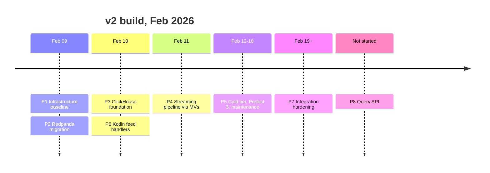

# Migration Journey — v1 to v2

This is the honest version: what was predicted, what shipped, what was quietly abandoned, and what the numbers actually came out as. The as-built system is described in [architecture/README.md](architecture/README.md); the reasoning behind each move is in [decisions/](adr/).

---

## Why v2 existed

v1 worked. It was a complete Python lakehouse — Binance and Kraken WebSocket clients → Kafka + Confluent Schema Registry → five always-on Spark Structured Streaming jobs → Iceberg on MinIO → DuckDB → FastAPI, orchestrated by Prefect. It is still in the repo under [`legacy/v1/`](../legacy/v1/README.md).

It also consumed **35–40 CPU and 45–50 GB across 18–20 containers**, against a mandate of **16 cores / 40 GB on one host**. More than 2x over on both axes.

The cost was concentrated. Spark alone — master, two workers, five streaming jobs — was ~14 CPU / 20 GB, and those jobs were doing stateless per-record transforms at roughly 138 msg/s. A distributed computation framework was being paid for, in full, to not distribute anything.

The pre-work included an explicit check on whether tuning could close the gap:

| v1 tuning option | CPU saved | Enough? |
|---|---|---|
| Drop one Spark worker | ~3.5 | No — still ~32 |
| Cut Spark executor memory | 0 (RAM only) | No |
| Remove Kafka UI | 0.5 | Negligible |
| Remove one streaming job | ~3 | No — still ~29 |
| **Best case, 1–2 weeks of tuning** | **~7.5** | **No — still ~28** |

Conclusion at the time, and it held: *the 16-core constraint requires architectural change, not configuration tuning.* v2 was built greenfield rather than migrated incrementally.

---

## Phases

| # | Phase | Shipped | Outcome | ADRs |
|---|---|---|---|---|
| 1 | Infrastructure baseline | Compose skeleton, Redpanda + Console, Prometheus, Grafana, health checks | ✅ Done in 1 day against a 1-week estimate. 1.09 GB idle vs a 12.75 GB budget | [001](adr/ADR-001-replace-kafka-with-redpanda.md), [010](adr/ADR-010-resource-budget.md) |
| 2 | Redpanda migration | Single-broker Redpanda v25.3.4, built-in schema registry, explicit topic init | ✅ Kafka + Confluent Schema Registry both deleted; startup 15–30 s → 2–5 s | [001](adr/ADR-001-replace-kafka-with-redpanda.md) |
| 3 | ClickHouse foundation | Kafka-engine queues, bronze/silver/gold DDL, Kraken added as second exchange | ✅ 30k+ trades through all layers, 0 errors over 90 min | [003](adr/ADR-003-clickhouse-warm-storage.md), [009](adr/ADR-009-medallion-in-clickhouse.md), [011](adr/ADR-011-multi-exchange-bronze-architecture.md) |
| 4 | Streaming pipeline | Bronze → Silver → Gold entirely as materialized views | ✅ **The planned Kotlin Silver Processor was never built** — MVs made it unnecessary, saving a service | [004](adr/ADR-004-eliminate-spark-streaming.md), [009](adr/ADR-009-medallion-in-clickhouse.md) |
| 5 | Cold tier / Iceberg | 10 Iceberg tables, Spark offload with PostgreSQL watermarks, Prefect 3 deployments, daily compaction + audit | ✅ 3.78M rows in 16 s (236k rows/s), 12:1 zstd compression, 99.9%+ warm/cold consistency | [006](adr/ADR-006-spark-batch-only.md), [007](adr/ADR-007-iceberg-cold-storage.md), [013](adr/ADR-013-pragmatic-iceberg-version-strategy.md), [014](adr/ADR-014-spark-based-iceberg-offload.md), [017](adr/ADR-017-iceberg-maintenance-pipeline.md) |
| 6 | Kotlin feed handlers | Ktor WebSocket clients, dual raw+Avro producers, shared instrument registry | ✅ Built early, during Phase 3, to unblock end-to-end validation. 0.034 CPU / 134 MiB measured for Binance | [002](adr/ADR-002-kotlin-feed-handlers.md) |
| 7 | Integration hardening | Latency benchmark ✅, resource burn-in 🟡, failure-mode testing ✅, monitoring ✅, runbooks ✅ (8: failure-recovery, iceberg-offload-{failure,lag,performance,monitoring,watermark-recovery}, iceberg-scheduler-recovery, redpanda) | 🟡 4 of 5 steps complete; remaining: 24 h burn-in, 5×/10× load test, Alertmanager routing | [015](adr/ADR-015-clickhouse-lts-downgrade.md), [016](adr/ADR-016-add-coinbase-exchange.md) |
| 8 | Query API | — | ⬜ Not started | [005](adr/ADR-005-kotlin-spring-boot-api.md) |

---

## Measured outcomes

### Resources

| | v1 | v2 as-built | Change |
|---|---|---|---|
| CPU limits | 35–40 cores | **15.1** | −57 to −62% |
| RAM limits | 45–50 GB | **21.875 GB** | −51 to −56% |
| Long-lived services | 18–20 | **14** (+2 one-shot) | −22 to −30% |
| Always-on Spark | 14 CPU / 20 GB | 0 (batch only) | −100% |
| Python processes | 4 | 0 in the data path | Prefect remains, control plane only |
| Trade → queryable | 5–15 min | **<200 ms p99** | >1000x |

Fits the mandate on both axes, with 0.9 CPU and 18.125 GB of headroom. (v3's capture and lake tiers run
alongside the v2 paths they replace on `feat/v3-lake-tier`, for 16.20 CPU / 23.250 GiB across
19 long-running services (+5 one-shot) as deployed on that branch; see
[architecture/README.md](architecture/README.md).)

### Latency

Exchange timestamp → `silver_trades.ingestion_timestamp`, 1-hour window, 2026-02-19:

| Exchange | p50 | p95 | p99 | Max | n |
|---|---|---|---|---|---|
| Binance | 91 ms | 183 ms | **191 ms** | 193 ms | 12 |
| Coinbase | 87 ms | 188 ms | **197 ms** | 199 ms | 13 |
| Kraken | 71 ms | 162 ms | **170 ms** | 172 ms | 12 |

**Read these with the caveat attached.** The stack was cold-started and each sample is 12–13 trades. They are directionally right — the ~80 ms network RTT to the exchanges dominates, and bronze → silver is below measurement resolution — but they are not statistically load-bearing. The 24-hour burn-in that would fix that is still unfinished, and the 5x / 10x replay scenarios were never run.

### Failure modes

All six scenarios tested 2026-02-19; all passed, all inside target MTTR.

| Failure | Injected by | MTTR | Result |
|---|---|---|---|
| Redpanda restart | `compose restart redpanda` | ~10 s | All 3 ClickHouse consumers resumed, offsets intact |
| ClickHouse restart | `compose restart clickhouse` | ~32 s | Silver resumed; no gaps |
| Feed handler crash | `compose stop feed-handler-binance` | ~30 s | Kraken and Coinbase unaffected — isolation confirmed |
| Offload killed mid-run | kill Spark container | next 15-min cycle | Watermark held; no duplicates |
| MinIO down | `compose stop minio` | ~5 s | Hot tier kept ingesting; cold tier deferred cleanly |
| Network partition | `docker network disconnect` | ~20–30 s | Consumers resumed from last committed offset, no corruption |

Worth noting what this does *not* prove: every recovery is "restart the container and the offsets are fine." There is no replication anywhere in the stack. The system is resilient to process failure, not to host or disk failure.

---

## Predictions vs reality

The v2 investment analysis and ADRs were written on 2026-02-09, before any code. Scoring them afterwards is the most useful thing in this document.

| Predicted | Reality | Verdict |
|---|---|---|
| E2E latency <200 ms | p99 191 / 197 / 170 ms | ✅ Hit — with a small-sample caveat |
| Query latency 2–5 ms (from 200–500 ms) | Never measured | ❓ Unverifiable — no API was built, no query benchmark exists |
| 5,000+ msg/s per feed handler (36x) | Handlers run at 100–200 trades/s because that is what the exchanges send; headroom untested | ❓ Unverified |
| Feed handler p99 2 ms, broker p99 5 ms | Only end-to-end was instrumented | ❓ Unverified per-segment |
| Cold tier freshness 24 h → ~1 h | 15-minute offload cadence | ✅ Beaten by 4x |
| Prefect eliminated ([ADR-008](adr/ADR-008-eliminate-prefect-orchestration.md)) | **Retained** — 3 containers, 2.5 CPU / 2.5 GB. It stopped scheduling OHLCV (MVs took that) and started scheduling the Iceberg offload, a job that genuinely needs retries, run history and a work pool | ❌ Reversed, correctly |
| Kotlin Silver Processor (1.0 CPU / 512 MB) | Never built. A materialized view did the same transform in-database, sub-millisecond | ❌ Deleted from the plan mid-Phase-4 |
| A Kotlin JVM API replaces the v1 FastAPI service ([ADR-005](adr/ADR-005-kotlin-spring-boot-api.md)) | Never built. The analysis itself ranked it 3/10 ROI and noted it *costs* +0.5 CPU | ❌ Correctly skipped |
| Four-layer medallion: Raw → Bronze → Silver → Gold | Three layers. The Kafka-engine queue holds raw in flight but nothing persists it | ❌ Scoped down |
| Iceberg REST catalog + PostgreSQL metadata | Hadoop file catalog on a bind mount. REST cost a day of version fights and bought nothing on one node ([ADR-013](adr/ADR-013-pragmatic-iceberg-version-strategy.md)) | ❌ Simplified |
| One feed-handler service | Three containers, one per exchange, from a single image | ❌ Changed — cross-exchange blast-radius isolation was worth 2 extra containers, and the failure test proved it |
| 15.5 CPU / 19.5 GB across 11 services | 15.1 CPU / 21.875 GB across 14 services (+2 one-shot) | ~ CPU came in under; RAM over by 2.375 GB, mostly Prometheus and the third exchange |
| Two exchanges (Binance, Kraken) | Three — Coinbase added in Phase 7 ([ADR-016](adr/ADR-016-add-coinbase-exchange.md)) | ✅ Scope grew, budget held |
| ClickHouse 26.1 (latest) | 24.3 LTS — 26.1 broke Spark JDBC ([ADR-015](adr/ADR-015-clickhouse-lts-downgrade.md)) | ❌ Newest lost to compatible |

Pattern in the misses: **every prediction that was wrong was wrong in the direction of over-building.** Nothing that got cut turned out to be needed. Two of the three services that were planned and never written (Silver Processor, JVM query API) were replaced by features already present in components that were already running.

---

## What is left

**Phase 7 — hardening (in progress)**
- 24-hour resource burn-in: sampling loop ran, results never collected. Without it the latency figures stay caveated and the resource numbers stay limits-on-paper rather than observed steady state.
- Alert fire test: 17 rules are loaded and none has been triggered on purpose.
- 5 operational runbooks and doc finalisation.

**Phase 8 — query API (not started)**
No read interface exists beyond `clickhouse-client`, the HTTP interface on `:8123`, and Spark SQL over Iceberg. This is the largest honest gap: the "2–5 ms query latency" claim cannot be tested until something serves queries.

**Structural, unscheduled**
Single broker, single ClickHouse node, single host, no replication. Iceberg on a bind mount rather than MinIO. Both are correct for a single-host demonstrator and both are the first thing to change if this ever needed to survive a disk.

---

## Lessons

1. **Check whether the framework is doing framework work.** Five Spark Streaming jobs cost 14 CPU / 20 GB to run stateless per-record transforms at 138 msg/s. Nothing was being shuffled, joined, or windowed across a cluster. That single observation funded the entire migration.

2. **A database that already consumes Kafka does not need a service in front of it.** ClickHouse Kafka-engine tables plus materialized views replaced five Spark jobs *and* the Kotlin Silver Processor that was supposed to replace two of them. The best service is the one you notice you don't have to write.

3. **Constraints beat intentions.** "Reduce resource usage" produces tuning. "16 cores, 40 GB, one host" produces architecture. The budget in [ADR-010](adr/ADR-010-resource-budget.md) was checked at every phase boundary, which is why the answer at the end was 15.1 and not 22.

4. **Deleting a tool and repurposing it are different decisions.** [ADR-008](adr/ADR-008-eliminate-prefect-orchestration.md) argued Prefect was two services and a UI for what amounted to five cron jobs. That was true — of the OHLCV workload. Once MVs absorbed that, the offload job appeared, and it wanted retries, run history, watermark safety and a work pool. Prefect stayed for a better reason than it was originally there for. The ADR is kept as written, unamended.

5. **Latest is not a version strategy.** ClickHouse 26.1 broke the Spark JDBC driver and cost a downgrade to 24.3 LTS; the Iceberg REST catalog cost a day before the file-based Hadoop catalog worked in ten minutes. Both are recorded ([ADR-015](adr/ADR-015-clickhouse-lts-downgrade.md), [ADR-013](adr/ADR-013-pragmatic-iceberg-version-strategy.md)) rather than quietly fixed.

6. **Idempotency is cheaper than exactly-once.** Watermarks in PostgreSQL, advanced only after a successful Iceberg append, made "kill Spark mid-run" a non-event. No transactions, no two-phase commit, no coordination — just a number that moves last.

7. **Isolate at the blast-radius boundary, not the deployment boundary.** One feed-handler image, three containers. It costs two container slots and buys the property that a Binance parser bug cannot stop Kraken — which the failure test then confirmed rather than assumed.

8. **Measure before claiming.** Three of the headline v2 predictions are still marked ❓ in the table above because nothing measured them. That is a worse outcome than a missed target, and it is why the burn-in and the fire test are the top of the remaining list rather than the bottom.
