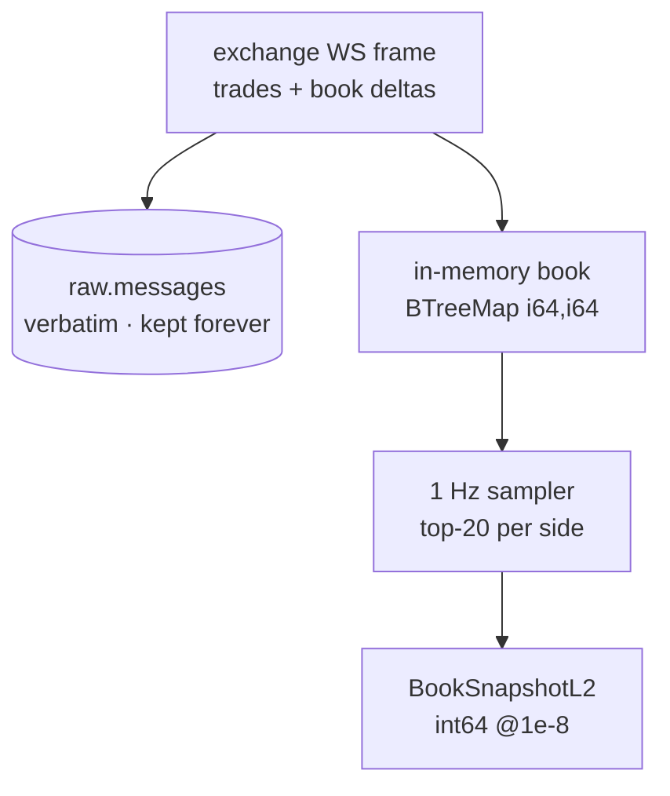

# ADR-027: L2 book snapshot model and per-exchange resync policy

**Status:** Proposed
**Date:** 2026-08-26
**Author:** Rob Scott
**Category:** Data model

---

## Context

v2 has no order book. It captures trades only, so every question that starts "what
did the book look like when…" — spread at the time of a fill, depth imbalance before
a move, realistic slippage on a hypothetical order — is unanswerable. Adding L2 is
the largest single increase in what this platform can be asked, and it is also the
largest increase in what it has to store and get right.

Three constraints shape it:

- **Volume.** A full L2 delta stream is one to two orders of magnitude more messages
  than the trade stream. Spike S5 measured a Coinbase `level2` connection at 527
  `l2_data` frames against 133 `market_trades` frames in the same window, and the
  BTC-USD opening snapshot alone was **5,195,904 bytes across 43,974 levels**
  ([ADR-018 Appendix A](ADR-018-v3-lake-first-rust-capture.md#s5--coinbase-level2-without-jwt)).
  Full depth, kept queryably, for 34 instruments, is not a single-host proposition.
- **The three venues sequence differently, and one of them does not sequence at all.**
  Binance's partial-depth stream carries `lastUpdateId` and no timestamp. Kraken v2
  carries no sequence number but a CRC32 checksum over the top 10 levels. Coinbase
  carries a connection-wide `sequence_num` spanning all channels. Any "detect a gap
  and resync" policy that pretends these are the same thing will be wrong on at least
  two venues.
- **The archive is already verbatim.** [ADR-018](ADR-018-v3-lake-first-rust-capture.md)
  puts every frame, unparsed, in `raw.messages`, kept forever. Whatever the queryable
  product is, the deltas are on disk regardless.

The budget is unchanged: one host, 16 CPU / 40 GB
([ADR-010](ADR-010-resource-budget.md)), and the capture containers are sized at
0.25 CPU / 256 MB each.

---

## Decision

**We will make a top-20 L2 snapshot sampled at 1 Hz the canonical, queryable book
product, keep every delta only as verbatim frames in `raw.messages`, and give each
exchange its own sequencing and resync policy rather than a shared abstraction —
because the archive already makes deeper and faster books recoverable by replay, and
the three venues do not agree on what "a gap" means.**

Scope: the L2 product across all three exchanges. Depth beyond 20 levels and
sub-second book reconstruction remain available *by replay from the archive*, and are
not materialised in either tier.

---

## Rationale

**1 Hz × 20 levels is the product; the deltas are the record.** These are different
jobs and v2 conflated them for trades, which is how the lake ended up a lossy JDBC
copy of a serving database. The archive answers *completeness and reproducibility*;
the snapshot topic answers *queries*. Because `raw.messages` holds every delta, full
depth at full rate is not lost — it is recoverable by pushing the archived frames
back through the same `handle_frame` the live path runs
([ADR-019](ADR-019-rust-capture-tier.md)). Storing full depth queryably would buy
convenience at a storage and rebuild cost far beyond one host, for depth no planned
research uses.

**Snapshots, not deltas, as the query surface.** A delta table forces every consumer
to implement book reconstruction — fold from a snapshot, apply in order, handle the
resync boundary — which is a second implementation of `book.rs` in SQL and Python,
and exactly the research/production drift the requirements clarification rejected in
Q1. A snapshot is a row you can join to.

**Per-exchange sequencing, not a common abstraction.** The policy table below is
three different mechanisms with three different failure signatures. An interface that
made them look alike would have to invent a sequence number for Kraken and a checksum
for Binance, and both inventions would be lies that some later query believes:

| Exchange | Continuity signal | Failure signature | Policy on failure | Emitted |
|----------|-------------------|-------------------|-------------------|---------|
| **Binance** | `lastUpdateId` on `<sym>@depth20@100ms` | `lastUpdateId` **regresses** or repeats backwards | Reconnect the combined stream; the next partial-depth frame *is* a complete top-20, so no separate snapshot fetch is needed | `seq` = `lastUpdateId`, `checksum_ok` = `null`, `exchange_ts` = `null` (the stream carries no timestamp; inventing one would fabricate a clock reading) |
| **Kraken v2** | **CRC32 checksum** over the top 10 asks then bids, on every `book` update | Computed checksum ≠ published checksum → the local book has drifted | Increment `k2_capture_checksum_failures_total`, **resubscribe that symbol only** (other symbols on the connection are unaffected), and emit the next snapshot with `checksum_ok = false` rather than suppressing it | `seq` = `0` (the venue does not sequence this stream; 0 means "unanswerable", not "sequence zero"), `checksum_ok` ∈ {`true`,`false`} |
| **Coinbase** | `sequence_num`, **connection-wide** across all channels — not per channel | Gap in `sequence_num` | Increment `k2_capture_gaps_total`, **reconnect** and rebuild from a fresh `level2` snapshot; a connection-wide counter cannot be resynced per symbol | `seq` = `sequence_num`, `checksum_ok` = `null` |

Two of these facts were established by measurement rather than by reading docs. S1
reproduced Kraken's published checksum `3310070434` from a 15-line CRC32 over
precision-formatted decimal strings, red first, and established that formatting from
`f64` desyncs the book *silently while the checksum reports success*. S5 established
that Coinbase's `sequence_num` is connection-wide, not per-channel — 677 frames, 0
gaps, spanning `l2_data`, `market_trades` and `heartbeats` — which is the shape the
gap counter has to have.

**`checksum_ok` is three-valued and stays that way.** `null` on Binance and Coinbase
means "this venue publishes no checksum, so the question is unanswerable". Collapsing
`null` into `true` would claim two thirds of the book data is verified when nothing
verified it. That misrepresentation is the whole reason the field is a union, and it
is why the alert on it fires per exchange rather than in aggregate.

**Coinbase's full-depth book, and its memory bound.** Coinbase is the only venue where
the capture process maintains a complete book — `level2` sends absolute
`new_quantity` per level with no top-N option, so top-20 is derived by truncating a
full `BTreeMap<i64,i64>` on each side. That map is sized from S5's measured 43,974
levels for BTC-USD, not from a guess: the Coinbase container gets **512 MB where
Binance and Kraken get 256 MB**. S5 also produced the failure that would have taken
the tier down on connect — Python's 1 MiB default WebSocket message limit tripped on
the very first snapshot after 1,027,837 bytes — so the Rust client sets an explicit
max message size rather than inheriting a library default.

**`Array(Float64)` in ClickHouse against `int64` on the wire.** The wire and the lake
carry exact fixed-point integers at 1e-8
([ADR-020](ADR-020-avro-fixed-point-contracts.md)). The hot tier is expected to widen
them to `Array(Float64)`, and that is a deliberate asymmetry, not an oversight.
ClickHouse's array functions — `arrayMap`, `arraySum`, `arrayZip` over depth
imbalance, notional-at-level, weighted mid — are ergonomic over `Float64` and awkward
over arrays of `Decimal`, where division rules and result-scale inference make a
simple mid-price expression a fight. ClickHouse is a *derived, rebuildable, 7-day*
tier ([ADR-018](ADR-018-v3-lake-first-rust-capture.md) Decision §3), so the
authoritative value is never the one in ClickHouse. The honest cost, stated so nobody
discovers it in a reconciliation: **a mid-price computed in the hot tier and one
computed in DuckDB over the lake can differ in the last bits.** Any research that
needs bit-exact prices reads the lake. Any dashboard, screen or exploratory query
reads the hot tier and does not care.

---

## Alternatives Considered

| Option | Why not |
|--------|---------|
| **Full-depth deltas as the queryable product**, reconstructable to any depth at any instant | Storage and rebuild cost far beyond one host — S5's single Coinbase opening snapshot is 5.2 MB, before deltas, before 34 instruments. And it pushes book reconstruction into every consumer, which is a second implementation of `book.rs` and the exact research/production drift Q1 rejected. `raw.messages` already holds every delta, so this is recoverable by replay rather than lost. |
| **Higher snapshot rate (10 Hz or 100 Hz)** at top-20 | 10–100× the rows for intra-second detail no currently planned research uses, on a stream that already outnumbers trades 4:1. The sampler cadence is one config value (`K2_SNAPSHOT_INTERVAL_MS`) and `snapshot_ts_ns` makes the actual cadence auditable from the data, so this is a knob to turn when a research question demands it — not a default to pay for now. |
| **Deeper snapshots (top-50 or top-100) at 1 Hz** | Binance's partial-depth stream tops out at 20 levels without maintaining book state, so top-50 would force full book state on all three venues to serve depth nobody has asked for. Level 21 is recoverable by replay. |
| **One shared sequencing abstraction across the three venues** | Requires inventing a sequence number for Kraken and a checksum for Binance. Both inventions become fields some later query trusts. Three explicit policies in one table is more honest and, at three venues, less code than the abstraction. |
| **Suppress the snapshot when Kraken's checksum fails** | Hides the incident from the data and leaves a gap that looks like quiescence. Emitting with `checksum_ok = false` makes the bad window queryable and excludable — and the alert fires either way. |

---

## Consequences

**Easier:** as-of joins between trades and book (one snapshot row per symbol per
second, on a regular time axis); depth, spread, imbalance and weighted-mid queries
without book reconstruction; a bounded, predictable storage cost per instrument;
detecting a desynced book on Kraken within one update, and a dropped message on
Coinbase within one frame.

**Harder — and this is the honest cost of 1 Hz: everything that happens between
samples is invisible in this product.** A level that appears and is taken within the
same second leaves no trace in `bronze.book_snapshots_l2`. Quote flickering,
sub-second queue dynamics, the precise book state at a trade's timestamp, and any
microstructure signal whose horizon is shorter than a second are all *not answerable
from the snapshot topic*. They are answerable from `raw.messages` by replay, at the
cost of a batch job rather than a query, and the numbers derived that way carry a
different provenance. `snapshot_ts_ns - recv_ts_ns` bounds how stale a given snapshot
is, so the gap is at least measurable per row — but a research result quoted off the
1 Hz product must say so. This is a research platform on public internet feeds, not a
microstructure simulator, and the sampling rate is where that shows most plainly.

Also harder: three resync policies to maintain instead of one; a Coinbase container
holding a full book in memory, sized from one measurement of one symbol on one day;
and two numeric representations of the same book — exact `int64` in the lake, widened
`Float64` in the hot tier — which anyone reconciling the tiers has to know about.

**Committed to:** `depth` as an emitted field rather than a constant, so a consumer
can distinguish "the book only had 6 levels" from "we dropped 14"; `conn_id` +
`conn_msg_seq` on every snapshot, which is what makes a snapshot reproducible —
replay `raw.messages` for that `conn_id` up to that counter and the book must come
out identical; and `seq = 0` meaning "this venue does not sequence this stream",
documented in the field's `doc` because it is the kind of sentinel that becomes a bug
the moment it is undocumented.

**Risks:** Coinbase's book bound rests on a single measurement (43,974 levels, BTC-USD,
2026-08-26) — a market event that doubles resting depth doubles the memory, and the
512 MB limit is sized with headroom rather than proof. Kraken's checksum covers the
top 10 levels only, so drift at levels 11–20 is undetected by construction and the
`checksum_ok = true` claim is narrower than it reads. Binance's partial-depth stream
carries no `exchange_ts` at all, so `exchange_ts` is null for a third of the book
data and any cross-venue latency comparison has a hole in it. And a 23-hour scheduled
reconnect on Binance means at least one `conn_id` boundary per day per exchange where
`seq` continuity is meaningless.

**Revisit when:** `k2_capture_book_levels_total{exchange="coinbase"}` exceeds 80,000
(the memory bound was sized on half that), or a research question in `notebooks/`
requires sub-second book state and the replay path proves too slow to answer it, or
`k2_capture_checksum_failures_total` is non-zero on Kraken outside a resync window.

---

## Related

- [ADR-018](ADR-018-v3-lake-first-rust-capture.md) — the umbrella; Appendix A carries spikes S1 (Kraken CRC32) and S5 (Coinbase `level2`, 44k levels, the 1 MiB message-size trap)
- [ADR-019](ADR-019-rust-capture-tier.md) — the capture tier that maintains the book and samples it
- [ADR-020](ADR-020-avro-fixed-point-contracts.md) — the fixed-point `int64` the arrays carry, and why the wire has no floats
- [`../../schemas/avro/book-snapshot-l2.avsc`](../../schemas/avro/book-snapshot-l2.avsc) — every field's meaning, including the three-valued `checksum_ok` and the `seq = 0` sentinel
- [`../plans/2026-08-26-v3-quant-research-platform/002-phase-c-rust-capture.md`](../plans/2026-08-26-v3-quant-research-platform/002-phase-c-rust-capture.md) — the per-exchange stream configuration this policy table implements
- [`../runbooks/capture-checksum-failure.md`](../runbooks/capture-checksum-failure.md), [`../runbooks/capture-sequence-gaps.md`](../runbooks/capture-sequence-gaps.md) — operating the resync policies

---

## Outcome

_To be appended after the Phase C burn-in._
