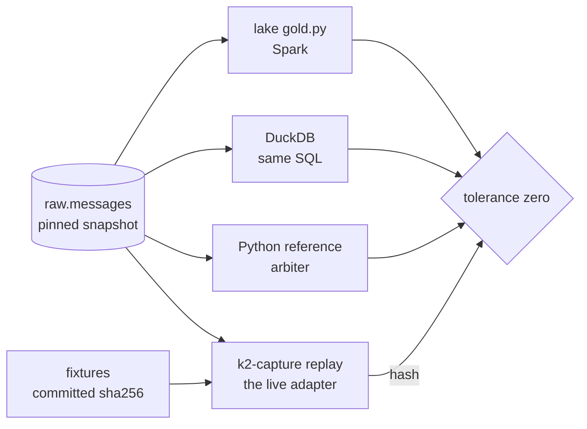

# ADR-029: The research/production parity contract

**Status:** Accepted
**Date:** 2026-08-28
**Author:** Rob Scott
**Category:** Data model · Testing

---

## Context

A research platform whose notebooks and whose live pipeline disagree is worse than
one with no notebooks: the disagreement is silent, and the number that gets quoted
is whichever one was easier to reach. v2 had exactly that shape. Candles were
computed in ClickHouse with a `SummingMergeTree` whose open and close resolved
arbitrarily across insert blocks; nothing else computed the same candle, so nothing
noticed ([`docker/clickhouse/ddl/10-gold-tables.sql`](../../docker/clickhouse/ddl/10-gold-tables.sql)
carries the post-mortem in its comments). The lake was a JDBC copy of the serving
database, so a research result could not even name the input it was derived from.

The requirements clarification asked and answered the question that decides this
([Q1](../research/2026-08-26-v3-requirements-clarification.md#q1--replay-what-is-it-for-and-who-owns-the-parser)):
replay is a *production artefact*, the same parser pushed back over the archive, not a
research-side reconstruction that looks equivalent and drifts on the first exchange
quirk one side handles. Phases C–E then built the pieces this ADR binds together: a
capture crate whose adapters are pure functions of `(bytes, recv_ts_ns)`
([ADR-019](ADR-019-rust-capture-tier.md)), fixed-point integers on the wire and in the
lake with no `f64` on the record path ([ADR-020](ADR-020-avro-fixed-point-contracts.md)),
a verbatim archive ([ADR-021](ADR-021-raw-first-archive-and-lineage.md)), gold products
that carry the snapshot they were computed from ([ADR-026](ADR-026-four-layer-lake-and-gold-served-from-clickhouse.md)),
and one measured surprise: the first three-way OHLCV parity run found 3,829 of 28,590
buckets whose open or close depended on which engine broke a tie, which is how the
total order `(exchange_ts, recv_ts_ns, trade_seq)` came to be written down
([`docker/lake/gold.py`](../../docker/lake/gold.py)).

---

## Decision

**We will keep research and production from drifting by construction, not by
review: one parser for live and replay, every derived product computed at least twice
by independent engines and compared at tolerance zero against a pinned snapshot, every
notebook reading pinned snapshots only, and a fixed set of golden fixtures whose output
hash is committed — because a parity that is argued in a document is a parity that
fails silently, and a parity that is a test fails loudly.**

Scope: the capture crate, the lake's gold products (`ohlcv_*`, `bars`, `book_top20`,
`bbo_1s`), the ClickHouse copies of them, and `notebooks/`. The four clauses:

1. **One parser.** `k2-capture replay` is a subcommand of the capture crate
   ([`src/replay.rs`](../../services/capture-rust/src/replay.rs)) that drives the same
   `Adapter::handle_frame(bytes, recv_ts_ns)` the socket loop calls, with the 1 Hz
   sampler ticking off the recorded `recv_ts_ns`. There is no replay-only parser, no
   research-only book, and adding one is what this ADR forbids.
2. **Determinism, asserted.** Same input, same bytes out: the three fixtures under
   [`services/capture-rust/tests/fixtures/`](../../services/capture-rust/tests/fixtures/)
   replay to a committed SHA-256 in CI, `--speed realtime` and `max` are asserted
   byte-identical, and the constraints that make this true are held in code: no
   `HashMap` iteration on an emit path (`BTreeMap` only), no `f64` on the record path,
   no wall-clock read after the frame stamp, single-threaded replay.
3. **Parity at tolerance zero, pinned.** Every materialised product has a second and a
   third computation: candles by ClickHouse on read, the lake's `gold.py`, and DuckDB
   over silver ([`scripts/parity_ohlcv.py`](../../scripts/parity_ohlcv.py)); event bars by
   the lake, the same window SQL in DuckDB, and a pure-Python reference that is the
   arbiter ([`scripts/parity_bars.py`](../../scripts/parity_bars.py)). Every comparison
   is exact on every integer column and runs at the snapshot ids in
   [`tests/parity/pinned.json`](../../tests/parity/pinned.json), never at `latest`.
4. **Notebooks pin.** `k2lake.pin()` freezes every gold, silver and audit table at its
   current snapshot id into `pinned.*` views and prints the ids with the commit; a
   notebook reads nothing else, and `tests/test_notebooks_pinned.py` fails CI if one
   does. A replay from the archive files `(snapshot id, conn_id, crate sha, output
   sha256)` into `audit.checks` (`job = 'replay'`), so reproducing a result later is
   re-running the same ids and comparing one digest.

---

## Rationale

**Why a parser, not a reconstruction.** Q1's argument stands unchanged: two
implementations of the book state machine are two opinions about every venue quirk,
and nothing compares them. Making replay a subcommand cost one `replay.rs` and a flag
or two on the adapters; making it a Python notebook would have cost a second Kraken
checksum, a second Coinbase sequence policy, and a second set of bugs.

**Why tolerance zero.** A tolerance is a place for a bug to live. The v2 candle bug
was not a rounding error; it was the wrong trade chosen as the open, and a 1e-6
tolerance on price would have passed it. Zero is only possible because the contracts
are integers: the first bars parity run lost one unit in the eighth decimal place to
DuckDB turning a `DECIMAL` quotient into a `DOUBLE`, and the answer was to remove the
division from the table, not to add a tolerance
([`docker/lake/bars.py`](../../docker/lake/bars.py)).

**Why the Python reference is the arbiter.** When Spark and DuckDB disagree, one of
them is wrong and the SQL does not say which. Twenty lines of sorted-loop Python that
were written to be read settle it; that is why the reference is deliberately the
slowest implementation and runs over two symbols rather than all twenty-three.

**Why pinned, in notebooks too.** A number computed at `latest` cannot be recomputed:
the next ingest lands beside it. `pin()` costs one view per table at connect time and
buys a provenance line at the top of every notebook. The cost the plan did not foresee
is small and real: an empty table has no snapshot, and its view is honestly unpinned
and says so.

**Why the fidelity limits are written down first.** A replay this faithful invites
simulation this archive cannot support. [`docs/research/2026-08-28-replay-fidelity-limits.md`](../research/2026-08-28-replay-fidelity-limits.md)
says, in plain words, which research this data can carry and which it cannot, so the
parity contract is never mistaken for a claim about the market.

---

## Alternatives Considered

| Option | Why not |
|--------|---------|
| **Research-side reconstruction in DuckDB/Python**, production untouched | Q1's rejected option. A second parser and book machine with nothing comparing them; drift on the first venue quirk, silently. |
| **Parity at a tolerance** (1e-6 on price, 1 trade on count) | Passes the v2 candle bug. Every product here is integer-exact, so a tolerance only hides an engine's rounding, which is the thing worth finding. |
| **Parity in CI against a live stack** (the plan's wording) | GitHub's runners cannot reach the lake. CI holds what does not need a stack — the golden-hash tests, the Python reference tests, the pinned-notebook grep — and the live three-way runs are `make parity-ohlcv` / `make parity-bars`, required by `/release-check` before a tag. Recorded here rather than pretended. |
| **A Kafka sink on replay**, so replayed records flow through the live topics | The raw topic is what the lake ingests: a replayed frame produced there is archived a second time and the exactly-once argument ([ADR-022](ADR-022-exactly-once-via-snapshot-offsets.md)) breaks. Replay writes JSONL; loading it anywhere is a deliberate second step. |
| **A Parquet/Iceberg reader inside the Rust binary** for the lake source | Forty more crates for a job a forty-line Python export does ([`scripts/replay_export.py`](../../scripts/replay_export.py)). One fixture shape for tests and lake exports is the better property. |
| **Reset-after-crossing event bars** (the textbook definition) | Stateful; three engines spell a running reset three ways. The cumulative bucket is one window expression everywhere and agrees at zero. Documented in `config/bars.yaml`. |

---

## Consequences

**Easier:** proving a parser change is behaviour-preserving (the hash moves or it does
not); reproducing a research number six months on (an id and a digest); adding a
product (write its SQL twice and a reference once, and it joins the parity set);
answering "what did this chart read" (the first cell says).

**Harder:** every improvement to the parser lands with a deliberate hash update and a
line in the PR saying what moved; a Kraken checksum fix, a Coinbase batching change, a
new venue all pay this. Every new gold product costs three implementations, not one.
Notebooks are one call longer and cannot read the head. And the live parity gates are
a human's job before a tag, not CI's; if nobody runs them the guard is gone, which is
the second row [`16-failure-modes.md`](../architecture/16-failure-modes.md) adds.

**Committed to:** the fixture directory as the one shared corpus (a changed
expectation means a new fixture with a new name, never a regenerated old one);
`tests/parity/pinned.json` as the record of the last passing ids; `audit.checks`
`job = 'replay'` rows as the reproducibility ledger; the integer contract on every
product column that parity compares.

**Risks:** the fixtures are seconds long and were recorded on one day; a venue
behaviour they do not contain is a behaviour replay cannot prove. `k2lake.pin()` pins
what exists at connect time, so a notebook re-run tomorrow pins tomorrow's ids and must
be read against its own first cell, not last week's. DuckDB's Iceberg reader has twice
returned zero rows for a predicate it should have honoured (`IS NOT NULL` on
`raw.messages.schema_id`, any predicate on a `DATE` partition source); both are worked
around and recorded where they bit, and a third would surface as a parity failure,
which is the point.

**Revisit when:** a parity run fails and the fix proposed is a tolerance (that is the
signal to find the rounding, not to accept it); a second consumer of the parser
appears outside the crate; or the fixture corpus is older than the newest venue
protocol version any adapter speaks.

---

## References

- [`docs/plans/2026-08-26-v3-quant-research-platform/006-phase-g-replay-parity.md`](../plans/2026-08-26-v3-quant-research-platform/006-phase-g-replay-parity.md) — the phase, with its 2026-08-28 scope amendment
- [`docs/research/2026-08-26-v3-requirements-clarification.md`](../research/2026-08-26-v3-requirements-clarification.md) Q1 — the decision this contract enforces
- [`docs/research/2026-08-28-replay-fidelity-limits.md`](../research/2026-08-28-replay-fidelity-limits.md) — what this archive can and cannot honestly simulate
- [`services/capture-rust/README.md`](../../services/capture-rust/README.md) § Subcommands, § Fixtures and replay
- [`scripts/replay-lake.sh`](../../scripts/replay-lake.sh), [`scripts/parity-ohlcv.sh`](../../scripts/parity-ohlcv.sh), [`scripts/parity-bars.sh`](../../scripts/parity-bars.sh)
- [ADR-027](ADR-027-book-snapshot-and-sequencing.md) Outcome — deeper and faster books by replay, which `--depth` / `--interval-ms` deliver
