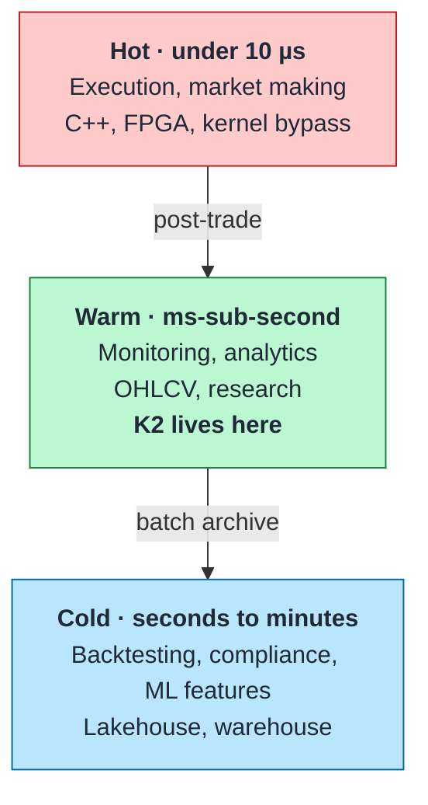

# 01 — What K2 is — and is not

> **You will learn** what the platform is for, what it deliberately is not, and the rules the design is held to.
> **Read this if** everyone, first.
> **Before this** nothing.

What this platform is for, what it is measurably good at, and the workloads it is deliberately wrong for. Knowing where a system does *not* belong is most of what makes it usable.

## What it is

A single-host crypto market-data platform that takes live exchange trades and makes them queryable as OHLCV candles in **under 200 ms p99**, then lands them in an open table format for history. It runs three exchanges on 15.1 CPU / 21.875 GB (v2 baseline); with the capture tier swapped for v3's Rust `k2-capture` ([ADR-019](../adr/ADR-019-rust-capture-tier.md)) and Phase D finished — the v2 ClickHouse→Iceberg offload deleted, the v3 lake the only lake ([ADR-018](../adr/ADR-018-v3-lake-first-rust-capture.md)) — the steady state is **14.60 CPU / 21.625 GiB across 15 long-running services** (bootstrap peak 16.10 CPU / 23.125 GiB across 19, with the four one-shots). The capture tier now carries L2 order books the v2 one never had. Source: `docker compose --env-file .env.example config`, limits summed ([command](../operations/docker-resources.md#how-these-numbers-are-produced)).

The design centre is the **warm path**: fast enough that a dashboard or a monitor reads current market state without feeling stale, durable enough that a year of history is one `SELECT` away, and small enough to run on one machine. That is a narrower target than "market data platform" usually implies, and the narrowness is the point.

## Where it sits

K2 spans the warm tier and the cold tier: ClickHouse is the warm store and Iceberg is the cold one. They are siblings rather than a chain — since Phase D both are fed from Redpanda, ClickHouse by its Kafka-engine consumers and the lake by a 5-minute Spark batch ([ADR-018](../adr/ADR-018-v3-lake-first-rust-capture.md)) — so the archive is not a copy of a serving database, and losing the hot tier costs a rebuild rather than data ([ADR-025](../adr/ADR-025-clickhouse-derived-hot-tier.md)). It is nowhere near the hot tier and is not trying to be — it sits after execution, never in front of it.

## Fits

**Live market monitoring.** `gold.ohlcv_live` and `gold.bbo_live` are computed on read over deduplicated trades and books that arrive within a few hundred milliseconds of the venue (measured p99 per venue in [benchmarks/2026-08-27](../benchmarks/2026-08-27.md#latency--exchange-timestamp--k2-receive)).

**Intraday and historical research.** Every trade and 1 Hz top-20 book in ClickHouse `gold` with no TTL; every frame ever received in the lake, forever, with four OHLCV timeframes and BBO materialised from it and DuckDB over the Parquet for anything else.

**Cross-exchange comparison.** Three venues on one `canonical_symbol` in `gold.trades` and `gold.book_top20`; comparing BTC/USD across Binance, Kraken and Coinbase is a `GROUP BY exchange`, with the venue's native symbol and fields still one layer down in silver.

**Learning the medallion pattern end to end.** Bronze/Silver/Gold, hot/cold tiering, idempotent batch ingest with the offsets in the snapshot summary, table-format maintenance — all present, all small enough to read in an afternoon.

## Does not fit

**Trade execution or market making.** Sub-10 µs needs FPGAs, kernel bypass and shared memory. A WebSocket, a broker hop and an OLAP insert are four orders of magnitude off. Nothing in this design closes that gap.

**Real-time risk and pre-trade checks.** Margin and position engines want single-digit-millisecond in-memory state. ClickHouse is a columnar store optimized for scans, not a state store optimized for point updates. kdb+, Flink or an in-memory grid is the right shape.

**Order management.** No FIX, no order lifecycle, no fills or allocations. K2 ingests public trade prints; it has no concept of *your* orders.

**Anything needing high availability.** One broker, one ClickHouse node, one host, no replication. Failure testing proved every component recovers from a restart in under 32 seconds — it proved nothing about surviving a dead disk, because nothing here would.

**Order-book depth, quotes, or non-crypto assets.** Trades only, crypto only. The Silver schema carries `asset_class` and `currency` so equities or futures *could* be added, but no such path has been built or tested.

## Measured, and honestly

| | Value | Confidence |
|---|---|---|
| Trade → queryable candle, p99 | 191 / 197 / 170 ms (Binance / Coinbase / Kraken) | Directional — n ≈ 12–13, cold start, 24 h burn-in unfinished |
| Cold-tier freshness | Under 15 minutes | Solid — scheduled cadence, verified running |
| Offload throughput | 3.78M rows in 16 s (236k rows/s) | Solid — measured on real data |
| Compression, Parquet + zstd 3 | ~12:1 | Solid |
| Warm/cold row consistency | 99.9%+ | Solid — audited 2026-02-15 and 02-18 |
| Recovery from component failure | Max MTTR 32 s across 6 injected failures | Solid — all six tested |
| Query latency | **Unmeasured** | No API exists; the "2–5 ms" figure in the v2 design was never verified |
| Sustained throughput ceiling | **Unmeasured** | Handlers run at the rate the exchanges send; 5x/10x load tests never run |

The last two rows are the honest limits of what can be claimed. Details and the full prediction scorecard: [MIGRATION-JOURNEY.md](../MIGRATION-JOURNEY.md).

## Choosing something else

| If you need | Use |
|---|---|
| Microsecond execution | Custom C++/Rust with FPGA or kernel bypass |
| In-memory time-series with millisecond point queries | kdb+ |
| Stateful streaming with exactly-once and large keyed state | Flink |
| Petabyte-scale warehousing with elastic compute | Snowflake, BigQuery, Databricks |
| Managed streaming you do not operate | Confluent Cloud, MSK, Redpanda Cloud |
| High availability | Any of the above, or this design across three hosts with replication |

K2's claim is narrow and specific: sub-second trade-to-candle, open formats end to end, three exchanges, on one 16-core machine, with the resource accounting shown ([ADR-010](../adr/ADR-010-resource-budget.md)). Outside that envelope, something on this list is a better answer.

---

## Principles

Six rules the design is actually held to. Each one has a place in the codebase where it is enforced or a place where it was violated and cost something — otherwise it would be a slogan, not a principle.

---

### 1. The resource budget is a hard constraint, not a goal

16 cores, 40 GB, one host. Every service in [`docker-compose.yml`](../../docker-compose.yml) carries explicit `deploy.resources.limits`, and the total is checked at every phase boundary. As built (v2): **15.1 CPU / 21.875 GB across 14 services** (+2 one-shot). v3 added Lakekeeper (+0.25 CPU / +256 MB) and the lake tier's `lake-metrics` exporter (+0.1 CPU / +128 MB), swapped three Kotlin feed handlers (−1.5 CPU / −1.5 GB) for three Rust capture containers (+0.75 CPU / +1 GB), and deleted the v2 offload's exporter (−0.1 CPU / −128 MB): **14.60 CPU / 21.625 GiB across 15 (+4 one-shot, 1.50 CPU / 1.500 GiB, bootstrap peak 16.10 / 23.125 across 19) as deployed here**. Every figure: `docker compose --env-file .env.example config`, limits summed ([command](../operations/docker-resources.md#how-these-numbers-are-produced)).

This is first because it is the only principle that changed the architecture. "Reduce resource usage" produces tuning; a number you cannot exceed produces different decisions — five Spark Streaming jobs became materialized views, and a planned Kotlin stream processor was never written. Full accounting in [ADR-010](../adr/ADR-010-resource-budget.md).

**Where it bites:** a new service must displace an existing one or justify its slot. That is the intended friction.

---

### 2. Idempotency over exactly-once

Every batch job must be safe to kill and re-run. The lake ingest reads Redpanda by offset range and writes the offsets it consumed into the Iceberg snapshot summary of the very commit that wrote those rows ([ADR-022](../adr/ADR-022-exactly-once-via-snapshot-offsets.md)). A run killed mid-flight either committed both or neither, so the next 5-minute cycle either repeats the same range or starts at its successor.

v2 got this from a PostgreSQL watermark advanced after the write — one number that moves last. The lake removes even that: there is no second store to order against, so there is no intermediate state to get wrong. Files written by a run that never committed are orphans no reader can see, and the nightly maintenance pass reclaims them with a 24-hour floor.

**Where it bites:** the property holds for a *sequence* of runs, not for two concurrent ones — two racing appends both commit and the loser's offsets overwrite the winner's. `lake-ingest-5min` is deployed at concurrency 1 and `ingest.py` takes an exclusive `flock`, because the Prefect setting only gates the runs Prefect launched.

---

### 3. Raw survives normalization

Every frame is archived verbatim to `market.crypto.v3.raw.<ex>` before anything is derived from it, so a normalisation bug is repairable by reprocessing rather than by losing the day. The frozen v2 medallion held the same principle one layer up: bronze kept native symbols and native sequence semantics per exchange, and normalisation to the canonical symbol happened at Silver ([ADR-011](../adr/ADR-011-multi-exchange-bronze-architecture.md)).

The reason is debugging. When a price looks wrong, the question is always "did the exchange send this, or did we do it?", and that question is only answerable if the pre-transform bytes still exist.

**Where it bites:** it costs a second produce per trade and a second copy of storage. And the principle is imperfectly applied — nothing durably persists pre-normalization rows in ClickHouse, which is why the four-layer medallion in [ADR-009](../adr/ADR-009-medallion-in-clickhouse.md) shipped as three.

---

### 4. Isolate at the blast radius, not the deployment boundary

One `k2-capture` image, three containers. Deploying one service with an exchange loop would be simpler; it would also mean a Binance parser bug stops Kraken.

Verified rather than assumed: stopping the Binance container left Kraken and Coinbase ingesting normally, and Binance resumed within 30 seconds (measured 2026-02-19 against the Kotlin handler this tier replaced; not re-measured on Rust — `make chaos` is the gate that would). Cost: two extra container slots. Same reasoning gave each exchange its own bronze table and its own Kafka-engine consumer group in the v2 tier.

---

### 5. Use what is already running before adding something new

ClickHouse already consumed from Kafka and already maintained incremental aggregates, so it did the stream processing — deleting five Spark Streaming jobs and a planned Kotlin Silver Processor. Redpanda has a schema registry built in, so there is no Confluent registry. Spark was already present for batch, so no Iceberg SDK service was written ([ADR-006](../adr/ADR-006-spark-batch-only.md)).

The strongest form of this: the best service is the one you notice you do not have to write. Three planned services were deleted from the plan mid-build for exactly this reason, and none was missed.

**Where it bites:** it concentrates load. ClickHouse is now the store *and* the processor — its 4 CPU / 8 GB is the largest slice of the budget, and a ClickHouse outage stops the pipeline end to end (32 s recovery, measured).

---

### 6. Instrument it, then say what is not instrumented

The Rust capture tier exposes Prometheus metrics on `:8082/metrics`; ClickHouse exposes Prometheus on `:9363`; 26 alert rules (4 v2 ClickHouse + 10 capture + 12 lake) are loaded from `docker/prometheus/rules/`; five Grafana dashboards are provisioned from source.

The second half is the part that matters. One gap is documented rather than glossed: no alert has been deliberately fired end to end. An undocumented gap is worse than a known one, because only one of them gets fixed.

---

### Applied to a new component

1. Does something already running do this? (5)
2. What does it cost in CPU and RAM, and what gives up its slot? (1)
3. If it is killed mid-work, what happens on restart? (2)
4. If it fails, what else stops? (4)
5. Are the pre-transform inputs still recoverable? (3)
6. What does it export, and what is still dark? (6)

Answers that are non-obvious become an ADR in [`docs/adr/`](../adr/) — including the ones that later turn out wrong. [ADR-008](../adr/ADR-008-eliminate-prefect-orchestration.md) argued for deleting Prefect; Prefect is still running. It is kept as written, and the reversal is explained in [MIGRATION-JOURNEY.md](../MIGRATION-JOURNEY.md) rather than edited out.

