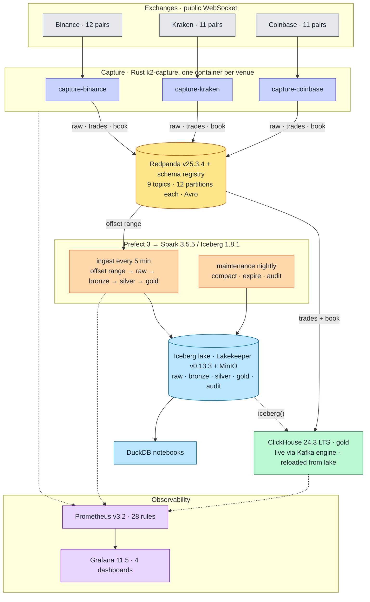

# 04. System overview

> **You will learn** the whole system on one diagram, its three invariants, and the data path end to end.
> **Read this if** you need the shape before the detail.
> **Before this** chapter 01.

## Problem

A research platform for crypto market data has to do four things end to end, on one host, inside a
16 CPU / 40 GB budget: receive every frame three public venues send and know when it did not; keep an
archive still trustworthy after the code that wrote it has been rewritten twice; derive research
products from it and recompute them on demand; and serve queries fast. The hard part is that the fast
tier and the durable tier want opposite things, and whichever is the record silently caps the other.

v1 was a complete Python lakehouse, Kafka and five always-on Spark Structured Streaming jobs into
Iceberg, and it worked at 35 to 40 CPU and 45 to 50 GB across 18 to 20 containers, more than 2x over
the mandate on both axes ([MIGRATION-JOURNEY.md](../MIGRATION-JOURNEY.md)). v2 was rebuilt greenfield
around Redpanda and a ClickHouse medallion, hit the budget, and made the serving database the record:
its Iceberg tier was a JDBC copy of ClickHouse and inherited that database's TTL, normalisation and
dropped columns. v3 inverts the ownership ([ADR-018](../adr/ADR-018-v3-lake-first-rust-capture.md)):
capture is Rust, the lake is the record, ClickHouse is derived and disposable.

Versions are the image tags in [`docker-compose.yml`](../../docker-compose.yml); decisions live in
[`../adr/`](../adr/README.md), numbers in [`../benchmarks/`](../benchmarks/README.md).

## System

Three invariants hold the shape together:

1. **The lake is the record; everything else is derived.** ClickHouse, the notebooks and every
   product table can be dropped and rebuilt from `raw.messages`
   ([ADR-018](../adr/ADR-018-v3-lake-first-rust-capture.md)).
2. **One wire format.** Avro with the registry, `int64` at 1e-8, `recv_ts_ns` in the body
   ([ADR-020](../adr/ADR-020-avro-fixed-point-contracts.md)). Nothing parses JSON downstream of capture.
3. **Correctness is measured, not asserted.** Sequence and checksum counters at capture, per-layer
   audits in the lake, three-way OHLCV parity at a pinned snapshot, chaos scripts with timed recovery.

## The data path

One trade, from the venue's socket to a candle in ClickHouse and a row in lake gold.

1. **The frame arrives.** `k2-capture` holds one WebSocket per venue carrying trades and L2 book
   together, and stamps `recv_ts_ns` as the first statement after the frame leaves the socket, before
   anything is parsed ([capture.md](05-capture.md)).
2. **Continuity is checked in the venue's own terms.** Binance's `lastUpdateId`, Kraken's CRC32,
   Coinbase's connection-wide `sequence_num`; a broken signal drops that book and resubscribes rather
   than publishing a stale one ([capture-venues.md](06-capture-venues.md)).
3. **Three records leave capture,** Avro against the registry, keyed by canonical symbol: the frame
   verbatim to `raw.<venue>`, the trade to `trades.<venue>` as fixed-point `int64` at 1e-8, the
   symbol's top-20 book at the next 1 Hz tick to `book.<venue>` ([wire-contracts.md](07-wire-contracts.md)).
4. **Every 5 minutes the lake reads by offset range,** from the offsets in the last ingest snapshot's
   summary to the broker's latest, appending each record verbatim to `raw.messages` with the consumed
   offsets in the same commit, so a killed run resumes rather than duplicates
   ([lake-ingest.md](08-lake-ingest.md)).
5. **Bronze decodes it per venue** into the venue's own field names with lineage to the raw row;
   **silver** types and flags it (UTC, canonical symbol, `venue_replay` / `seq_gap` /
   `precision_loss` / `checksum_ok`), keeping every delivery ([lake-layers.md](09-lake-layers.md)).
6. **Gold makes it one trade:** first delivery per `(exchange, canonical_symbol, trade_id)` wins;
   OHLCV buckets are `MERGE`d under the total order `(exchange_ts, recv_ts_ns, trade_seq)`, so a
   late delivery re-opens its candle ([lake-layers.md](09-lake-layers.md)).
7. **ClickHouse served it within seconds** (Kafka engine flush every 5 s) ([clickhouse-gold.md](10-clickhouse-gold.md)): the trade
   reached `gold.trades` from the topic as a `ReplacingMergeTree` row, earliest delivery winning, and
   `ohlcv_live(bucket)` computes the candle on read over `FINAL`. Lake history arrives by `iceberg()`.
8. **Every step above is measured.** Capture counters, lake gauges read from Iceberg snapshot
   summaries and ClickHouse's own `/metrics` feed 28 Prometheus rules as code; 22 carry a runbook
   annotation and 17 have a promtool unit test; eleven chaos scripts in `scripts/chaos/` fire the
   ones that can be induced on a single host ([observability.md](11-observability.md)).

Research reads the lake, not the database: `notebooks/` is a uv project where DuckDB queries the
Parquet under MinIO directly, four notebooks (connect, book at a time, ASOF trades-to-book,
completeness) run by `make notebooks-run` over `gold` for research and `silver` for
forensics. Nothing in the notebooks reads ClickHouse.

## Decisions that shaped it

| ADR | Decision | Why |
|---|---|---|
| [018](../adr/ADR-018-v3-lake-first-rust-capture.md) | Lake is the system of record; everything else derived | v2's lake was a JDBC copy of the serving DB, it inherited its TTL, normalisation and dropped columns |
| [019](../adr/ADR-019-rust-capture-tier.md) | Rust capture replaces three JVM handlers | One connection per venue carrying trades *and* book; `recv_ts` before parse; retired on a measured parity gate |
| [020](../adr/ADR-020-avro-fixed-point-contracts.md) | Avro + registry, `int64` @1e-8, `BACKWARD_TRANSITIVE` | v2 stored prices as strings and its registry proved nothing |
| [022](../adr/ADR-022-exactly-once-via-snapshot-offsets.md) | Kafka offsets committed inside the Iceberg snapshot | One atomic commit replaces a watermark table and its failure modes |
| [026](../adr/ADR-026-four-layer-lake-and-gold-served-from-clickhouse.md) | raw / bronze-per-venue / silver-per-venue / gold-canonical; ClickHouse serves gold with no TTL | Typed venue fields survive; OHLCV on read fixes v2's `SummingMergeTree` candles resolving open/close arbitrarily |
| [027](../adr/ADR-027-book-snapshot-and-sequencing.md) | Top-20 snapshots at 1 Hz; per-venue sequencing and resync policy | Raw holds the deltas; the product is what research joins against |
| [008](../adr/ADR-008-eliminate-prefect-orchestration.md) | Remove Prefect, **reversed** | Wrong call, kept on the record with its Outcome |

## Resource footprint

15 long-running services at 14.60 CPU / 25.625 GiB of limits, plus four one-shot init containers;
per-service table and the command that produces it in
[operations/docker-resources.md](../operations/docker-resources.md). Budget and reasoning per limit:
[ADR-010](../adr/ADR-010-resource-budget.md).

## Not built

No query API; no replication or failover; no Alertmanager routing; no load test above 1×. Designed
and deferred: pcap sidecar with kernel timestamps
([ADR-026](../adr/ADR-026-four-layer-lake-and-gold-served-from-clickhouse.md), `raw.pcap`,
deferred) and a cross-venue security
master ([data-strategy.md](12-data-strategy.md)). The cloud mapping in
[scale-out-path.md](17-scale-out-path.md) is designed, not exercised.

## Key points

- One ownership decision sets the shape: the lake holds the record, every other tier is a cache that
  can be dropped and recomputed, and none can quietly become authoritative.
- A trade is written verbatim before it is understood, then understood in steps, each layer derived
  only from the one above it and rebuildable on demand.
- Position and data commit in one snapshot, so exactly-once is a property of the storage format, not
  of a checkpoint store somebody has to operate. ClickHouse buys freshness, not truth.

## Further reading

| Page | What it holds |
|---|---|
| [12-data-strategy.md](12-data-strategy.md) | why four layers, what ClickHouse holds and for how long, retention vs disk |
| [13-schema-design.md](13-schema-design.md) | every column in every layer and the wire contracts |
| [14-partitioning-strategy.md](14-partitioning-strategy.md) | partition specs, sort orders, file sizes, ClickHouse keys |
| [15-capacity-model.md](15-capacity-model.md) | predicted vs measured bytes/day, CPU, disk runway |
| [16-failure-modes.md](16-failure-modes.md) | FMEA: detection, blast radius, recovery, proof per failure |
| [17-scale-out-path.md](17-scale-out-path.md) | the AWS mapping at TB/PB scale, designed, not exercised |
| [A1-technology-stack.md](A1-technology-stack.md) | every version and the ADR behind each |
