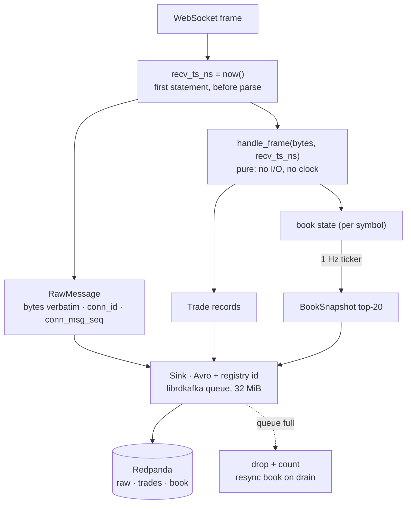

# 05. Capture: `k2-capture`

> **You will learn** how one Rust process turns a venue WebSocket into three Avro topics without losing or reinterpreting a frame.
> **Read this if** engineers touching `services/capture-rust/`, reviewers of the ingestion path.
> **Before this** chapter 04.

## Problem

A research archive is judged on whether it is
[complete](02-market-data-concepts.md#completeness), correct and reproducible, and the capture tier
is where all three are won or lost. Every venue speaks its own dialect over a public WebSocket:
[symbols](02-market-data-concepts.md#symbols-and-venues) are spelled per venue, prices arrive as
decimal strings, and [order book](02-market-data-concepts.md#order-books) updates are deltas whose
continuity is only checkable with the venue's own signal, a
[sequence number](02-market-data-concepts.md#sequencing) on Binance and Coinbase or a
[CRC32 checksum](02-market-data-concepts.md#checksums) on Kraken. The frame carries one clock, the
venue's, so unless the platform stamps its own receive time before parsing, exchange skew and
platform delay are inseparable in every stored row
([clocks](02-market-data-concepts.md#timestamps-and-clocks)); and a price that has been through a
float is one the archive can no longer prove ([fixed point](02-market-data-concepts.md#fixed-point-numbers)).

## Options

| Option | Why it lost | Reference |
|---|---|---|
| **JVM handler per stream** (the v2 Kotlin tier) | Its only wall clock was taken after JSON parse and normalisation, it carried no book at all, and it parsed Coinbase's `sequence_num` only to discard it. Every gap sits on the frame-receipt path, so patching in place *is* the rewrite, and it ends with `BigDecimal` on the record path, three JVMs, and a second parser written for replay. | [ADR-019](../adr/ADR-019-rust-capture-tier.md), [ADR-002](../adr/ADR-002-kotlin-feed-handlers.md) |
| **A generic connector or CDC tool** | Nothing off the shelf stamps a receive time before its own decoder runs, holds per-symbol book state, or verifies Kraken's CRC32. All three are requirements of the frame path, so the connector becomes a bespoke plugin: the same rewrite, with a framework to argue with. | [ADR-021](../adr/ADR-021-raw-first-archive-and-lineage.md) |
| **Go** | A real candidate on footprint and libraries. It loses on the two properties this decision is about: `float64` is the idiomatic numeric type and map iteration is deliberately randomised. Both are avoidable with discipline; in Rust they are the default. | [ADR-019](../adr/ADR-019-rust-capture-tier.md) |
| **One process per venue in Rust** (chosen) | Nothing. The frame path had to be rewritten under any of the above, so it was written where fixed-point `i64`, ordered `BTreeMap` book state and no `f64` are what the compiler hands you, and where capture and replay share one function. | [ADR-019](../adr/ADR-019-rust-capture-tier.md), [ADR-018](../adr/ADR-018-v3-lake-first-rust-capture.md) |

## Decision

**We capture with one Rust process per venue that publishes every frame verbatim before anything
is parsed, because receive-timestamp-before-parse, exact fixed-point arithmetic and bit-for-bit
replay determinism are properties of the frame path, and that path had to be rewritten to get
them in any language ([ADR-019](../adr/ADR-019-rust-capture-tier.md)).**

The consequence downstream: the raw topic is the system of record and the trades and book topics
derive from it, so a normalisation bug is repaired by
[reprocessing](03-data-engineering-concepts.md#rebuildability), not by losing the day. The same
`handle_frame` runs live and over recorded fixtures, so research and production cannot drift apart.
The cost: anything on the frame path is now Rust, and each venue is a hand-written adapter
([capture-venues.md](06-capture-venues.md)).

## How it works

One binary ([`services/capture-rust/`](../../services/capture-rust/README.md)), one container per venue, one WebSocket carrying trades and L2 book.

- **Runtime.** `tokio` `current_thread`: the container has 0.25 CPU, and one thread reading
  one socket is the whole workload. No internal channels; librdkafka's queue is the only
  buffer, so memory is bounded by one number (`queue.buffering.max.kbytes = 32768`).
- **Clock.** `recv_ts_ns` is wall-clock nanoseconds taken as the first statement after the
  frame leaves the socket (`ws.rs`). It travels in the record body and as a Kafka header, so
  the lake can measure venue→K2 latency per row without trusting any later clock.
- **Adapter contract.** `Adapter::handle_frame(&mut self, bytes, recv_ts_ns) -> Handled`
  (`exchanges/mod.rs`) is pure: it mutates book state and returns records plus an `Action`
  (resubscribe, reconnect). The same function runs in production and in the replay tests
  over recorded fixtures (`tests/fixtures/*.jsonl`, sha256-pinned).
- **Numbers.** `decimal.rs` parses venue strings straight to `i64` at 1e-8
  (`SCALE = 100_000_000`); a value with more than 8 decimals is counted in
  `k2_capture_precision_loss_total`, never rounded silently. No `f64` on the path.
- **Sink.** `sink.rs` encodes Avro with the registry id in the Confluent 5-byte header,
  keys by canonical symbol, and produces with `enable.idempotence`, `acks=all`, zstd, an 8 MiB
  message cap (Coinbase's subscribe snapshot is ~5 MB) and a 5 minute message timeout
  (`message.timeout.ms=300000`). A full queue drops the record and counts it
  ([backpressure](03-data-engineering-concepts.md#backpressure-and-loss)); `resync.rs` remembers
  which book streams dropped and resubscribes them once a tick passes with no drops, so the book
  is never silently stale.
- **Lifecycle.** `Backoff` reconnects with exponential delay; each connection gets a fresh
  `conn_id` and `conn_msg_seq` restarts at 0, so `(conn_id, conn_msg_seq)` is a primary key across
  the archive ([lineage](03-data-engineering-concepts.md#lineage-and-identifiers)). SIGTERM flushes
  the queue for 5 s, then exits.
- **Image.** `cargo-chef` layers so a code change does not recompile librdkafka; release
  profile `lto = "thin"`, `strip = true`; final stage `distroless/cc-debian12:nonroot`. No
  shell, so `k2-capture healthcheck` backs the Compose healthcheck.

## Practices

| Practice | Where it is enforced |
|---|---|
| Timestamp before parse | `ws.rs` `now_ns()` at frame receipt; carried in body + header (`record.rs`) |
| Pure parsing, replayable | `handle_frame` has no I/O; `tests/replay*.rs` run fixtures through it |
| No floats for money | `decimal.rs` `parse_fixed` + tests; `precision_loss_total` counter and `CapturePrecisionLoss` alert |
| Bounded memory, explicit loss | single librdkafka queue; `produce_errors_total{reason}`; `CaptureProduceErrors`, `CaptureProduceStalled` |
| Every frame kept | `RawMessage` produced before decode; lake `bronze_parity` audit proves nothing was lost after |
| Config is data | `config/instruments.yaml` single source of native/canonical symbols; `config.rs` tests |
| Minimal, non-root image | `Dockerfile` distroless final stage; Trivy in CI |
| Lint as a gate | CI `rust` job: `cargo fmt --check`, `clippy -D warnings`, `cargo test` |

## Trade-offs

- **Drop, don't block.** Blocking the frame loop when the broker stalls would stop reading the
  socket and the venue would disconnect, losing more. Loss is counted and the lake's audit
  records the hole.
- **One connection per venue.** Simplest possible failure domain; the cost is that a venue
  disconnect takes trades and book together, and the resubscribe path is exercised in `make chaos`.
- **No local persistence.** A spill-to-disk buffer would add a second store to reconcile;
  Redpanda's retention (48 h raw) is the buffer.
- **Public feeds.** Latency includes the internet and venue clock skew, and is published as
  such ([benchmarks](../benchmarks/2026-08-27.md#latency--exchange-timestamp--k2-receive)).

## Key points

- **Stamp, then parse.** `recv_ts_ns` is the first statement after the frame leaves the socket: the
  one property that cannot be added credibly later, and the reason the tier was rewritten.
- **Raw is the system of record.** Trades and book snapshots derive from a verbatim copy of every
  frame, failed parses included, so a parser bug is a reprocessing job rather than a lost day.
- **Loss is counted, never silent.** Drop-on-full plus a resync once the queue drains beats
  blocking the socket; `produce_errors_total` and the lake's parity audit both see the hole.
- **Rust for determinism, not speed.** Transit over the public internet dominates the process ([latency](02-market-data-concepts.md#latency-and-what-it-means));
  the language buys `i64` fixed point with no `f64` on the record path, ordered book iteration, and a 39.5 MB image.
