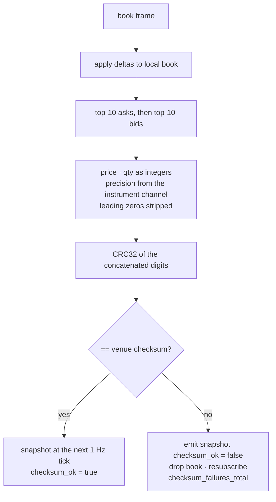

# 06. Capture: venue dialects

> **You will learn** what Binance, Kraken and Coinbase each send, how continuity is checked, and what happens when it breaks.
> **Read this if** anyone adding a venue or reading a gap/checksum alert.
> **Before this** chapter 05.

## Problem

An [order book](02-market-data-concepts.md#order-books) (the resting bids and asks for one
instrument) is only useful if you can prove you have not missed an update. Every venue
answers that differently. Binance publishes a monotonic `lastUpdateId`; Kraken publishes no
[sequence number](02-market-data-concepts.md#sequencing) at all and instead attaches a
[checksum](02-market-data-concepts.md#checksums) (a hash over the book's top levels that
must match yours) to every book frame; Coinbase publishes one `sequence_num` shared by every
channel on the connection.

Three detectors, three blast radii. Binance can lose one symbol's book and repair it alone.
Kraken learns within one update that a book is wrong but cannot say which update was missed.
A Coinbase gap cannot be attributed to any product, so it invalidates every book on the
socket. A single resync policy either under-reacts on one venue or over-reacts on another,
and both show up in the archive as
[completeness](02-market-data-concepts.md#completeness) you cannot defend.

## Options

| Option | Why it lost | Reference |
|---|---|---|
| Normalise everything behind one generic adapter interface, one sequencing model | Requires inventing a sequence number for Kraken and a checksum for Binance; both inventions become fields a later query trusts. The v2 Kotlin tier was that shape: it parsed Coinbase's `sequence_num` and discarded it, and synthesised Kraken trade ids from `timestamp + pair.hashCode()` | [ADR-027](../adr/ADR-027-book-snapshot-and-sequencing.md), [ADR-019](../adr/ADR-019-rust-capture-tier.md) |
| Resync every venue by reconnecting the socket | Correct for Coinbase, wasteful for the other two: it drops 12 healthy Binance books to repair one, and re-downloads every Kraken book for one symbol's checksum mismatch | [ADR-027](../adr/ADR-027-book-snapshot-and-sequencing.md) |
| **Per-venue policy matched to the venue's own continuity signal** (chosen) | Three explicit policies in one table, no shared abstraction over three implementations | [ADR-027](../adr/ADR-027-book-snapshot-and-sequencing.md) |

## Decision

**We give each venue its own continuity check and its own resync scope, because the
narrowest honest repair is the one the venue's own signal can justify.** The policies sit in
one comparison table rather than behind an interface. No book is rebuilt from a guess: a
fresh venue snapshot is the only repair, and where a venue answers nothing the record says
nothing (`checksum_ok` stays `null`) rather than defaulting to `true`.

## How it works

Three containers from one image, selected by `--exchange` / `K2_EXCHANGE`; the process is
chapter [05](05-capture.md), the code is
`services/capture-rust/src/exchanges/{binance,kraken,coinbase}.rs`.
[`config/instruments.yaml`](../../config/instruments.yaml) is the single source of truth for
all three ([symbols and venues](02-market-data-concepts.md#symbols-and-venues)), currently
12 Binance, 11 Kraken, 11 Coinbase: each instrument carries a `native` (the bytes on the
wire, byte for byte) and a `canonical` (`BASE/QUOTE`), and a symbol the registry does not
list is a hard error, never a guess. A venue's private ticker for an asset is folded into
the canonical name; `BTC/USDT` and `BTC/USD` never are, being different collateral with a
basis that is itself a research subject.

| | Binance | Kraken (WS v2) | Coinbase (Advanced Trade) |
|---|---|---|---|
| Endpoint | `wss://stream.binance.com:9443/stream` | `wss://ws.kraken.com/v2` | `wss://advanced-trade-ws.coinbase.com` |
| Streams on the one socket | `<sym>@trade`, `<sym>@depth20@100ms` via `/stream?streams=`, no subscribe frame | `instrument`, `book` (depth 25), `trade`; `heartbeat` and `status` arrive unsubscribed | `market_trades`, `level2`, `heartbeats` |
| Book model | complete top-20 partial every 100 ms; no local state | snapshot + deltas, local book | snapshot + absolute-quantity updates, local full-depth `BTreeMap` |
| Continuity signal | `lastUpdateId` strictly increasing per symbol | CRC32 over top-10 asks then bids on every `book` frame; no sequence numbers | `sequence_num`, one counter across every channel on the connection |
| On failure | drop that book; `Resubscribe`, the next partial is a complete top-20 | emit one last snapshot with `checksum_ok=false`, drop the book, unsubscribe + subscribe that symbol | drop every book; `Reconnect`, a gap cannot be attributed to one product |
| Trade id | venue `t` | venue `trade_id` (v1 had none, v2 was a reason to move) | venue `trade_id`; the subscribe-time snapshot carries history, excluded from the latency histogram |
| `native` / `canonical` | `BTCUSDT` / `BTC/USDT` | `BTC/USD` / `BTC/USD` | `BTC-USD` / `BTC/USD` |
| Connection lifetime | venue closes at 24 h; capture reconnects at 23 h (`reason="scheduled"`) | none published | none published |

### Kraken

The digit rendering (`decimal.checksum_digits`) depends on each pair's `price_precision`
and `qty_precision` from the `instrument` channel, which is why `instrument` is the first
subscription sent; frames arriving before their precision does are parked (up to
`MAX_PENDING_FRAMES = 512` per symbol) rather than checked against a guess, and Kraken's
documented example (`3310070434`) is a unit test. Subscription depth is 25, the shallowest
the checksum is defined over (overridable per instrument via `book_depth`), while the
emitted snapshot is top-20
([top-of-book sampling](02-market-data-concepts.md#top-of-book-sampling)); levels past the
subscription depth are truncated on apply, because a level the venue stops reporting would
corrupt a later checksum. The lake replays the same algorithm over every archived frame
([09-lake-layers.md](09-lake-layers.md)), so a checksum that passed live and fails in
[replay](02-market-data-concepts.md#trades-and-replays) means the archive has a hole.

**Kraken's spellings moved with the v2 migration.** WS v1 spelled Bitcoin `XBT/USD` and
Dogecoin `XDG/USD`; WS v2 spells them `BTC/USD` and `DOGE/USD` and answers
`{"error":"Currency pair not supported XBT/USD"}` to the old ones. The alias table that
bridged the two retired with the Kotlin handlers, so a registry typo now presents as a venue
error rather than as silent aliasing (`kraken::tests::a_v1_spelling_is_not_aliased_and_matches_nothing`,
`tests/test_contracts.py::test_kraken_natives_are_the_ws_v2_spellings`).

### Binance

The combined endpoint carries the subscription in the URL, so there is no subscribe frame
and no ack to wait for. `@depth20@100ms` is a *partial* stream: every frame is a complete
top-20, so the adapter holds no book state beyond the last `lastUpdateId` per symbol and
recovery from a regression is simply the next frame. That id means nothing across a
connection boundary, so it is reset on reconnect rather than compared. Binance closes a
connection at 24 h; `BINANCE_MAX_CONNECTION_AGE` pre-empts that at 23 h (`main.rs:124`),
turning an involuntary disconnect into a scheduled one, and
`k2_capture_reconnects_total{reason}` keeps the two distinguishable in a postmortem.

### Coinbase

`sequence_num` is connection-wide across every channel, so the continuity check is one
`expected == got` per frame. A gap invalidates every book on the connection: `level2` sends
absolute `new_quantity` per level, so a book that lost one delta is wrong forever with no
per-product resync short of a fresh snapshot. The adapter reports one `Action::Reconnect`
and drops its books; `snapshot` then returns `None` rather than a plausible-looking lie
until the new connection's snapshots land. No checksum is published, so `checksum_ok` is
`None`, meaning unanswerable, never collapsed to `true`.

There is no top-N option either: the `level2` subscribe snapshot is the whole book, measured
at 5,195,904 bytes / 43,974 levels for `BTC-USD`, which is what sized the 8 MiB
`max.message.bytes` on the `raw` topics ([07-wire-contracts.md](07-wire-contracts.md)). The
local `BTreeMap` holds full depth, top-20 is a truncation at sample time, and
`k2_capture_book_levels_total` is updated after every apply so memory is watched rather than
assumed. That snapshot also replays trade history hours old by construction, so frames
flagged `history` are excluded from the latency histogram (`main.rs:442`). A snapshot's
`exchange_ts` is the latest per-level `event_time` in that book, the last instant the venue
vouches for its state
([timestamps and clocks](02-market-data-concepts.md#timestamps-and-clocks)).

### Adding a fourth venue

Coinbase was added this way ([ADR-016](../adr/ADR-016-add-coinbase-exchange.md)); the full
procedure is [operations/adding-new-exchanges.md](../operations/adding-new-exchanges.md).

| Step | What changes |
|---|---|
| Registry | venue and instruments in [`config/instruments.yaml`](../../config/instruments.yaml), `native` exactly as the venue spells it on the wire, `canonical` as `BASE/QUOTE` |
| Code | an `Exchange` variant plus default URL in `src/config.rs`, and `src/exchanges/<venue>.rs` implementing `handle_frame`, `subscribe_messages`, `snapshot` and the venue's own continuity check, wired into `exchanges/mod.rs` |
| Test | a fixture from `k2-capture record --exchange <venue>` and a `tests/replay_<venue>.rs` hashing two passes against a committed golden value |
| Topics | the three v3 topics and their Avro subjects in [`docker/redpanda/init.sh`](../../docker/redpanda/init.sh) |
| Runtime | a `capture-<venue>` service in `docker-compose.yml` (0.25 CPU / 256M, more for full-depth books), a scrape job with no `exchange` target label, and the `exchange=~` selectors in [`docker/prometheus/rules/capture-alerts.yml`](../../docker/prometheus/rules/capture-alerts.yml) plus the dashboard |
| Lake | nothing: bronze is unified with `exchange` as a column and [`docker/lake/ingest.py`](../../docker/lake/ingest.py) builds its topic list as `K2_EXCHANGES × {raw, trades, book}` ([08-lake-ingest.md](08-lake-ingest.md)) |

Two traps, both hit for real. `config/instruments.yaml` is a file-level bind mount, so the
container pins the inode and a write-then-rename edit leaves it reading the old one;
`docker compose up -d --force-recreate --no-deps <service>` fixes it, `docker restart` does
not. And the registry race: capture containers gate on `redpanda-init` with
`service_completed_successfully`, then the sink warms one subject per record kind before the
first WebSocket connect, with a 5 s timeout so a hung registry cannot stall the socket read.

## What is measured

Per venue counters, all on `:8082/metrics` and prefixed `k2_capture_`: `gaps_total`,
`checksum_failures_total` (Kraken only, no series is seeded for the other two),
`resyncs_total`, `reconnects_total{reason}`, `produce_errors_total{reason}`,
`precision_loss_total`, `unknown_frames_total`, `exchange_to_recv_seconds` histogram,
`book_depth`, `book_levels_total`. Every series carries the venue's own `exchange` label, so
the scrape jobs set no `exchange` target label
([11-observability.md](11-observability.md)). The 6.5 h window on 2026-08-27 read 0 gaps and
0 checksum failures over 14.1 M Kraken frames
([benchmarks](../benchmarks/2026-08-27.md#ingestion--capture-tier)).

## Practices

| Practice | Where it is enforced |
|---|---|
| Continuity checked on every frame | `lastUpdateId` / CRC32 / `sequence_num` in each adapter; `CaptureSequenceGaps`, `CaptureChecksumFailure` alerts |
| Failure is visible before it is repaired | Kraken marked snapshot emitted **before** the book is dropped (`kraken.rs`); consumers can filter `checksum_ok = false` |
| Resync is the venue's job, not ours | no book is rebuilt from guesses; a fresh venue snapshot is the only repair |
| Venue example is a test | `decimal.rs` / `kraken.rs` tests against Kraken's published checksum example |
| Recorded sessions replay | `k2-capture record` fixtures in `tests/fixtures/`, sha256-pinned, run in CI |
| Pre-empt known limits | Binance 23 h scheduled reconnect; 8 MiB frame cap sized to Coinbase's snapshot |

## Trade-offs

Three policies means three code paths and three sets of venue docs to keep current, and the
honest limit of this shape is around ten venues. At three it is less code than the
abstraction would have been.

Coinbase's connection-wide resync is the expensive one: one lost frame costs every book on
the socket, and that cost grows with the instrument count. Splitting products across
connections is the upgrade path, not taken yet.

There is no dead-letter queue and no spill to disk. When librdkafka's 32 MiB queue fills,
records are dropped and counted rather than blocking the frame loop, because a blocked loop
stops us reading the socket and the venue drops us, losing more than it saved
([backpressure and loss](03-data-engineering-concepts.md#backpressure-and-loss)). An
unparseable frame is still archived verbatim to the `raw` topic and counted in
`unknown_frames_total`, so a normalisation bug stays
[rebuildable](03-data-engineering-concepts.md#rebuildability). At 34 instruments this has
cost nothing; at a hundred across ten venues the DLQ is the first thing to add.

## Key points

- Each venue offers a different continuity signal, so each gets a different resync scope:
  per-symbol on Binance and Kraken, whole-connection on Coinbase.
- Kraken's CRC32 is the strongest of the three and the only one that proves the book's
  *contents*, not just its ordering; it needs per-pair precision before it can run at all.
- A book that fails its check is emitted once with `checksum_ok = false` before it is
  dropped, so the bad window is queryable instead of looking like quiet.
- Nothing is translated or synthesised: the registry's `native` is the bytes on the wire, an
  unknown symbol fails loudly, and arithmetic is
  [fixed-point](02-market-data-concepts.md#fixed-point-numbers) `i64` at 1e-8 throughout.
