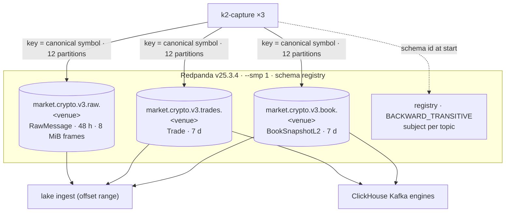

# 07 — Redpanda and the wire contracts

> **You will learn** the nine topics, the three Avro records, keying, retention and registry compatibility.
> **Read this if** producers and consumers of the topics; schema changes.
> **Before this** chapter 04.

A single Redpanda broker with the schema registry built in carries nine topics and three
Avro records. It is a buffer with retention, not storage: the lake reads it by offset range
and keeps the record; ClickHouse reads it for freshness. Decisions:
[ADR-001](../adr/ADR-001-replace-kafka-with-redpanda.md) (Redpanda over Kafka),
[ADR-020](../adr/ADR-020-avro-fixed-point-contracts.md) (one wire format).

## Topics

- **Created, not auto-created.** `redpanda-init` runs `rpk topic create` for the nine
  `market.crypto.v3.{raw,trades,book}.<venue>` topics at 12 partitions each, then applies
  retention explicitly so a topic that already exists with the wrong value is corrected.
  108 partitions on one broker; partition counts are deterministic across clones.
- **Keyed by canonical symbol.** One symbol's records stay ordered within a partition, and
  three venues' BTC/USD land on the same key. Twelve partitions because at most 12
  instruments per venue and the ClickHouse feeds run 2 consumers.
- **Retention is a per-partition budget.** `retention.ms` 48 h and `retention.bytes` per
  partition on `raw.*`, 7 d on the derived topics; the bytes floor is derived in
  `init.sh` from the measured per-venue rate. Symbol-keyed partitions are uneven (one BTC
  partition can hold several times the median), so the floor is sized to the largest.
- **Frame cap.** `max.message.bytes` 8 MiB on `raw.*` to fit Coinbase's ~5 MB `level2`
  subscribe snapshot; the capture's own cap matches.

## Records

| Record | Carries | Notes |
|---|---|---|
| `RawMessage` | `exchange`, `stream`, `symbol?`, `recv_ts_ns`, `conn_id`, `conn_msg_seq`, `payload` bytes | every frame, verbatim; the lake's `raw.messages` stores the whole Kafka value including the 5-byte Confluent header |
| `Trade` | venue + canonical symbol, `trade_id`, `price_e8`, `qty_e8`, `side`, `exchange_ts` (`timestamp-micros`), `recv_ts_ns`, `seq`, lineage | fixed-point `long` at 1e-8; no strings for numbers |
| `BookSnapshotL2` | top-20 as parallel arrays `bid_px[]`, `bid_qty[]`, `ask_px[]`, `ask_qty[]`, `depth`, `checksum_ok`, `seq`, timestamps | 1 Hz per symbol; arrays decode natively in ClickHouse `AvroConfluent` |

Schemas live in [`schemas/avro/`](../../schemas/avro/) and are compiled into the capture
binary (`include_str!`), so the producer cannot drift from the file the registry holds.
`recv_ts_ns` also travels as a Kafka header, readable without decoding the value.

## Practices

| Practice | Where it is enforced |
|---|---|
| Explicit topic provisioning | `docker/redpanda/init.sh` one-shot; `rpk topic list` in the release check |
| Schema compatibility gated | registry level `BACKWARD_TRANSITIVE`; `init.sh` documents the `/compatibility` probe that rejects an incompatible record |
| One wire format, tested | `tests/test_wire_format.py` decodes fixtures against the `.avsc` files; CI `python` job |
| Producer-side durability | `enable.idempotence`, `acks=all` in `sink.rs`; drops are counted, never silent |
| Retention sized from measurement | `init.sh` arithmetic cites the per-venue GB/day; `15-capacity-model.md` scores it |
| Broker health alerted from both sides | `CaptureProduceErrors` (producer view), `LakeIngestLagHigh` / `ClickHouseGoldFeedStale` (consumer view) |

## Trade-offs

- **Single broker.** No replication; recovery is restart, measured in `make chaos`
  (`redpanda-stop`). A second node would double the CPU budget of the tier.
- **`--smp 1`.** One core for the broker holds 108 partitions at the measured ~1 k
  frames/s with headroom; the budget is CPU-bound, not throughput-bound.
- **Retention as deadline.** An ingest outage past 48 h loses raw frames; the lake records
  the hole rather than pretending ([lake-ingest.md](08-lake-ingest.md)).
