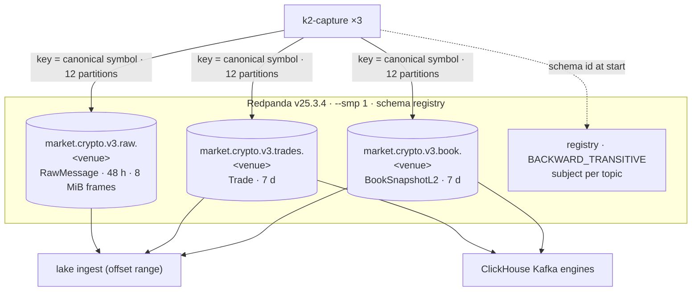

# 07. Redpanda and the wire contracts

> **You will learn** the nine topics, the three Avro records, keying, retention and registry compatibility.
> **Read this if** producers and consumers of the topics; schema changes.
> **Before this** chapter 04.

## Problem

Rust capture writes the bytes, ClickHouse 24.3 decodes them for the hot tier, Spark reads them by bounded
offset range into Iceberg ([batch vs streaming](03-data-engineering-concepts.md#batch-vs-streaming)). A
contract between a capture process, a serving DB and a lake owes those readers four guarantees: one decimal
decodes to the same number everywhere with no per-consumer parser; one instrument's records stay ordered,
which is the key's job ([partitioning](03-data-engineering-concepts.md#partitioning-and-pruning) orders
within a partition, never across them); today's bytes stay readable by a 2028 reader, since the Iceberg
archive is never rewritten ([schema evolution](03-data-engineering-concepts.md#schema-evolution) governs
which changes stay resolvable); and a stalled broker loses records loudly, not silently
([backpressure](03-data-engineering-concepts.md#backpressure-and-loss)).

v2 missed all four. Price, quantity and quote volume travelled as JSON strings
([`normalized-trade.avsc:36`](../../schemas/avro/normalized-trade.avsc)). The Avro schema meant to fix that
was registered and unread (every ClickHouse Kafka table was `JSONAsString` over a parallel `.raw` topic) and
was itself broken: `logicalType` sat as a sibling of `type`, where Avro silently ignores it. Raw topics were
keyed by exchange name rather than instrument (`legacy/v2-kotlin/.../KafkaProducerService.kt:155`), so a
20-partition topic used one partition and ordering was luck. And no receive timestamp reached the wire.

## Options

| Option | Why it lost | Reference |
|---|---|---|
| Kafka + a separate Confluent registry | Two services, 2.0 CPU / 2.77 GB for the broker layer alone; Redpanda carries a Kafka-compatible registry in the same binary | [ADR-001](../adr/ADR-001-replace-kafka-with-redpanda.md) |
| JSON on the wire, JSON Schema | Keeps every payload greppable, the one thing this gives up; loses binary compactness on the highest-volume topic, loses schema-id resolution for an immutable archive, and re-introduces per-consumer number parsing | [ADR-020](../adr/ADR-020-avro-fixed-point-contracts.md) |
| Protobuf | The registry supports it, but it buys nothing Avro does not here and costs a codegen step in three toolchains; never reached an ADR's alternatives table | [ADR-001](../adr/ADR-001-replace-kafka-with-redpanda.md) |
| **Avro, fixed-point `int64` @1e-8** | **Chosen.** One binary format on the one path, exact integer arithmetic in Rust, ClickHouse and Spark | [ADR-020](../adr/ADR-020-avro-fixed-point-contracts.md) |

## Decision

**We carry every v3 record as Avro registered under TopicNameStrategy at a global `BACKWARD_TRANSITIVE`
level, with prices and quantities as `int64` scaled by 1e-8 and `recv_ts_ns` in the body as well as a Kafka
header, because three runtimes have to decode the same bytes to the same value without negotiating, and an
integer is the only numeric type all three agree on exactly.**

A single Redpanda broker with the registry built in carries nine topics and three Avro records. It is a
buffer with retention, not storage: the lake reads it by offset range and keeps the record, ClickHouse reads
it for freshness. The cost: a topic is no longer readable by eye, and the registry now gates every produce.

## How it works

### Topics

- **Created, not auto-created.** `redpanda-init` runs `rpk topic create` for the nine
  `market.crypto.v3.{raw,trades,book}.<venue>` topics at 12 partitions each, then applies retention
  explicitly so a topic that already exists with the wrong value is corrected. 108 partitions on one broker;
  partition counts are deterministic across clones.
- **Keyed by canonical symbol**, `BASE/QUOTE` uppercase, the venue-independent name for an instrument
  ([symbols and venues](02-market-data-concepts.md#symbols-and-venues)). One symbol's records stay ordered
  within a partition, and three venues' BTC/USD land on the same key. Twelve partitions because at most 12
  instruments per venue and the ClickHouse feeds run 2 consumers.
- **Retention is a per-partition budget.** `retention.ms` 48 h and `retention.bytes` per partition on
  `raw.*`, 7 d on the derived topics; the bytes floor is derived in `init.sh` from the measured per-venue
  rate. Symbol-keyed partitions are uneven (one BTC partition can hold several times the median), so the
  floor is sized to the largest.
- **Frame cap.** `max.message.bytes` 8 MiB on `raw.*` to fit Coinbase's ~5 MB `level2`
  subscribe snapshot; the capture's own cap matches.

### Records

| Record | Carries | Notes |
|---|---|---|
| `RawMessage` | `exchange`, `stream`, `symbol?`, `recv_ts_ns`, `conn_id`, `conn_msg_seq`, `payload` bytes | every frame, verbatim; the lake's `raw.messages` stores the whole Kafka value including the 5-byte Confluent header |
| `Trade` | venue + canonical symbol, `trade_id`, `price`, `qty`, `side`, `exchange_ts` (`timestamp-micros`), `recv_ts_ns`, `seq`, lineage | fixed-point `long` at 1e-8; no strings for numbers |
| `BookSnapshotL2` | top-20 as parallel arrays `bid_px[]`, `bid_qty[]`, `ask_px[]`, `ask_qty[]`, `depth`, `checksum_ok`, `seq`, timestamps | 1 Hz per symbol; arrays decode natively in ClickHouse `AvroConfluent` |

Prices and quantities are [fixed point](02-market-data-concepts.md#fixed-point-numbers), the decimal scaled
to a whole number by `round(value * 1e8)`, so 45285.2 is `4528520000000`. Two clocks ride along
([timestamps and clocks](02-market-data-concepts.md#timestamps-and-clocks)): `exchange_ts` is the venue's,
subject to its skew; `recv_ts_ns` is the only one K2 controls, stamped before parse, and duplicated as a
Kafka header, readable without decoding the value. Schemas live in [`schemas/avro/`](../../schemas/avro/)
and are compiled into the capture binary (`include_str!`), so the producer cannot drift from the registry.

## Practices

| Practice | Where it is enforced |
|---|---|
| Explicit topic provisioning | `docker/redpanda/init.sh` one-shot; `rpk topic list` in the release check |
| Schema compatibility gated | registry level `BACKWARD_TRANSITIVE`; `init.sh` documents the `/compatibility` probe that rejects an incompatible record |
| One wire format, tested | `tests/test_wire_format.py` decodes fixtures against the `.avsc` files; CI `python` job |
| Producer-side durability | `enable.idempotence`, `acks=all` in `sink.rs`; drops are counted, never silent |
| Retention sized from measurement | `init.sh` arithmetic cites the per-venue GB/day; `15-capacity-model.md` scores it |
| Broker health alerted from both sides | `CaptureProduceErrors` (producer view), `LakeIngestLagHigh` / `ClickHouseGoldFeedStale` (consumer view) |

## Trade-offs

- **Single broker.** No replication; recovery is restart, measured in `make chaos` (`redpanda-stop`). A
  second node would double the CPU budget of the tier.
- **`--smp 1`.** One core holds 108 partitions at the measured ~1 k frames/s; CPU-bound, not throughput.
- **Retention as deadline.** An ingest outage past 48 h loses raw frames; the lake records the hole rather
  than pretending ([lake-ingest.md](08-lake-ingest.md)).
- **A field is forever.** `BACKWARD_TRANSITIVE` means no field is ever removed or renamed.

## Key points

- Nine topics, three records, one format, registry on the only path: a schema mistake fails at boot.
- `int64` at 1e-8 is the numeric contract; >8 decimal places is rejected and counted at capture.
- The canonical-symbol key makes ordering a property, not a coincidence; it also makes partitions uneven.
- Redpanda is a 48 h / 7 d buffer. The archive is Iceberg `raw.messages`, which never expires.
