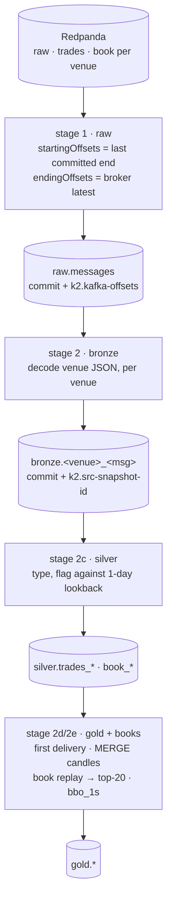

# 08. Lake ingest: Redpanda to Iceberg, exactly once

> **You will learn** how Redpanda reaches Iceberg exactly once, and how each layer is derived incrementally.
> **Read this if** engineers touching `docker/lake/`, anyone debugging a lake audit.
> **Before this** chapter 07.

`docker/lake/ingest.py` is the only writer of new data into the lake. Every 5 minutes it reads
Redpanda by explicit offset range, appends every record verbatim to `raw.messages`, then derives
bronze, silver and gold from that archive. Design:
[ADR-022](../adr/ADR-022-exactly-once-via-snapshot-offsets.md); operations: [`docker/lake/README.md`](../../docker/lake/README.md).

## Problem

A topic is a position, not a dataset. Redpanda hands out records by offset; the lake must end up
holding each of them exactly once ([exactly-once](03-data-engineering-concepts.md#exactly-once):
every source record lands in the target once, however the job dies). An offset stored twice and an
offset nobody stored must both be impossible.

"Read the stream and checkpoint somewhere" fails on where *somewhere* is. Rows land in one store
and the position in another, no transaction spans the pair, so a crash between the two writes is
either a re-read on resume (duplicates) or an advance over rows never written (a hole); ordering
them chooses which, never whether. v2 shipped that shape and needed a recovery runbook for its
position store's state machine. A *timestamp* watermark is worse: with no exact successor, its
lateness buffer is a standing choice between duplicates and loss.

## Options

| Option | Why it lost | Reference |
|---|---|---|
| Spark Structured Streaming with its own checkpoint | The framework's own answer, and a resident streaming runtime against a 16 CPU single-host budget; ADR-004 deleted precisely this to recover 13.5 CPU. The checkpoint is still a second store with the same atomicity gap against the Iceberg commit, in a format that is Spark's business, not ours ([batch vs streaming](03-data-engineering-concepts.md#batch-vs-streaming): a bounded run you can re-run, against a process you can only restart). | [ADR-004](../adr/ADR-004-eliminate-spark-streaming.md), [ADR-006](../adr/ADR-006-spark-batch-only.md) |
| A watermark table in PostgreSQL | What v2's offload did. Two stores, no transaction, so the crash window survives; and the watermark was a timestamp, so lateness was guesswork. It also put PostgreSQL on the archive's critical path: no Prefect database, no advancing system of record. | [ADR-014](../adr/ADR-014-spark-based-iceberg-offload.md), [ADR-022](../adr/ADR-022-exactly-once-via-snapshot-offsets.md) |
| Kafka Connect with an Iceberg sink connector | An always-on JVM cluster to run, size and monitor for a job that fires 12 times an hour, committing on a cadence of its own into an offset store of its own: the two-store problem bought back at a higher resting cost. The lake wants one writer under one lock, not an autonomous one. No ADR of its own; it never survived the resident-cost line ADR-004 drew and ADR-010 budgets. | [ADR-010](../adr/ADR-010-resource-budget.md) |
| **Offsets committed in the Iceberg snapshot summary** (chosen) | Nothing left to disagree: the position is a property of the commit that wrote the rows. It costs one rule, "latest snapshot carrying `k2.job = ingest`", which is why `offsets.py` is pure Python and unit-tested. | [ADR-022](../adr/ADR-022-exactly-once-via-snapshot-offsets.md) |

## Decision

**We store the consumed Kafka offsets in the snapshot summary of the same Iceberg commit that
wrote the rows, and read the next run's start back out of it, because one atomic commit cannot
half-happen.**

An [Iceberg snapshot](03-data-engineering-concepts.md#iceberg-snapshots) is an immutable listing of
the table's files, swapped in atomically, so a property hung on it lives or dies with the rows it
describes. Re-running an ingest that did not commit is a no-op; re-running one that did is impossible,
because its own commit moved the start: [idempotency](03-data-engineering-concepts.md#idempotency)
by construction, not by deduplication.

## How it works

One process, one Spark session, one file lock (`lock.py`): a second writer exits 2 rather
than interleaving appends; nightly maintenance takes the same lock blocking, so compaction
never shares the 8 GiB container with an ingest.

### Stage 1: offsets in the snapshot

1. **Where to start.** `offsets.latest_summary()` finds the newest `raw.messages` snapshot
   whose summary carries `k2.job = ingest`, maintenance snapshots (compaction, expiry) have
   no `k2.job` and are skipped by that property, not by guessing at Iceberg's `operation`
   field. Its `k2.kafka-offsets` map holds Kafka *end* offsets (exclusive), so the next
   start is the same number copied, no ±1. A partition the map has never seen starts at
   `EARLIEST`: for an archive that is never expired, the beginning is always right.
2. **Where to stop.** `bounded_offsets()` clips each partition at the broker's `latest`,
   at `--max-offsets-per-partition` for backlog slicing, or at `--end-timestamp`. What it
   leaves behind is the `k2_lake_ingest_backlog_offsets` gauge.
3. **What is gone.** If a committed start is below the broker's earliest offset, retention
   evicted records the lake never read. `failOnDataLoss=true` and the run fails; it keeps
   failing until an operator types `--accept-data-loss`, which records each hole as an
   `offset_gap` row in `audit.checks` before skipping it. There is deliberately no
   environment variable for this: the scheduled path can never absorb a loss silently.
4. **The commit.** One `append` carrying `k2.job`, `k2.kafka-offsets` (merged over the
   previous map, a committed offset is never dropped), `k2.kafka-backlog` and
   `k2.max-kafka-ts`. Rows and position are the same atomic metadata swap in Lakekeeper.

### Stages 2–2e: incremental by parent snapshot

Below raw is the usual [medallion](03-data-engineering-concepts.md#medallion-layers) progression, each
layer a pure function of its parent plus the
[lineage columns](03-data-engineering-concepts.md#lineage-and-identifiers) that trace a gold row back
to the frame it came from, and flags that record what a venue did rather than smoothing it away
([replays](02-market-data-concepts.md#trades-and-replays): a venue re-sending a trade it already
sent, which is not a duplicate the lake made). Each layer reads its parent with `start-snapshot-id` = the id it last committed
(`k2.src-snapshot-id` on its own newest snapshot) and `end-snapshot-id` = the parent's
current id, then writes that end id into its own commit. Same contract as stage 1, one
level up. Start == end means nothing new and the stage is skipped (Spark rejects the empty
range).

| Stage | Module | What it does | Why it is shaped that way |
|---|---|---|---|
| bronze | `bronze.py` | decodes raw JSON per venue with `from_json` in PERMISSIVE mode into the venue's own field names; unparseable frames are counted, not dropped | the lake must not depend on the capture's parser; a venue field is never lost before silver |
| silver | `silver.py` | types and flags (`venue_replay`, `seq_gap`, `precision_loss`) by scoring `batch ∪ last 1 day of silver` with window functions | replay and gap detection need history; one day bounds the scan |
| gold | `gold.py` | first delivery per `(exchange, canonical_symbol, trade_id)`; dims from `config/instruments.yaml`; OHLCV `MERGE`d for the buckets the batch touched, total order `(exchange_ts, recv_ts_ns, trade_seq)` | a late delivery must re-open its candle, and open/close ties must resolve the same way in every engine |
| books | `books.py` | one streaming replay per connection: Kraken CRC32 verified per update, end-of-second top-20 and BBO sampled from the same pass; `gold.book_state` carries the book across runs | replaying once is cheaper than twice, and a checksum proves the replay is the venue's book |

`rebuild.py --layer bronze|silver|gold|books` drops a layer and recomputes it from its parent
over the whole archive; bronze 520 s, books 2,367 s
([benchmarks](../benchmarks/2026-08-27.md#lake)). That is what keeping raw buys: every layer above
it is [rebuildable](03-data-engineering-concepts.md#rebuildability), so a bug in a projection is a re-run rather than a loss.

## Proof

`maintenance.py` runs nightly and writes every assertion to `audit.checks`; any failure
exits non-zero and `LakeAuditFailed` fires ([runbook](../runbooks/lake-audit-failed.md)). These are
[audits as tests](03-data-engineering-concepts.md#audits-as-tests): assertions about last night's
data, not about the code CI ran.

| Audit | Asserts |
|---|---|
| `offset_continuity` | per partition, the committed ranges tile with no hole other than recorded `offset_gap` rows |
| `bronze_parity`, `bronze_unparseable`, `bronze_schema_drift` | raw frames in == bronze rows out per venue; no undeclared keys |
| `silver_parity`, `silver_flags` | bronze == silver row counts; flag rates reported |
| `gold_trades`, `ohlcv_parity` | one row per identifier; candles recompute from gold trades to the same values |
| `book_parity`, `kraken_checksum` | book rows tile the deltas; failed checksums outside acknowledged windows are zero |

`kraken_checksum` re-verifies the venue's own [checksum](02-market-data-concepts.md#checksums) in
the lake: the replayed book either is the one Kraken had, or it is not. Independently,
`make lake-verify` runs the parity checks on demand and `make parity-ohlcv` compares lake,
ClickHouse and DuckDB candles at a pinned snapshot.

## Practices

| Practice | Where it is enforced |
|---|---|
| Position and data in one commit | `snapshot-property.k2.kafka-offsets` on the `raw.messages` append (`ingest.py`); `test_lake_offsets.py` |
| Exactly-once by construction, tested | `make lake-verify`: a second run adds 0 rows; chaos `lake-ingest-kill.sh` (42 s, no duplicates) |
| Loss needs a human | `--accept-data-loss` is a CLI flag only; scheduled runs fail until typed; each hole is an `offset_gap` audit row |
| One writer | `lock.py` `flock`; ingest exits 2 if held, maintenance waits |
| Layers read parents by snapshot id | `k2.src-snapshot-id` in `bronze.py`, `silver.py`, `gold.py`, `books.py` |
| Nightly proof, alerted | `maintenance.py` audits → `audit.checks`; non-zero exit → `LakeAuditFailed` |
| Pure logic unit-tested off Spark | `offsets.py`, `book.py`, `instruments.py` have no pyspark import; `tests/test_lake_*.py` |

## Trade-offs

- **Batch, five minutes.** Freshness in the lake is bounded by the cron; ClickHouse covers the head
  from the topics. A streaming writer would need its own checkpoint store, the thing this design removes.
- **One writer, one container.** Ingest, rebuilds and maintenance share 2 CPU / 8 GiB in
  turn. Serial by lock is a capacity ceiling, not a correctness one.
- **Retention is the deadline.** `raw.*` topics keep 48 h, the only door
  [loss](03-data-engineering-concepts.md#backpressure-and-loss) can enter by, and it enters loudly:
  a longer outage is a recorded, acknowledged hole ([failure modes](16-failure-modes.md#lake-tier)).
- **Bronze keeps vendor schemas.** Cross-venue work waits for gold; in exchange nothing a
  venue sent is normalised away before it can be inspected.

## Key points

- The archive's position lives in the archive's own commit, so there is no second store to disagree
  with it and no recovery procedure for one.
- Offsets, not timestamps: an offset has an exact successor, so runs abut with nothing to guess at.
- "Latest snapshot with `k2.job = ingest`", never "latest snapshot": compaction commits too.
- Every layer below raw resumes by parent snapshot id and can be dropped and rebuilt from raw.
- Loss enters only through retention, and only a human typing `--accept-data-loss` records it.
