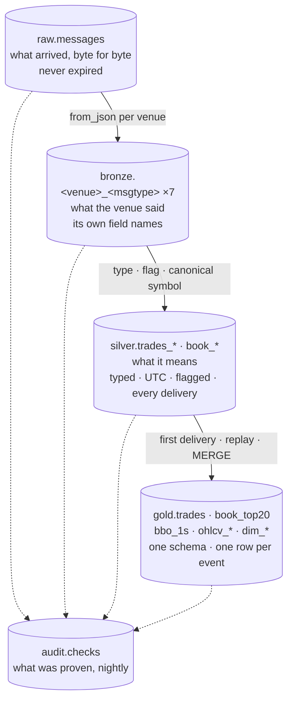

# 09 — Lake layers — raw, bronze, silver, gold

> **You will learn** what raw, bronze, silver and gold each hold, the identifier at each layer, and why the boundaries sit where they do.
> **Read this if** anyone querying the lake.
> **Before this** chapter 08.

Iceberg tables on a Lakekeeper REST catalog over MinIO, Parquet + zstd. Each layer is
derived only from the one above it and is rebuilt from `raw.messages` on demand; the
boundary between layers is where a specific question gets answered. Decision:
[ADR-026](../adr/ADR-026-four-layer-lake-and-gold-served-from-clickhouse.md); columns:
[schema-design.md](13-schema-design.md); partitioning: [partitioning-strategy.md](14-partitioning-strategy.md);
how rows move: [lake-ingest.md](08-lake-ingest.md).

| Layer | Question it answers | Identifier | Kept because |
|---|---|---|---|
| `raw` | what did K2 receive, byte for byte, and when | `(topic, partition, offset)`; `(conn_id, conn_msg_seq)` | regulatory-grade record; every other layer is a function of it |
| `bronze` | what did the venue say, in its own vocabulary | lineage to the raw row | a field the venue sent is never normalised away before it can be inspected; schema drift is detectable per venue |
| `silver` | what does it mean, and can it be trusted | lineage to bronze; flags `venue_replay`, `seq_gap`, `precision_loss`, `checksum_ok` | forensics: every delivery, including replays, with the reason it is suspect |
| `gold` | what does research join against | `(exchange, canonical_symbol, trade_id)` — unique here and nowhere below | one schema across venues; dedup happens once, where the audit proves it |

**Why uniqueness lives in gold.** The Phase D unified bronze declared `(exchange, symbol,
trade_id)` unique and the data disproved it twice in a day (reconnect replay, then
in-connection re-send). Below gold the only honest identifier is lineage; gold is where
"one logical trade" is *made* true, and `gold_trades` is the audit that proves it.

## Storage choices

- **Partitions.** `raw` by `days(kafka_ts), topic` — time first so a replay lands in one
  partition; `bronze`/`silver` by `days(recv_ts)`, the one clock every frame carries; `gold`
  by `exchange` then day of `exchange_ts`.
- **Files.** `write.distribution-mode = hash`, targets 256 MB (raw) / 128 MB (derived),
  copy-on-write. Nightly binpack on raw and sort-rewrite on the last two days of bronze.
- **Column metrics.** Off by default (`write.metadata.metrics.default = none`); on for the
  columns range scans use (`offset`, `kafka_ts`, `partition`, `symbol`, `recv_ts`,
  `src_offset`). Manifests stay small; the queries that matter still prune.
- **Book replay.** Silver books are built by replaying every archived delta per connection
  (`book.py`, pure) with the Kraken CRC32 re-verified; `gold.book_top20` and `gold.bbo_1s`
  are sampled at the end of each second from the same pass; `gold.book_state` carries the
  book across runs.
- **Sizes, 2026-08-27.** Per-venue bronze stores at 0.59× the raw archive; the lake grows
  ≈ 9.8 GB/day; runway on this host ≈ 60 days
  ([benchmarks](../benchmarks/2026-08-27.md#lake), [capacity-model.md](15-capacity-model.md)).

## Practices

| Practice | Where it is enforced |
|---|---|
| Immutable record at the bottom | `raw.messages` never expired; `offset_continuity` audit; `LakeOffsetGap` alert |
| Schema per venue, drift detected | `bronze_schema_drift` audit fails on undeclared keys; `spark.sql.caseSensitive = true` |
| Every delivery kept with a reason | silver flags computed against a 1-day lookback; `silver_flags` reported nightly |
| Dedup once, proven | `gold_trades` audit: count == distinct identifier |
| Products carry provenance | `src_snapshot_id` on every `ohlcv_*` / `bbo_1s` row; parity pinned to a snapshot in `tests/parity/pinned.json` |
| DDL is the contract | `docker/lake/ddl/lake.sql` applied by the `lake-ddl` one-shot; `tests/test_wire_format.py` |
| Add-nullable-only evolution | schema changes move Avro + lake DDL + ClickHouse DDL + projections together (`/schema-change`) |
| Rebuild is a command, timed | `make lake-rebuild LAYER=…`; times in the benchmark |

## Trade-offs

- **Four copies of a trade** (raw, bronze, silver, gold). Disk is the price of being able
  to answer "what arrived" and "what does it mean" separately; on one host that sets the
  runway.
- **Cross-venue queries start at gold.** Silver keeps venue vocabulary on purpose; a
  research question that needs a silver-only field routinely is the trigger to promote it.
- **No security master yet.** `canonical_symbol` comes from `config/instruments.yaml`; a
  cross-venue instrument dimension is designed and deferred ([data-strategy.md](12-data-strategy.md)).
