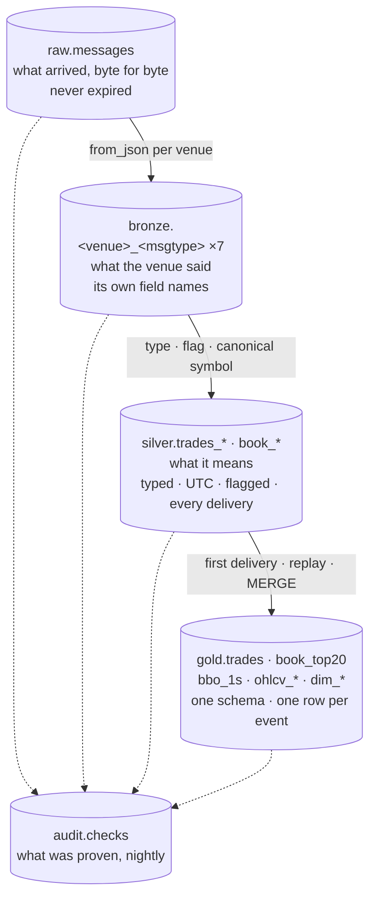

# 09. Lake layers: raw, bronze, silver, gold

> **You will learn** what raw, bronze, silver and gold each hold, the identifier at each layer, and why the boundaries sit where they do.
> **Read this if** you query the lake.
> **Before this** chapter 08.

## Problem

A research archive is asked four questions, and they are not one question asked four ways:

- **What arrived?** The frame off the socket with K2's clock on it: the answer that survives an argument with a venue.
- **What did the venue say?** In its own vocabulary: Kraken's `ord_type`, Binance's
  `buyer_is_maker`, Coinbase's per-level `event_time` ([symbols and venues](02-market-data-concepts.md#symbols-and-venues)).
- **What does it mean?** Typed, UTC, canonical symbol attached, flagged where suspect: a
  replay, a gap, a price 1e-8 cannot hold ([trades and replays](02-market-data-concepts.md#trades-and-replays)).
- **What does research join against?** One schema across venues, one row per logical trade.

One normalised table cannot answer all four. Normalising on write deletes what the venues
differ on, so question two survives only as bytes nobody can query; and one table must claim
"one row per trade" at ingest, before it has the history to know a delivery is a repeat. Phase D
shipped that table and the data disproved the claim twice in a day. The medallion answer is one
question per layer, each proven ([medallion layers](03-data-engineering-concepts.md#medallion-layers)).

## Options

| Option | Why it lost | Reference |
|---|---|---|
| The v2 lake as a JDBC copy of ClickHouse | The system of record was a lossy read of a serving database behind a 7-day TTL: normalisation already applied, two `Array`/`Map` columns the driver could not deserialize, nothing rebuildable from first principles | [ADR-014](../adr/ADR-014-spark-based-iceberg-offload.md), [ADR-018](../adr/ADR-018-v3-lake-first-rust-capture.md) |
| A single unified bronze across venues | Venue-only fields had no column and fell back to raw bytes; its `(exchange, symbol, trade_id)` uniqueness claim failed on a reconnect replay, then on an in-connection re-send, within one day | [ADR-024](../adr/ADR-024-unified-bronze-tables-in-the-lake.md), superseded |
| Three-layer medallion with normalisation at bronze | v2's shape. Bronze is then a typed rendering, not what the venue sent, so no layer answers "what arrived" when a venue disputes a fill | [ADR-009](../adr/ADR-009-medallion-in-clickhouse.md), [ADR-011](../adr/ADR-011-multi-exchange-bronze-architecture.md) |
| **Four layers: raw, bronze per venue, silver per venue, gold canonical** | **Chosen.** One question per layer; the layer that promises uniqueness is the layer that can prove it | [ADR-026](../adr/ADR-026-four-layer-lake-and-gold-served-from-clickhouse.md) |

## Decision

**We split the lake into four layers because each of the four questions needs a different
contract, and a layer that cannot keep its promise should not make it.**

Iceberg tables on a Lakekeeper REST catalog over MinIO, Parquet + zstd. Each layer is derived
only from the one above it and rebuilt from `raw.messages` on demand
([rebuildability](03-data-engineering-concepts.md#rebuildability)), so every layer below raw is a
cached answer, never an original. The boundary between two layers is where a question gets
answered: normalisation waits for silver, dedup waits for gold. Columns: [schema-design.md](13-schema-design.md);
partitioning: [partitioning-strategy.md](14-partitioning-strategy.md); rows: [lake-ingest.md](08-lake-ingest.md).

## How it works

| Layer | Question it answers | Identifier | Kept because |
|---|---|---|---|
| `raw` | what did K2 receive, byte for byte, and when | `(topic, partition, offset)`; `(conn_id, conn_msg_seq)` | regulatory-grade record; every other layer is a function of it |
| `bronze` | what did the venue say, in its own vocabulary | lineage to the raw row | a field the venue sent is never normalised away before it can be inspected; schema drift is detectable per venue |
| `silver` | what does it mean, and can it be trusted | lineage to bronze; flags `venue_replay`, `seq_gap`, `precision_loss` (trades), `checksum_ok` (books) | forensics: every delivery, including replays, with the reason it is suspect |
| `gold` | what does research join against | `(exchange, canonical_symbol, trade_id)`, unique here and nowhere below | one schema across venues; dedup happens once, where the audit proves it |

Each layer reads its parent by Iceberg snapshot id ([snapshots](03-data-engineering-concepts.md#iceberg-snapshots)); venue fields arrive as added nullable columns only ([schema evolution](03-data-engineering-concepts.md#schema-evolution)).

**Why uniqueness lives in gold.** The Phase D unified bronze declared `(exchange, symbol,
trade_id)` unique and the data disproved it twice in a day (reconnect replay, then
in-connection re-send). Below gold the only honest identifier is *lineage*, the pointer from a
derived row back to the archived record that produced it
([lineage and identifiers](03-data-engineering-concepts.md#lineage-and-identifiers)); gold is
where "one logical trade" is *made* true, and the `duplicate_identifiers` audit on `gold.trades` is what proves it
([audits as tests](03-data-engineering-concepts.md#audits-as-tests)).

### Storage choices

- **Partitions.** `raw` by `days(kafka_ts), topic`, time first so a replay lands in one
  partition; `bronze` and `silver.book_*` by `days(recv_ts)`, the one clock every frame carries;
  `silver.trades_*` by `days(exchange_ts)`; `gold.trades` by `exchange, days(exchange_ts)`;
  `ohlcv_{1m,5m,1h}` by `exchange, months(window_start)` and `ohlcv_1d` by `exchange`;
  `book_top20` and `bbo_1s` by `exchange, days(second)`
  ([pruning](03-data-engineering-concepts.md#partitioning-and-pruning)).
- **Files.** `write.distribution-mode = hash`, targets 256 MB (raw) / 128 MB (derived),
  copy-on-write (a change rewrites the file, no delete files). Nightly binpack (merge small
  files) on raw and a sort-rewrite of the last two days of every
  derived table (bronze, silver, gold trades, book_top20, bbo_1s)
  ([compaction](03-data-engineering-concepts.md#files-and-compaction)).
- **Column metrics.** Off by default (`write.metadata.metrics.default = none`); on for the
  columns range scans use (`offset`, `kafka_ts`, `partition`, `symbol`, `recv_ts`,
  `src_offset`). Manifests stay small; the queries that matter still prune.
- **Book replay.** Silver books are built by replaying every archived delta per connection
  (`book.py`, pure) with the Kraken CRC32 re-verified ([order books](02-market-data-concepts.md#order-books),
  [checksums](02-market-data-concepts.md#checksums)); `gold.book_top20`
  is sampled at the end of each second from the same pass and `gold.bbo_1s` is a projection of it ([top of book](02-market-data-concepts.md#top-of-book-sampling));
  `gold.book_state` carries the book across runs.
- **Sizes, 2026-08-27.** Per-venue bronze stores at 0.59× the raw archive; the lake grows
  ≈ 9.8 GB/day; runway on this host ≈ 60 days
  ([benchmarks](../benchmarks/2026-08-27.md#lake), [capacity-model.md](15-capacity-model.md)).
  The benchmark rebuild covered the six tables that existed on 2026-08-27;
  `bronze.kraken_instrument` was added later.

## Practices

| Practice | Where it is enforced |
|---|---|
| Immutable record at the bottom | `raw.messages` never expired; `offset_continuity` audit; `LakeOffsetGap` alert |
| Schema per venue, drift detected | `bronze_schema_drift` audit fails on undeclared keys; `spark.sql.caseSensitive = true` |
| Every delivery kept with a reason | silver flags computed against a 1-day lookback; `silver_flags` reported nightly |
| Dedup once, proven | `duplicate_identifiers` audit on `gold.trades`: count == distinct `(exchange, canonical_symbol, trade_id)` |
| Products carry provenance | `src_snapshot_id` on every `ohlcv_*` / `bbo_1s` row; parity pinned to a snapshot in `tests/parity/pinned.json` |
| DDL is the contract | [`docker/lake/ddl/lake.sql`](../../docker/lake/ddl/lake.sql) applied by the `lake-ddl` one-shot; `tests/test_lake_bronze.py` |
| Add-nullable-only evolution | schema changes move Avro + lake DDL + ClickHouse DDL + projections together (`/schema-change`) |
| Rebuild is a command, timed | `make lake-rebuild LAYER=…`; times in the benchmark |

## Trade-offs

- **Four copies of a trade** (raw, bronze, silver, gold). Disk is the price of answering
  "what arrived" and "what does it mean" separately; on one host that sets the runway.
- **Cross-venue queries start at gold.** Silver keeps venue vocabulary on purpose; a
  research question that needs a silver-only field routinely is the trigger to promote it.
- **No security master yet.** `canonical_symbol` comes from `config/instruments.yaml`; a
  cross-venue instrument dimension is designed and deferred ([data-strategy.md](12-data-strategy.md)).

## Key points

- Below gold the identifier is lineage. Only gold claims one row per logical trade, because only gold can prove it.
- Bronze and silver stay per venue so nothing a venue sent is normalised away; the cost is that cross-venue work starts at gold.
- `raw.messages` is never expired, so every layer below it is a cached answer `make lake-rebuild` recomputes.
