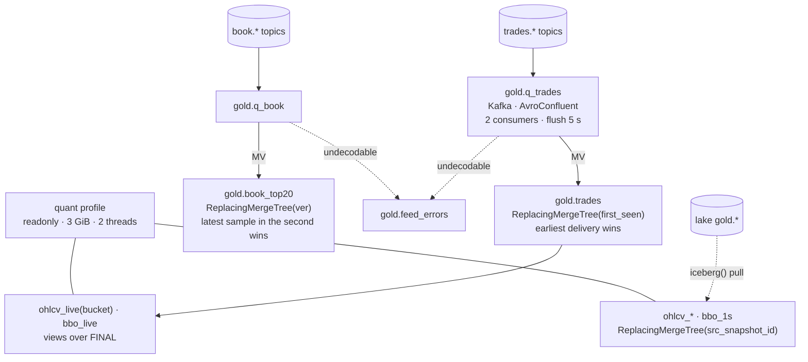

# 10. ClickHouse `gold`: the served tier

> **You will learn** the served tier: dedup as a merge-tree key, candles on read, reload from the lake.
> **Read this if** dashboard and notebook authors, anyone tuning ClickHouse.
> **Before this** chapter 09.

## Problem

The lake answers any question correctly and none quickly: a 5-minute batch ingest and
Parquet range scans are the wrong shape for a Grafana panel. A served tier has to be fast;
correct while the same row arrives twice, because venues replay (re-sending trades already
sent: [trades and replays](02-market-data-concepts.md#trades-and-replays)) and a reload
overlaps the topic head; and disposable, that is *rebuildable*, every row existing upstream
so it is dropped and reloaded rather than restored ([rebuildability](03-data-engineering-concepts.md#rebuildability)).

v2 got all three wrong, readably so in the archived DDL. Its OHLCV candles
([open/high/low/close/volume per bucket](02-market-data-concepts.md#ohlcv-candles)) were
materialised into `SummingMergeTree` tables whose open and close were resolved by
`argMin`/`argMax` *within each insert block*
([`legacy/v2-clickhouse/01-k2-schema.sql:179`](../../legacy/v2-clickhouse/01-k2-schema.sql)):
a minute arriving in two blocks kept whichever open survived the merge, a wrong number that
looks right. Bronze was plain `MergeTree`, no key, no version (`:89`), so re-consuming a
topic duplicated every row: not *[idempotent](03-data-engineering-concepts.md#idempotency)*.
And the lake was filled *from* ClickHouse over JDBC, so the permanent record inherited a
serving database's TTL and its driver's type support.

## Options

| Option | Why it lost | Reference |
|---|---|---|
| ClickHouse as the system of record, medallion of cascading MVs inside it | The archive inherits the serving DB's TTL, normalisation and JDBC type support; `Array`/`Map` columns were dropped at that boundary; one lost volume is lost data | [ADR-009](../adr/ADR-009-medallion-in-clickhouse.md), [ADR-003](../adr/ADR-003-clickhouse-warm-storage.md); both superseded in part by [ADR-025](../adr/ADR-025-clickhouse-derived-hot-tier.md)/[026](../adr/ADR-026-four-layer-lake-and-gold-served-from-clickhouse.md) |
| Derived hot tier holding 7 days, TTL beyond that | Right direction, wrong window: gold is ≈ 0.5 GB/day compressed, so a TTL buys little disk and puts the record question back on the lake for every historical backtest | [ADR-025](../adr/ADR-025-clickhouse-derived-hot-tier.md) as first written; TTL clause dropped by [ADR-026](../adr/ADR-026-four-layer-lake-and-gold-served-from-clickhouse.md) |
| Materialise OHLCV here, as v2 did | Per-block open/close is wrong under any late or replayed trade, and a candle computed in two places is two answers; the lake already computes them once | [ADR-009](../adr/ADR-009-medallion-in-clickhouse.md) Outcome, `01-k2-schema.sql:179` |
| DuckDB over the lake only, no serving database | One storage layer and one truth, but it loses sub-second dashboards over the last hour, continuous ingest and concurrent readers; the freshest lake row is up to 5 minutes old | [ADR-025](../adr/ADR-025-clickhouse-derived-hot-tier.md) *Alternatives* |
| **ClickHouse gold derived from the lake, candles on read (chosen)** | Freshness from the topics, correctness and history from the lake, dedup as a merge-tree key rather than a job; the tier originates nothing, so it can be dropped | [ADR-026](../adr/ADR-026-four-layer-lake-and-gold-served-from-clickhouse.md) |

## Decision

**We serve `gold`, and only `gold`, from ClickHouse 24.3 LTS with no TTL, fed live from the
Avro topics for freshness and reloaded from the lake for correctness, deduplicated by
`ReplacingMergeTree` keys with live candles computed on read, because a tier that
originates nothing can be stale but cannot be lossy or wrong.**

The lake wins on conflict: a pull from it is the source of truth, the topics only a head
start. DDL: [`docker/clickhouse/ddl/`](../../docker/clickhouse/README.md).

## How it works

- **Two feeds, one contract.** `20-gold-kafka.sql` creates the Kafka engine tables and the
  materialized views that route into the tables `10-gold-tables.sql` defines. The contract
  file is applied alone in CI; the feeds need a broker.
- **Dedup is a merge-tree key, not a job.** `gold.trades` is `ReplacingMergeTree(first_seen)`
  ordered by `(exchange, canonical_symbol, exchange_ts, trade_id)`; `first_seen` is
  `UInt64max − recv_ts_ns`, so the row that survives a merge is the *earliest* delivery. A
  venue replay, a consumer restart, or a lake reload that overlaps the topic head all
  collapse to one row under `FINAL` (ClickHouse's read-time merge, which applies the
  `ReplacingMergeTree` rule before returning rows).
- **Candles on read.** `ohlcv_live(bucket)` is a parameterised view: `argMin`/`argMax` over
  `FINAL` with the total order `(exchange_ts, recv_ts_ns, trade_id)` (lake gold uses `trade_seq`) so open and close are
  deterministic. v2's `SummingMergeTree` candles resolved open/close per insert block;
  `scripts/clickhouse-schema-test.sh` inserts one minute in two blocks and asserts the open.
- **History by pull.** `ohlcv_*` and `bbo_1s` (per-second best bid/offer with spread,
  imbalance and microprice: [BBO and book features](02-market-data-concepts.md#bbo-and-book-features))
  are loaded from lake gold through the `iceberg()` table function, with the
  [Iceberg snapshot](03-data-engineering-concepts.md#iceberg-snapshots) they were read from
  recorded in `src_snapshot_id`; 10.4 M trades in 4.4 s
  ([runbook](../runbooks/clickhouse-rebuild-from-lake.md)). Never computed here.
- **Errors are rows.** `kafka_handle_error_mode = 'stream'` sends an undecodable record to
  `gold.feed_errors` with its bytes; the partition keeps moving.
  `kafka_skip_broken_messages` does not cover a registry miss (schema id 0), stream mode does.
- **Fixed point on disk, decimals on read.** `price_e8 Int64` is stored (an integer count of
  1e-8 units, [fixed-point numbers](02-market-data-concepts.md#fixed-point-numbers));
  `price Decimal(38,10)` is an `ALIAS`, so storage stays 8 bytes and arithmetic stays exact.
- **Limits.** Container 4 CPU / 8 GiB; `max_server_memory_usage` 6.5 GiB; `background_pool_size` 8
  with the two merge-tree floors lowered to match; the `quant` profile is `readonly`,
  3 GiB, 2 threads, `max_execution_time` 300 s, `do_not_merge_across_partitions_select_final`.

## Practices

| Practice | Where it is enforced |
|---|---|
| Schema is a tested contract | `make test-clickhouse` (CI `clickhouse` job): 9 assertions incl. the two-block OHLCV regression |
| Idempotent ingestion | `ReplacingMergeTree` keys on the logical trade; `FINAL` count == distinct count asserted |
| Deterministic aggregates | total order in `ohlcv_live`; three-way parity `make parity-ohlcv` at a pinned snapshot, 0 differ |
| Poison records isolated | `kafka_handle_error_mode='stream'` → `feed_errors`; `ClickHouseKafkaMessagesFailed` alert; chaos `clickhouse-corrupt-record.sh` (4 s) |
| Least privilege | `quant` readonly profile in `users.xml`; notebooks and `make parity-ohlcv` use it |
| Memory bounded below the container | `config.xml` server cap 6.5 GiB under an 8 GiB limit |
| Rebuildable, timed | `clickhouse-rebuild-from-lake.md` with the command and the measured time |
| Feed liveness alerted | `ClickHouseGoldFeedStale` (topics moving, tables not); `clickhouse-stop.sh`: `ClickHouseDown` at 160 s under a 150 s stop, healthy 7 s after restart |

## Trade-offs

- **`FINAL` on every live read.** Correctness costs a merge at query time; the pulled
  product tables avoid it for history.
- **24.3 cannot speak REST.** The lake pull is by metadata path and needs
  `write.metadata.compression-codec=none` on the source tables plus
  `iceberg_engine_ignore_schema_evolution=1`.
- **Two numeric truths.** Bit-exact numbers come from the lake; the book features here are `Float64` ratios ([ADR-027](../adr/ADR-027-book-snapshot-and-sequencing.md)).
- **No TTL.** Gold grows with the archive; the revisit trigger is 80 % of the data volume
  or > 1 GB/day growth ([data-strategy.md](12-data-strategy.md)).

## Key points

- The tier originates nothing, so losing it is a timed reload, not an incident.
- Dedup is a schema property, not a job: the `ReplacingMergeTree` key defines one trade.
- Live candles on read, historical candles pulled: the same arithmetic in one place.
- The `quant` profile (readonly, 3 GiB, 2 threads) is why a backtest cannot evict the ingest.
