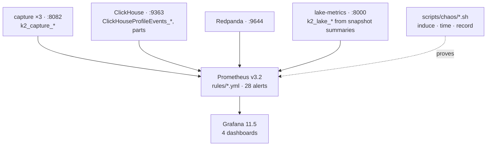

# 11. Observability

> **You will learn** what is measured, which rules watch it, and how each failure mode was proven.
> **Read this if** operators, anyone adding an alert.
> **Before this** chapter 04.

Prometheus scrapes every tier, 28 rules carry runbooks and `promtool` cases, four Grafana
dashboards ship from the repo, and the failure modes those rules watch are induced on purpose
with timed recovery. No Alertmanager: rules are evaluated and shown, not routed. Operator
detail: [operations/observability.md](../operations/observability.md); FMEA:
[failure-modes.md](16-failure-modes.md).

## Problem

"Is the platform healthy" is four questions, and a capture-to-lake pipeline fails each alone.

- **Staleness.** Did a venue stop sending? A stream quiet at 03:00 UTC on a thin pair looks
  exactly like a dead socket, until you ask *when* the last message arrived.
- **Loss.** Gaps, checksum failures and a full produce queue are all
  [backpressure and loss](03-data-engineering-concepts.md#backpressure-and-loss): a bounded
  buffer filling faster than it drains, so it must drop or block, surfacing away from source.
- **Lag.** [Latency](02-market-data-concepts.md#latency-and-what-it-means) here is exchange
  timestamp to our receipt, then receipt to committed lake snapshot, per tier.
- **Correctness.** [Completeness](02-market-data-concepts.md#completeness), every message
  present exactly once and in order, is checked by
  [audits as tests](03-data-engineering-concepts.md#audits-as-tests), not by a dashboard.

The trap is rate-based alerting. `rate(messages_total[5m]) == 0` reads as "nothing is arriving",
but a counter that stops incrementing yields zero for five minutes and then a series that never
changes, and if the process exits the series vanishes and the expression matches nothing:
loudest while the thing dies, silent once dead. `time() - gauge` on a timestamp inverts that,
growing without bound whether the exporter is up, frozen, or gone.

## Options

| Option | Why it lost | Reference |
|---|---|---|
| Alert on rates going to zero | Silent exactly when the fault is total: a stopped process takes its series with it, and `absent()` per stream per venue is more rules than gauges | [`rules/capture-alerts.yml`](../../docker/prometheus/rules/capture-alerts.yml) |
| Hosted APM / SaaS | Per-series billing against a three-venue book feed, egress off a single host, and a demo that expires with the trial; the 16 CPU / 40 GB budget is a stated constraint | [ADR-010](../adr/ADR-010-resource-budget.md) |
| Alertmanager routing now | One operator, no rotation, nowhere to page. Routing config that nobody is on the other end of is untested config | `alerting.alertmanagers[].targets: []` in [`prometheus.yml`](../../docker/prometheus/prometheus.yml) |
| **Alert rules as code, each with a runbook and a unit test, proven by chaos** (chosen) | Every rule is reviewable in a diff, its threshold is asserted by `promtool`, and the fault it names has been injected and timed | [`rules/`](../../docker/prometheus/rules/), [`scripts/chaos/`](../../scripts/chaos/), [failure-modes.md](16-failure-modes.md) |

## Decision

**We treat alert rules as code with a runbook and a unit test, and prove them by injecting
the fault, because an alert nobody has seen fire is a guess.** Thresholds are asserted by
`promtool test rules` in CI, so a threshold change that breaks the semantics fails the build
rather than the next incident, and every "age" is a timestamp aged in PromQL so a dead exporter
reads as a growing age, not a missing series. The claim is narrow: these faults were injected
and measured on the dates in `scripts/chaos/results/`, not nightly.

## How it works

- **Capture** exports counters per venue and stream (`messages`, `bytes`, `gaps`,
  `checksum_failures`, `resyncs`, `reconnects{reason}`, `produce_errors{reason}`,
  `precision_loss`), the `exchange_to_recv_seconds` histogram with buckets to 30 s, and
  `last_message_ts_seconds` per stream so staleness is `time() − gauge`, not a rate.
- **Lake** metrics come from Iceberg snapshot summaries, read over the catalog's REST API
  with `urllib` (`metrics.py`; PyIceberg's `PyArrowFileIO` costs 122 MB of RSS on import
  alone, against a 128 MB container limit): last commit timestamp, `max_kafka_ts`, backlog offsets, last compaction, rows / files / bytes
  per table. If the catalog is down the gauge freezes and the age grows: the alert you want.
- **ClickHouse** ships its own `/metrics`; the two gold-feed rules watch
  `ClickHouseProfileEvents_KafkaMessagesFailed` and topic movement versus table growth.
- **Rules** are three files by tier, 10 capture, 12 lake, 6 ClickHouse, each with a severity
  and (bar one ClickHouse rule) a `for`. The 22 capture and lake rules carry a `runbook`
  annotation that gate (d) of `check-docs.sh` resolves to a file; unit tests sit in
  `docker/prometheus/tests/*.test.yml` and `rules/tests/*_test.yml`, both run by gate (c2).
  Prometheus loads rules at start or `SIGHUP`, so the docs say so.
- **Dashboards** are JSON in `docker/grafana/dashboards/`: pipeline overview, capture, lake,
  ClickHouse. All four query Prometheus; no ClickHouse datasource is provisioned. Notebooks
  and `make parity-ohlcv` use the read-only `quant` user.
- **Chaos** scripts in `scripts/chaos/` stop or corrupt one thing, watch the alert that should
  fire, time recovery, and append a row to `scripts/chaos/results/`. Measured: lake ingest
  killed 42 s, MinIO stopped 38 s, Lakekeeper stopped 37 s
  ([benchmarks § MTTR](../benchmarks/2026-08-27.md#mttr)); ClickHouse stopped for 150 s,
  `ClickHouseDown` at 160 s and healthy 7 s after restart, corrupt feed record isolated in
  4 s ([`scripts/chaos/results/2026-08-27.tsv`](../../scripts/chaos/results/2026-08-27.tsv)).

## Practices

| Practice | Where it is enforced |
|---|---|
| Alerts carry their runbook | 28 of 28, as a `runbook` annotation. Two gates, because one was not enough: `check-docs.sh` (d) checks the paths present resolve, (d2) checks every `- alert:` has one at all. Until 2026-09-03 only (d) existed and the 6 ClickHouse rules carried no annotation — passing a gate by having nothing to check, while this row claimed 22 of 28 were covered |
| Alert thresholds unit-tested | 17 of 28 alert names asserted in `tests/*.test.yml` and `rules/tests/*_test.yml`, run by `promtool` in `check-docs.sh` and CI `docs` |
| Staleness as timestamp, not rate | `k2_capture_last_message_ts_seconds`, `k2_lake_last_commit_ts_seconds`; `CaptureFeedStale`, `LakeCommitAgeHigh` |
| Counters carry the reason | `reconnects_total{reason}`, `produce_errors_total{reason}` |
| Build provenance exported | `k2_capture_build_info{git_sha}` |
| Alerts proven against the fault they name | `make chaos`; each `16-failure-modes.md` row cites the script and the measured time |
| Dashboards versioned | provisioned from JSON in the repo, not hand-edited in the UI |
| Least-privilege reads | notebooks and `make parity-ohlcv` use the `quant` readonly profile |

## Trade-offs

- **No routing.** Alerts show in Prometheus and Grafana, not paged: deliberate for one operator.
- **No SLOs.** Thresholds are per-alert `for` windows sized from measurement, not error
  budgets; the burn-in that would justify SLOs is a Phase F item.
- **Scrape gaps during chaos** are part of the record: a stopped ClickHouse shows as `up == 0`
  and the FMEA rows state what was lost versus delayed.
- **Coverage is not uniform.** 17 of the 28 alerts are named by a `promtool` case, and the six
  ClickHouse rules predate the `runbook` annotation, naming it in the description instead.

## Key points

- Health is four questions, not one: staleness, loss, lag, correctness.
- Export timestamps and age them in PromQL. A rate to zero is quietest when the fault is worst.
- A rule with a runbook and a `promtool` case is reviewable; one without is never noticed.
- Chaos turns the FMEA recovery column into dated measurements; paging stays a stated omission.
