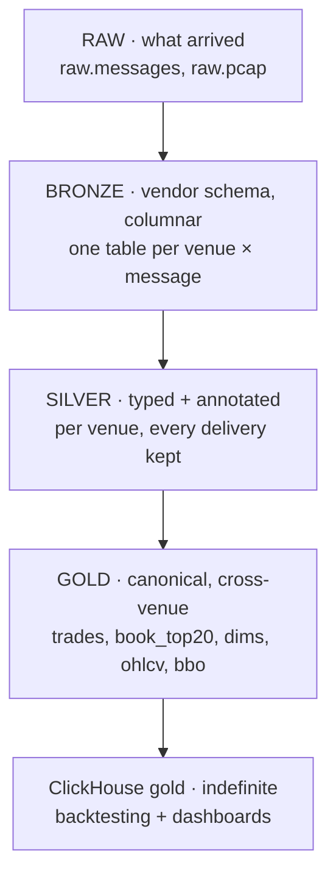

# 12. Data strategy: layers, serving, retention

> **You will learn** why four lake layers, what ClickHouse keeps and for how long, retention against the disk.
> **Read this if** architects, anyone proposing a new table or tier.
> **Before this** chapter 09, 10.

Decided with the maintainer on 2026-08-27, after the first day of running Phase D. This page
is the *strategy*: which data lives where, why, and what each tier is for. The mechanics are
in [schema-design.md](13-schema-design.md) (contracts), [partitioning-strategy.md](14-partitioning-strategy.md)
(layout) and the ADRs it cites. Phase E implements it; until then the running stack is the
Phase D shape ([ADR-024](../adr/ADR-024-unified-bronze-tables-in-the-lake.md)) and this page
says so where it differs.

**Frame.** This repository is a single-host, production-quality *demonstration* of the
design. Every mechanism is real and measured; the host is not. The same layers map onto a
cloud deployment with horizontal and vertical scaling per tier, that mapping is
[scale-out-path.md](17-scale-out-path.md), *designed, not exercised*. Numbers on this page are
from this host, with their commands.

## The layers

| Layer | Contract | Lives in | Retention | Who reads it |
|---|---|---|---|---|
| **Raw** | the frame as received: bytes verbatim, `recv_ts_ns`, `conn_id`/`conn_msg_seq`, Kafka lineage; later the pcap beside it | Iceberg (`raw.*`) | forever | replay, regulatory "what did you receive", forensics |
| **Bronze** | the venue's own schema, columnar: one table per venue × message type, field names and types as sent, no renaming | Iceberg (`bronze.*`) | forever | anyone who needs the venue's semantics untouched |
| **Silver** | bronze, typed and annotated: fixed-point, UTC, canonical symbol *added* beside the native one, flags `checksum_ok` / `venue_replay` / `seq_gap` / `precision_loss`, lineage to the bronze row; every delivery kept | Iceberg (`silver.*`) | forever | investigations, per-venue research, gold's source |
| **Gold** | canonical model: one schema, one row per logical trade, cross-venue in one query; reference dims; materialised products `ohlcv_{1m,5m,1h,1d}`, `bbo_1s` | Iceberg (`gold.*`) **and** ClickHouse (`gold.*`) | forever in both | backtesting, dashboards, notebooks |

Rules that keep it explainable:

- **Each layer is derived only from the one above it.** A bug anywhere is fixed by rebuilding
  from raw. Lineage columns point exactly one layer up.
- **The lake builds bronze → gold from raw, in Spark.** The Rust capture also publishes typed
  `Trade` / `BookSnapshotL2` Avro to the bus, that is the *transport* contract for the hot
  path, not a lake layer. The lake never depends on the capture's parser being right.
- **Dedup happens in gold, not silver.** Silver is evidence (Coinbase re-sends trades, measured
  5,034 times in a day, [ADR-024 amendment](../adr/ADR-024-unified-bronze-tables-in-the-lake.md));
  gold is truth. `venue_replay` stays a number the audit reports.
- **Audits per layer**: raw, offset continuity; bronze and silver, row parity with raw per
  venue and message type; gold, one-row-per-trade and parity with silver.
- **Vendor fields are never dropped.** They are bronze columns; silver keeps them; gold carries
  what is common and links back.

## Serving: ClickHouse holds gold, indefinitely

Decided as a hybrid, and the reasons are the trade-offs, not a preference:

| | ClickHouse gold, no TTL *(chosen)* | + silver in ClickHouse *(rejected)* | Lake + DuckDB only *(rejected as the serving tier)* |
|---|---|---|---|
| Backtesting | `ASOF JOIN`, sparse index on `(exchange, symbol, ts)`, vectorised; gold is already one row per trade so **no `FINAL`** on the hot path | silver keeps replays → dedup on read (`FINAL`) on every wide range | DuckDB has `ASOF` too; one process per notebook, no server; fine for one analyst |
| Concurrency | analysts + Grafana on one server, `quant` readonly profile with memory/thread quotas | as left | none shared, and no shared cache either |
| Storage/day at measured rates¹ | ≈ 0.5 GB/day (~180 GB/yr) | ≈ 1–1.4 GB/day (~450 GB/yr) | 0 extra, the lake is the record anyway |
| Rebuild | gold only, from the lake: hours | gold + silver: days | n/a |
| Venue-level questions | from the lake (or `iceberg()` from ClickHouse on demand) | in ClickHouse | in the lake |

¹ 8.6 M trades and 1.5 M book rows on 2026-08-26 (`make lake-verify`, `raw == trades 8,630,658`,
`raw == book 1,484,606`), ClickHouse compression assumed ~10:1 for trades and ~7:1 for the
80-float book rows, a prediction until Phase E measures `system.parts`.

What decides it: **gold is the backtest surface by definition** (canonical symbol, one row per
trade, BBO at 1 s, cross-venue). Silver's job is provenance and venue nuance, it is read when
a result looks wrong, not in every backtest. Keeping it lake-only halves the ClickHouse
footprint and the rebuild time. If a backtest needs a silver-level field routinely, that is the
signal to promote the field into gold, not to copy silver into ClickHouse.

Serving-load isolation on this host: backtests run under a `quant` profile (readonly,
`max_memory_usage` ≈ 3 GiB, `max_threads` 2) so a six-month scan cannot evict the ingest.
One heavy backtest at a time is the honest capacity of a 4 CPU / 8 GiB ClickHouse; what
changes on a bigger box is in [scale-out-path.md](17-scale-out-path.md).

## Retention and the disk

"Indefinite" is a policy; the disk is a fact. This host has 961 GB, **79 % used on
2026-08-26** (`df -h /`). At the predicted ~10 GB/day for four lake layers plus ~0.5 GB/day
in ClickHouse, the free space is roughly two months. Before Phase E lands:

- a larger volume for `/var/lib/docker` (or MinIO and ClickHouse data on their own disk), and
- the disk gauges on both tiers: `k2_lake_disk_used_ratio` (exists; blind on Docker Desktop , 
  [capacity-model.md](15-capacity-model.md)) and a ClickHouse `system.parts` bytes gauge (Phase E).

**Revisit when** either gauge crosses 80 %, or the measured ClickHouse gold growth exceeds
1 GB/day for a week, then either the box grows or the hot window gets a TTL again, and the
ADR records which.

## Raw pcap: the phase after E

For the regulatory/replay claim to hold *at the wire*, not only at the WebSocket frame: a
`dumpcap` sidecar per capture container writing pcapng with kernel timestamps, hourly ring
rotated into `raw.pcap`; the Rust capture exports its TLS key log behind an env flag, keys
encrypted at rest; and one script that decrypts a window, extracts the WS frames and diffs
them against `raw.messages`. The demonstration is two numbers per frame, kernel receive time
and user-space receive time, and a zero-length diff. Designed in the Phase E ADR, built
after it.

## What this is not

Not a trading path: public WebSocket feeds over the internet, one host, no HA. The layers
above are about **fidelity and reproducibility**, which is what quant research and
regulatory replay need; latency is measured and reported, never optimised for
([positioning.md](01-what-k2-is.md)).

## Deferred to v3.1: a security master

Decided 2026-08-27 with the maintainer. `config/instruments.yaml`, `(exchange, native)
→ canonical BASE/QUOTE`, materialised as `gold.dim_instrument` / `gold.dim_venue`, is
the security master v3 has, and `canonical_symbol` is the only cross-venue key silver and
gold carry. `BTC/USDT` and `BTC/USD` stay different instruments on purpose. What a full
security master adds, and the trigger that makes each worth building:

| Piece | Adds | Build when |
|---|---|---|
| stable surrogate `instrument_id` | identity that survives a venue rename (Kraken XBT→BTC), a delisting, symbol reuse | the first rename or delisting in the registry, or a fourth venue |
| `dim_asset` | asset codes with venue aliases and decimals | two venues disagree on an asset code the yaml cannot express |
| attributes with validity (SCD2: tick, lot, precision, status, listed/delisted) | as-of joins for queue-position and fee features; `bronze.kraken_instrument` already holds Kraken's | a gold product needs tick or lot size, or derivatives arrive (symbol ≠ instrument) |
| exposure families | "BTC spot against a USD-like quote" across venues, with the stablecoin basis explicit | the first cross-venue research notebook that wants it |

Rule kept from the start so none of this forces a rewrite: silver stays thin, the
native symbol and `canonical_symbol` (later `instrument_id`), nothing else joined in.
Attributes are dimensions joined at query time; an attribute change never rewrites a
10 M-row table.
