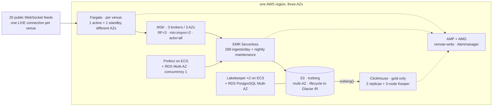

# 17. Scale-out path: single host to AWS, highly available and fault tolerant

> **You will learn** how each tier becomes highly available on AWS, what it costs, and what breaks.
> **Read this if** architects; readers asking 'what would change at 200×, and what would it cost'.
> **Before this** chapters 04, 12, 16.

> **Designed, not exercised.** Nothing on this page has been deployed, benchmarked or
> costed against a real AWS account. There is no account and the cloud deployment is
> explicitly out of scope
> ([Q9](../research/2026-08-26-v3-requirements-clarification.md#q9--scale-target)). This
> is a design document whose purpose is to keep the single-host implementation honest:
> every claim below is a claim about *this repository's code*, which can be checked, not
> about AWS behaviour, which cannot be checked from here. Where a claim is about AWS or a
> vendor, it carries a URL and the date it was fetched, and where it is a chosen number
> rather than a measured one, it says **design target**.

Single-host Docker is a **stand-in**, not the design target. This chapter answers two
questions precisely: *if this platform had to hold a petabyte, what would change in the
code?* and *if it had to survive an availability zone, a region, and a component dying
mid-write, what would each tier become and what would it cost?*

The answer to the first is "five environment variables and a Terraform repository", and
the value of writing it down is that it fails loudly whenever a hard-coded endpoint
sneaks in. The answer to the second is more interesting, because **three tiers do not
become highly available by being deployed on a highly available substrate** — and
finding which three is what most of this page is for.

The full working — every option considered per tier, the source for every vendor claim,
the arithmetic behind every dollar — is in
[`2026-08-29-aws-ha-dr.md`](../research/2026-08-29-aws-ha-dr.md). This chapter carries the
conclusions and cites it.

Scope: the v3 tiers as built in Phases B–E. The 16 CPU / 40 GB single-host constraint
([ADR-010](../adr/ADR-010-resource-budget.md)) is a *deliberate* constraint of the
project, not a ceiling on the architecture: ADR-018's non-goal list keeps *no HA on this
host*, which is a different sentence from *cannot scale*.

---

## 1. What can fail, and what a redundant deployment does about it

Chapter 16's FMEA covers the single host as built, with **measured** detection and
recovery times. This table is the other axis — the same components, asked what a
redundant AWS deployment would do about them. None of these numbers are measured, which
is why chapter 16 remains the authority on anything with a stopwatch attached.

| # | What fails | Blast radius today (single host) | Mitigation on AWS | Residual risk |
|---|---|---|---|---|
| F1 | **Availability zone** | not representable: one host. Everything stops; the lake and ClickHouse survive on disk; live frames are lost for the outage | every tier across ≥ 2 AZs — capture tasks in different AZs, MSK 3 brokers / 3 AZs, RDS Multi-AZ. S3 is already multi-AZ within a region | the platform's **single-writer** assumptions do not become multi-AZ by being deployed multi-AZ (F5, F7): redundant substrate, single-flighted application |
| F2 | **Broker** | total. One Redpanda, `--smp 1`. Capture's librdkafka queue absorbs ~32 MiB and then drops, and dropped is *lost*, not delayed (ch. 16 blast-radius legend) | MSK, `replication.factor=3`, `min.insync.replicas=2`, rack-aware across 3 AZs. One broker lost is a leader election | **capture's producer must set `acks=all`** or the replication buys nothing. That is a repo code change, not an endpoint swap |
| F3 | **Capture task** | the venue's frames for the outage are lost; the other two venues unaffected. Measured: `CaptureDown` fires **119 s** after SIGKILL, recovery **3 s** (ch. 16) | §2 — the one tier where HA is a *design* question, because [ADR-019](../adr/ADR-019-rust-capture-tier.md) makes one connection per venue a correctness property | a failover gap is loss: public WebSocket feeds do not replay and there is no spill to disk. The only question is whether the gap is bounded and recorded |
| F4 | **Catalog database** | Lakekeeper's PostgreSQL down means no commits. The ingest writes its data files, fails to commit, and is a no-op with orphans — [ADR-022](../adr/ADR-022-exactly-once-via-snapshot-offsets.md)'s own table covers it | RDS PostgreSQL Multi-AZ: synchronous replication, failover in ~1–2 min | Lakekeeper must reconnect rather than wedge. **Unverified** — no failover has been exercised anywhere |
| F5 | **Ingest job dies mid-commit** | **already safe, and for an exact reason** — §1.1 | unchanged. Exactly-once is a property of the Iceberg commit, so it does not care what launched the job | **the `flock` does not survive the move.** §1.2. This is the sharpest finding on this page |
| F6 | **ClickHouse node** | the hot tier is gone; nothing is lost. [ADR-025](../adr/ADR-025-clickhouse-derived-hot-tier.md) makes it derived, rebuildable and originating nothing | `ReplicatedMergeTree` × 2+ replicas with a 3-node Keeper ensemble, or ClickHouse Cloud | the RTO is the **rebuild duration**, which is a function of lake size and is unmeasured at 200×. §3's hot-tier row argues that number should be measured before any replica is bought |
| F7 | **Prefect** | no ingest is dispatched; the lake stalls and `LakeIngestFailed` fires. Nothing is lost only while the bus still holds the unread records — and the binding limit is **512 MiB per partition, not 48 h**: measured 2026-08-26, that cap bound at **7.01 h** on `raw.kraken` partition 0, because keyed partitioning concentrates the busiest symbol, and 1,168,954 records were evicted unread (`docker/redpanda/init.sh`) | Prefect Cloud, or server + worker on ECS across AZs with RDS Multi-AZ | `concurrency_limit=1` becomes the **only** mutual exclusion once the `flock` is gone (F5), so a control-plane bug becomes a correctness bug |
| F8 | **S3 regional event** | not representable — MinIO is one container on one disk | nothing single-region can mitigate it. This row is why §7 exists | — |
| F9 | **Region** | not representable | §7: S3 CRR, a catalog in the second region, re-placed capture. **Not** a warm standby — a cold rebuild with a stated RTO | Iceberg's absolute paths make this a *catalog and metadata* problem before it is a storage problem (§7.1) |

**The three rows that a managed service does not fix** — the ones the introduction
promises — are F3, F5/F7 and F6. F3 is a design decision about sequence continuity (§2).
F5 and F7 are a single-writer assumption that a redundant substrate makes *more*
dangerous, not less, because the substrate will happily run two (§1.2). F6's RTO is a
rebuild duration nobody has measured (§3). Everything else in that table is bought.

### 1.1 Why F5 is already safe, precisely

[ADR-022](../adr/ADR-022-exactly-once-via-snapshot-offsets.md) stores the consumed Kafka
offsets **inside the Iceberg snapshot summary of the commit that wrote the rows** —
`snapshot-property.k2.kafka-offsets` — instead of in a separate position store. The
whole class of bug being removed is "two durable stores, no transaction", and removing
it makes a mid-commit death a non-event in both directions:

- **Crash before the commit.** The Parquet files exist and no snapshot references them,
  so no reader ever sees them. The next run reads the same `startingOffsets`, re-reads
  the same records, writes new files and commits. The orphans are reclaimed by
  `remove_orphan_files` with a 24 h floor so it cannot race a live write.
- **Crash after the commit.** Indistinguishable from success — the commit *is* the
  completion signal. Both the rows and the offsets that produced them are in it, because
  an Iceberg commit is atomic and the summary is part of it.

There is no ordering to get right, no `status` column to wedge, and no recovery
procedure for the position store, because there is no position store. The offset is also
the right *type*: it has an exact successor, so run *n*'s `endingOffsets` is run *n+1*'s
`startingOffsets` with no gap and no overlap — a timestamp watermark has neither
property and needs a lateness buffer, which is a choice between duplicates and loss with
no way to detect which you got.

**This is what lets §3 move ingest to EMR Serverless and claim nothing else changes.**

### 1.2 …and the one thing about it that does not survive the move

`docker/lake/lock.py` is 31 lines of stdlib: an exclusive `fcntl.flock` on
`/tmp/k2-lake-ingest.lock`, taken non-blocking by `ingest.py` (exit 2 if held) and
blocking by `maintenance.py` (held for its whole run). On one host with one Spark
container it is exact — two writers are unrepresentable.

**On EMR Serverless each job run is a fresh container with its own `/tmp`, so the
`flock` becomes a no-op across runs.** And ADR-022 measured what that costs: two
identical 5-row appends raised nothing and left 10 rows in two snapshots, because
Iceberg's optimistic-concurrency retry re-applies the loser on the new base — correct
for an append, and fatal for an append that also carries the reader's position.

So the residual risk in F5 is exact: after the move, `concurrency_limit=1` on the Prefect
deployment (`docker/lake/flows/deploy_lake.py:55`) is the only guard, and it covers only
Prefect-launched runs — not the runbooks, the chaos scripts, `make lake-verify`, or an
operator's hand-run during an incident, all of which dispatch directly today. The
replacement is a DynamoDB conditional put with a lease TTL, changing `lock.py` and
nothing else; the [research note §3.2](../research/2026-08-29-aws-ha-dr.md) has the
options that were rejected and why.

**Recording it here means a migration meets this as a known task rather than as an
incident.**

---

## 2. Capture HA: the one tier where HA is a design decision

Every other tier on this page becomes highly available by being bought. Capture cannot,
because ADR-019's first reason is a correctness claim, not a deployment convenience:

> One socket per exchange means one sequence space, one reconnect policy, and one place
> where the book and the trades agree about time.

Both options below were traced against the code. The full trace is in the
[research note §4](../research/2026-08-29-aws-ha-dr.md); the conclusions are here.

**The hook already exists.** Every record carries a `conn_id` — a v4 UUID minted per
connection at `services/capture-rust/src/main.rs:431`, stamped into the trade, book and
raw records (`record.rs`), carried through silver, and used as an identifier field of
`gold.book_state` (`lake.sql:1224`). `conn_msg_seq` counts within it. The archive already
models *which connection said this*, so two live connections per venue are representable
in the schema as it stands. The question is only what the layers above do with them.

### 2.1 Option A — active-active: two tasks per venue, different AZs, both producing

| Layer | With two live connections | Verdict |
|---|---|---|
| `raw.messages` | both connections' frames archived verbatim, each carrying its own `conn_id`. The **verbatim promise is untouched**: it promises the bytes are the venue's bytes, not that there is one copy of each event | safe, at 2× raw bytes |
| Bronze | identifier fields are `src_topic, src_partition, src_offset` — *Kafka* coordinates. Two producers write different offsets for the same venue event, so `duplicate_identifiers` passes | safe by construction |
| Silver trades | `silver.score()` computes `venue_replay` over `Window.partitionBy("symbol", "trade_id")` — **`conn_id` is not in that window** (`silver.py:197`). The second connection's copy is scored `venue_replay = true` **today, with no code change** | already deduplicated, bounded by `LOOKBACK = 1 day` |
| Gold trades | `_project_silver` filters `~venue_replay`; the identifier is `(exchange, canonical_symbol, trade_id)`, asserted nightly | safe, one row per logical trade |
| **Books** | `books.py` repartitions by `(symbol, conn_id)` and the [ADR-027](../adr/ADR-027-book-snapshot-and-sequencing.md) sampler emits one row per second **per connection**, while `gold.book_top20` and `gold.bbo_1s` are keyed `(exchange, canonical_symbol, second)` | **breaks.** Two `conn_id`s produce two rows per symbol-second and the audit fails every run |
| Replay | `scripts/replay_export.py:frames()` refuses a set whose `conn_msg_seq` is not `1..n` unbroken — and the check is **scoped to one `conn_id`**. Two connections are two independent `1..n` sequences | **unaffected**, which is the objection one expects and it does not hold |

So active-active is **free for trades and broken for books**. Making books work needs a
cross-connection winner rule per `(symbol, second)` — lowest `recv_ts_ns`, or
`checksum_ok`, or no `seq_gap`, all of them judgements — in the layer whose own docstring
says gold is "a projection of silver, not a second deduplication with its own rules". It
also doubles `raw.messages` forever: 12.94 GB/day at 1×, 2.59 TB/day at 200×, on the only
line of the cost sheet that rises monotonically.

### 2.2 Option B — active-passive with health-check failover

One live connection per venue, a standby in another AZ, promotion on health-check
failure. The cost is a gap of N seconds, and the gap is loss.

| Component of N | Estimate | Basis |
|---|---|---|
| detection | 15–120 s | **measured 119 s** for `CaptureDown` at `for: 2m` (ch. 16). A task-level health check at 3 × 10 s would be ~30 s — **design target** |
| task start + WS connect | 3–10 s | **measured 3 s** to a scrapeable target with fresh frames (ch. 16) |
| subscribe + book resync | seconds to tens of seconds | venue-dependent; Kraken awaits its resync snapshot after a checksum mismatch |

**~35–60 s on a tuned health check, ~2 min on the alert path as configured today.** And
it is *recorded, not silent*: the promoted task mints a new `conn_id` and starts at
`conn_msg_seq = 1`, so the archive shows a connection boundary rather than a continuous
stream with a hole in it, and silver's `seq_gap` / `missing_before` flags score the
venue-sequence discontinuity across the seam.

### 2.3 The recommendation

**Active-passive.** Active-active is free for trades and broken for books, and books are
the harder half of the platform: trades deduplicate today with no code change because
`venue_replay` is scored per `(symbol, trade_id)` with no `conn_id` in the window, while
books cannot, because the 1 Hz sampler is per-connection by construction and the canonical
book tables are keyed by second. Buying an avoided ~40 s gap with a cross-connection
winner rule in gold means paying in the platform's most load-bearing invariant for a
loss that is already bounded, recorded and alertable.

**ADR-019 needs no change to adopt this.** Its wording is "one socket per exchange", and
under active-passive exactly one socket is live at any instant — the standby holds no
connection. The ADR is already satisfied.

**If Option A were ever taken, ADR-019 would need an appended `Outcome`** recording that
"one socket per exchange" becomes *one **authoritative** socket per exchange at a time*;
that the authority is decided per `(symbol, second)` in gold and the rule is named there;
and that "one place where the book and the trades agree about time" becomes a chosen
place rather than a structural one. That is a materially weaker property — which is the
argument against Option A, stated in the ADR's own terms.

**Revisit when:** a measured failover gap exceeds 60 s, or a venue's reconnect and resync
exceed it on their own.

---

## 3. Per tier: managed or self-managed, and why

The tiebreak used throughout: *a single maintainer does not run a consensus system he did
not have to run.* Every option considered, with its pros and cons, is in the
[research note §5](../research/2026-08-29-aws-ha-dr.md); the picks and their one-line
reasons are here.

| Tier | Pick | HA mechanism | Why this one | What the repo changes |
|---|---|---|---|---|
| **Capture** | **ECS Fargate**, 1 active + 1 standby per venue in different AZs | ECS restarts a failed task in a healthy AZ; §2's promotion | three long-lived single-threaded processes with no local state. Everything EKS offers beyond "keep one running, in some AZ" is unused | `K2_BROKERS`, `K2_SCHEMA_REGISTRY_URL` — both already env-driven. **Plus `acks=all` on the producer**, which is real code |
| **Bus** | **MSK provisioned**, 3 brokers / 3 AZs | `replication.factor=3`, `min.insync.replicas=2`, rack-aware | the only option that is both multi-AZ by configuration and **publicly costable** — Redpanda Cloud is quote-based (§8). Kafka-protocol compatibility means neither the producer nor Spark notices the engine changed | `K2_BROKERS`, SASL/IAM on the producer and the Spark reader |
| **Schema registry** | **the bus's registry**, Glue Schema Registry as fallback | managed | it is a lookup table with a strong compatibility rule, not an HA problem: a record decodes by schema id and the id is in the payload. Glue is free but changes the Rust client library, which is why it is the fallback | `K2_SCHEMA_REGISTRY_URL`, registry auth. **Not** the Avro contracts |
| **Object store** | **S3** | already multi-AZ within a region | there is no other answer. The design work here is *lifecycle* (§6), not availability | `K2_S3_ENDPOINT` unset, `K2_S3_REGION`, `K2_S3_PATH_STYLE=false` |
| **Catalog** | **Lakekeeper on ECS + RDS Multi-AZ** | 2+ stateless tasks behind an ALB; all state in a synchronously replicated database | Glue is cheaper *and is not the pick*: [ADR-023](../adr/ADR-023-lakekeeper-rest-catalog.md)'s argument is one REST protocol every engine speaks, and Glue makes the catalog an AWS-shaped dependency DuckDB and ClickHouse must each be taught | `K2_LAKE_CATALOG_URI`, `K2_LAKE_WAREHOUSE`, catalog auth |
| **Ingest + maintenance** | **EMR Serverless** | a failed job is a retry, and §1.1 makes a retry safe | billing matches the shape exactly: 288 short jobs a day plus one nightly window, no idle cluster. **Precondition: §1.2's lock replacement** | the Prefect deployment's dispatch, and `docker/lake/lock.py`. Not `ingest.py`, `offsets.py` or `maintenance.py` |
| **Hot tier** | **measure the rebuild first**, then ClickHouse Cloud (quote) or 2 replicas + 3-node Keeper on EC2 | replication, or none | the only tier where the honest answer is a measurement this design does not have. ADR-025 already makes it derived and rebuildable, so **if the rebuild is fast enough the correct amount of HA here is none** and the money belongs in the lake | connection strings; the `iceberg()` reload path gains an S3 URL and an IAM role. The contract is unchanged |
| **Orchestration** | **self-hosted on ECS + RDS Multi-AZ** | 2 server tasks, workers in ≥ 2 AZs, RDS Multi-AZ | not about Prefect: after §1.2, `concurrency_limit=1` is load-bearing for *correctness*. That belongs in an account you control until the distributed lock replaces it — then Prefect Cloud becomes the obvious pick | the API URL and the work-pool type. Not the flows or the schedules |
| **Observability** | **AMP + AMG** | managed, regional, multi-AZ | Alertmanager finally exists, and everything the repo owns — the rules, the `runbook:` annotations, the promtool tests gated by `scripts/check-docs.sh` — is a file that moves unedited. Caution: at 200× it is **cardinality**, not sample rate, that sets the bill | scrape config becomes remote-write |
| **Notebooks** | SageMaker or any notebook host; **Athena** for SQL without a cluster | — | DuckDB reads Iceberg through the same REST catalog it does today (spike S10) | the `ATTACH` endpoint and credentials |

### 3.1 What flips each endpoint

Every endpoint, region, path-style flag and catalog URI in `docker/lake/` is read from
the environment with today's single-host value as its default
([`docker/lake/spark_conf.py`](../../docker/lake/spark_conf.py)). This is the mechanical
form of the claim above: **if the mapping needs a code edit, that is a bug in the code,
not a gap in this page.**

| Variable | Default (this host) | On AWS | Effect |
|---|---|---|---|
| `K2_LAKE_CATALOG_URI` | `http://lakekeeper:8181/catalog` | the ECS service's URL | which catalog every Spark job and notebook resolves tables through |
| `K2_LAKE_WAREHOUSE` | `k2` | the warehouse registered in that catalog | which warehouse's storage profile is used |
| `K2_LAKE_CATALOG` | `lake` | unchanged | the Spark catalog name; also `spark.sql.defaultCatalog` |
| `K2_S3_ENDPOINT` | `http://minio:9000` | unset, or a VPC endpoint | which object store `S3FileIO` talks to |
| `K2_S3_REGION` | `local-01` | `eu-west-2` | the S3 signing region. Lakekeeper requires it in the `s3-compat` warehouse body even for MinIO (spike S9) |
| `K2_S3_PATH_STYLE` | `true` | `false` | path-style (MinIO) vs virtual-hosted (S3) addressing |
| `K2_BROKERS` | `redpanda:9092` | MSK bootstrap brokers | where capture produces and Spark reads |
| `K2_SCHEMA_REGISTRY_URL` | `http://redpanda:8081` | the managed registry | where schema ids resolve |
| `K2_LAKE_LOCK` | `/tmp/k2-lake-ingest.lock` | **nothing valid** — §1.2 | the ingest mutual exclusion, and the one row here that is not a rename |

Credentials are the other thing that is not a variable rename: `MINIO_ROOT_USER` /
`MINIO_ROOT_PASSWORD`, read at `spark_conf.py`'s `lake_session()`, become an IAM task
role and stop being passed at all. That is a deletion, which is the right direction.

### 3.2 The three things that do not change anywhere

Stated separately because they are the design's actual load-bearing claims:

1. **The Avro contracts.** One wire format, fixed-point `int64` at 1e-8, `recv_ts_ns` in
   the body, `BACKWARD_TRANSITIVE` forever. A 2026 record decodes in 2030 by schema id,
   in a different cloud, with no migration.
2. **The capture binary.** `k2-capture` reads a WebSocket, stamps a receive time before
   parsing, keeps a book, samples it, and produces Avro. Nothing in it is
   single-host-shaped.
3. **The lake-as-system-of-record contract.** `raw.messages` verbatim and never expired;
   `bronze.*` pure functions of it; ClickHouse derived and rebuildable. Every tier above
   can be replaced without touching this, which is precisely why it was worth
   establishing on one host first.

---

## 4. Target topology: one region, three AZs



Three properties of that picture are worth naming, because they are the ones that took
argument rather than shopping:

- **Capture is the only tier with an active and a standby**, and §2 is why.
- **The catalog is stateless and the database is not.** All of Lakekeeper's HA is the
  RDS instance behind it; the tasks are replaceable.
- **ClickHouse hangs off S3, not off the bus.** ADR-025 makes reload a *pull* through
  `iceberg()`, so the hot tier's recovery does not depend on the bus, on Prefect, or on
  anything upstream still being alive.

---

## 5. The arithmetic at PB scale

Every number below derives from the predicted 1× rates in
[`15-capacity-model.md`](15-capacity-model.md), which are themselves **predictions, not
measurements**: §4c there predicts **13.6 GB/day across all the lake tables**, of which
`raw.messages` is 6.47, the six `bronze.<venue>_<msg>` tables 3.5, the book layers 2.7
and the remaining tables 0.86, and it flags the raw compression ratio (G3) as the row
most likely to be wrong. Every multiplication of a prediction inherits its error. The
working is shown so a reader can substitute measured inputs later and re-derive rather
than re-guess.

### 5.1 What "PB scale" means here

**Assumption A1, the scale factor.** 1 PB/year of lake data is the target size.

```
1,000,000 GB / 365 d          = 2,740 GB/day
2,740 GB/day ÷ 13.6 GB/day    = 201×   →  call it 200× today's rate
```

**Assumption A2, the shape of that 200×.** It comes from breadth, not from a busier
BTC: roughly **20 venues × ~500 instruments ≈ 10,000 instruments**, against today's
34 instruments across 3 venues (`config/instruments.yaml`: 12 Binance, 11 Kraken,
11 Coinbase). Those instruments are tail instruments, so 10,000 of them carry 200× the
bytes rather than 294×. That matters because it changes what scales: partition counts and
topic counts scale with venues and symbols; per-connection CPU does not.

At 200×: **~140,000 frames/s in**, **~177,000 records/s out**
(699.8 and 883.8 /s at 1×, capacity model §2c), and **1.29 TB/day** into `raw.messages`.

### 5.2 Files per day, and why the small-file problem inverts

**Assumption A3**, files land at the configured target size after compaction; the ingest
cadence stays 5 minutes (288 commits/day/table). GB and MB are **decimal** throughout this
section, as in the capacity model; the DDL's `write.target-file-size-bytes` values are the
binary equivalents (128 MiB, 256 MiB), a 5 % difference that moves no conclusion below.

```
raw.messages, 200×:  1,294 GB/day ÷ 256 MB per file   = 5,055 files/day
per commit:          1,294 GB ÷ 288 commits           = 4.49 GB  → ~18 files
```

**Eighteen files of 256 MB per commit, without compaction.** This is the single most
useful thing on the page: the small-file problem is a *small-scale* problem. On this host,
a 5-minute commit writes a few MB and the nightly binpack exists to fix that. At 200×,
every commit is already writing target-sized files, so raw compaction becomes a no-op
guarded by a minimum-file-size filter, and the maintenance job's real work shifts to
**sort rewrites** (clustering `bronze.*` by symbol) and **manifest rewrites**.

```
bronze.<venue>_<msg>, 200×: 700 GB/day ÷ ~40 tables = 17.5 GB/table/day, one day partition
                            17,500 MB ÷ 128 MB      = ~137 files/partition/day
```

At that point `bronze.*` should move to a 256 MB target too; 128 MB exists today only
because 3.5 GB/day spread over six tables cannot fill a bigger file.

### 5.3 Partition spec, re-derived

The rule this design uses: **a partition should hold at least one target-sized file, and
a table should not accumulate partitions faster than its metadata can be planned.**

| Spec | 1× (today) | 200× | Verdict |
|---|---|---|---|
| `raw.messages` `days(kafka_ts), topic` | 9 partitions/day, ~26 files/day, ~0.72 GB per partition | 60 partitions/day (20 venues × 3 streams), ~22 GB per partition | holds at both ends |
| `raw.messages` `hours(kafka_ts), topic` | 216 partitions/day, **30 MB per partition**, a tenth of a target file | 1,440 partitions/day, **~0.9 GB per partition**, 3–4 target files | wrong today, **right at scale** |
| `bronze.<venue>_<msg>` `days(recv_ts)` | 6 tables, 1 partition/day each, ~583 MB each | ~40 tables (20 venues × 2 message types), ~17.5 GB each | holds at both ends |
| `silver.trades_<venue>` `days(exchange_ts)` | 3 tables, 1 partition/day each, ~83 MB each | 20 tables, ~2.5 GB each | thin today, holds at scale |
| `bronze.*` + `symbol` | 34 partitions/day (34 exchange–symbol pairs), ~7 MB of trades each and most holding hundreds of rows | 10,000 instruments → **10,000 partitions/day** | wrong at both ends, catastrophically so at scale |

**The `hours()` crossover is a computable trigger, not a judgement.** A per-topic hour
partition holds `6.47 GB/day ÷ 9 topics ÷ 24 h = 30 MB` today. It reaches one 256 MB
target file at `256 ÷ 30 ≈ 8.5×` today's rate. That is the number in this page's
*Revisit when*, and it is why [`14-partitioning-strategy.md`](14-partitioning-strategy.md)
rejects `hours()` today without claiming it is wrong in general.

**Symbol stays out of the partition spec at every scale**, and the reason strengthens
rather than weakens: the 10,000 instruments of A2 already span the 20 venues, so
`10,000 × 365` is **3.65 million partitions a year**, against a table whose sort order
already prunes by symbol at zero metadata cost
([ADR-024](../adr/ADR-024-unified-bronze-tables-in-the-lake.md)). Partition evolution
remains the escape hatch for a *specific* hot symbol, not for the dimension.

### 5.4 Manifests

**Assumption A4**, a manifest entry is ~500 bytes of Avro with metrics on 3–4 columns,
and Iceberg's default `commit.manifest.target-size-bytes` is **8 MiB** (8,388,608 B), so
`8,388,608 ÷ 500 = 16,777`, call it **~16,800 entries per manifest**.

```
1×:    9,490 files/year   ÷ 16,777  = 1 manifest covers a year
200×:  1.85 M files/year  ÷ 16,777  = ~110 manifests for a year of raw
```

A hundred-odd manifests in a snapshot's manifest list is comfortable: planning reads the
list, prunes manifests by their partition summaries, and opens only the ones whose
`kafka_ts` and `topic` ranges intersect the query. It stops being comfortable when
manifests are *not* clustered by partition, which is what happens when hundreds of small
commits each add their own: 288 commits/day × 365 = 105,000 manifests a year if nothing
rewrites them. **`rewrite_manifests`, grouped by partition, is therefore a required
maintenance step at scale and merely a nice-to-have today** — the difference between 110
and 105,000 is entirely whether that job runs.

### 5.5 Compaction cadence

| Scale | Raw compaction | Bronze compaction | Manifest rewrite | Snapshot expiry |
|---|---|---|---|---|
| 1× (today) | nightly binpack → 256 MB; this is the job that matters | nightly sort rewrite, last 2 days | not needed (1 manifest) | nightly, keep 7 days |
| 200× | **skip**: files already land at target. Run binpack with a min-file-size filter so it is a metadata scan, not 1.3 TB of rewriting | nightly sort rewrite, last 2 days, partition-parallel on EMR Serverless | **nightly, grouped by partition** — the job that matters at this scale | nightly; expiry now reclaims real money in S3 |

The point of the table: **the maintenance job's centre of gravity moves from data to
metadata as the platform grows.** A cadence tuned on this host and shipped unchanged to
200× would rewrite 1.3 TB a night to fix a problem that no longer exists, while leaving
the problem that does.

One constraint that survives every scale, and is easy to get wrong: **snapshot expiry must
never remove the newest ingest snapshot**, because its summary carries the Kafka offsets
that the next run resumes from (§1.1).

---

## 6. Storage lifecycle: what actually makes "keep forever" affordable

[Q8](../research/2026-08-26-v3-requirements-clarification.md#q8--raw-archive-retention-on-a-single-host)
keeps `raw.messages` forever and names the single-host disk as the honest limit. On S3 the
limit stops being capacity and becomes storage class, which is a lifecycle policy on the
data prefix. This is the one place where the AWS mapping changes a *promise*, not just a
hostname, so it is written out rather than waved at.

| Age | Class | Readable by `iceberg()` / DuckDB? |
|---|---|---|
| 0–30 d | S3 Standard | yes |
| 30–90 d | Standard-IA | yes |
| 90 d – 1 y | **Glacier Instant Retrieval** | yes, millisecond access, which is what keeps the archive queryable |
| > 1 y | Glacier Deep Archive | **no**: a restore is required first, hours to ~48 h |

**Two rules that follow, and both are the kind that get discovered the hard way:**

1. **Never lifecycle the metadata prefix.** Iceberg's `metadata.json`, manifest lists and
   manifests must stay in Standard. Transitioning them makes table *planning* fail, not
   just reading old data, because planning touches every live manifest regardless of
   which partitions the query wants.
2. **Deep Archive changes what "system of record" means.** Beyond a year, the archive is
   still complete and no longer *immediately* queryable: a research question about 2027
   becomes a restore request and a wait. That is a defensible trade at PB scale and it is
   a different promise from the one this platform makes today, so it belongs in an ADR
   when it is taken, not in a lifecycle rule someone adds quietly.

§8 puts a number on why this section exists. At 200×, a year of data costs **$7,900/month**
under this lifecycle against **$24,000/month** if it all stayed in S3 Standard — the
lifecycle is a **3× lever** on what becomes the largest line at scale. And in year 2, the
same year of data costs $5,000/month in Glacier Instant Retrieval against $1,800/month in
Deep Archive, which is the trade rule 2 says belongs in an ADR.

---

## 7. Multi-region: disaster recovery, and what Iceberg makes hard

### 7.1 The problem is Iceberg's paths, not S3's replication

The intuitive design — turn on S3 Cross-Region Replication and the lake is in two
regions — does not work, and the reason is specific. All findings fetched **2026-08-29**;
sources in the [research note §6](../research/2026-08-29-aws-ha-dr.md).

**Every location field in Iceberg format versions 1–3 is a fully-qualified path.** The
[spec](https://iceberg.apache.org/spec/) states it directly — *"All location fields in
format versions 3 and prior contain fully-qualified paths"* — and names them: table
metadata `location` (*"Must be an absolute path when present"*), snapshot `manifest-list`,
manifest-list `manifest_path`, and data-file `file_path` (*"Full URI for the file with FS
scheme"*). Relative paths arrive in format **v4**, which *"is under active development and
has not been formally adopted"* as of Iceberg 1.11.0 (released 2026-05-19).

Every table in [`docker/lake/ddl/lake.sql`](../../docker/lake/ddl/lake.sql) sets
`'format-version' = '2'`, so this applies to all of them.

**And the same bucket name in two regions is impossible.** AWS: *"General purpose buckets
exist in a global namespace, which means that each bucket name must be unique across all
AWS accounts in all the AWS Regions within a partition."* So the destination bucket has a
different name, every metadata path names the source bucket, and **the replica is
byte-perfect and inert**.

| Option | Verdict |
|---|---|
| CRR alone | **does not work**, for the two reasons above |
| `write.metadata.path` / `write.data.path` | **does not solve it.** They are write-side only — *"Base location for data files"* / *"…metadata files"* — so new files go to the new prefix and every existing path still names the source bucket. Useful for a forward migration, useless for failover |
| Wait for relative paths (v4) | correct long-term answer, **not available** |
| **`rewrite_table_path` → copy → `register_table`** | **the pick.** The Spark procedure *"[s]tages a copy of the Iceberg table's metadata files where every absolute path source prefix is replaced by the specified target prefix"* and emits a source→target CSV; it explicitly does not copy the files. Then `register_table` in the destination catalog |
| MRAP + `s3.access-points.<bucket>` | the only *continuous* option: Iceberg supports a bucket→access-point mapping so the original URIs route regionally with no metadata rewrite. Not recommended first because MRAP's current availability was **not verified** |

Two things make the recommended route practical rather than theoretical. First,
`rewrite_table_path` landed in **Iceberg 1.8.0**, and the stack runs **1.8.1**
(`tabulario/spark-iceberg:3.5.5_1.8.1`, pinned by digest) — **the mitigation is available
in the image the repo already runs.** Second, its documented limitation is tables with
partition statistics files; nothing in `docker/lake/` computes them, so it does not bite.

One operational rule is non-negotiable, and it comes from `register_table`'s own warning
that the same `metadata.json` in two catalogs *"can lead to missing updates, loss of data,
and table corruption"*: **failover is a one-way move, not a fan-out.** Failing back is a
second `rewrite_table_path` in the other direction, not a DNS flip.

### 7.2 The rest of the tiers

| Tier | Mechanism | The catch |
|---|---|---|
| Lake objects | S3 CRR on data *and* metadata prefixes | CRR is asynchronous **per object**, so a `metadata.json` can replicate before the manifests it references. Failover must recover to a *snapshot*, not to a wall-clock instant — which is exactly what `rewrite_table_path`'s `end_version` argument controls |
| Catalog | Lakekeeper in region B, RDS cross-region read replica, promoted on failover | whether Lakekeeper permits changing an existing S3 warehouse's `bucket`/`region` is **not documented**, so the design does not assume it: the plan is `register_table` into a warehouse created for region B |
| Bus | MSK Replicator or MirrorMaker 2 to a second cluster | asynchronous; the RPO is its lag. This is why the bus is a buffer and not the archive |
| Capture | re-place the tasks; capture is stateless between connections | a new `conn_id` and `conn_msg_seq = 1` mark the seam, so the discontinuity is recorded |
| Hot tier | rebuild from the region-B lake | strictly downstream of the lake being readable |
| Orchestration | re-apply `deploy_lake.py` against a region-B API | configuration, not state |

**Not designed: an active-active two-region lake.** Two regions committing to one Iceberg
table is a distributed-transaction problem the catalog does not solve, and
`register_table`'s warning says the naive version corrupts tables. This is warm-standby
storage and cold-standby compute.

### 7.3 RPO and RTO targets

**Every number here is a design target** — chosen from the mechanism, not measured,
because there is no deployment to measure. The reasoning is given so a reader can
disagree with a number by disagreeing with its reason.

**AZ loss** (single-region multi-AZ, the §4 topology):

| Tier | RPO | RTO | Reasoning |
|---|---|---|---|
| Capture | **~40 s** | ~40 s | §2.2's failover gap. RPO = RTO because the gap *is* the loss: public feeds do not replay |
| Bus | **0** | seconds | `RF=3`, `min.insync.replicas=2`, rack-aware — an acknowledged write survives one AZ by definition. Recovery is a leader election |
| Lake (S3) | **0** | 0 | S3 Standard is already multi-AZ. Nothing to fail over |
| Catalog (RDS) | **0** | **1–2 min** | Multi-AZ is synchronous, so no committed transaction is lost; the RTO is AWS's failover |
| Ingest | **0** | **≤ 5 min** | §1.1: the in-flight run is a no-op with orphans and the next scheduled run resumes from the committed offsets. RTO is one cadence interval |
| Hot tier | **0** | **minutes–hours** | ADR-025 makes it derived, so RPO is 0 by construction. RTO is a reload, unmeasured at scale |
| Orchestration | **0** | ~1 min | RDS Multi-AZ behind it; the flows are code |

**Region loss:**

| Tier | RPO | RTO | Reasoning |
|---|---|---|---|
| Capture | **minutes** | ~5 min | detection is now a cross-region signal, so minutes rather than seconds |
| Bus | **seconds–minutes** | ~10 min | MirrorMaker 2 / MSK Replicator is asynchronous. The RPO is "whatever the lag was" — which is why the bus is a buffer |
| Lake objects | **minutes** | — | CRR is asynchronous. AWS publishes a Replication Time Control SLA; it is **not assumed here**. The target is stated as *the last fully-replicated snapshot* — a snapshot id, not a clock |
| **Lake readability** | — | **hours** | **the number that dominates**: `rewrite_table_path` over every table, a copy per the emitted file list (a near-no-op, since CRR already moved the bytes), then `register_table` per table |
| Catalog | seconds | ~15 min | read-replica promotion, plus the `register_table` pass above |
| Hot tier | **0** | hours | rebuild from the region-B lake, strictly after the row above |

**Region-loss RTO is hours, and it is dominated by one step** — making the CRR'd Iceberg
metadata point at the region-B bucket. That is a direct consequence of absolute paths,
not of anything this platform chose. The one change that would collapse it is the MRAP
route in §7.1, which removes the metadata rewrite entirely and drops the lake's RTO to
the catalog's.

---

## 8. What it costs

> **Estimate, list price, not measured.** **Region: eu-west-2 (Europe, London)**, USD,
> on-demand, fetched **2026-08-29**. Every AWS marketing pricing page except Glue renders
> its regional tables in JavaScript and returns only us-east-1 examples, so these figures
> were read from the **AWS Price List Bulk API** — the machine-readable feed that backs
> those pages. Each row cites the page *and* the offer-file version actually read, because
> these files republish every few days and the version string is what makes the table
> reproducible six months from now. The full fetch log, the workload inputs and the
> arithmetic per tier are in the
> [research note §9](../research/2026-08-29-aws-ha-dr.md).

**1× is today's 13.6 GB/day across 3 venues; 200× is §5's 2,740 GB/day across 20.** S3 is
priced as *the month ending year 1*, with §6's lifecycle applied, because storage is the
one line that is cumulative rather than steady-state. Instance and task sizing is a
**design target** and is the largest source of error in these totals.

| Tier | Configuration | 1× / month | 200× / month | Rate source (page · offer file) |
|---|---|---|---|---|
| Capture | Fargate, 3 → 20 tasks | **$31** | **$829** | [fargate/pricing](https://aws.amazon.com/fargate/pricing/) · `AmazonECS v20260707160651` |
| Bus | MSK, 3 → 12 × `kafka.m7g.large` + storage | **$528** | **$7,031** | [msk/pricing](https://aws.amazon.com/msk/pricing/) · `AmazonMSK v20260729211408` |
| Schema registry | Glue Schema Registry | **$0** | **$0** | [glue/pricing](https://aws.amazon.com/glue/pricing/) · *"offered at no additional charge"* |
| Lake | S3, lifecycled, end of year 1 | **$44** | **$7,900** | [s3/pricing](https://aws.amazon.com/s3/pricing/) · `AmazonS3 v20260818181113` |
| Catalog | Lakekeeper ECS ×2–4 + RDS Multi-AZ | **$174** | **$504** | [rds/postgresql/pricing](https://aws.amazon.com/rds/postgresql/pricing/) · `AmazonRDS v20260828001733` |
| Ingest | EMR Serverless, 288/day + nightly | **$58** | **$2,307** | [emr/pricing](https://aws.amazon.com/emr/pricing/) · `ElasticMapReduce v20260827162115` |
| Hot tier | 2 → 4 × `r7i.2xlarge` + gp3 | **$945** | **$2,557** | [ec2 on-demand](https://aws.amazon.com/ec2/pricing/on-demand/) · `AmazonEC2` 2026-08-27 |
| Orchestration | Prefect self-hosted, ECS + RDS Multi-AZ | **$244** | **$244** | same RDS/ECS offer files |
| Observability | AMP + AMG, 1 editor + 2 viewers | **$249** | **$1,056** | [prometheus](https://aws.amazon.com/prometheus/pricing/) · `AmazonPrometheus v20260804172725`; [grafana](https://aws.amazon.com/grafana/pricing/) · `AmazonGrafana v20260126195257` |
| Cross-AZ transfer | produce + consume, $0.01/GB each way | **$14** | **$2,894** | ec2 on-demand, Data Transfer · `AWSDataTransfer v20260720184645` |
| | **Total** | **~$2,287** | **~$25,322** | |

**Excluded, and named rather than absorbed:** the ClickHouse 3-node Keeper ensemble (no
rate for a suitable small instance class was verified, so it is left out and the totals
understate by it); S3 GET charges (there is no query workload to model); NAT gateways,
load balancers, backups, support plans; and any reserved-instance or savings-plan
discount.

**Quote-based, so no number is invented for them:** **Redpanda Cloud** (Serverless
"starts at $0" with metered dimensions, but the per-unit rates are not published),
**ClickHouse Cloud** (the pricing page carries no numbers; the docs give us-east-1
monthly examples only), and **Prefect Cloud** above the free tier — though Prefect does
publish Starter at $100/month and Team at $100/user/month.

### 8.1 The two things the totals say

1. **HA has a floor, and at 1× the floor is most of the bill.** The hot tier,
   orchestration and catalog are **$1,363 of $2,287 — 60 %** — and they are almost
   entirely *redundancy*, not capacity: they cost the same whether the platform ingests
   13.6 GB/day or nothing. That is the real price of the phrase "highly available", and
   it is the argument for §3's refusal to buy ClickHouse replicas before measuring the
   rebuild. If the rebuild is fast enough, **the largest single line at 1× is optional.**
2. **At 200× the shape inverts.** Storage, bus and data transfer are **$17,825 of
   $25,322 — 70 %** — and *cross-AZ transfer*, a line that does not exist on one host and
   appears in no capacity model built on GB/day, is **larger than the entire 1× bill**.
   It is billed per GB in each direction and scales with topology, not with stored bytes.

**200× the data costs about 11× the money.** Storage lifecycle (§6) and serverless
billing (§3) are why, and both are design choices this platform already made.

---

## 9. What this page does not answer

- **Whether any of it works.** Nothing here has been deployed. The first thing a real
  migration would discover is which assumption in §5 is wrong, and A4 (manifest entry
  size) is the one with the least behind it.
- **Whether the cost estimate is right.** It is list price against predicted volumes with
  guessed instance sizes. Three inputs would each move the total by a large factor:
  observability cardinality, MSK broker sizing, and the ClickHouse decision in §3.
- **The ClickHouse rebuild duration**, which §3 and §7.3 both defer to and which is the
  single measurement that would most change this design.
- **Active-active anything.** Not the lake across regions (§7.2), and not capture within
  a region (§2.3). Both are argued and both are declined.
- **The migration itself.** Moving existing lake data to S3, re-registering tables in a
  new catalog, and running both stacks during a cutover are each their own piece of work.
  [Q7](../research/2026-08-26-v3-requirements-clarification.md#q7--v2-data-migrate-the-existing-clickhouse-and-iceberg-data-into-the-lake)'s
  reasoning — that data captured to a different standard should not be imported as if it
  were not — would need re-asking, and would probably answer differently, because this
  data *was* captured to the v3 standard.

**Revisit when:** a second host or an AWS account is provisioned (Q9's own trigger); or
sustained ingest passes **8.5× today's rate**, where §5.3's `hours()` partition crossover
falls and the first line of this design stops being hypothetical; or `docker/lake/` gains
a hard-coded endpoint, which is the failure §3.1 exists to make visible; or a measured
capture failover gap exceeds **60 s**, which is the trigger on §2.3's recommendation; or
the ClickHouse rebuild from the lake is measured, which is what unblocks §3's hot-tier
decision.

---

## Related

- [2026-08-29-aws-ha-dr.md](../research/2026-08-29-aws-ha-dr.md), the full working: every option per tier, the failure-mode analysis, the Iceberg sources, the RPO/RTO reasoning and the pricing fetch log
- [Q9, v3 requirements clarification](../research/2026-08-26-v3-requirements-clarification.md#q9--scale-target), the question this answers, and the *designed, not exercised* label
- [Q8](../research/2026-08-26-v3-requirements-clarification.md#q8--raw-archive-retention-on-a-single-host), keep forever, and why §6's lifecycle is what makes it viable past one disk
- [16-failure-modes.md](16-failure-modes.md), the same components on one host, with measured detection and recovery
- [15-capacity-model.md](15-capacity-model.md), every 1× input multiplied above, with its assumption
- [14-partitioning-strategy.md](14-partitioning-strategy.md), the same specs argued at today's scale
- [ADR-019](../adr/ADR-019-rust-capture-tier.md), one connection per venue, and what §2 would need it to say
- [ADR-021](../adr/ADR-021-raw-first-archive-and-lineage.md), the archive contract that survives the move
- [ADR-022](../adr/ADR-022-exactly-once-via-snapshot-offsets.md), why the ingest job does not care what launched it
- [ADR-023](../adr/ADR-023-lakekeeper-rest-catalog.md), the catalog choice, and why §3 keeps it over Glue
- [ADR-025](../adr/ADR-025-clickhouse-derived-hot-tier.md), why the hot tier's HA is a measurement away from being unnecessary
- [`docker/lake/spark_conf.py`](../../docker/lake/spark_conf.py), the env-driven configuration §3.1 describes
- [`docker/lake/lock.py`](../../docker/lake/lock.py), the 31 lines §1.2 is about
