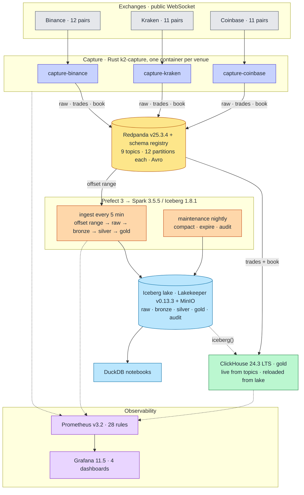

# Architecture — as built

How each component is built, how it works, and what it trades away. Versions are the
image tags in [`docker-compose.yml`](../../docker-compose.yml). Decisions live in
[`../adr/`](../adr/README.md), numbers in [`../benchmarks/`](../benchmarks/README.md); this page
cites both and repeats neither.

## System

Three invariants hold the shape together:

1. **The lake is the record; everything else is derived.** ClickHouse, the notebooks and every
   product table can be dropped and rebuilt from `raw.messages`
   ([ADR-018](../adr/ADR-018-v3-lake-first-rust-capture.md)).
2. **One wire format.** Avro with the registry, `int64` at 1e-8, `recv_ts_ns` in the body
   ([ADR-020](../adr/ADR-020-avro-fixed-point-contracts.md)). Nothing parses JSON downstream of capture.
3. **Correctness is measured, not asserted.** Sequence and checksum counters at capture, per-layer
   audits in the lake, three-way OHLCV parity at a pinned snapshot, chaos scripts with timed recovery.

## Capture — `k2-capture`

**Built.** One Rust crate ([`services/capture-rust/`](../../services/capture-rust/README.md)), one
image, three containers selected by `--exchange`. Single-threaded tokio (`current_thread`) because the
CPU quota is 0.25; librdkafka's producer queue (32 MiB) is the only buffer. Runs on
`distroless/cc` as non-root; a `healthcheck` subcommand stands in for `curl`.

**How it works.** One WebSocket per venue carries trades and L2 book together. `recv_ts_ns` is the
first statement after a frame leaves the socket. Each frame is published verbatim to `raw.<venue>`,
then parsed by a pure `handle_frame(bytes, recv_ts) -> records` that runs identically in production
and in the replay tests. Per venue: Kraken v2 with CRC32 verification of every book update against
the venue's published checksum; Binance `depth20@100ms` partials with `lastUpdateId` regression checks
and a scheduled reconnect before the 24 h cap; Coinbase `level2` full books in a `BTreeMap` with
`sequence_num` gap detection and resync. Top-20 snapshots are emitted at 1 Hz per symbol
([ADR-027](../adr/ADR-027-book-snapshot-and-sequencing.md)). After a produce-error drop on a book
stream, capture resubscribes for a fresh snapshot once the queue drains.

**Trade-offs.** Drop-on-full rather than back-pressure: a stalled broker costs records (counted in
`k2_capture_produce_errors_total`, recovered by the lake's audit) rather than a frozen socket that the
venue would close anyway. No spill-to-disk; the lake, not capture, is where completeness is proven.
Internet feeds: exchange→receive latency includes transit and venue clock skew and is published as
such ([benchmarks](../benchmarks/2026-08-27.md#latency--exchange-timestamp--k2-receive)).

## Streaming backbone — Redpanda

**Built.** Single broker, `--smp 1 --memory 1500M`, schema registry and console built in
([ADR-001](../adr/ADR-001-replace-kafka-with-redpanda.md)). Topics are created by the `redpanda-init`
one-shot, never auto-created: `market.crypto.v3.{raw,trades,book}.<venue>`, 12 partitions each,
keyed by canonical symbol. Retention: raw 48 h, derived 7 d.

**Trade-offs.** Retention is a buffer, not storage — an ingest outage longer than 48 h loses raw
frames, and the `raw` audit says so ([failure-modes.md](failure-modes.md)). Single broker: recovery is
restart, measured, not failover.

## Lake ingest — Spark under Prefect

**Built.** [`docker/lake/`](../../docker/lake/README.md): `ingest.py` runs the stages, one module per
layer (`bronze.py`, `silver.py`, `gold.py`, `books.py`), `maintenance.py` compacts and audits,
`rebuild.py` recomputes any layer from its parent. Prefect deployments `lake-ingest-5min`
(`1-59/5 * * * *`) and `lake-maintenance-daily` (`0 3 * * *`) `docker exec` into the one Spark
container; a file lock serialises writers.

**How it works.** Stage 1 reads Redpanda by explicit offset range — from the offsets recorded in the
last ingest snapshot's summary to `latest` — and appends every record verbatim to `raw.messages`,
writing the consumed offsets into the same Iceberg commit ([ADR-022](../adr/ADR-022-exactly-once-via-snapshot-offsets.md)).
Each later stage reads its parent incrementally by snapshot id (`k2.src-snapshot-id`) and commits the
id it read up to. A run killed at any instant leaves either the old snapshot or the new one; the next
run resumes from whichever it finds.

**Trade-offs.** Batch, not streaming: freshness in the lake is five minutes, and ClickHouse covers the
head. One Spark container at 2 CPU / 8 GiB serves ingest, rebuilds and maintenance in turn; a full
bronze rebuild takes 520 s, books 2,367 s ([benchmarks](../benchmarks/2026-08-27.md#lake)).

## Lake layers — Iceberg on Lakekeeper + MinIO

**Built.** DDL in [`docker/lake/ddl/lake.sql`](../../docker/lake/ddl/lake.sql); catalog is Lakekeeper's
REST API over MinIO ([ADR-023](../adr/ADR-023-lakekeeper-rest-catalog.md)); Parquet + zstd.

| Layer | Tables | Contract |
|---|---|---|
| `raw` | `messages` | every Kafka record verbatim, partitioned `days(kafka_ts), topic`, never expired |
| `bronze` | `<venue>_<msgtype>` ×7 | the venue's field names and JSON types as sent, decoded from raw JSON, lineage to the raw row |
| `silver` | `trades_<venue>`, `book_<venue>` ×3 | typed, UTC, canonical symbol beside native, flags `venue_replay` / `seq_gap` / `precision_loss` / `checksum_ok`; every delivery kept |
| `gold` | `trades`, `book_top20`, `bbo_1s`, `ohlcv_{1m,5m,1h,1d}`, `dim_*` | one row per logical trade, end-of-second book state from replaying every delta, products with `src_snapshot_id` |
| `audit` | `checks` | every nightly assertion, pass or fail |

Columns: [schema-design.md](schema-design.md). Partitioning and file sizing:
[partitioning-strategy.md](partitioning-strategy.md). Why four layers and what each is for:
[data-strategy.md](data-strategy.md), [ADR-026](../adr/ADR-026-four-layer-lake-and-gold-served-from-clickhouse.md).

**Trade-offs.** Bronze keeps vendor schemas, so a Kraken field is not a Binance field until silver —
cross-venue queries pay for that at gold. Silver keeps every delivery, including replays, so it is
larger than gold and lake-only. Disk on one host is the binding constraint: ≈ 9.8 GB/day, runway
≈ 60 days at the 2026-08-27 fill ([capacity-model.md](capacity-model.md)).

## Served tier — ClickHouse `gold`

**Built.** [`docker/clickhouse/ddl/10-gold-tables.sql`](../../docker/clickhouse/ddl/10-gold-tables.sql)
is the contract, tested in CI (`make test-clickhouse`); `20-gold-kafka.sql` adds `AvroConfluent`
Kafka engines over the trades and book topics with `kafka_handle_error_mode='stream'`, so an undecodable
record lands in `gold.feed_errors` instead of stalling a partition. A read-only `quant` profile
(3 GiB, 2 threads) is what dashboards and notebooks use. Limits: 4 CPU / 8 GiB, server cap 6.5 GiB.

**How it works.** `gold.trades` is `ReplacingMergeTree` keyed on
`(exchange, canonical_symbol, exchange_ts, trade_id)`, earliest delivery wins; a venue replay or a
topic/lake overlap is one row under `FINAL`. `gold.ohlcv_*` and `gold.bbo_1s` are pulled from the
lake through `iceberg()` ([runbook](../runbooks/clickhouse-rebuild-from-lake.md)); `ohlcv_live` and
`bbo_live` are views over `FINAL` for the head the lake has not reached. No TTL; the lake wins on
conflict ([ADR-025](../adr/ADR-025-clickhouse-derived-hot-tier.md)).

**Trade-offs.** OHLCV on read costs a `FINAL` scan per query rather than a merge-time bug: v2's
`SummingMergeTree` resolved open and close per insert block, and the CI test that inserts one minute
in two blocks is the regression guard. ClickHouse 24.3 cannot speak to a REST catalog, so the lake
pull is by metadata path and needs uncompressed metadata on the source tables.

## Observability

Prometheus scrapes capture (`:8082`), ClickHouse (`:9363`), Redpanda (`:9644`), the lake exporter
(`lake-metrics:8000`, PyIceberg over snapshot summaries) and itself. 28 rules in
[`docker/prometheus/rules/`](../../docker/prometheus/rules/) — 10 capture, 12 lake, 6 ClickHouse — each
with a runbook in [`../runbooks/`](../runbooks/README.md) and a `promtool` unit test. Four Grafana
dashboards: pipeline overview, capture, lake, ClickHouse. No Alertmanager: rules are evaluated and
shown, not routed. Detail: [operations/observability.md](../operations/observability.md).

## Research surface

`notebooks/` is a uv project: DuckDB reads the lake straight from Parquet under MinIO, four
notebooks (connect, book at a time, ASOF trades-to-book, completeness) run in 19 s
(`make notebooks-run`). Notebooks read `gold` for research and `silver` for forensics; nothing reads
ClickHouse.

## Resource footprint

15 long-running services at 14.60 CPU / 25.625 GiB of limits, plus four one-shot init containers;
per-service table and the command that produces it in
[operations/docker-resources.md](../operations/docker-resources.md). Budget and the reasoning behind
each limit: [ADR-010](../adr/ADR-010-resource-budget.md).

## Not built

No query API; no replication or failover; no Alertmanager routing; no load test above 1×. Designed
and deferred: pcap sidecar with kernel timestamps (ADR-026 Phase E+1) and a cross-venue security
master ([data-strategy.md](data-strategy.md)). The cloud mapping in
[scale-out-path.md](scale-out-path.md) is designed, not exercised.

## Further reading

| Page | What it holds |
|---|---|
| [data-strategy.md](data-strategy.md) | why four layers, what ClickHouse holds and for how long, retention vs disk |
| [schema-design.md](schema-design.md) | every column in every layer and the wire contracts |
| [partitioning-strategy.md](partitioning-strategy.md) | partition specs, sort orders, file sizes, ClickHouse keys |
| [failure-modes.md](failure-modes.md) | FMEA: detection, blast radius, recovery, proof per failure |
| [capacity-model.md](capacity-model.md) | predicted vs measured bytes/day, CPU, disk runway |
| [streaming-sources.md](streaming-sources.md) | the three venue dialects and what a fourth costs |
| [platform-principles.md](platform-principles.md), [positioning.md](positioning.md) | the rules the design is held to, and what it is deliberately wrong for |
| [../MIGRATION-JOURNEY.md](../MIGRATION-JOURNEY.md) | v1 → v2 → v3, with the measured outcomes of each |
