# Architecture — As Built

K2 is a single-host crypto market-data platform: three exchange WebSocket feeds land in Redpanda, ClickHouse turns them into a Bronze → Silver → Gold medallion using nothing but Kafka-engine tables and materialized views, and a Prefect-scheduled Spark job appends the results to Iceberg every 15 minutes. The whole stack runs in one Docker Compose file on **15.1 CPU / 21.875 GB across 14 long-lived containers** (+2 one-shot init containers), against a mandate of 16 cores / 40 GB.

Everything below describes what actually runs on `main` today. Where the design intent and the built system diverge, the divergence is called out rather than papered over. The story of how it got here is in [MIGRATION-JOURNEY.md](../MIGRATION-JOURNEY.md).

---

## System diagram

```mermaid
flowchart LR
    subgraph EX["Exchanges"]
        BIN["Binance<br/>12 pairs"]
        KRK["Kraken<br/>11 pairs"]
        CBS["Coinbase<br/>11 pairs"]
    end

    subgraph FH["Ingestion · Kotlin 2.3 + Ktor 3.1"]
        FHB["feed-handler-binance"]
        FHK["feed-handler-kraken"]
        FHC["feed-handler-coinbase"]
    end

    RP["Redpanda v25.3.4<br/>6 topics · 160 partitions<br/>built-in schema registry"]

    subgraph CH["Hot store · ClickHouse 24.3 LTS"]
        Q["3 Kafka-engine queues<br/>JSONAsString"]
        BR["3x bronze_trades_*<br/>MergeTree · TTL 7d"]
        SI["silver_trades<br/>MergeTree · TTL 30d"]
        GO["6x ohlcv_*<br/>AggregatingMergeTree"]
    end

    subgraph BATCH["Orchestration + batch"]
        PF["Prefect 3<br/>server · worker · Postgres"]
        SP["Spark 3.5 + Iceberg<br/>JDBC read, append write"]
    end

    ICE["Iceberg cold.*<br/>10 tables · Hadoop catalog<br/>Parquet + zstd"]

    subgraph OBS["Observability"]
        PR["Prometheus v3.2<br/>17 alert rules"]
        GR["Grafana 11.5<br/>4 dashboards"]
    end

    BIN -->|WebSocket| FHB
    KRK -->|WebSocket| FHK
    CBS -->|WebSocket| FHC
    FHB -->|"raw JSON + Avro"| RP
    FHK -->|"raw JSON + Avro"| RP
    FHC -->|"raw JSON + Avro"| RP
    RP --> Q
    Q -->|normalizing MV| BR
    BR -->|"3 MVs"| SI
    SI -->|"6 MVs"| GO
    PF -->|"cron */15"| SP
    BR -.->|JDBC| SP
    SI -.->|JDBC| SP
    GO -.->|JDBC| SP
    SP -->|append| ICE
    FHB -.->|"handlers :8082"| PR
    Q -.->|"ClickHouse :9363"| PR
    PR --> GR

    classDef exchange fill:#e5e7eb,stroke:#4b5563,color:#1f2937
    classDef kotlin fill:#c7d2fe,stroke:#4338ca,color:#1f2937
    classDef stream fill:#fde68a,stroke:#b45309,color:#1f2937
    classDef ch fill:#bbf7d0,stroke:#15803d,color:#1f2937
    classDef batch fill:#fed7aa,stroke:#c2410c,color:#1f2937
    classDef storage fill:#bae6fd,stroke:#0369a1,color:#1f2937
    classDef obs fill:#e9d5ff,stroke:#7e22ce,color:#1f2937

    class BIN,KRK,CBS exchange
    class FHB,FHK,FHC kotlin
    class RP stream
    class Q,BR,SI,GO ch
    class PF,SP batch
    class ICE storage
    class PR,GR obs
```

---

## Tiers

### Ingestion — Kotlin feed handlers

Three containers from one image (`services/feed-handler-kotlin/`), differing only by `K2_EXCHANGE`. Kotlin 2.3.10 on JVM 21, Ktor 3.1.0 WebSocket client, coroutines, `kafka-clients` 4.1.0 with the Confluent Avro serializer. Each handler subscribes to its instruments, then **dual-produces**: the untouched exchange payload to `market.crypto.trades.<exchange>.raw`, and a `NormalizedTrade` Avro record to `market.crypto.trades.<exchange>`.

- Instruments come from [`config/instruments.yaml`](../../config/instruments.yaml) — one file, all three exchanges, no per-service duplication.
- Reconnect is a fixed 5 s delay with unlimited retries (`reconnect-delay-ms`, `max-reconnect-attempts = -1` in `application.conf`) — the KDoc in the WebSocket clients still says "exponential backoff"; it isn't. Measured cost is ~0.03 CPU / 134 MiB for Binance at 100–200 trades/s, against a 0.5 CPU / 512 MB limit.
- Micrometer exposes `feed_handler_trades_produced_total`, `feed_handler_errors_total`, `feed_handler_reconnects_total` on `:8082/metrics`; `:8082/health` backs the Compose healthcheck.
- Why Kotlin over the v1 Python handlers: [ADR-002](../decisions/ADR-002-kotlin-feed-handlers.md).

**As-built quirk:** the Bronze layer consumes the *raw JSON* topics, not the normalized Avro ones. The Avro path is live and schema-registered, but nothing downstream reads it today — normalization ended up in ClickHouse instead (see below). It is kept because it is the seam a non-ClickHouse consumer would attach to.

### Streaming backbone — Redpanda

Single-broker Redpanda v25.3.4 in `dev-container` mode, `--smp 1 --memory 1500M`, with the schema registry built in — no separate Confluent registry process ([ADR-001](../decisions/ADR-001-replace-kafka-with-redpanda.md)).

Topics are created explicitly by the `redpanda-init` one-shot service rather than by auto-create, so partition counts are deterministic: 40 partitions for each Binance topic, 20 for each Kraken and Coinbase topic — 6 topics, 160 partitions. That job also hardens `_schemas` to `cleanup.policy=compact` with infinite retention, which fixed a real failure where the registry hit `offset_out_of_range` after a restart.

### Hot store — ClickHouse

ClickHouse 24.3 LTS ([ADR-015](../decisions/ADR-015-clickhouse-lts-downgrade.md) — downgraded from 26.1 for Spark JDBC compatibility) is the whole stream processor. There is no stream-processing framework in this platform ([ADR-004](../decisions/ADR-004-eliminate-spark-streaming.md), [ADR-009](../decisions/ADR-009-medallion-in-clickhouse.md)).

Per exchange, the chain is four objects:

1. **Kafka-engine table** (`k2.trades_<exchange>_queue`) reading `JSONAsString` — one `message String` column, `kafka_flush_interval_ms = 7500`.
2. **Normalizing MV** — `JSONExtract*` + `toDecimal64(…, 8)` turns the exchange's JSON dialect into the shared bronze column set.
3. **Bronze table** — `MergeTree`, `PARTITION BY toYYYYMMDD(exchange_timestamp)`, `ORDER BY (symbol, exchange_timestamp, sequence_number)`, `TTL … + INTERVAL 7 DAY`.
4. **Silver MV** — `bronze_<exchange>_to_silver_mv` fans the per-exchange bronze into the single `silver_trades` table (canonical symbols, `is_valid`, `asset_class`).

Six more MVs read `silver_trades` and maintain `ohlcv_1m/5m/15m/30m/1h/1d` as `AggregatingMergeTree` tables keyed on `(exchange, canonical_symbol, window_start)`.

Separate bronze tables per exchange — rather than one normalized bronze — is [ADR-011](../decisions/ADR-011-multi-exchange-bronze-architecture.md): native shapes survive to a layer you can diff against the exchange's own docs.

DDL lives in [`docker/clickhouse/ddl/01-k2-schema.sql`](../../docker/clickhouse/ddl/01-k2-schema.sql), auto-applied on a fresh volume (`docker/clickhouse/schema/` is the historical migration trail); see [schema-design.md](schema-design.md) for columns and [partitioning-strategy.md](partitioning-strategy.md) for the keys.

### Orchestration and batch — Prefect + Spark

Prefect 3 (`prefect-server`, `prefect-worker`, `prefect-db` on PostgreSQL 15) runs two deployments:

| Deployment | Cron | Does |
|---|---|---|
| `iceberg-offload-15min` | `*/15 * * * *` | Bronze (3 concurrent) → Silver (sequential) → Gold (6 concurrent) offload |
| `iceberg-maintenance-daily` | `0 2 * * *` | Compact (binpack, 128 MB) → expire snapshots (7 day) → row-count audit |

Both shell out to the shared `spark-iceberg` container. `docker/offload/offload_generic.py` reads ClickHouse over JDBC above a per-table watermark, appends to Iceberg, then advances the watermark in PostgreSQL `offload_watermarks` — so a killed run is a no-op and the next cycle resumes exactly where it stopped. Column lists are explicit in the flow, so a new ClickHouse column is ignored until it is added to both the flow and the Iceberg DDL.

Spark is batch-only ([ADR-006](../decisions/ADR-006-spark-batch-only.md)); doing the offload in Spark rather than a bespoke Kotlin service is [ADR-014](../decisions/ADR-014-spark-based-iceberg-offload.md).

### Cold store — Iceberg

10 tables under the `cold` namespace: 3 bronze, 1 silver, 6 gold. Bronze/silver partition by `days(...)`, gold by `months(window_start), exchange`; Parquet with zstd level 3, 128 MB target file size ([ADR-007](../decisions/ADR-007-iceberg-cold-storage.md)).

**As-built divergence:** the catalog is the file-based **Hadoop catalog** over a bind-mounted warehouse (`docker/iceberg/warehouse` → `/home/iceberg/warehouse`), not the Iceberg REST catalog the original design assumed. The REST catalog cost a day of version-compatibility fights and bought nothing on a single node ([ADR-013](../decisions/ADR-013-pragmatic-iceberg-version-strategy.md)). MinIO runs and holds S3 credentials for the S3FileIO path, but the offload writes to the local warehouse today — swapping the catalog `warehouse` property is the migration when this stops being a single host.

Two silver columns are absent from cold storage on purpose: `trade_conditions Array(String)` and `vendor_data Map(String,String)` cannot be deserialized by the Spark ClickHouse JDBC driver, so the Iceberg schema drops them.

### Observability

Prometheus v3.2 scrapes the three feed handlers (`:8082`), ClickHouse (`:9363`), Redpanda (`:9644`), and Grafana. Grafana 11.5 ships four provisioned dashboards in `docker/grafana/dashboards/`: pipeline overview, ClickHouse overview, Iceberg offload, v2 migration tracker.

**17 alert rules** are loaded from `docker/prometheus/rules/`: 3 feed-handler, 5 ClickHouse, 9 Iceberg-offload. The `iceberg-scheduler` Prometheus job scrapes the offload metrics exporter on `iceberg-metrics:8000`, so all 9 offload alerts have live series. One honest gap remains: no alert has been fire-tested end to end. There is no Alertmanager.

---

## Data model

| Layer | Table(s) | Shape |
|---|---|---|
| Bronze | `bronze_trades_binance`, `_kraken`, `_coinbase` | `exchange_timestamp, sequence_number, symbol, price Decimal(18,8), quantity, quote_volume, event_time, kafka_offset, kafka_partition, ingestion_timestamp` — identical across all three |
| Silver | `silver_trades` | `message_id, trade_id, exchange, symbol, canonical_symbol, asset_class, currency, price, quantity, quote_volume, side, timestamp, ingestion_timestamp, processed_at, source_sequence, platform_sequence, is_valid` (+ `trade_conditions`, `vendor_data`, `validation_errors`, hot tier only) |
| Gold | `ohlcv_{1m,5m,15m,30m,1h,1d}` | `exchange, canonical_symbol, window_start, open_time, open_price, close_time, close_price, high_price, low_price, volume, quote_volume, trade_count` |

Full field notes: [schema-design.md](schema-design.md).

---

## Trade lifecycle

The end-to-end p99 is dominated by network RTT to the exchanges (~80 ms average), not by anything in the platform — bronze → silver is below the measurement resolution. Caveat on those numbers: they come from a 1-hour window on a cold-started stack with n ≈ 12–13 trades per exchange, and the 24-hour burn-in that would give them statistical weight is unfinished.

---

## Resource footprint

| Service | CPU limit | Memory limit |
|---|---|---|
| clickhouse | 4.0 | 8 GB |
| redpanda | 2.0 | 2 GB |
| spark-iceberg | 2.0 | 4 GB |
| prometheus | 1.0 | 2 GB |
| minio | 1.0 | 1 GB |
| prefect-db | 1.0 | 1 GB |
| prefect-server | 1.0 | 1 GB |
| redpanda-console | 0.5 | 256 MB |
| grafana | 0.5 | 512 MB |
| prefect-worker | 0.5 | 512 MB |
| feed-handler-binance | 0.5 | 512 MB |
| feed-handler-kraken | 0.5 | 512 MB |
| feed-handler-coinbase | 0.5 | 512 MB |
| iceberg-metrics | 0.1 | 128 MB |
| **Total (14 services)** | **15.1** | **21.875 GB** |

Two further entries, `redpanda-init` and `iceberg-init`, are one-shot containers (topic creation and Iceberg table bootstrap respectively) that exit after startup and are not counted in the total above. Budget and reasoning: [ADR-010](../decisions/ADR-010-resource-budget.md), [docs/operations/docker-resources.md](../operations/docker-resources.md).

---

## What is not built

- **No query API.** Phase 8 is unstarted. Reads today are `clickhouse-client` / HTTP on `:8123` and Spark SQL against Iceberg. The Kotlin JVM query API proposed in [ADR-005](../decisions/ADR-005-kotlin-spring-boot-api.md) was never written, and the ROI analysis that ranked it last is the reason.
- **No REST catalog.** Hadoop catalog on a bind mount, as above.
- **No Raw layer.** [ADR-009](../decisions/ADR-009-medallion-in-clickhouse.md) specified a four-layer Raw → Bronze → Silver → Gold medallion. The built system has three: the Kafka-engine queue table plays the Raw role in flight, but nothing durably persists pre-normalization rows.
- **No Alertmanager, no alert fire test, no load testing above 1x.** The 5x/10x replay scenarios in the latency plan were never run.
- **Single broker, single ClickHouse node, single host.** No replication, no failover; recovery is container restart, verified by test rather than by design.

---

## Decision records

The full set is in [docs/decisions/](../decisions/). The ones that shaped this diagram:

| ADR | Decision |
|---|---|
| [ADR-001](../decisions/ADR-001-replace-kafka-with-redpanda.md) | Kafka + Schema Registry → Redpanda |
| [ADR-002](../decisions/ADR-002-kotlin-feed-handlers.md) | Python feed handlers → Kotlin |
| [ADR-003](../decisions/ADR-003-clickhouse-warm-storage.md) | ClickHouse as the hot store |
| [ADR-004](../decisions/ADR-004-eliminate-spark-streaming.md) | Delete Spark Structured Streaming |
| [ADR-006](../decisions/ADR-006-spark-batch-only.md) | Spark retained, batch only |
| [ADR-007](../decisions/ADR-007-iceberg-cold-storage.md) | Iceberg as the cold tier |
| [ADR-008](../decisions/ADR-008-eliminate-prefect-orchestration.md) | Proposed dropping Prefect — **not adopted**, see the journey doc |
| [ADR-009](../decisions/ADR-009-medallion-in-clickhouse.md) | Medallion as ClickHouse materialized views |
| [ADR-010](../decisions/ADR-010-resource-budget.md) | The 16-core / 40 GB budget |
| [ADR-011](../decisions/ADR-011-multi-exchange-bronze-architecture.md) | Bronze table per exchange |
| [ADR-013](../decisions/ADR-013-pragmatic-iceberg-version-strategy.md) | Hadoop catalog over REST |
| [ADR-014](../decisions/ADR-014-spark-based-iceberg-offload.md) | Spark offload, not a Kotlin service |
| [ADR-015](../decisions/ADR-015-clickhouse-lts-downgrade.md) | ClickHouse 26.1 → 24.3 LTS |
| [ADR-016](../decisions/ADR-016-add-coinbase-exchange.md) | Coinbase as the third exchange |
| [ADR-017](../decisions/ADR-017-iceberg-maintenance-pipeline.md) | Daily compaction + snapshot expiry |
