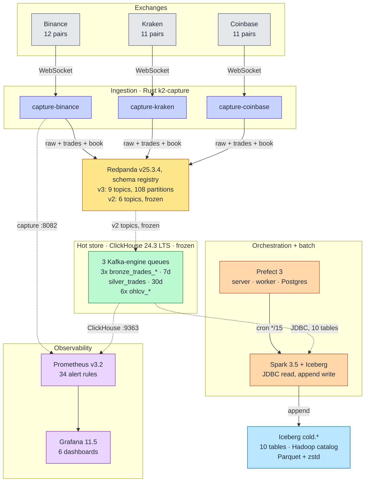
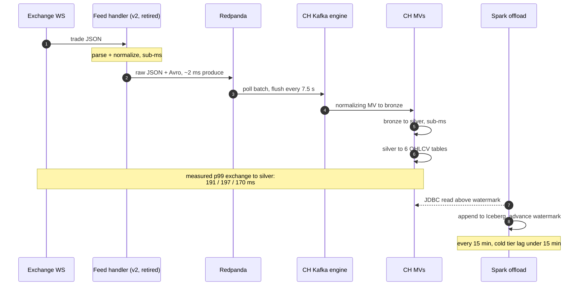
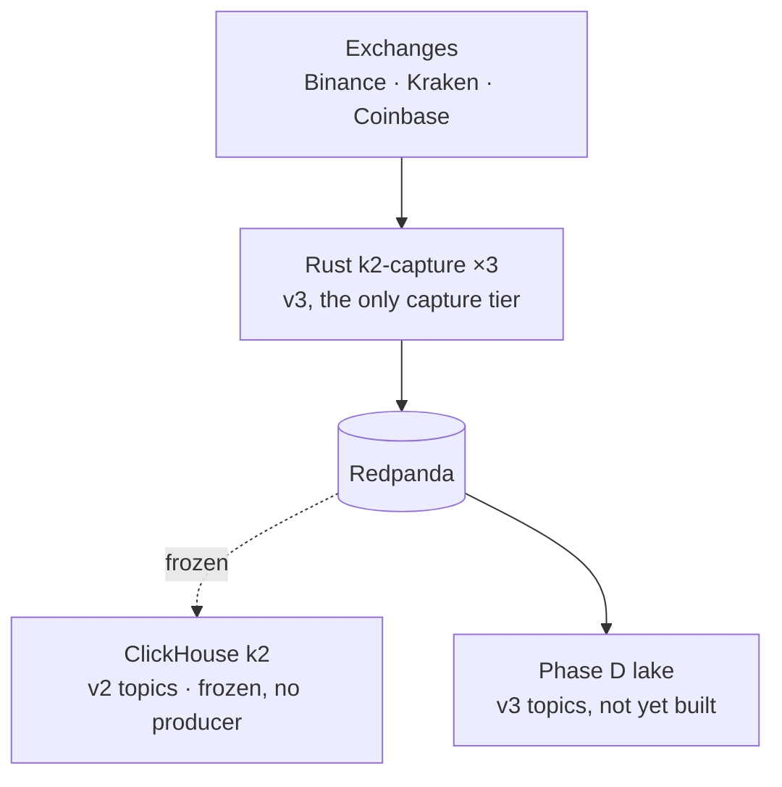
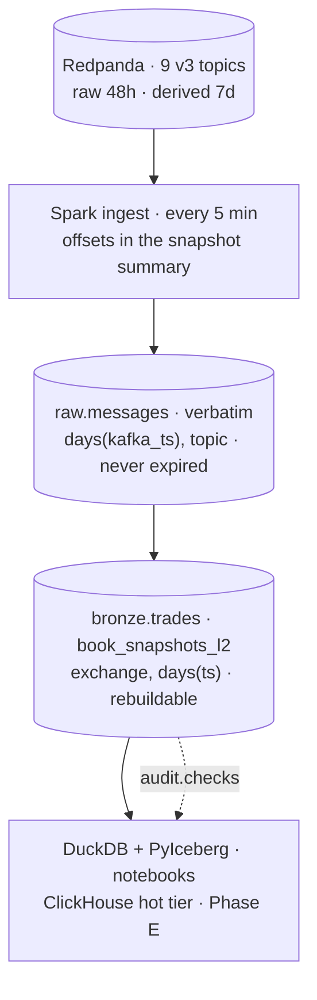
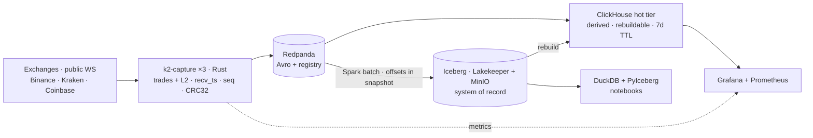

# Architecture — As Built

K2 is a single-host crypto market-data platform: three exchange WebSocket feeds land in Redpanda, ClickHouse turns them into a Bronze → Silver → Gold medallion using nothing but Kafka-engine tables and materialized views, and a Prefect-scheduled Spark job appends the results to Iceberg. The v2 pipeline ran in one Docker Compose file on **15.1 CPU / 21.875 GB across 14 long-lived containers** (+2 one-shot init containers), against a mandate of 16 cores / 40 GB. What is deployed here is that stack with its capture tier swapped for v3's Rust `k2-capture` ([ADR-019](../adr/ADR-019-rust-capture-tier.md)) and the v3 lake tier running beside the v2 offload it replaces ([ADR-018](../adr/ADR-018-v3-lake-first-rust-capture.md)): **14.70 CPU / 21.750 GiB across 16 long-running containers**, plus 5 one-shot init containers declaring a further 2.00 CPU / 2.500 GiB for a bootstrap peak of **16.70 CPU / 24.250 GiB across 21**. The v2 offload retires at its own cutover, landing at 14.60 CPU / 21.625 GiB across 15. Source for every figure: `docker compose --env-file .env.example config`, limits summed ([command](../operations/docker-resources.md#how-these-numbers-are-produced)).

> **The v2 hot tier is frozen as of 2026-08-26.** The three Kotlin feed handlers were the only producers of `market.crypto.trades.<ex>[.raw]`, and they retired to [`legacy/v2-kotlin/`](../../legacy/v2-kotlin/README.md) when the Rust capture tier matched them on per-symbol parity ([ADR-019](../adr/ADR-019-rust-capture-tier.md)). Nothing writes those six topics now, so the Kafka-engine queues have nothing to read and **`k2.bronze_trades_*`, `k2.silver_trades` and the six `k2.ohlcv_*` tables stop advancing at the retirement timestamp** — they hold history, they do not grow, and their TTLs keep expiring rows out from under them (bronze 7 d, silver 30 d). The `market.crypto.v3.{raw,trades,book}.<ex>` topics are the only live feed. The `k2` database, its Kafka-engine queues and the `.raw` topics are dropped together at the Phase E cutover, not here — a frozen table is still queryable while the v3 hot tier is being built beside it. Everything below that describes `k2.*` describes what was built and what is still readable, not what is being written.

Everything below describes what actually runs on this branch. Where the design intent and the built system diverge, the divergence is called out rather than papered over. The story of how it got here is in [MIGRATION-JOURNEY.md](../MIGRATION-JOURNEY.md).

---

## System diagram

---

## Tiers

### Ingestion — Rust `k2-capture`

Three containers from one image ([`services/capture-rust/`](../../services/capture-rust/README.md)), differing only by `--exchange`. One `k2-capture` binary per venue on `gcr.io/distroless/cc-debian12:nonroot`, one WebSocket connection carrying trades *and* L2 book, `recv_ts_ns` stamped as the first statement on frame receipt, fixed-point `i64` at 1e-8 end to end. Each container produces to three topics: `market.crypto.v3.raw.<ex>` (every frame verbatim), `.trades.<ex>` (Avro `Trade`) and `.book.<ex>` (Avro `BookSnapshotL2`, top-20 at 1 Hz).

- Instruments come from [`config/instruments.yaml`](../../config/instruments.yaml) — one file, all three exchanges, native *and* canonical spellings, no per-service duplication and no mapping in code.
- Prometheus metrics on `:8082/metrics` (`k2_capture_messages_total`, `_gaps_total`, `_checksum_failures_total`, `_records_delivered_total`, `_exchange_to_recv_seconds`, …); the `k2-capture healthcheck` subcommand backs the Compose healthcheck, because distroless has no `curl`.
- Why Rust, and what the JVM tier could not be asked to do: [ADR-019](../adr/ADR-019-rust-capture-tier.md). The wire contract is [ADR-020](../adr/ADR-020-avro-fixed-point-contracts.md); the book product and resync policy are [ADR-027](../adr/ADR-027-book-snapshot-and-sequencing.md).

**Retired: the Kotlin feed handlers.** Three JVM containers (Kotlin 2.3.10, Ktor 3.1.0, `kafka-clients` 4.1.0) dual-produced raw exchange JSON to `market.crypto.trades.<ex>.raw` and a `NormalizedTrade` Avro record to `market.crypto.trades.<ex>` from February to August 2026. They were the only producer of the v2 topics, and their retirement is what freezes the ClickHouse medallion below. Code, topic inventory and their measured footprint: [`legacy/v2-kotlin/README.md`](../../legacy/v2-kotlin/README.md); the decision is [ADR-002](../adr/ADR-002-kotlin-feed-handlers.md), superseded by [ADR-019](../adr/ADR-019-rust-capture-tier.md).

**As-built quirk, inherited:** the Bronze layer consumed the *raw JSON* topics, never the normalized Avro ones. The Avro path was live and schema-registered for its whole life and nothing downstream ever read it — normalization ended up in ClickHouse instead (see below). v3 does not repeat the shape: `.trades.<ex>` is Avro and is what the v3 hot tier will read.

### Streaming backbone — Redpanda

Single-broker Redpanda v25.3.4 in `dev-container` mode, `--smp 1 --memory 1500M`, with the schema registry built in — no separate Confluent registry process ([ADR-001](../adr/ADR-001-replace-kafka-with-redpanda.md)).

Topics are created explicitly by the `redpanda-init` one-shot service rather than by auto-create, so partition counts are deterministic: 9 v3 topics at 12 partitions each — `market.crypto.v3.{raw,trades,book}.<ex>` for each exchange — for 108 partitions. The 6 v2 topics (40 partitions per Binance topic, 20 per Kraken and Coinbase topic, 160 total) are still created and still hold their retained data, but **no producer writes them**: `redpanda-init` keeps creating them so a fresh volume can still be read against, and Phase E deletes them. `rpk topic list` shows 15 market topics / 268 partitions (plus `_schemas`). That job also hardens `_schemas` to `cleanup.policy=compact` with infinite retention, which fixed a real failure where the registry hit `offset_out_of_range` after a restart.

### Hot store — ClickHouse

ClickHouse 24.3 LTS ([ADR-015](../adr/ADR-015-clickhouse-lts-downgrade.md) — downgraded from 26.1 for Spark JDBC compatibility) is the whole stream processor. There is no stream-processing framework in this platform ([ADR-004](../adr/ADR-004-eliminate-spark-streaming.md), [ADR-009](../adr/ADR-009-medallion-in-clickhouse.md)).

**Frozen since 2026-08-26.** The three Kafka-engine queues below still exist and still poll, but their topics have had no producer since the Kotlin handlers retired, so every table in this section holds history and gains no rows. Existing data stays queryable and keeps ageing out under its TTL; the v3 hot tier built on `market.crypto.v3.*` replaces this chain in Phase E, which is also when `DROP DATABASE k2` and the `.raw` topic deletion happen. Nothing here is dropped by the retirement PR.

Per exchange, the chain is four objects:

1. **Kafka-engine table** (`k2.trades_<exchange>_queue`) reading `JSONAsString` — one `message String` column, `kafka_flush_interval_ms = 7500`.
2. **Normalizing MV** — `JSONExtract*` + `toDecimal64(…, 8)` turns the exchange's JSON dialect into the shared bronze column set.
3. **Bronze table** — `MergeTree`, `PARTITION BY toYYYYMMDD(exchange_timestamp)`, `ORDER BY (symbol, exchange_timestamp, sequence_number)`, `TTL … + INTERVAL 7 DAY`.
4. **Silver MV** — `bronze_<exchange>_to_silver_mv` fans the per-exchange bronze into the single `silver_trades` table (canonical symbols, `is_valid`, `asset_class`).

Six more MVs read `silver_trades` and maintain `ohlcv_1m/5m/15m/30m/1h/1d` as `AggregatingMergeTree` tables keyed on `(exchange, canonical_symbol, window_start)`.

Separate bronze tables per exchange — rather than one normalized bronze — is [ADR-011](../adr/ADR-011-multi-exchange-bronze-architecture.md): native shapes survive to a layer you can diff against the exchange's own docs.

DDL lives in [`docker/clickhouse/ddl/01-k2-schema.sql`](../../docker/clickhouse/ddl/01-k2-schema.sql), auto-applied on a fresh volume (`docker/clickhouse/schema/` is the historical migration trail); see [schema-design.md](schema-design.md) for columns and [partitioning-strategy.md](partitioning-strategy.md) for the keys.

### Orchestration and batch — Prefect + Spark

Prefect 3 (`prefect-server`, `prefect-worker`, `prefect-db` on PostgreSQL 15) runs two deployments:

| Deployment | Cron | Does |
|---|---|---|
| `iceberg-offload-15min` | `*/15 * * * *` | Bronze (3 concurrent) → Silver (sequential) → Gold (6 concurrent) offload |
| `iceberg-maintenance-daily` | `0 2 * * *` | Compact (binpack, 128 MB) → expire snapshots (7 day) → row-count audit |

Both shell out to the shared `spark-iceberg` container. `docker/offload/offload_generic.py` reads ClickHouse over JDBC above a per-table watermark, appends to Iceberg, then advances the watermark in PostgreSQL `offload_watermarks` — so a killed run is a no-op and the next cycle resumes exactly where it stopped. Column lists are explicit in the flow, so a new ClickHouse column is ignored until it is added to both the flow and the Iceberg DDL.

Spark is batch-only ([ADR-006](../adr/ADR-006-spark-batch-only.md)); doing the offload in Spark rather than a bespoke Kotlin service is [ADR-014](../adr/ADR-014-spark-based-iceberg-offload.md).

### Cold store — Iceberg

10 tables under the `cold` namespace: 3 bronze, 1 silver, 6 gold. Bronze/silver partition by `days(...)`, gold by `months(window_start), exchange`; Parquet with zstd level 3, 128 MB target file size ([ADR-007](../adr/ADR-007-iceberg-cold-storage.md)).

**As-built divergence:** the catalog is the file-based **Hadoop catalog** over a bind-mounted warehouse (`docker/iceberg/warehouse` → `/home/iceberg/warehouse`), not the Iceberg REST catalog the original design assumed. The REST catalog cost a day of version-compatibility fights and bought nothing on a single node ([ADR-013](../adr/ADR-013-pragmatic-iceberg-version-strategy.md)). MinIO runs and holds S3 credentials for the S3FileIO path, but the offload writes to the local warehouse today — swapping the catalog `warehouse` property is the migration when this stops being a single host.

Two silver columns are absent from cold storage on purpose: `trade_conditions Array(String)` and `vendor_data Map(String,String)` cannot be deserialized by the Spark ClickHouse JDBC driver, so the Iceberg schema drops them.

### Observability

Prometheus v3.2 scrapes the three capture containers (`:8082`), ClickHouse (`:9363`), Redpanda (`:9644`), the offload metrics exporter (`iceberg-metrics:8000`), the lake metrics exporter (`lake-metrics:8000`) and Grafana. Grafana 11.5 ships six provisioned dashboards in `docker/grafana/dashboards/`: pipeline overview, ClickHouse overview, Iceberg offload, v2 migration tracker, K2 Capture (v3), K2 Lake (v3).

**34 alert rules** are loaded from `docker/prometheus/rules/`: 4 ClickHouse and 9 Iceberg-offload (13 v2 total), plus 10 v3 capture-tier rules, which landed with Phase C and are evaluated against live series, and 11 v3 lake-tier rules landing with Phase D. The `iceberg-scheduler` Prometheus job scrapes the offload metrics exporter on `iceberg-metrics:8000`, so all 9 offload alerts have live series. **Two of the ten capture rules have been shown to fire on the fault they name.** `make chaos` ran for the first time on 2026-08-26, 16:40–16:57Z: five faults injected, one SKIP, and `CaptureDown` (119 s / 152 s / 165 s to fire) and `CaptureProduceErrors` (256 s) both fired, with recovery 0–30 s ([`scripts/chaos/README.md`](../../scripts/chaos/README.md), raw rows in [`scripts/chaos/results/2026-08-26.tsv`](../../scripts/chaos/results/2026-08-26.tsv)). The remaining eight are unproven against a real fault; three of them — `CaptureFeedStale`, `CaptureProduceStalled`, `CaptureBookDepthDegraded` — carry `promtool` unit tests only ([`docker/prometheus/tests/capture-alerts.test.yml`](../../docker/prometheus/tests/capture-alerts.test.yml), `make check-alerts`), which pin an expression and never a recovery time. `CaptureFeedStale` cannot be proven by the pause script at all: a paused scrape target is stale-marked, so the rule stops evaluating rather than firing. The lake-tier gap is wider: **not one of the 11 lake rules has been shown to fire on the fault it names**, because the four `lake-*.sh` chaos scripts ship unrun; they carry `promtool` unit tests only. The 13 v2 rules are unproven the same way. There is no Alertmanager.

---

## Data model

| Layer | Table(s) | Shape |
|---|---|---|
| Bronze | `bronze_trades_binance`, `_kraken`, `_coinbase` | `exchange_timestamp, sequence_number, symbol, price Decimal(18,8), quantity, quote_volume, event_time, kafka_offset, kafka_partition, ingestion_timestamp` — identical across all three |
| Silver | `silver_trades` | `message_id, trade_id, exchange, symbol, canonical_symbol, asset_class, currency, price, quantity, quote_volume, side, timestamp, ingestion_timestamp, processed_at, source_sequence, platform_sequence, is_valid` (+ `trade_conditions`, `vendor_data`, `validation_errors`, hot tier only) |
| Gold | `ohlcv_{1m,5m,15m,30m,1h,1d}` | `exchange, canonical_symbol, window_start, open_time, open_price, close_time, close_price, high_price, low_price, volume, quote_volume, trade_count` |

Full field notes: [schema-design.md](schema-design.md).

---

## Trade lifecycle

This is the **v2** path, as it ran and as it was measured on 2026-02-19. It is frozen at the first hop: the feed handler that opened it retired on 2026-08-26 and nothing produces to the topic the Kafka engine polls. Kept because the measured p99 below is what this repo published, and a measured number is not rewritten. The live path is `k2-capture` → `market.crypto.v3.*`, whose consumer is the Phase E hot tier.

The end-to-end p99 is dominated by network RTT to the exchanges (~80 ms average), not by anything in the platform — bronze → silver is below the measurement resolution. Caveat on those numbers: they come from a 1-hour window on a cold-started stack with n ≈ 12–13 trades per exchange, and the 24-hour burn-in that would give them statistical weight is unfinished.

---

## Resource footprint

| Service | CPU limit | Memory limit |
|---|---|---|
| clickhouse | 4.0 | 8 GB |
| redpanda | 2.0 | 2 GB |
| spark-iceberg | 2.0 | 4 GB |
| prometheus | 1.0 | 2 GB |
| minio | 1.0 | 1 GB |
| prefect-db | 1.0 | 1 GB |
| prefect-server | 1.0 | 1 GB |
| redpanda-console | 0.5 | 256 MB |
| grafana | 0.5 | 512 MB |
| prefect-worker | 0.5 | 512 MB |
| iceberg-metrics | 0.1 | 128 MB |
| lakekeeper (v3) | 0.25 | 256 MB |
| capture-binance (v3) | 0.25 | 256 MB |
| capture-kraken (v3) | 0.25 | 256 MB |
| capture-coinbase (v3) | 0.25 | 512 MB |
| `lake-metrics` (v3) | 0.1 | 128 MB |
| **Total (16 long-running services)** | **14.70** | **21.750 GiB** |

Against the v2 baseline of 15.1 CPU / 21.875 GB across 14 services: `lakekeeper`, the three `capture-*`
containers and `lake-metrics` added +1.10 CPU / +1.375 GiB, and retiring the three Kotlin feed handlers
gave back −1.5 CPU / −1.5 GiB ([ADR-019](../adr/ADR-019-rust-capture-tier.md)) — net −0.4 CPU for a
capture tier that now carries L2 books as well as trades, plus a lake exporter. `lake-metrics` still
doubles up with `iceberg-metrics` on the v2 offload path; retiring that with the rest of
`docker/offload/` (−0.10 CPU / −128 MiB) takes it to 14.60 CPU / 21.625 GiB across 15.

Five further entries — `redpanda-init` (v2, topic creation), `iceberg-init` (v2 cold.* Hadoop-catalog DDL),
`lakekeeper-migrate` (v3 catalog DB schema), `lake-init` (v3 bucket + warehouse + namespaces) and
`lake-ddl` (v3 raw/bronze/audit table DDL) — are one-shot containers that exit after startup, so they are
not in the steady-state total. They are not free either: they declare 2.00 CPU / 2.500 GiB between them and
run concurrently with everything above at `docker compose up`, for a bootstrap peak of 16.70 CPU /
24.250 GiB across 21 containers. Budget and reasoning: [ADR-010](../adr/ADR-010-resource-budget.md),
[docs/operations/docker-resources.md](../operations/docker-resources.md).

| Forward look | [capacity-model.md](capacity-model.md) — msg/s per core, bytes/day per topic and lake table, and headroom against 16 CPU / 40 GB once the v3 capture tier lands. Predictions only, written before the burn-in that scores them. |
|---|---|
| Scale-out | [scale-out-path.md](scale-out-path.md) — every tier's AWS equivalent at TB/PB, what changes versus what does not, and the partition/file/manifest arithmetic redone at 400×. Labelled *designed, not exercised*: nothing in it has been deployed. |
| Failure modes | [failure-modes.md](failure-modes.md) — FMEA over the v3 capture tier and Redpanda as capture sees it: each failure's detection signal, what it loses versus delays, its runbook, and the [`scripts/chaos/`](../../scripts/chaos/README.md) script that proves it. Lake and hot-tier rows land with Phases D and E. |

---

## What is not built

- **No query API.** Phase 8 is unstarted. Reads today are `clickhouse-client` / HTTP on `:8123` and Spark SQL against Iceberg. The Kotlin JVM query API proposed in [ADR-005](../adr/ADR-005-kotlin-spring-boot-api.md) was never written, and the ROI analysis that ranked it last is the reason.
- **No REST catalog.** Hadoop catalog on a bind mount, as above.
- **No Raw layer.** [ADR-009](../adr/ADR-009-medallion-in-clickhouse.md) specified a four-layer Raw → Bronze → Silver → Gold medallion. The built system has three: the Kafka-engine queue table plays the Raw role in flight, but nothing durably persists pre-normalization rows.
- **No Alertmanager, no alert fire test, no load testing above 1x.** The 5x/10x replay scenarios in the latency plan were never run.
- **Single broker, single ClickHouse node, single host.** No replication, no failover; recovery is container restart, verified by test rather than by design.

---

## v3 direction

The list above is what v2 chose not to build. Separately, an audit of the code found eight things v2 got *wrong* for research use — this is a quant-research platform on public internet feeds, not a trading path, and it still fails at completeness, correctness and reproducibility:

- The lake is a JDBC copy of ClickHouse, not the system of record ([`offload_generic.py:172`](../../docker/offload/offload_generic.py#L172)) — the archive inherits a serving DB's normalisation, TTL and dropped columns.
- OHLCV `SummingMergeTree` resolves open/high/low/close arbitrarily across merges ([`01-k2-schema.sql:178`](../../docker/clickhouse/ddl/01-k2-schema.sql#L178)) — a real correctness bug, not a rounding one.
- Bronze is plain `MergeTree` ([`01-k2-schema.sql:88`](../../docker/clickhouse/ddl/01-k2-schema.sql#L88)) — a topic replay duplicates every row.
- No receive timestamp before parse ([`TradeNormalizer.kt:28`](../../legacy/v2-kotlin/src/main/kotlin/com/k2/feedhandler/TradeNormalizer.kt#L28)) — clock skew and platform latency are inseparable.
- Kraken runs WS v1 with synthesised colliding trade IDs ([`TradeNormalizer.kt:60`](../../legacy/v2-kotlin/src/main/kotlin/com/k2/feedhandler/TradeNormalizer.kt#L60)).
- Coinbase `sequence_num` is parsed and never compared ([`CoinbaseWebSocketClient.kt:178`](../../legacy/v2-kotlin/src/main/kotlin/com/k2/feedhandler/CoinbaseWebSocketClient.kt#L178)) — dropped messages are silent.
- The Avro schema puts `logicalType` beside `type` where Avro ignores it ([`normalized-trade.avsc:60`](../../schemas/avro/normalized-trade.avsc#L60)), and ClickHouse consumes raw JSON anyway ([`01-k2-schema.sql:39`](../../docker/clickhouse/ddl/01-k2-schema.sql#L39)).
- Trades only, no L2 book, and raw topics keyed by exchange name ([`KafkaProducerService.kt:155`](../../legacy/v2-kotlin/src/main/kotlin/com/k2/feedhandler/KafkaProducerService.kt#L155)) pin two exchanges to a single partition.

The four source links above resolve into [`legacy/v2-kotlin/`](../../legacy/v2-kotlin/README.md): the code is archived, not deleted, because it is the baseline the parity comparison was measured against.

v3 inverts the storage hierarchy — the lake becomes the system of record and everything else is derived and rebuildable — and has replaced the Kotlin handlers with one Rust `k2-capture` binary per exchange doing trades and L2 book on a single connection.

**Today, honestly (Phase C complete, this branch):** capture is Rust only and the v2 hot tier is frozen
(top of this page); the lake the v3 topics are written for does not exist yet — that lands in Phase D.
Throughput, latency, reconnects and resource use for the Rust tier are in the "Measured" section of
[`services/capture-rust/README.md`](../../services/capture-rust/README.md).

### Phase D — the lake tier (this branch)

Phase D is where "the lake is the system of record" stops being a sentence in an ADR and
becomes four Iceberg tables. Spark reads Redpanda **by offset range** — not as a stream —
lands every frame verbatim in `raw.messages`, then decodes that archive into `bronze.*`.
Nothing reads ClickHouse; the JDBC offload that made the v2 lake a copy of a serving
database is deleted with `docker/offload/`.

Four things about this diagram are decisions rather than drawing:

- **The arrow from Redpanda is batch, by offset range.** Exactly-once comes from writing
  the consumed offsets into the Iceberg snapshot summary of the same commit that wrote the
  rows, so there is no watermark table and no second store to disagree with
  ([ADR-022](../adr/ADR-022-exactly-once-via-snapshot-offsets.md)). The PostgreSQL
  `offload_watermarks` table goes away.
- **`raw.messages` has no outbound TTL and never will.** It is the system of record, kept
  forever, and the honest cost is that host disk becomes the platform's first binding
  constraint — on a calendar, not at a load multiple
  ([ADR-021](../adr/ADR-021-raw-first-archive-and-lineage.md),
  [capacity model §7](capacity-model.md#7-bottleneck-prediction)).
- **`bronze.*` is unified across all three venues**, not one table per exchange as v2's
  ClickHouse Bronze is — the native shape is preserved by the archive rather than by a
  table shape ([ADR-024](../adr/ADR-024-unified-bronze-tables-in-the-lake.md), which
  supersedes [ADR-011](../adr/ADR-011-multi-exchange-bronze-architecture.md) for the lake
  only).
- **The catalog is Lakekeeper over MinIO**, not the Hadoop catalog on a bind mount: a
  file-based catalog has no atomic commit, no multi-writer, and cannot be read by
  ClickHouse ([ADR-023](../adr/ADR-023-lakekeeper-rest-catalog.md)).

The four tables, with per-column commentary, are in
[`docker/lake/ddl/lake.sql`](../../docker/lake/ddl/lake.sql); their partition specs and the
rejected alternatives are in [partitioning-strategy.md](partitioning-strategy.md); the AWS
mapping — *designed, not exercised* — is in [scale-out-path.md](scale-out-path.md).

**Target (Phase F, end state):**

Same 16 CPU / 40 GB single host ([ADR-010](../adr/ADR-010-resource-budget.md) holds). Phases, exit criteria and verify-first spikes: [the v3 plan](../plans/2026-08-26-v3-quant-research-platform/README.md). Decision and rejected alternatives: [ADR-018](../adr/ADR-018-v3-lake-first-rust-capture.md) (Proposed).

---

## Decision records

The full set is in [docs/adr/](../adr/). The ones that shaped this diagram:

| ADR | Decision |
|---|---|
| [ADR-001](../adr/ADR-001-replace-kafka-with-redpanda.md) | Kafka + Schema Registry → Redpanda |
| [ADR-002](../adr/ADR-002-kotlin-feed-handlers.md) | Python feed handlers → Kotlin |
| [ADR-003](../adr/ADR-003-clickhouse-warm-storage.md) | ClickHouse as the hot store |
| [ADR-004](../adr/ADR-004-eliminate-spark-streaming.md) | Delete Spark Structured Streaming |
| [ADR-006](../adr/ADR-006-spark-batch-only.md) | Spark retained, batch only |
| [ADR-007](../adr/ADR-007-iceberg-cold-storage.md) | Iceberg as the cold tier |
| [ADR-008](../adr/ADR-008-eliminate-prefect-orchestration.md) | Proposed dropping Prefect — **not adopted**, see the journey doc |
| [ADR-009](../adr/ADR-009-medallion-in-clickhouse.md) | Medallion as ClickHouse materialized views |
| [ADR-010](../adr/ADR-010-resource-budget.md) | The 16-core / 40 GB budget |
| [ADR-011](../adr/ADR-011-multi-exchange-bronze-architecture.md) | Bronze table per exchange |
| [ADR-013](../adr/ADR-013-pragmatic-iceberg-version-strategy.md) | Hadoop catalog over REST |
| [ADR-014](../adr/ADR-014-spark-based-iceberg-offload.md) | Spark offload, not a Kotlin service |
| [ADR-015](../adr/ADR-015-clickhouse-lts-downgrade.md) | ClickHouse 26.1 → 24.3 LTS |
| [ADR-016](../adr/ADR-016-add-coinbase-exchange.md) | Coinbase as the third exchange |
| [ADR-017](../adr/ADR-017-iceberg-maintenance-pipeline.md) | Daily compaction + snapshot expiry |
| [ADR-018](../adr/ADR-018-v3-lake-first-rust-capture.md) | **Proposed** — v3: lake-first, Rust capture tier |
| [ADR-021](../adr/ADR-021-raw-first-archive-and-lineage.md) | **Proposed** — `raw.messages` is the system of record, kept forever |
| [ADR-022](../adr/ADR-022-exactly-once-via-snapshot-offsets.md) | **Proposed** — Kafka offsets in the Iceberg snapshot summary; the watermark table goes |
| [ADR-023](../adr/ADR-023-lakekeeper-rest-catalog.md) | **Proposed** — Lakekeeper REST catalog on MinIO, replacing the Hadoop catalog |
| [ADR-024](../adr/ADR-024-unified-bronze-tables-in-the-lake.md) | **Proposed** — unified bronze in the lake, partitioned by exchange |
| [ADR-025](../adr/ADR-025-clickhouse-derived-hot-tier.md) | **Proposed** — ClickHouse derived and rebuildable; reload by pull through `iceberg()` |
