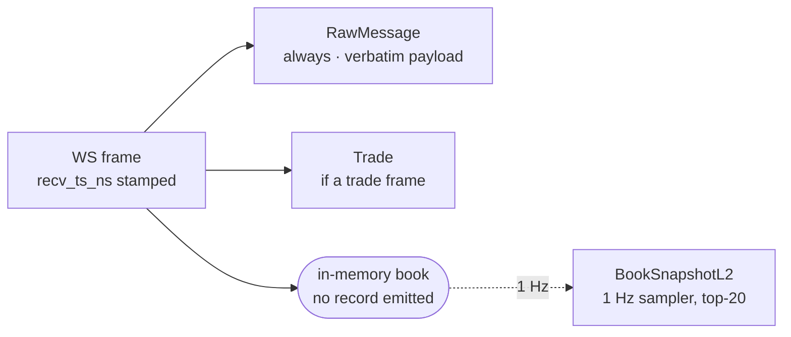

# Capacity model — v3 capture and lake tiers

**Status: predictions only. Written 2026-08-26, in Phase C, before the first burn-in
sample exists.** Every row below is a forecast, labelled `predicted`, naming the
assumption it rests on and the input it was derived from. Phase F adds two columns —
`measured` and `error %` — from the 24 h burn-in ([`005-phase-f-notebooks-numbers-docs.md`](../plans/2026-08-26-v3-quant-research-platform/005-phase-f-notebooks-numbers-docs.md)).

**The predicted values are never edited afterwards.** A row that turns out 3× wrong
stays on the page exactly as written, with one line naming the assumption that was
wrong. That is the whole point of the document, and it is the answer given to
[Q2 of the v3 requirements clarification](../research/2026-08-26-v3-requirements-clarification.md):
predict, then measure, and keep the error. An estimate that was never written down
cannot be scored, and an engineer who never scores an estimate does not get better at
making them.

Scope: the three Rust `k2-capture` containers ([`002-phase-c-rust-capture.md`](../plans/2026-08-26-v3-quant-research-platform/002-phase-c-rust-capture.md)),
the Redpanda topics they write, and the Iceberg tables the lake tier derives from those
topics. Budget under test: 16 CPU / 40 GB single host ([ADR-010](../adr/ADR-010-resource-budget.md)).

**Honest framing.** Exactly one input below was measured on a running system at
1× production load: the v2 trade rate. Two more come from 12–15 second exploratory
spikes against live exchange sockets. Everything else is arithmetic on top of a stated
guess. Section 8 says which command settles which row.

---

## 1. Inputs

| # | Input | Value | Source |
|---|-------|-------|--------|
| I1 | Kraken `book` frame rate, BTC/USD, depth 25 | 944 frames / 12 s = **78.7 frames/s**, one symbol | Spike S2, [ADR-018 Appendix A](../adr/ADR-018-v3-lake-first-rust-capture.md#s2--kraken-instrument-channel) |
| I2 | Coinbase frame mix, 2 symbols, one connection | 677 frames / 15 s = **45.1 frames/s**; `l2_data` 527, `market_trades` 133, `heartbeats` 14, `subscriptions` 3 | Spike S5, [ADR-018 Appendix A](../adr/ADR-018-v3-lake-first-rust-capture.md#s5--coinbase-level2-without-jwt) |
| I3 | Coinbase BTC-USD full-depth snapshot | **5,195,904 B / 43,974 levels** in a single frame | Spike S5 (same run as I2) |
| I4 | v2 trade rate, all exchanges | **~150 msg/s across three exchanges** — the "Window" line of the v2 baseline: *"1 hour, 1× baseline load (~150 msg/s across three exchanges)"* | [`docs/benchmarks/2026-02-19-v2-baseline.md`](../benchmarks/2026-02-19-v2-baseline.md) — **the only input here taken from a running system at 1× load** |
| I5 | Instrument count | binance **12**, kraken **11**, coinbase **11** = **34** | [`config/instruments.yaml`](../../config/instruments.yaml) |
| I6 | Binance `<sym>@depth20@100ms` cadence | **≤10 partial books/s/symbol**, by construction — the stream is a fixed 100 ms tick, not an event stream | Binance stream contract, recorded in [the v3 plan's ground truth](../plans/2026-08-26-v3-quant-research-platform/README.md) |
| I7 | Book snapshot emit cadence | **1 Hz × symbols** (`K2_SNAPSHOT_INTERVAL_MS`) | [`002-phase-c-rust-capture.md`](../plans/2026-08-26-v3-quant-research-platform/002-phase-c-rust-capture.md) Scope |
| I8 | `RawMessage.payload` | the frame **byte for byte**, never compressed in-field, never re-serialised | [`schemas/avro/raw-message.avsc`](../../schemas/avro/raw-message.avsc) |
| I9 | Capture container limits | `capture-binance` / `capture-kraken` 0.25 CPU / 256 M; `capture-coinbase` 0.25 CPU / 512 M | [`002-phase-c-rust-capture.md`](../plans/2026-08-26-v3-quant-research-platform/002-phase-c-rust-capture.md) Scope |
| I10 | Steady-state budget before the Phase C cutover (v2 + Lakekeeper) | **15.35 CPU / 22.125 GB**; bootstrap peak **16.85 CPU / 23.625 GiB** | [ADR-010 Outcome addendum](../adr/ADR-010-resource-budget.md#outcome-addendum-v3-phase-b-2026-08-26) |

> **I10, as of 2026-08-26 (Phase D).** The predictions below were computed against the Phase B
> figures in the row above and are left as computed. Since then the three Kotlin feed handlers
> retired ([ADR-019](../adr/ADR-019-rust-capture-tier.md)) and this branch added `lake-metrics`
> and the `lake-ddl` one-shot: steady state is now **14.70 CPU / 21.750 GiB across 16
> long-running services** and the bootstrap peak **16.70 CPU / 24.250 GiB across 21** —
> `docker compose --env-file .env.example config`, limits summed
> ([command](../operations/docker-resources.md#how-these-numbers-are-produced)).

| I11 | Host filesystem free space | **212 GiB free of 961 GiB** on `/` (Docker root) | `df -BG /var/lib/docker`, 2026-08-26 |
| I12 | librdkafka producer queue cap | `queue.buffering.max.kbytes=32768` = **32 MiB** | [`002-phase-c-rust-capture.md`](../plans/2026-08-26-v3-quant-research-platform/002-phase-c-rust-capture.md) Scope |

### Stated guesses — the inputs with no measurement behind them at all

| # | Guess | Value | Why this value |
|---|-------|-------|----------------|
| G1 | **Tail-symbol decay.** The spikes sampled BTC-quoted majors. Non-major instruments are assumed to run at **1/3** the major's frame rate. | ×0.333 | A round number chosen deliberately over a fitted one, so that the error is attributable to *this line* rather than to a curve. |
| G2 | **Broker-side compression ratio on exchange JSON** in Redpanda, whole-batch | **0.40** of raw | The codec is **zstd, producer-side** — `compression.type=zstd` in `services/capture-rust/src/sink.rs`; no `compression.codec` is set on the v3 topics, so batches land on disk as the producer compressed them. The 0.40 is an lz4-era midpoint (lz4 on repetitive JSON typically lands 0.35–0.45) and is therefore **conservative**: one captured 4,803,578-byte Coinbase `level2` snapshot compressed to 383,011 bytes, 12.5:1 at `zstd -3` (`services/capture-rust/README.md`). That is one frame of one shape, not a whole-topic ratio, so the prediction is left at 0.40 and scored in Phase F rather than adjusted on a single sample. |
| G3 | **zstd-3 ratio on `raw.messages.payload`** in Parquet | **0.20** of raw | The row [Q2 flags as most likely to miss](../research/2026-08-26-v3-requirements-clarification.md#q2--estimation-are-capacity-numbers-predicted-or-only-reported): the payload is an opaque `bytes` column, so Parquet's dictionary and RLE encodings do nothing for it and only the zstd block codec applies. |
| G4 | **zstd-3 ratio on the derived columnar tables** (`bronze.trades` 0.10, `bronze.book_snapshots_l2` 0.15) | 0.10 / 0.15 | These *are* dictionary- and delta-encodable — repeated symbols, near-identical int64 magnitudes — so they should beat G3 by ~2×. |
| G5 | **Per-frame capture cost**, single-threaded: parse + book apply + CRC32 + Avro encode + produce-enqueue | **~20 µs/frame** | Built up component by component in §3; rounded **up** from a ~13 µs component sum to absorb cache misses and the sampler. |
| G6 | **Rust `BTreeMap<i64,i64>` cost per live book level** | **~28 B/entry** | A `std` B-tree leaf holds ≤11 pairs in ~192 B of node; at a typical ~8/11 fill that is 24 B/entry, +~10 % for internal nodes. |
| G7 | **tokio + rustls + metrics runtime floor**, per container | **0.02 CPU / 8 MB** | Flat overhead not attributable to any frame; a guess with no component breakdown behind it. |

---

## 2. Per-stream message rates

**How one inbound frame becomes records** — this fan-out is why §4's byte totals are
dominated by the raw topic rather than by the products:

Every frame writes a `RawMessage`. Book *deltas* write nothing but state — the L2
product is sampled at 1 Hz off that state, not emitted per delta. So book frames are
cheap in record count and expensive in bytes, and trades are the reverse.

### 2a. Trades in

| Stream | predicted | Assumption | Derived from |
|---|---|---|---|
| Trades/s per instrument (all venues) | **4.41** | Trade rate is roughly uniform across the 34 instruments in the registry | I4 ÷ I5: `150 ÷ 34 = 4.41` |
| binance `@trade` | **52.9 /s** | as above | `12 × 4.41` |
| kraken v2 `trade` | **48.5 /s** | as above | `11 × 4.41` |
| coinbase `market_trades` | **48.5 /s** | as above | `11 × 4.41` |
| **All trades in** | **150 /s** | — | sum, and equal to I4 by construction |

**Corroboration, unplanned.** Spike S5 saw 133 `market_trades` frames in 15 s over
2 symbols — `133 ÷ 15 ÷ 2 = 4.43` trades/s/symbol, against 4.41 derived independently
from the v2 benchmark and the instrument count. Two unrelated inputs agreeing to
0.5 % is the strongest thing on this page, and it is still only two data points.

### 2b. Book frames in

| Stream | predicted | Assumption | Derived from |
|---|---|---|---|
| binance `@depth20@100ms` | **120 /s** | Fixed 100 ms cadence per symbol; no decay applies, because the stream ticks whether or not the book moved | I6 × I5: `10 × 12 = 120` |
| kraken v2 `book` depth 25 | **340.9 /s** | BTC/USD at the spike rate; the other 10 symbols at G1 | I1, G1: `78.7 × (1 + 10/3) = 340.9` |
| coinbase `level2` | **87.8 /s** | The 2 spike symbols are majors at `527 ÷ 15 ÷ 2 = 17.57` /s each; the other 9 at G1 | I2, G1: `17.57 × (2 + 9/3) = 87.8` |
| **All book frames in** | **548.7 /s** | — | sum |

The Kraken number is the one to watch: a depth-25 event stream on one major produces
**7.9× more frames than Binance's entire 12-symbol depth stream per symbol**
(78.7 vs 10 /s), because Binance conflates to a 100 ms grid and Kraken does not.

### 2c. Raw frames in, and records out

Control frames: coinbase `heartbeats` at `14 ÷ 15 = 0.93` /s (I2); kraken `instrument`
at ~0.1 /s (assumed — it publishes on status change, and S2 saw it once at connect);
binance ping/pong ~0 /s.

| Exchange | Raw frames in, predicted | Records produced /s, predicted | Assumption | Derived from |
|---|---|---|---|---|
| binance | **172.9 /s** | **237.9 /s** | 1 raw + 1 trade per trade frame; 1 raw per book frame; 12 snapshots/s | in `52.9 + 120 + 0`; out `172.9 + 52.9 + 12` |
| kraken | **389.5 /s** | **449.0 /s** | as above, 11 snapshots/s | in `48.5 + 340.9 + 0.1`; out `389.5 + 48.5 + 11` |
| coinbase | **137.3 /s** | **196.8 /s** | as above, 11 snapshots/s; heartbeats are archived, not dropped (I8) | in `48.5 + 87.8 + 0.93`; out `137.3 + 48.5 + 11` |
| **Total** | **699.8 /s** | **883.8 /s** | — | sum |

For scale: v2 moved 150 msg/s of trades only. v3 predicts **~700 frames/s in and
~884 records/s out** — a **4.7× / 5.9×** increase, bought entirely by adding L2 and by
archiving verbatim.

---

## 3. Per-core throughput of one capture container

### 3a. Where the 20 µs goes

The `handle_frame` path is pure and single-threaded on a `current_thread` tokio runtime
(no internal channels — librdkafka's queue is the only buffer). Cost per frame,
built up component by component:

| Component | predicted | Assumption | Derived from |
|---|---|---|---|
| `serde_json` parse, ~700 B frame | **~4.7 µs** | serde_json sustains ~150 MB/s on small JSON documents | `700 B ÷ 150e6 B/s` |
| Book apply, ~20 level updates | **~2.0 µs** | `BTreeMap` insert/remove at ~100 ns on a warm few-thousand-entry map | `20 × 100 ns` |
| CRC32 over the checksum string (Kraken only) | **~0.05 µs** | `crc32fast` uses SSE4.2/CLMUL at ~10 GB/s over a ~500 B string | `500 B ÷ 10e9 B/s` — **negligible, and worth saying so**: the checksum is free, so verifying every update costs nothing |
| Avro encode, `apache-avro` | **~3.0 µs** | Fixed-point int64 only, no `f64`, no decimal logicalType — varint zigzag over ~40 fields | component guess |
| `rdkafka` produce enqueue | **~2.0 µs** | A memcpy into the librdkafka queue; no I/O and no broker RTT on the calling thread | component guess |
| Verbatim payload copies for `RawMessage` | **~1.0 µs** | Two ~700 B copies (socket buffer → record → Avro buffer) at ~2 GB/s | `2 × 700 B ÷ 2e9 B/s` |
| **Component sum** | **~12.8 µs** | | |
| **G5, rounded up** | **20 µs** | +56 % for cache misses, allocator, the 1 Hz sampler and TLS record framing | stated guess G5 |

| Metric | predicted | Assumption | Derived from |
|---|---|---|---|
| Frames/s per full core | **50,000** | G5 holds and the path stays branch-predictable | `1 ÷ 20e-6` |
| Frames/s at the 0.25 CPU limit | **12,500** | The cgroup quota is the ceiling; `cpuset` pinning keeps it off ClickHouse's cores | `50,000 × 0.25` |

### 3b. Predicted CPU per container against the 0.25 limit

| Container | Frame CPU, predicted | + runtime (G7) | vs 0.25 limit | Derived from |
|---|---|---|---|---|
| `capture-binance` | **0.0035 core** | **0.024 core** | **9.4 %** | `172.9 × 20 µs = 3,458 µs/s` |
| `capture-kraken` | **0.0078 core** | **0.028 core** | **11.1 %** | `389.5 × 20 µs = 7,790 µs/s` |
| `capture-coinbase` | **0.0027 core** | **0.023 core** | **9.1 %** | `137.3 × 20 µs = 2,746 µs/s` |
| **All three** | **0.014 core** | **0.074 core** | **9.9 % of 0.75** | sum |

Two one-off costs excluded from the steady state and called out rather than buried:

- **Coinbase connect burst.** The 5.2 MB / 43,974-level snapshot (I3) parses in
  `5.2e6 ÷ 150e6 ≈ 35 ms`; 11 symbols snapshot serially on one connection at connect,
  so **~380 ms of single-threaded work** at every reconnect. At a 0.25 CPU quota that
  stretches to **~1.5 s of wall time**. Predicted, and the reason the Coinbase
  container gets 512 M rather than 256 M.
- **Binance 23 h scheduled reconnect** — one connect burst per day per container,
  negligible against the above. Implemented as `BINANCE_MAX_CONNECTION_AGE` /
  `connection_expired()` in `services/capture-rust/src/main.rs`, ahead of the venue's
  own 24 h cut-off, and counted as
  `k2_capture_reconnects_total{exchange="binance",reason="scheduled"}`. Kraken and
  Coinbase publish no connection lifetime and have no equivalent burst.

**Sanity anchor.** The v2 Kotlin handler measured 0.03 CPU / 134 MiB doing trades only
([ADR-010 Outcome](../adr/ADR-010-resource-budget.md#outcome-as-built-2026-02)).
Rust is predicted at 0.023–0.028 CPU while handling **4.7× the frame rate** and
maintaining book state the JVM never touched. If Phase F comes back showing Rust at
parity with the JVM per-frame, G5 was wrong by roughly 5× and this is the row that
says so.

---

## 4. Bytes/day

### 4a. Record sizes on the wire

Avro binary, plus the 5-byte Confluent framing (magic byte + schema id) that
`schema_registry_converter` writes.

| Record | predicted size | Assumption | Derived from |
|---|---|---|---|
| `RawMessage` envelope (all fields but `payload`) | **~90 B** | `exchange` 9 + `stream` 13 + `symbol` 9 + `recv_ts_ns` 9 (zigzag varint on ~1.8e18) + `conn_id` 37 (UUID) + `conn_msg_seq` 5 + array/len bytes 3 + Confluent header 5 | field-by-field over [`raw-message.avsc`](../../schemas/avro/raw-message.avsc) |
| `Trade` | **~120 B** | 12 fields, all fixed-point int64 or short strings; `trade_id` ~12 B, `conn_id` 37 B dominates | field-by-field over [`trade.avsc`](../../schemas/avro/trade.avsc) |
| `BookSnapshotL2` | **~600 B** | 4 parallel arrays × 20 longs: prices ~7 B, quantities ~5 B zigzag → `20×(7+5)×2 = 480 B`, + ~110 B scalars + 5 B header | field-by-field over [`book-snapshot-l2.avsc`](../../schemas/avro/book-snapshot-l2.avsc) |
| binance payload, trade frame | **~230 B** | compact JSON, no nesting | frame-shape guess |
| binance payload, `depth20` frame | **~1,100 B** | 40 levels × ~26 B (`["43210.50","0.05432"]`) + ~120 B envelope | `40 × 26 + 120` |
| kraken payload, book update | **~300 B** | v2 updates carry 1–3 levels plus a checksum and a timestamp | frame-shape guess |
| coinbase payload, `level2` update | **~350 B** | verbose envelope: `product_id`, per-level `event_time`, `side` as `bid`/`offer` | frame-shape guess |
| coinbase payload, `market_trades` | **~400 B** | UUID `trade_id` and a full product envelope | frame-shape guess |

Weighted average payload per exchange, predicted: binance **834 B**
(`(52.9×230 + 120×1100) ÷ 172.9`), kraken **300 B**, coinbase **367 B**
(`(48.5×400 + 87.8×350 + 0.93×200) ÷ 137.3`).

### 4b. Per topic, per day

| Topic | Uncompressed/day, predicted | On disk after compression (G2), predicted | Assumption | Derived from |
|---|---|---|---|---|
| `market.crypto.v3.raw.binance` | **13.80 GB** | **5.52 GB** | 924 B/record incl. envelope | `924 × 172.9 × 86,400` |
| `market.crypto.v3.raw.kraken` | **13.13 GB** | **5.25 GB** | 390 B/record | `390 × 389.5 × 86,400` |
| `market.crypto.v3.raw.coinbase` | **5.42 GB** | **2.17 GB** | 457 B/record | `457 × 137.3 × 86,400` |
| **raw, all three** | **32.34 GB** | **12.94 GB** | G2 | sum |
| `market.crypto.v3.trades.*` (3 topics) | **1.555 GB** | **0.544 GB** | trades compress worse than raw JSON — already dense binary, so 0.35 rather than 0.40 | `120 B × 150/s × 86,400 = 1.555 GB`, `× 0.35` |
| `market.crypto.v3.book.*` (3 topics) | **1.763 GB** | **0.705 GB** | G2 | `600 B × 34/s × 86,400 = 1.763 GB`, `× 0.40` |
| **All 9 v3 topics** | **35.66 GB/day** | **14.19 GB/day** | — | sum |

**Raw is 91 % of the uncompressed bytes and 91 % of the disk.** That is the price of
"the lake is the system of record" and it is being paid deliberately: `BookSnapshotL2`
at 1 Hz is 5 % of the volume of the deltas it was sampled from, and the deltas are kept
anyway so that a deeper or faster book stays recoverable by replay.

### 4c. Per lake table, per day

| Iceberg table | Parquet + zstd-3, predicted | Assumption | Derived from |
|---|---|---|---|
| `raw.messages` | **6.47 GB/day** | G3 — opaque `bytes` column, only the block codec helps | `32.34 × 0.20` |
| `bronze.trades` | **0.156 GB/day** | G4 — dictionary on `symbol`/`exchange`/`side`, delta on timestamps, near-constant int64 magnitudes | `1.555 × 0.10` |
| `bronze.book_snapshots_l2` | **0.264 GB/day** | G4 — the four int64 arrays are tightly clustered in magnitude | `1.763 × 0.15` |
| **All lake tables** | **6.89 GB/day** | — | sum |

### 4d. Retention → disk

| Line | predicted | Assumption | Derived from |
|---|---|---|---|
| Redpanda, `raw.*` at 48 h retention | **25.9 GB** | steady state once retention saturates | `12.94 × 2` |
| Redpanda, `trades.*` at 7 d | **3.81 GB** | as above | `0.544 × 7` |
| Redpanda, `book.*` at 7 d | **4.94 GB** | as above | `0.705 × 7` |
| **Redpanda steady-state disk** | **34.6 GB** | Retention is time-based, so this scales linearly with message rate | sum |
| **MinIO growth** | **209.7 GB/month** | Lake retention is *forever* — no TTL, no expiry; only snapshot expiry (7 d) trims metadata, never data | `6.89 × 30.44` |
| MinIO, first year | **2.51 TB** | as above, at a constant 1× rate | `6.89 × 365 ÷ 1000` |

---

## 5. Memory

| Line | predicted | Assumption | Derived from |
|---|---|---|---|
| coinbase BTC-USD full book | **2.46 MB** | I3's 43,974 levels read as **per side** (the conservative reading); G6 at 28 B/entry | `43,974 × 2 × 28 B` |
| coinbase, all 11 symbols, **conservative** | **27.1 MB** | every symbol as deep as BTC-USD | `2.46 × 11` |
| coinbase, all 11 symbols, with G1 decay | **10.7 MB** | tail books are shallower in proportion to their frame rate | `2.46 × (1 + 10/3)` |
| kraken, all 11 symbols | **0.015 MB** | depth 25 per side, fixed — not a book to maintain, a window to hold | `25 × 2 × 11 × 28 B` |
| binance, all 12 symbols | **0 MB** | `@depth20@100ms` is a *partial-book stream*: each frame is a complete top-20, so there is no book state and no resync path — only a `lastUpdateId` regression check | I6, by construction |
| librdkafka queue at cap | **32 MiB** | Drop-on-full with a counter; the cap is reached only when the broker is unreachable | I12 |
| librdkafka fixed overhead | **~8 MB** | broker/topic/partition metadata for 3 topics | component guess |
| tokio + rustls + binary + metrics | **~8 MB** | G7 | stated guess |
| coinbase WS max-message-size buffer | **16 MB** | Set explicitly because Python's 1 MiB default died on the first snapshot (S5); 16 MiB is 3× the observed 5.2 MB | I3 |
| coinbase transient snapshot parse | **~25 MB peak** | a `serde_json` DOM of a 5.2 MB document costs ~5× the input; **at connect only** | `5.2 MB × 5` |

> **Note, 2026-08-26 — the queue-slack row above was scored and the prediction did not
> hold.** `32 MiB ÷ 164.3 kB/s` gives kraken **204 s** before the first record is dropped.
> The first chaos run
> ([`scripts/chaos/results/2026-08-26.tsv`](../../scripts/chaos/results/2026-08-26.tsv))
> measured the first drop at **102 s, −50 %**, with 231,744 records lost and **zero**
> carrying `reason="queue_full"`.
>
> **The arithmetic was not what was wrong.** `sink.rs` also set
> `message.timeout.ms=30000`, so records were failed on a 30 s timer regardless of how
> much of the 32 MiB was free — the queue's slack was never reachable and the drops were
> counted `delivery`. The prediction above is a bytes prediction and remains untested as
> one; what the run tested was the *smaller* of two caps, which is not the row's claim.
>
> The row is left as predicted, as this page's convention requires. The timeout is now
> 300 s ([ADR-019 Outcome](../adr/ADR-019-rust-capture-tier.md#measured-correction-2026-08-26--the-32-mib-buffer-was-unreachable)),
> which puts the queue back in front at binance and kraken rates — coinbase's 446 s still
> sits behind the 300 s timeout, so that venue's slack is capped by time by design.
> **Revisit when** `capture-queue-full.sh --exchange kraken` is re-run against a binary
> carrying `message.timeout.ms=300000`; that run scores the 204 s.

**Predicted RSS against the limits:**

| Container | Steady, predicted | Peak, predicted | Limit | Peak vs limit | Derived from |
|---|---|---|---|---|---|
| `capture-binance` | **60 MB** | **60 MB** | 256 M | **23 %** | `(8 + 8 + 32 + 2) × 1.2` allocator slack |
| `capture-kraken` | **60 MB** | **60 MB** | 256 M | **23 %** | `(8 + 8 + 32 + 2 + 0.015) × 1.2` |
| `capture-coinbase` | **109 MB** | **139 MB** | 512 M | **27 %** | steady `(8 + 8 + 32 + 27.1 + 16) × 1.2`; peak `+25 × 1.2` at connect |

**Sanity anchor.** The v2 Kotlin handler measured 134 MiB doing trades only. Rust at
60 MB for binance/kraken and 139 MB peak for coinbase-with-a-44k-level-book is a
prediction that the JVM heap floor, not the workload, was v2's memory cost. The
Coinbase 512 M limit exists for I3, not for the steady state — and if Phase F shows
`capture-coinbase` at 150 MB steady, the limit should be cut to 256 M in the same PR.

---

## 6. Headroom against 16 CPU / 40 GB

| Step | CPU, predicted | RAM, predicted | Derived from |
|---|---|---|---|
| Steady state before the cutover (v2 + Lakekeeper) | 15.35 | 22.125 GB | I10 — declared, not predicted |
| − 3 Kotlin feed handlers retired to `legacy/v2-kotlin/` | −1.50 | −1.50 GB | `3 × 0.5 CPU`, `3 × 512 M` |
| + 3 Rust capture containers | +0.75 | +1.00 GB | `3 × 0.25 CPU`; `256 M + 256 M + 512 M` |
| **Steady state after Phase C, predicted** | **14.60** | **21.625 GB** | sum |
| **Headroom vs 16 / 40** | **1.40 (8.8 %)** | **18.375 GB (45.9 %)** | `16 − 14.60`, `40 − 21.625` |

| Bootstrap peak | CPU, predicted | RAM, predicted | Derived from |
|---|---|---|---|
| Steady state after Phase C | 14.60 | 21.625 GB | above |
| + 4 one-shots running concurrently | +1.50 | +1.50 GB | [ADR-010 addendum](../adr/ADR-010-resource-budget.md#outcome-addendum-v3-phase-b-2026-08-26) one-shot table |
| **Bootstrap peak, predicted** | **16.10** | **23.125 GB** | sum |
| vs the current 16.85 / 23.625 GiB peak | **−0.75 CPU** | **−0.50 GB** | `16.85 − 16.10` |

> **Scored, 2026-08-26.** Phase C landed and the Kotlin handlers are out of
> `docker-compose.yml`. The measured declaration is **14.60 CPU / 21.625 GiB across
> 15 steady services**, bootstrap peak **16.10 CPU / 23.125 GiB across 19** — both
> predictions exact, because every term in them is a declared limit rather than an
> estimate. Provenance and the command:
> [ADR-010 Kotlin-retirement addendum](../adr/ADR-010-resource-budget.md#outcome-addendum-kotlin-retirement-2026-08-26).
> The predicted values above are left as written.

Three things worth saying plainly:

1. **The swap is net-positive on CPU by 0.75 cores.** ADR-010's addendum predicted the
   Rust tier would be "net-neutral to net-positive" and budgeted it under 1.5 CPU; at
   0.75 it lands at half that. The addendum's stated trigger — *"if it is not, this
   Outcome gets a second addendum before Phase D"* — is not fired by these numbers.
2. **The bootstrap peak stays over 16 cores, at 16.10.** It improves but does not
   resolve. The acceptance argument is unchanged and still the right one: a CPU limit
   is a ceiling on scheduling, not a reservation, and the one-shots live for seconds.
3. **Limits are not usage.** Predicted *actual* capture usage is 0.074 CPU / ~0.26 GB
   across all three containers (§3b, §5) against 0.75 CPU / 1.0 GB of declared limit —
   a 10× overprovision that exists so a burst does not throttle the only tier with no
   upstream backpressure.

---

## 7. Bottleneck prediction

Each resource, and the multiple of today's 1× rate at which it binds:

| Rank | Resource | Binds at, predicted | Assumption | Derived from |
|---|---|---|---|---|
| **1** | **Host disk, from lake growth** | **not a multiple — a date: ~26 days** | The lake has no TTL by design. Growth is a *calendar* problem, not a load problem, and it is the only unbounded line on this page. | `(212 GiB free − 34.6 GB Redpanda) ÷ 6.89 GB/day` (I11, §4d) |
| 2 | Redpanda disk at 48 h raw retention | **~5.8×**, if 200 GB is allocated to it | Time-based retention scales disk linearly with rate | `200 GB ÷ 34.6 GB` (§4d) |
| 3 | `capture-coinbase` RSS | **~12.5×** on **book depth** — *not* on message rate | Only the book scales with depth: fixed cost is `(8+8+32+16)×1.2 + 25×1.2 = 106.8 MB`, book cost `27.1×1.2 = 32.5 MB`. A market-wide depth increase binds this; a trade-rate spike does not touch it. | `(512 − 106.8) ÷ 32.5` (§5) |
| 4 | Total CPU budget headroom | **~19×** on capture usage alone | 1.40 cores of headroom ÷ 0.074 predicted usage — but this is headroom for *everything*, not just capture | `1.40 ÷ 0.074` (§3b, §6) |
| 5 | Capture CPU (`capture-kraken`, the busiest) | **~32×** | G5 holds and the 0.25 CPU quota is the ceiling | `12,500 frames/s ÷ 389.5 frames/s` (§3) |
| 6 | Redpanda broker CPU | **~113×** | ADR-010's "2 cores handles 100 K msg/s" | `100,000 ÷ 883.8 records/s` |
| 7 | ClickHouse hot-tier ingest | **>100×** | 884 records/s against a store that absorbed 236 K rows/s on the v2 offload path | [v2 baseline, cold tier throughput](../benchmarks/2026-02-19-v2-baseline.md) |

**The prediction, in one sentence: disk binds first, and it binds on a calendar rather
than on a multiple — ~26 days from a cold start on the current host, because
`raw.messages` grows 6.5 GB/day forever and nothing in the v3 design deletes it.**

This is the useful output of the whole document, and it is a design finding rather than
a sizing one. Three responses exist and none is chosen here:

- Compress harder at the source (the payload is already the exchange's own JSON; a
  per-topic zstd on Redpanda would help G2 but not G3).
- Tier `raw.messages` older than N days to a cheaper store — which reopens the
  system-of-record question ADR-018 just closed.
- Buy disk. On a single-host portfolio platform this is the honest answer, and it is
  the one that keeps ADR-018's guarantee intact.

What is *not* predicted to bind: CPU, at any tier, at any plausible multiple. v2's
constraint was CPU ([ADR-010 addendum](../adr/ADR-010-resource-budget.md#outcome-addendum-v3-phase-b-2026-08-26):
*"CPU headroom is now the tight axis at 0.65 cores"*). v3's is predicted to be bytes.
If Phase F confirms that, the ADR-010 Outcome gets a line saying the binding axis moved.

---

## 8. How this table is settled

Phase F runs a 24 h burn-in and fills `measured` + `error %` for every row above. One
command per row, so that no number on this page is settled by inspection.

| Section | Row | Command that settles it |
|---|---|---|
| §2a | trades/s per exchange | `curl -s --get localhost:9090/api/v1/query --data-urlencode 'query=rate(k2_capture_records_produced_total{kind="trade"}[5m])'`. **Not** `curl localhost:8082/metrics`: the capture metrics port is not published to the host and the distroless image has no `curl`, so the endpoint is reachable only through Prometheus or a one-shot `curlimages/curl` container on the compose network (verified 2026-08-26). This counter is the local **enqueue**; `k2_capture_records_delivered_total` is what the broker acknowledged |
| §2b | book frames/s per exchange | same endpoint, `k2_capture_messages_total{stream="book"}` (`depth20@100ms`, `book`, `level2` per venue), differenced over 60 s |
| §2c | raw frames/s, records/s | `k2_capture_messages_total` and `k2_capture_records_produced_total`, summed across streams, over the full 24 h window, through Prometheus as in §2a. Use `records_delivered_total` instead if the question is what actually reached the broker |
| §3b | CPU per container | `docker stats --no-stream --format '{{.Name}} {{.CPUPerc}} {{.MemUsage}}' capture-binance capture-kraken capture-coinbase`, sampled every 60 s for 24 h and averaged — a single `--no-stream` sample is not an answer |
| §3a | µs/frame | derive: measured CPU-seconds ÷ measured frames, i.e. `(docker stats CPU% × 86,400) ÷ Δk2_capture_messages_total` — this is what scores G5 |
| §3b | Coinbase connect burst | `k2_capture_reconnects_total` (sum over the `reason` label, or `reason="involuntary"` to exclude Binance's scheduled recycle) cross-referenced with the CPU sample series; expect a visible ~1.5 s spike per reconnect |
| §4b | bytes/day per topic, uncompressed | `k2_capture_bytes_total` differenced over 24 h, per topic |
| §4b | bytes/day per topic, on disk | `rpk topic describe -p market.crypto.v3.raw.binance` (and the other 8) — sum `HIGH-WATERMARK` deltas against `rpk cluster logdirs describe` for on-disk size; scores G2 |
| §4c | bytes/day per lake table | `mc du --depth 3 k2/k2-lake/` before and after the 24 h window, per table prefix; scores G3 and G4 |
| §4c | rows/day per lake table | `SELECT COUNT(*) FROM k2.raw.messages` etc. via DuckDB over the pinned snapshot; cross-check against §2c |
| §4d | Redpanda steady-state disk | `rpk cluster logdirs describe` after retention saturates — i.e. **≥48 h after start**, not at the end of the burn-in if the burn-in is 24 h |
| §4d | MinIO growth/month | `mc du k2/k2-lake/` at the start and end of the window, extrapolated ×30.44 |
| §5 | RSS per container | `docker stats` `MemUsage` from the same 60 s sample series as §3b; take max and p50, not the last value |
| §5 | book levels held | `curl -s --get localhost:9090/api/v1/query --data-urlencode 'query=k2_capture_book_depth'` — per symbol, which scores G1 and G6 together. Same reachability caveat as §2a: port 8082 is not published |
| §5 | Coinbase snapshot parse peak | `k2_capture_book_levels_total` at connect vs the RSS series; expect the peak within 2 s of a `k2_capture_reconnects_total{reason="involuntary"}` increment |
| §6 | steady-state CPU / RAM limits | `docker compose config \| yq '[.services[].deploy.resources.limits]'` summed — the same provenance ADR-010's addendum used |
| §6 | bootstrap peak | as above, including the four one-shot services |
| §7 | days-to-full | `df -BG /var/lib/docker` at the start and end of the window; the slope is the answer |
| §7 | multiples | derived from the rows above; no separate command |

**Load multiples are not in this list on purpose.** §7's multiples are extrapolations
from a 1× burn-in, not measurements. Proving `~5.8×` would need a Redpanda replay at
that multiple — the 5× / 10× test that
[v2 recorded the method for and never ran](../benchmarks/2026-02-19-v2-baseline.md).
Phase F inherits that gap rather than closing it, and this line is here so the gap is
stated rather than implied.

---

## Related

- [ADR-010](../adr/ADR-010-resource-budget.md) — the 16 CPU / 40 GB budget and its Outcome
- [ADR-018](../adr/ADR-018-v3-lake-first-rust-capture.md) — lake-first, Rust capture; Appendix A holds spikes S2 and S5
- [Q2, v3 requirements clarification](../research/2026-08-26-v3-requirements-clarification.md) — why this document is predicted-first
- [Phase C](../plans/2026-08-26-v3-quant-research-platform/002-phase-c-rust-capture.md) — the capture tier being sized
- [v2 baseline benchmark](../benchmarks/2026-02-19-v2-baseline.md) — the only 1× input on this page
