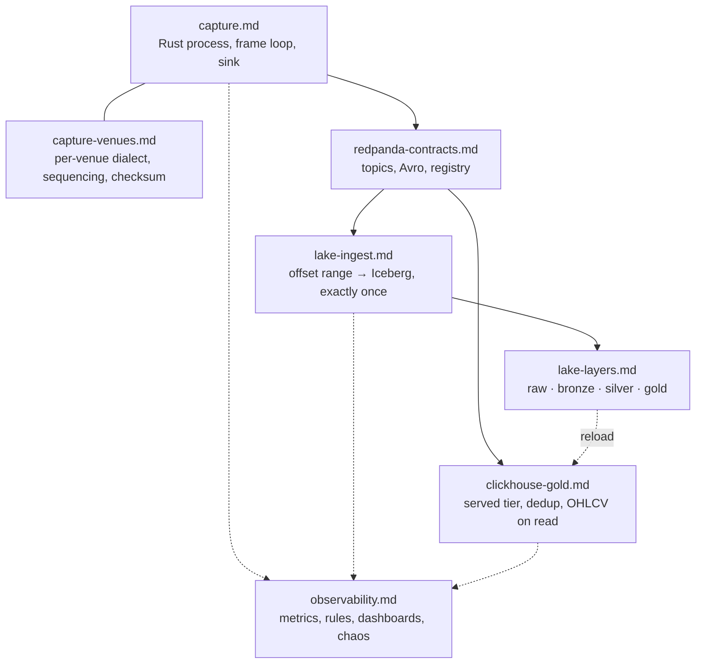

# Components

One page per component: how it is built, how it works, what it trades away, and a
**Practices** table naming where each practice is enforced — a file, a test, an alert —
so every claim can be checked. Numbers are cited to [`../../benchmarks/`](../../benchmarks/README.md),
decisions to [`../../adr/`](../../adr/README.md).

| Page | Read it for |
|---|---|
| [capture.md](capture.md) | one binary, one socket per venue, `recv_ts` before parse, drop-on-full sink |
| [capture-venues.md](capture-venues.md) | what Binance, Kraken and Coinbase each send, and how gaps, checksums and resyncs are handled |
| [redpanda-contracts.md](redpanda-contracts.md) | nine topics, three Avro records, fixed-point `int64`, registry compatibility |
| [lake-ingest.md](lake-ingest.md) | offsets committed in the Iceberg snapshot; incremental layers; nightly audits |
| [lake-layers.md](lake-layers.md) | what each of raw, bronze, silver, gold holds and why the boundary sits there |
| [clickhouse-gold.md](clickhouse-gold.md) | `ReplacingMergeTree` dedup contract, candles on read, reload from the lake |
| [observability.md](observability.md) | 28 rules with runbooks and unit tests, four dashboards, chaos scripts with timed recovery |
