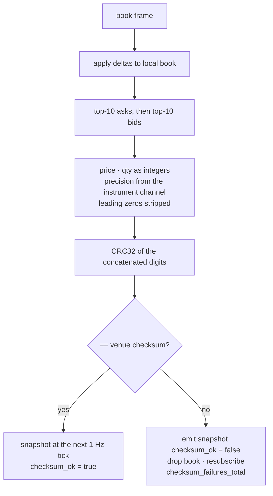

# Capture — venue dialects

What each venue sends, what continuity signal it offers, and what `k2-capture` does when
that signal breaks. The process is in [capture.md](capture.md); the policy is
[ADR-027](../../adr/ADR-027-book-snapshot-and-sequencing.md); the code is
`services/capture-rust/src/exchanges/{binance,kraken,coinbase}.rs`.

| | Binance | Kraken (WS v2) | Coinbase (Advanced Trade) |
|---|---|---|---|
| Streams on the one socket | `<sym>@trade`, `<sym>@depth20@100ms` via `/stream?streams=` — no subscribe frame | `trade`, `book` (depth 25), `instrument`, `heartbeat`, `status` | `market_trades`, `level2`, `heartbeats` |
| Book model | complete top-20 partial every 100 ms; no local state | snapshot + deltas, local book | snapshot + absolute-quantity updates, local full-depth `BTreeMap` |
| Continuity signal | `lastUpdateId` strictly increasing per symbol | CRC32 over top-10 asks then bids on every `book` frame; no sequence numbers | `sequence_num`, one counter across every channel on the connection |
| On failure | drop that book; `Resubscribe` — the next partial is a complete top-20 | emit one last snapshot with `checksum_ok=false`, drop the book, unsubscribe + subscribe that symbol | drop every book; `Reconnect` — a gap cannot be attributed to one product |
| Trade id | venue `t` | venue `trade_id` (v1 had none — v2 was a reason to move) | venue `trade_id`; the subscribe-time snapshot carries history, excluded from the latency histogram |
| Connection lifetime | venue closes at 24 h; capture reconnects at 23 h (`reason="scheduled"`) | none published | none published |

## Kraken checksum

The digit rendering (`decimal.checksum_digits`) depends on each pair's `price_precision`
and `qty_precision`, taken from the `instrument` channel; frames that arrive before the
precision is known are held (up to 512) rather than checked against a guess. The
documented Kraken example (`3310070434`) is a unit test. The lake replays the same
algorithm over every archived frame ([lake-layers.md](lake-layers.md)), so a checksum that
passed live and fails in replay means the archive has a hole.

## What is measured

Per venue counters, all on `:8082/metrics`: `gaps_total`, `checksum_failures_total`,
`resyncs_total`, `reconnects_total{reason}`, `produce_errors_total{reason}`,
`precision_loss_total`, `exchange_to_recv_seconds` histogram, `book_depth`,
`book_levels_total`. The 6.5 h window on 2026-08-27 read 0 gaps on all three venues and
0 checksum failures over 14.1 M Kraken frames
([benchmarks](../../benchmarks/2026-08-27.md#ingestion--capture-tier)).

## Practices

| Practice | Where it is enforced |
|---|---|
| Continuity checked on every frame | `lastUpdateId` / CRC32 / `sequence_num` in each adapter; `CaptureSequenceGaps`, `CaptureChecksumFailure` alerts |
| Failure is visible before it is repaired | Kraken marked snapshot emitted **before** the book is dropped (`kraken.rs`); consumers can filter `checksum_ok = false` |
| Resync is the venue's job, not ours | no book is rebuilt from guesses; a fresh venue snapshot is the only repair |
| Venue example is a test | `decimal.rs` / `kraken.rs` tests against Kraken's published checksum example |
| Recorded sessions replay | `k2-capture record` fixtures in `tests/fixtures/`, sha256-pinned, run in CI |
| Pre-empt known limits | Binance 23 h scheduled reconnect; 8 MiB frame cap sized to Coinbase's snapshot |
