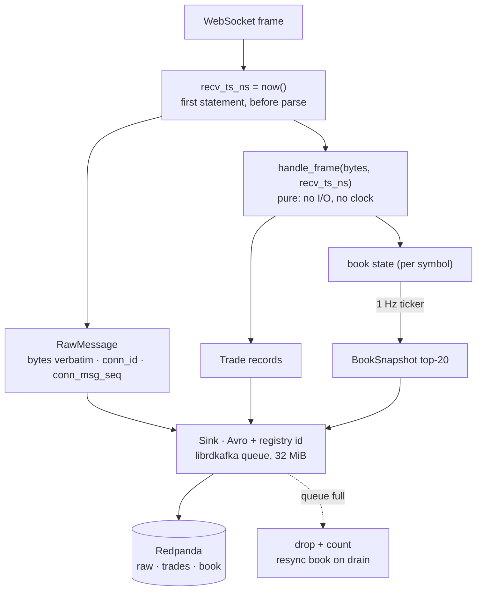

# Capture — `k2-capture`

One Rust binary ([`services/capture-rust/`](../../../services/capture-rust/README.md)), one
container per venue, one WebSocket per container carrying trades and L2 book. Its job is to
receive everything, stamp it, and hand it to Redpanda without interpretation getting in the
way: every frame is published verbatim before anything is parsed. Why Rust and not the JVM
tier it replaced: [ADR-019](../../adr/ADR-019-rust-capture-tier.md). Venue specifics:
[capture-venues.md](capture-venues.md).

## Frame loop

- **Runtime.** `tokio` `current_thread`: the container has 0.25 CPU, and one thread reading
  one socket is the whole workload. No internal channels; librdkafka's queue is the only
  buffer, so memory is bounded by one number (`queue.buffering.max.kbytes = 32768`).
- **Clock.** `recv_ts_ns` is wall-clock nanoseconds taken as the first statement after the
  frame leaves the socket (`ws.rs`). It travels in the record body and as a Kafka header, so
  the lake can measure venue→K2 latency per row without trusting any later clock.
- **Adapter contract.** `Adapter::handle_frame(&mut self, bytes, recv_ts_ns) -> Handled`
  (`exchanges/mod.rs`) is pure: it mutates book state and returns records plus an `Action`
  (resubscribe, reconnect). The same function runs in production and in the replay tests
  over recorded fixtures (`tests/fixtures/*.jsonl`, sha256-pinned).
- **Numbers.** `decimal.rs` parses venue strings straight to `i64` at 1e-8
  (`SCALE = 100_000_000`); a value with more than 8 decimals is counted in
  `k2_capture_precision_loss_total`, never rounded silently. No `f64` on the path.
- **Sink.** `sink.rs` encodes Avro with the registry id in the Confluent 5-byte header,
  keys by canonical symbol, and produces with `enable.idempotence`, `acks=all`, zstd, an 8 MiB
  message cap (Coinbase's subscribe snapshot is ~5 MB) and a 30 s message timeout. A full
  queue drops the record and counts it; `resync.rs` remembers which book streams dropped and
  resubscribes them once a tick passes with no drops, so the book is never silently stale.
- **Lifecycle.** `Backoff` reconnects with exponential delay; each connection gets a fresh
  `conn_id` and `conn_msg_seq` restarts at 0, so `(conn_id, conn_msg_seq)` is a
  primary key across the archive. SIGTERM flushes the queue for 5 s, then exits.
- **Image.** `cargo-chef` layers so a code change does not recompile librdkafka; release
  profile `lto = "thin"`, `strip = true`; final stage `distroless/cc-debian12:nonroot`. No
  shell, so `k2-capture healthcheck` backs the Compose healthcheck.

## Practices

| Practice | Where it is enforced |
|---|---|
| Timestamp before parse | `ws.rs` `now_ns()` at frame receipt; carried in body + header (`record.rs`) |
| Pure parsing, replayable | `handle_frame` has no I/O; `tests/replay*.rs` run fixtures through it |
| No floats for money | `decimal.rs` `parse_fixed` + tests; `precision_loss_total` counter and `CapturePrecisionLoss` alert |
| Bounded memory, explicit loss | single librdkafka queue; `produce_errors_total{reason}`; `CaptureProduceErrors`, `CaptureProduceStalled` |
| Every frame kept | `RawMessage` produced before decode; lake `bronze_parity` audit proves nothing was lost after |
| Config is data | `config/instruments.yaml` single source of native/canonical symbols; `config.rs` tests |
| Minimal, non-root image | `Dockerfile` distroless final stage; Trivy in CI |
| Lint as a gate | CI `rust` job: `cargo fmt --check`, `clippy -D warnings`, `cargo test` |

## Trade-offs

- **Drop, don't block.** Blocking the frame loop when the broker stalls would stop reading
  the socket and the venue would disconnect, losing more. Loss is counted and the lake's
  audit records the hole.
- **One connection per venue.** Simplest possible failure domain; the cost is that a venue
  disconnect takes trades and book together — and the resubscribe path is exercised in
  `make chaos`.
- **No local persistence.** A spill-to-disk buffer would add a second store to reconcile;
  Redpanda's retention (48 h raw) is the buffer.
- **Public feeds.** Latency includes the internet and venue clock skew, and is published as
  such ([benchmarks](../../benchmarks/2026-08-27.md#latency--exchange-timestamp--k2-receive)).
