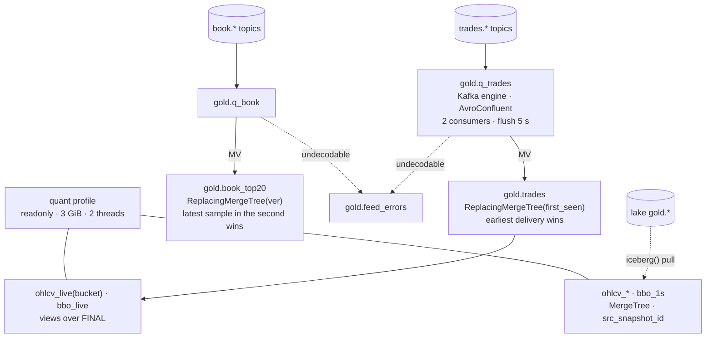

# ClickHouse `gold` — the served tier

ClickHouse 24.3 LTS holds one database, `gold`, and nothing else. It is fed live from the
Avro topics for freshness and reloaded from the lake for correctness; it can be dropped and
rebuilt, and the lake wins on conflict ([ADR-025](../../adr/ADR-025-clickhouse-derived-hot-tier.md),
[ADR-026](../../adr/ADR-026-four-layer-lake-and-gold-served-from-clickhouse.md)). DDL:
[`docker/clickhouse/ddl/`](../../../docker/clickhouse/README.md).

## How it works

- **Two feeds, one contract.** `20-gold-kafka.sql` creates the Kafka engine tables and the
  materialized views that route into the tables `10-gold-tables.sql` defines. The contract
  file is applied alone in CI; the feeds need a broker.
- **Dedup is a merge-tree key, not a job.** `gold.trades` is `ReplacingMergeTree(first_seen)`
  ordered by `(exchange, canonical_symbol, exchange_ts, trade_id)`; `first_seen` is
  `UInt64max − recv_ts_ns`, so the row that survives a merge is the *earliest* delivery. A
  venue replay, a consumer restart, or a lake reload that overlaps the topic head all
  collapse to one row under `FINAL`.
- **Candles on read.** `ohlcv_live(bucket)` is a parameterised view: `argMin`/`argMax` over
  `FINAL` with the total order `(exchange_ts, recv_ts_ns, trade_seq)` so open and close are
  deterministic. v2's `SummingMergeTree` candles resolved open/close per insert block;
  `scripts/clickhouse-schema-test.sh` inserts one minute in two blocks and asserts the open.
- **History by pull.** `ohlcv_*` and `bbo_1s` are loaded from lake gold through the
  `iceberg()` table function with `src_snapshot_id` recorded; 10.4 M trades in 4.4 s
  ([runbook](../../runbooks/clickhouse-rebuild-from-lake.md)). Never computed here.
- **Errors are rows.** `kafka_handle_error_mode = 'stream'` sends an undecodable record to
  `gold.feed_errors` with its bytes; the partition keeps moving.
  `kafka_skip_broken_messages` does not cover a registry miss (schema id 0) — stream mode does.
- **Fixed point on disk, decimals on read.** `price_e8 Int64` is stored; `price Decimal(38,10)`
  is an `ALIAS`, so storage stays 8 bytes and arithmetic stays exact.
- **Limits.** Container 4 CPU / 8 GiB; `max_server_memory_usage` 6.5 GiB; `background_pool_size` 8
  with the two merge-tree floors lowered to match; the `quant` profile is `readonly`,
  3 GiB, 2 threads, `max_execution_time` 300 s, `do_not_merge_across_partitions_select_final`.

## Practices

| Practice | Where it is enforced |
|---|---|
| Schema is a tested contract | `make test-clickhouse` (CI `clickhouse` job): 9 assertions incl. the two-block OHLCV regression |
| Idempotent ingestion | `ReplacingMergeTree` keys on the logical trade; `FINAL` count == distinct count asserted |
| Deterministic aggregates | total order in `ohlcv_live`; three-way parity `make parity-ohlcv` at a pinned snapshot, 0 differ |
| Poison records isolated | `kafka_handle_error_mode='stream'` → `feed_errors`; `ClickHouseKafkaMessagesFailed` alert; chaos `clickhouse-corrupt-record.sh` (4 s) |
| Least privilege | `quant` readonly profile in `users.xml`; dashboards and notebooks use it |
| Memory bounded below the container | `config.xml` server cap 6.5 GiB under an 8 GiB limit |
| Rebuildable, timed | `clickhouse-rebuild-from-lake.md` with the command and the measured time |
| Feed liveness alerted | `ClickHouseGoldFeedStale` (topics moving, tables not); `clickhouse-stop.sh` measured 160 s to healthy |

## Trade-offs

- **`FINAL` on every live read.** Correctness costs a merge at query time; the pulled
  product tables avoid it for history.
- **24.3 cannot speak REST.** The lake pull is by metadata path and needs
  `write.metadata.compression-codec=none` on the source tables plus
  `iceberg_engine_ignore_schema_evolution=1`.
- **No TTL.** Gold grows with the archive; the revisit trigger is 80 % of the data volume
  or > 1 GB/day growth ([data-strategy.md](../data-strategy.md)).
