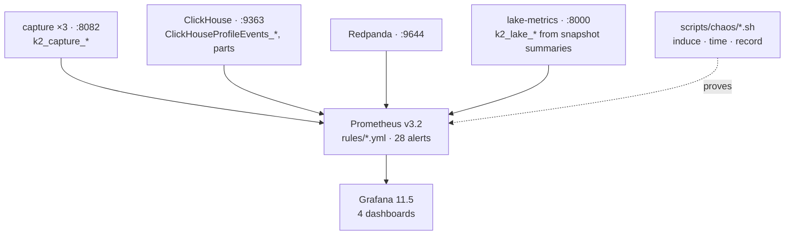

# Observability

Prometheus scrapes every tier, 28 rules each own a runbook and a unit test, four Grafana
dashboards are provisioned from the repo, and the failure modes the rules watch are induced
on purpose with timed recovery. No Alertmanager: rules are evaluated and shown, not routed.
Operator detail: [operations/observability.md](../../operations/observability.md); the FMEA:
[failure-modes.md](../failure-modes.md).

## How it works

- **Capture** exports counters per venue and stream (`messages`, `bytes`, `gaps`,
  `checksum_failures`, `resyncs`, `reconnects{reason}`, `produce_errors{reason}`,
  `precision_loss`), the `exchange_to_recv_seconds` histogram with buckets to 30 s, and
  `last_message_ts_seconds` per stream so staleness is `time() − gauge`, not a rate that
  goes to zero and stays there.
- **Lake** metrics come from Iceberg snapshot summaries via PyIceberg (`metrics.py`):
  last commit timestamp, `max_kafka_ts`, backlog offsets, last compaction, rows / files /
  bytes per table. Every "age" is exported as a timestamp and aged in PromQL — if the
  catalog is down the gauge freezes and the age keeps growing, which is the alert you want.
- **ClickHouse** ships its own `/metrics`; the two gold-feed rules watch
  `ClickHouseProfileEvents_KafkaMessagesFailed` and topic movement versus table growth.
- **Rules** are three files by tier — 10 capture, 12 lake, 6 ClickHouse. Each has `for`,
  a severity, a `runbook` annotation that must resolve to a file, and a `promtool test`
  case in `rules/tests/`. Prometheus loads rules at start or `SIGHUP`, so the docs say so.
- **Dashboards** are JSON in `docker/grafana/dashboards/`: pipeline overview, capture, lake,
  ClickHouse. Grafana queries ClickHouse as the read-only `quant` user.
- **Chaos** scripts in `scripts/chaos/` stop or corrupt one thing, watch the alert that
  should fire, time recovery, and append a row to `scripts/chaos/results/`. Measured:
  lake ingest killed 42 s, MinIO stopped 38 s, Lakekeeper stopped 37 s, ClickHouse stopped
  160 s to healthy, corrupt feed record isolated in 4 s
  ([benchmarks § MTTR](../../benchmarks/2026-08-27.md#mttr), [failure-modes.md](../failure-modes.md)).

## Practices

| Practice | Where it is enforced |
|---|---|
| Every alert has a runbook | `check-docs.sh` gate (d): `runbook` annotation paths must resolve |
| Every alert has a unit test | `rules/tests/*_test.yml`, run by `promtool` in `check-docs.sh` and CI `docs` |
| Staleness as timestamp, not rate | `k2_capture_last_message_ts_seconds`, `k2_lake_last_commit_ts_seconds`; `CaptureFeedStale`, `LakeCommitAgeHigh` |
| Counters carry the reason | `reconnects_total{reason}`, `produce_errors_total{reason}` |
| Build provenance exported | `k2_capture_build_info{git_sha}` |
| Alerts proven against the fault they name | `make chaos`; each `failure-modes.md` row cites the script and the measured time |
| Dashboards versioned | provisioned from JSON in the repo, not hand-edited in the UI |
| Least-privilege reads | Grafana uses the `quant` profile |

## Trade-offs

- **No routing.** Alerts are visible in Prometheus and Grafana, not paged. Alertmanager is
  a deliberate omission on a single-operator demo.
- **No SLOs.** Thresholds are per-alert `for` windows sized from measurement, not error
  budgets; the burn-in that would justify SLOs is a Phase F item.
- **Scrape gaps during chaos** are part of the record: a stopped ClickHouse shows as
  `up == 0`, and the FMEA rows state what was lost versus delayed.
