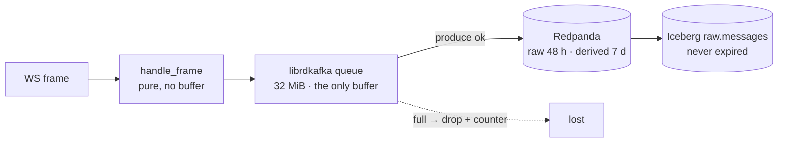

# Failure modes — FMEA

**Scope on this page: the v3 capture tier, and Redpanda as capture sees it.** Lake and
hot-tier rows arrive with the phases that build those tiers
([Phase D](../plans/2026-08-26-v3-quant-research-platform/003-phase-d-lake-tier.md),
Phase E); the placeholders at the bottom of the table say where.

Every row names one `component × failure`, the exact signal that detects it, what that
failure costs in data, the step that recovers it, and the artefact that proves the
whole row is true. A row with an empty cell does not ship — the gate is in
[Phase D's verification](../plans/2026-08-26-v3-quant-research-platform/003-phase-d-lake-tier.md#verification):

```bash
awk -F'|' '/^\|/ && NF>5 {for(i=2;i<NF;i++) if($i ~ /^ *$/) exit 1}' docs/architecture/failure-modes.md
```

---

## How to read this

**The `proof` column is the point of the document.** An FMEA whose recovery column is
prose is a wish list. Each row here ends in a script, a test, or a named measurement,
and where the proof does not exist yet the cell says so rather than leaving the claim
unchallenged. Three honest states appear in that column:

| State | Means |
|---|---|
| a test path | the assertion runs today, in `make test` or CI |
| `scripts/chaos/<name>.sh (written; not yet run — Phase C burn-in)` | the injection exists and has never been executed. The capture tier *is* built and running — three `k2-capture-*` containers on `k2-capture:v3`, healthy, verified 2026-08-26 — so the blocker is not the image. It is that every one of these scripts destroys real market data on a live venue, and none may run inside a labelled burn-in or parity window without invalidating it. `scripts/chaos/results/` is absent, which is the machine-checkable form of this cell |
| a stated reason it is not injectable | the fault cannot be induced locally without proving something other than the fault — the cell says which, and what stands in for it |

**Recovery times are not on this page yet.** `make chaos` measures time-to-alert and
time-to-recovery per script and appends them to `scripts/chaos/results/<date>.tsv`; the
numbers are copied into the recovery column by hand, dated, once a run exists
([`scripts/chaos/README.md`](../../scripts/chaos/README.md)). Until then the recovery
column carries the step and its runbook, not a duration — the same rule the runbooks
follow, where an unmeasured MTTR reads "not yet verified" rather than a guess.

**Thresholds are designed, not tuned.** Every `for:` and every bound quoted below comes
from [`docker/prometheus/rules/capture-alerts.yml`](../../docker/prometheus/rules/capture-alerts.yml).
Those rules are evaluated against live series today, but no rule here has yet been shown
to fire on the fault it names. The chaos run is what earns the right to move one. Three
of them — `CaptureFeedStale`, `CaptureProduceStalled`, `CaptureBookDepthDegraded` — also
carry `promtool` unit tests in
[`docker/prometheus/tests/capture-alerts.test.yml`](../../docker/prometheus/tests/capture-alerts.test.yml),
run by `make check-alerts` and by `scripts/check-docs.sh` (c2); a unit test proves the
expression, never the recovery time.

**Chaos is maintainer-run, not continuous.** The GitHub runner has ~7 GB and this stack
budgets ~22 GB, so a nightly chaos job would fail for resource reasons more often than
for real ones ([Q3](../research/2026-08-26-v3-requirements-clarification.md#q3--fault-injection-where-does-it-run)).
The guarantee this page offers is "these failures were injected and measured on the
dates recorded", not "these failures are injected nightly".

---

## Blast-radius legend

Three words, used strictly, because the difference between them is the difference
between an incident and an outage:

| Word | Means | Where it comes from in this tier |
|---|---|---|
| **delayed** | the data exists somewhere and arrives late | only inside librdkafka's 32 MiB queue, and only while the producer is retrying |
| **lost** | the data will never exist | anything the venue sent while we were not reading, or that fell out of a full queue. Public WebSocket feeds do not replay; there is no spill-to-disk ([`services/capture-rust/README.md`](../../services/capture-rust/README.md), *Deliberate simplifications*) |
| **unaffected** | named explicitly, because "the blast radius was small" is a claim | the other two venues, and every tier downstream of a commit that already happened |

A fourth state appears twice below and deserves its own name: **silently wrong** —
nothing is missing, the row count is right, and a value in it is untrue. Clock skew on
`recv_ts_ns` and a book that drifted past Kraken's top-10 checksum window are both this,
and they are the two rows worth reading twice.

The queue is the only place "delayed" can happen, and it has a computable size, so the
delayed→lost boundary is a number rather than an adjective:



Everything left of the queue is lost the instant we stop reading. Everything right of a
successful produce survives a capture crash. In between there are 194 s (binance),
204 s (kraken) or 446 s (coinbase) of slack — the arithmetic is in the Redpanda row.

---

## FMEA

| component | failure | detection signal (metric/alert name + PromQL) | blast radius (lost vs delayed vs unaffected — name the data) | recovery (step + runbook link) | proof (chaos script or test path) |
|---|---|---|---|---|---|
| capture (any venue) | **SIGKILL** — OOM, `docker kill`, host reboot. Container restarts under `restart: unless-stopped` | `CaptureDown`, `for: 2m` — `up{job=~"capture-.*"} == 0`. A restart that works re-scrapes inside one 15 s interval, so the alert firing means the restart is *not* working ([capture-down.md](../runbooks/capture-down.md) §1) | **Lost:** every frame the venue sent during the gap — `market.crypto.v3.{raw,trades,book}.<ex>` all three, since `raw` is produced on the same path. **Delayed:** nothing; the queue dies with the process. **Unaffected:** the other two venues, Iceberg, ClickHouse | Automatic restart. If crash-looping, read the exit code before restarting again — a loop is a start failure, not a transient — then `docker compose up -d capture-<ex>`. [capture-down.md](../runbooks/capture-down.md) §1 | `scripts/chaos/capture-kill.sh (written; not yet run — Phase C burn-in)` |
| capture (any venue) | **SIGSTOP / `docker pause`** — process frozen, socket left open in the kernel. The venue eventually closes it server-side; on unfreeze the client reconnects on its own backoff | `CaptureFeedStale`, `for: 2m` — `(time() - k2_capture_last_message_ts_seconds > 60) unless on (job) ALERTS{alertname="CaptureDown", alertstate="firing"}`, labelled `{exchange, stream}`, so a dead `book` subscription is named while `trades` still flows. Only *continuous* streams carry the gauge (`main.rs` `CONTINUOUS`) and `run` seeds every one of them at process start, so a subscription the venue silently rejects goes stale rather than never existing. `up` does **not** stay 1: a frozen container stops answering scrapes immediately, so `up` goes to 0 inside one `scrape_timeout` (10 s) + interval, and Prometheus stale-marks every series from that target — which is why the guard defers to `CaptureDown` only once `CaptureDown` is *firing*, and why `docker pause` is a poor injection for this alert specifically (the gauge it reads is gone; the venue-silence row below is the real fault) | **Lost:** frames for the frozen window on that venue. On unfreeze the loss is *reported* differently per venue: Coinbase as a `sequence_num` gap, Binance as a `lastUpdateId` regression, Kraken silently (no sequence on v2 — only a CRC mismatch if the book drifted, ADR-027). **Unaffected:** other venues; everything already produced | `docker unpause`; reconnect and resubscribe are automatic. Confirm every stream's age returned under 60 s before closing. [capture-feed-stale.md](../runbooks/capture-feed-stale.md) §1 | `scripts/chaos/capture-pause.sh (written; not yet run — Phase C burn-in)` |
| capture/sink | **Frame larger than producer/topic `max.message.bytes`** — librdkafka's default is 1,000,000 B and Redpanda's topic default 1,048,576 B; Coinbase's `level2` subscribe snapshot is 5,195,904 B for BTC-USD (ADR-018 S5), so the five largest products' snapshot frame was rejected at enqueue on every (re)connect | `CaptureProduceErrors`, `for: 5m` — `increase(k2_capture_produce_errors_total[10m]) > 0`, `reason="enqueue"` (librdkafka `MessageSizeTooLarge`); five ticks per connect | **Lost:** the raw frame only — `raw` never gets the snapshot, so the archive cannot replay the book from that connect. **Unaffected:** book state (the adapter still applied the frame), `trades`, `book`, the other venues | Raise both limits together: `MESSAGE_MAX_BYTES` in `sink.rs` and `max.message.bytes=8388608` on `market.crypto.v3.raw.*` in `docker/redpanda/init.sh` (this row's fix, 2026-08-26). Both must stay ≤ the 8 MiB WebSocket cap in `ws.rs` or the socket accepts what the producer cannot ship | Live produce after the fix: `rpk topic consume market.crypto.v3.raw.coinbase -p 8 -o 7846 -n 1 --format '%V'` → 4,803,578 bytes; `produce_errors_total{exchange="coinbase",reason="enqueue"}` = 0 after a fresh connect |
| capture → Redpanda | **Producer queue full** — librdkafka's `queue.buffering.max.kbytes=32768` (32 MiB) fills and `sink.rs` drops the record rather than blocking the frame loop | `CaptureProduceErrors`, `for: 5m` — `increase(k2_capture_produce_errors_total[10m]) > 0`; the `reason="queue_full"` label separates a full queue from an encode or auth failure. The counter is seeded at zero for all four reasons at startup, so the first drop is the alert — a rate threshold would have tolerated 8,640 permanently-lost records a day | **Lost, not delayed — say it plainly.** There is no spill-to-disk, so a dropped record never arrives late; it never arrives. `raw` is dropped alongside the derived records, so the archive carries the same hole and no reprocessing recovers it. **Unaffected:** the WebSocket read loop, deliberately — blocking it would have the venue disconnect us and cost more than the drop ([`services/capture-rust/README.md`](../../services/capture-rust/README.md)) | Fix the downstream cause (broker, registry, disk); the queue drains itself once produce succeeds — no capture restart. Record the loss window; nothing replays it. [capture-down.md](../runbooks/capture-down.md) §2 | `scripts/chaos/capture-queue-full.sh (written; not yet run — Phase C burn-in)` |
| Redpanda (as capture sees it) | **Broker down** — capture keeps reading the WebSocket and enqueueing; librdkafka retries in the background until the 32 MiB cap, then drops | `CaptureProduceErrors`, `for: 5m`, at the moment of the first drop. Before that the signal is `k2_capture_records_delivered_total` — the broker's own acknowledgements — going flat while `k2_capture_records_produced_total` keeps climbing; that divergence is the early warning, caught by `CaptureProduceStalled`, `for: 30s` ([capture-produce-stalled.md](../runbooks/capture-produce-stalled.md)). **`records_produced_total` counts the local enqueue, not the delivery**, so it climbs at full rate for the whole outage and is the wrong counter to watch here | **Delayed, then lost, with a computed boundary.** 32 MiB ÷ per-container wire rate — `924 B × 172.9/s + 120 B × 52.9/s + 600 B × 12/s = 173.3 kB/s` binance, `164.3 kB/s` kraken, `75.2 kB/s` coinbase ([capacity-model.md §4a–4b](capacity-model.md)) — gives **194 s / 204 s / 446 s to the first dropped record**. Inside that window nothing is lost. Past it, permanently lost, all three topics. **Unaffected:** Iceberg and ClickHouse keep serving what they already hold | `docker compose up -d redpanda`; produce resumes without restarting capture. If the outage ran past the boundary above, the gap is permanent and belongs in the audit record. [capture-down.md](../runbooks/capture-down.md) §2 | `scripts/chaos/redpanda-stop.sh (written; not yet run — Phase C burn-in)` — it also scores the predicted boundary against the measured one |
| schema registry (as capture sees it) | **Down at process start** — the encoder cannot fetch or register a schema id, so it has nothing to put in bytes 1–4 of the Confluent frame and **no record can be built at all** | `CaptureProduceErrors`, `for: 5m` — `increase(k2_capture_produce_errors_total[10m]) > 0`, `reason="encode"`, plus `k2_capture_records_produced_total` pinned at 0 while `k2_capture_messages_total` climbs. Since `Sink::warm_up` (run before the first connect, fatal on failure) this is a **start failure, not a silent one**: the process exits with the registry error and crash-loops under `restart: unless-stopped`, so `CaptureDown` fires and `k2_capture_messages_total` does not climb — the socket is never opened. `REGISTRY_TIMEOUT` (5 s, `sink.rs`) now bounds only the cases warm-up cannot pre-empt, chiefly a schema evolution mid-session. On Redpanda the registry lives in the broker process (`--schema-registry-addr`, `docker-compose.yml`), so this is the broker row seen one layer up | **Lost, immediately — and this is the asymmetry worth knowing.** Unlike the broker row, nothing is enqueued, so there is no 194 s of queue slack: loss starts at the first frame, on all three topics, for that venue. **Unaffected:** venues whose capture process started while the registry was up (see the next row) | Restore `:8081` — `docker compose up -d redpanda`. The next restart of the crash-looping capture container warms its schemas and runs; no manual capture restart is needed. [capture-down.md](../runbooks/capture-down.md) §2 | `scripts/chaos/redpanda-stop.sh --cold-start (written; not yet run — Phase C burn-in)` — stops the broker, then force-recreates one capture container so it starts with no registry |
| schema registry (as capture sees it) | **Down mid-run** — the ids for `raw`, `trade` and `book` are already cached in-process | **None from capture, by design.** Production continues on the cached ids and no capture metric moves; the only signal is `up{job="redpanda"} == 0`. A new schema version, or a capture restart inside the outage, converts this into the row above | **Unaffected** while the cache holds and the broker is up. The exposure is entirely latent: a restart during the outage starts cold, hits the previous row, and loses everything from that instant | None needed. The operational instruction is the unusual one: **do not restart capture** until `:8081` answers. [capture-down.md](../runbooks/capture-down.md) §2 | Not separable on Redpanda — registry and broker are one process, so the cached case is observed as the opening seconds of `scripts/chaos/redpanda-stop.sh (written; not yet run — Phase C burn-in)`, where `records_produced_total` still climbs after the broker is gone while `records_delivered_total` does not. Proving it independently needs an external registry, which this stack does not have |
| capture · kraken | **CRC32 checksum mismatch** — the computed checksum over the local top-10 asks-then-bids differs from Kraken's published one; the book has drifted | `CaptureChecksumFailure`, `for: 5m` — `increase(k2_capture_checksum_failures_total[10m]) > 0`. Repeats escalate to `CaptureResyncStorm` — `increase(k2_capture_resyncs_total[15m]) > 3` | **Neither lost nor delayed — marked.** The mismatching frame itself emits one last snapshot stamped `checksum_ok=false` *before* the book is dropped, so the bad window is queryable and excludable rather than suppressed (ADR-027). Snapshots after it are absent until the resync lands — `snapshot()` returns `None` on an empty book rather than a plausible-looking lie. Only that symbol resubscribes; other symbols on the connection, its trades, and `raw` are **unaffected**. Genuinely lost: book state between mismatch and fresh snapshot — recoverable from `raw.messages` by replay. **Silently wrong risk:** the checksum covers the top 10 only, so drift at levels 11–20 is undetected by construction and `checksum_ok = true` is a narrower claim than it reads ([ADR-027](../adr/ADR-027-book-snapshot-and-sequencing.md) Risks) | Automatic — `Action::Resubscribe(symbol)`, per-symbol, per [ADR-027](../adr/ADR-027-book-snapshot-and-sequencing.md). The human job is classifying transient (one failure, resync fixed it) versus systematic (the checksum *computation* is wrong, so the book drifts undetected between passes). [capture-checksum-failure.md](../runbooks/capture-checksum-failure.md) §1 | `services/capture-rust/src/exchanges/kraken.rs::a_bad_checksum_emits_a_marked_snapshot_then_resyncs` — asserts the `checksum_ok=false` snapshot is emitted, and fails if it is not; plus `services/capture-rust/tests/replay.rs`, which reproduces Kraken's own CRC32 over all 1185 frames of `tests/fixtures/kraken-20s.jsonl` |
| capture · coinbase | **`sequence_num` gap** — the connection-wide counter skips. It spans `l2_data`, `market_trades` and `heartbeats` together (spike S5), so a gap does not name which stream lost a message | `CaptureSequenceGaps`, `for: 5m` — `increase(k2_capture_gaps_total[10m]) > 0`, `exchange="coinbase"` | **Lost:** the skipped frames, permanently — public feeds do not replay. **Plus a memory spike that is not a data loss and must not be read as one:** the reconnect rebuilds from a fresh `level2` snapshot — 5,195,904 B across 43,974 levels for BTC-USD, measured (S5) — costing ~25 MB of transient `serde_json` DOM and ~380 ms of single-threaded parse across 11 symbols, ~1.5 s wall at the 0.25 CPU quota, against a 512 MB limit ([capacity-model.md §3b, §5](capacity-model.md)). **Unaffected:** binance, kraken | Automatic reconnect and rebuild; by the time the alert fires the book is already correct. This is an **investigation, not a repair** — gaps = 0 is a Phase C exit criterion, so a non-zero counter is either a real loss window to document or a bug in the detector, and those need opposite responses. [capture-sequence-gaps.md](../runbooks/capture-sequence-gaps.md) §1 | `scripts/chaos/capture-pause.sh --exchange coinbase (written; not yet run — Phase C burn-in)` — a freeze long enough for the venue to close the socket is the only local way to make Coinbase skip on us |
| capture · binance | **`lastUpdateId` regression** — the id on `<sym>@depth20@100ms` regresses or repeats backwards; frames arrived out of order or the combined stream was silently re-keyed | `CaptureSequenceGaps`, `for: 5m` — the same counter, `exchange="binance"`. Note the blind spot: Binance's partial-depth stream carries no `exchange_ts`, so this venue's book frames never enter `k2_capture_exchange_to_recv_seconds` and the failure is invisible in the latency histogram by construction | **Lost:** the frames between regression and reconnect — at most a few 100 ms ticks. **Nothing needs rebuilding:** each partial-depth frame *is* a complete top-20, so the next frame after reconnect is a full book, with no snapshot fetch and no rebuild window ([ADR-027](../adr/ADR-027-book-snapshot-and-sequencing.md)). **Unaffected:** binance trades (separate stream, separate continuity), other venues | Automatic reconnect of the combined stream. Same investigate-don't-repair posture as Coinbase. [capture-sequence-gaps.md](../runbooks/capture-sequence-gaps.md) §1 | `scripts/chaos/capture-pause.sh --exchange binance (written; not yet run — Phase C burn-in)` |
| capture · binance | **24 h connection limit** — Binance closes any combined stream at 24 h; capture pre-empts it with a scheduled reconnect at ~23 h | `k2_capture_reconnects_total{exchange="binance",reason="scheduled"}` increments once per day and `conn_id` changes in the emitted records. The `reason` label is what makes the correlation the runbooks ask for possible: `scheduled` is this row, `involuntary` is every other reconnect. Implemented as `connection_expired()` / `BINANCE_MAX_CONNECTION_AGE` in `main.rs`; Kraken and Coinbase publish no connection lifetime and get no timer. **No alert, deliberately** — this is the working state. `CaptureFeedStale` is the guard that the reconnect *landed*: one that fails becomes a stale feed inside 2 m | **Nothing lost by design** — sub-second, and the first frame after reconnect is a complete top-20. The real cost is one `conn_id` boundary per day per venue across which `seq` and `conn_msg_seq` continuity is meaningless ([ADR-027](../adr/ADR-027-book-snapshot-and-sequencing.md) Risks), so any query folding `seq` must partition by `conn_id` or it will read a reconnect as a gap | None — the reconnect is the recovery. The failure to watch for is the reconnect not landing, which is the stale-feed path. [capture-feed-stale.md](../runbooks/capture-feed-stale.md) §1 | **Not injectable inside the 2 h burn-in window** the plan uses — [Q6](../research/2026-08-26-v3-requirements-clarification.md#q6--burn-in-windows-real-wall-clock-duration-or-shortened) names this exact case as falling outside it by construction. The reconnect *path* is proven by `scripts/chaos/capture-pause.sh --exchange binance`; the 23 h timer is proven only by the first 24 h continuous run, which is Q6's stated revisit trigger |
| exchange (any venue) | **Venue-side maintenance — feed silent, socket open.** The venue enters maintenance or accepts a `subscribe` and stops delivering; TCP stays open, the process is healthy, `/metrics` answers, nothing arrives | `CaptureFeedStale`, `for: 2m` — `(time() - k2_capture_last_message_ts_seconds > 60) unless on (job) ALERTS{alertname="CaptureDown", alertstate="firing"}` per `{exchange, stream}`. This is the failure a liveness probe cannot see, and the reason `k2-capture healthcheck` reads the same gauge over loopback rather than answering "the process is alive" — over the **oldest** continuous stream, not the newest, or a 1 Hz heartbeat reports the container healthy while `book` and `trade` are both dead ([`services/capture-rust/README.md`](../../services/capture-rust/README.md)) | Two causes with the same signal and opposite radii, and the metric cannot separate them: a **genuine venue outage loses nothing that existed** (the venue sent nothing); a **silently dropped subscription loses everything on that stream**. Step 4 of the runbook — a reachability `curl` against the venue's REST endpoint — is what separates them. **Unaffected** either way: the other two venues | Healthcheck-driven restart, or `docker compose up -d --force-recreate capture-<ex>`; the reconnect rebuilds every subscription. Check the venue status page before assuming a capture bug. [capture-feed-stale.md](../runbooks/capture-feed-stale.md) §1 | `scripts/chaos/capture-pause.sh (written; not yet run — Phase C burn-in)` reproduces the **signal** — `last_message_ts` frozen with the process nominally up — not the cause. No local injection can silence a live venue, and the script says so when it runs |
| capture | **Clock skew on `recv_ts_ns`** — the host clock steps (NTP correction, VM suspend/resume, a drifted host). `recv_ts_ns` is `now_ns()` taken as the first statement after the frame leaves the socket (`services/capture-rust/src/ws.rs`), so the step lands directly in the archive | `CaptureIngressLatencyHigh`, `for: 10m` — `histogram_quantile(0.99, sum by (exchange,le) (rate(k2_capture_exchange_to_recv_seconds_bucket[5m]))) > 2` catches a **forward** step. A **backward** step makes `exchange_ts − recv_ts` negative, which a Prometheus histogram cannot represent — negative observations land in no bucket and pull the quantile *low* — so the query that sees it is the sum/count pair: `rate(k2_capture_exchange_to_recv_seconds_sum[5m]) / rate(k2_capture_exchange_to_recv_seconds_count[5m])` going negative while `_count` keeps climbing. **Only trades feed this histogram at all** — `main.rs` records it inside `if let OutRecord::Trade(t) = record` — so no book frame from any venue is in either expression, and Binance's book frames carry no `exchange_ts` to record even if they were | **Silently wrong — not lost, not delayed.** Every `recv_ts_ns` written during the skew is off by the step, permanently, in `raw.messages` (never expired) and in everything derived from it; the `snapshot_ts_ns − recv_ts_ns` staleness bound and any cross-venue timing comparison over that window are unusable. **Unaffected:** prices, quantities, sequence numbers, checksums — the *content* is correct, only its clock is not. Nothing detects this after the fact except this metric's own history, which is why the detection expression matters more here than anywhere else on the page | Fix the host clock — chrony/`systemd-timesyncd` configured to **slew, not step**, which is the change that prevents recurrence. Restart nothing: a restart adds a `conn_id` boundary and fixes no timestamp already written. Record the window as an audit exclusion. [capture-feed-stale.md](../runbooks/capture-feed-stale.md) §2 covers reading this alert without misquoting it as platform latency | **No chaos script, deliberately** — stepping the host clock steps Prometheus's own clock and every container's TLS validity window at the same instant, so the injection would be less trustworthy than the failure it models. What stands in: the detection expression is syntax-checked by `promtool check rules` in `scripts/check-docs.sh` (c), and the sign of the sum/count ratio is a Phase F burn-in observation against a known-good NTP source |
| capture · config | **`config/instruments.yaml` stale inode** — the file is edited in place, the editor writes-then-renames (new inode), and the bind mount keeps serving the old one. Capture goes on subscribing to the previous instrument list. The v3 mount is the *directory* `./config:/app/config:ro`, and directory mounts go stale the same way | **None automated, and that is the gap this row exists to record.** No alert fires: the process is healthy, every subscribed stream is live. The only symptom is a symbol absent from `k2_capture_messages_total` / `k2_capture_book_depth` and from the topics. `CaptureBookDepthDegraded` catches it only if the edit *removed* depth from a symbol already subscribed. The check is manual: diff `curl :8082/metrics \| grep k2_capture_book_depth` against `config/instruments.yaml` | **Lost:** everything for the added or changed instrument, from the edit until someone notices — and the window is bounded by attention, not by a timeout, which is what makes this row worse than its severity suggests. **Unaffected:** instruments already subscribed. **Nothing is delayed** — those frames were never requested | `docker compose up -d --force-recreate --no-deps capture-<ex>` — and it must cover **every** service mounting `./config`, because the stale directory entry is held while *any* container holds that host path. `docker restart` does not fix it. [docker/README.md](../../docker/README.md) | [`docker/README.md`](../../docker/README.md) — the table verified on this stack 2026-08-26, showing "another container still holds the dir → **old contents**". No chaos script: the fault is in the file-sharing layer rather than the platform, and it is already reproduced where it lives |
| Redpanda (as capture sees it) | **Data volume full** — the `redpanda-data` volume fills; capture experiences it as the produce-failure rows above | `CaptureProduceErrors`, `for: 5m`, from the capture side. **The capture tier has no broker-disk alert of its own** — the 80 % disk alert is Phase D's, per [Q8](../research/2026-08-26-v3-requirements-clarification.md#q8--raw-archive-retention-on-a-single-host) | **Bounded by config before it becomes an outage.** `retention.bytes=536870912` (512 MiB) **per partition** × 12 partitions × 3 `raw.*` topics = **18 GiB hard floor** out of a 20 GB budgeted slice; `trades.*`/`book.*` carry a 7 d time cap and no byte cap ([`docker/redpanda/init.sh`](../../docker/redpanda/init.sh), the retention block). Eviction is oldest-first per partition, so a full topic **loses the tail of the replay buffer, not the head** — and anything the lake already ingested is safe in `raw.messages` forever. Lost: only what the lake had not yet read. **Unaffected:** everything already committed to Iceberg | Raise the disk slice or cut the raw partition count — explicitly **not** a silently shorter retention, which is the trade `init.sh` refuses to make on your behalf. Capture-side symptom: [capture-down.md](../runbooks/capture-down.md) §2 | [`docker/redpanda/init.sh`](../../docker/redpanda/init.sh) carries the arithmetic; `rpk topic describe -c market.crypto.v3.raw.kraken` shows the cap as applied. **Not injectable in a 2 h window:** 6 GiB per topic at the predicted 5.25 GB/day for `raw.kraken` needs ~29 h to evict its first byte ([capacity-model.md §4b](capacity-model.md)). Filling it artificially would prove the eviction policy, not the failure |

<!-- Phase D: lake rows — Lakekeeper down mid-commit, MinIO down, ingest killed mid-run, corrupt Avro payload, offset discontinuity across a cross-day seam, host disk 80%. See 003-phase-d-lake-tier.md. -->
<!-- Phase E: hot-tier rows — ClickHouse paused, Kafka-engine consumer stall, MV lag, rebuild-from-lake timing. See 004-phase-e-hot-tier.md. -->

---

## What this page does not cover

- **The lake and the hot tier.** Both are unbuilt. The placeholder comments above name
  the rows and the phase that writes them, deliberately as comments rather than empty
  table rows — a blank cell would trip the `awk` gate, which is the correct outcome for
  a row that does not ship.
- **Correlated failure.** Every row is one component failing alone. On a single host
  with one broker, one ClickHouse and one MinIO, a machine reboot fires most of this
  page at once, and the recovery order is a runbook this tier does not yet have
  ([`docs/runbooks/failure-recovery.md`](../runbooks/failure-recovery.md) covers v2).
  There is no HA and none is claimed.
- **Anything beyond capture's own boundary.** Redpanda appears here only as capture
  experiences it. Broker-internal failure modes belong with the lake rows.

## Related

- [`docker/prometheus/rules/capture-alerts.yml`](../../docker/prometheus/rules/capture-alerts.yml) — the nine alerts every detection cell quotes
- [`docs/runbooks/capture-*.md`](../runbooks/) — the four capture runbooks the recovery column links
- [`scripts/chaos/README.md`](../../scripts/chaos/README.md) — how the proof column gets executed, and how its results come back here
- [capacity-model.md](capacity-model.md) — the predicted rates the delayed→lost boundary is computed from
- [ADR-019](../adr/ADR-019-rust-capture-tier.md) — the capture tier; [ADR-027](../adr/ADR-027-book-snapshot-and-sequencing.md) — the per-exchange sequencing and resync policies three rows rest on
- [Q3](../research/2026-08-26-v3-requirements-clarification.md#q3--fault-injection-where-does-it-run) — why the proof column runs locally rather than in CI
