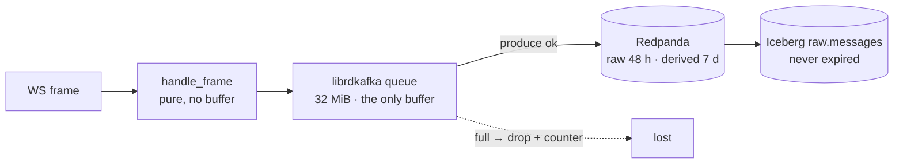

# Failure modes — FMEA

**Scope on this page: the v3 capture tier, Redpanda as capture sees it, and the lake
tier.** The hot-tier rows arrive with
[Phase E](../plans/2026-08-26-v3-quant-research-platform/004-phase-e-hot-tier.md); the
placeholder comment at the bottom of the table says where.

Every row names one `component × failure`, the exact signal that detects it, what that
failure costs in data, the step that recovers it, and the artefact that proves the
whole row is true. A row with an empty cell does not ship — the gate is in
[Phase D's verification](../plans/2026-08-26-v3-quant-research-platform/003-phase-d-lake-tier.md#verification):

```bash
awk -F'|' '/^\|/ && NF>5 {for(i=2;i<NF;i++) if($i ~ /^ *$/) exit 1}' docs/architecture/failure-modes.md
```

---

## How to read this

**The `proof` column is the point of the document.** An FMEA whose recovery column is
prose is a wish list. Each row here ends in a script, a test, or a named measurement,
and where the proof does not exist yet the cell says so rather than leaving the claim
unchallenged. Three honest states appear in that column:

| State | Means |
|---|---|
| a test path | the assertion runs today, in `make test` or CI |
| `scripts/chaos/<name>.sh — run <date>, <measurement>` | the injection was executed against the live stack on that date and the numbers in the row come from it. The raw log is `scripts/chaos/results/<date>.tsv`, committed |
| `scripts/chaos/<name>.sh (written; not yet run)` | the injection exists and has never been executed. One capture row is still in this state, and every Lake tier row is — each cell says why |
| a stated reason it is not injectable | the fault cannot be induced locally without proving something other than the fault — the cell says which, and what stands in for it |

**Recovery times on this page are measured, as of 2026-08-26.** The first `make chaos`
run (16:40–16:57Z, binary `v3-phase-b-33-gf808d87`) injected five of the six capture-tier
scripts — the four `lake-*.sh` scripts were written afterwards and are unrun — and
appended [`scripts/chaos/results/2026-08-26.tsv`](../../scripts/chaos/results/2026-08-26.tsv);
its numbers are hand-copied into the recovery and proof columns below, dated, per
[`scripts/chaos/README.md`](../../scripts/chaos/README.md). Rows whose fault was not
injected still carry the step and its runbook rather than a duration — the same rule the
runbooks follow, where an unmeasured MTTR reads "not yet verified" rather than a guess.

**One prediction on this page was measured wrong, and the row says so.** The
producer-queue-full row predicted 204 s of slack before the first kraken record was lost
and measured 102 s, because the binding cap was `message.timeout.ms`, not the 32 MiB
queue. That is recorded in the row rather than quietly corrected, because the point of
the proof column is to catch exactly this.

**Thresholds are designed, and four are now measured.** Every `for:` and every bound
quoted below comes from
[`docker/prometheus/rules/capture-alerts.yml`](../../docker/prometheus/rules/capture-alerts.yml).
`CaptureDown` and `CaptureProduceErrors` have now been shown to fire on the faults they
name (119–165 s and 256 s to firing respectively, 2026-08-26); the rest are still
evaluated against live series without having been made to fire. Three of them —
`CaptureFeedStale`, `CaptureProduceStalled`, `CaptureBookDepthDegraded` — also
carry `promtool` unit tests in
[`docker/prometheus/tests/capture-alerts.test.yml`](../../docker/prometheus/tests/capture-alerts.test.yml),
run by `make check-alerts` and by `scripts/check-docs.sh` (c2); a unit test proves the
expression, never the recovery time.

**Chaos is maintainer-run, not continuous.** The GitHub runner has ~7 GB and this stack
budgets ~22 GB, so a nightly chaos job would fail for resource reasons more often than
for real ones ([Q3](../research/2026-08-26-v3-requirements-clarification.md#q3--fault-injection-where-does-it-run)).
The guarantee this page offers is "these failures were injected and measured on the
dates recorded", not "these failures are injected nightly".

---

## Blast-radius legend

Three words, used strictly, because the difference between them is the difference
between an incident and an outage:

| Word | Means | Where it comes from in this tier |
|---|---|---|
| **delayed** | the data exists somewhere and arrives late | only inside librdkafka's 32 MiB queue, and only while the producer is retrying |
| **lost** | the data will never exist | anything the venue sent while we were not reading, or that fell out of a full queue. Public WebSocket feeds do not replay; there is no spill-to-disk ([`services/capture-rust/README.md`](../../services/capture-rust/README.md), *Deliberate simplifications*) |
| **unaffected** | named explicitly, because "the blast radius was small" is a claim | the other two venues, and every tier downstream of a commit that already happened |

A fourth state appears twice below and deserves its own name: **silently wrong** —
nothing is missing, the row count is right, and a value in it is untrue. Clock skew on
`recv_ts_ns` and a book that drifted past Kraken's top-10 checksum window are both this,
and they are the two rows worth reading twice.

The queue is the only place "delayed" can happen, and it has a computable size, so the
delayed→lost boundary is a number rather than an adjective:



Everything left of the queue is lost the instant we stop reading. Everything right of a
successful produce survives a capture crash. In between there are 194 s (binance),
204 s (kraken) or 446 s (coinbase) of slack — the arithmetic is in the Redpanda row.

**Two caps close that window, and the smaller one wins.** The 32 MiB above is one;
`message.timeout.ms=300000` in `sink.rs` is the other, failing any record still
undelivered five minutes after enqueue whatever the queue is doing. At binance and kraken
rates the queue *should* fill first (`reason="queue_full"`); at coinbase's slower rate the
timeout should fire first (`reason="delivery"`). **That split is arithmetic, not a
measurement** — the only injected run on record was taken with the timeout at 30 s, which
made the entire diagram's "delayed" state unreachable and every drop a `delivery`, and it
stays unscored until `capture-queue-full.sh` is re-run against the 5-minute timeout. See
the producer-queue-full row.

---

## FMEA

| component | failure | detection signal (metric/alert name + PromQL) | blast radius (lost vs delayed vs unaffected — name the data) | recovery (step + runbook link) | proof (chaos script or test path) |
|---|---|---|---|---|---|
| capture (any venue) | **SIGKILL** — OOM, `docker kill`, host reboot. Container restarts under `restart: unless-stopped` | `CaptureDown`, `for: 2m` — `up{job=~"capture-.*"} == 0`. A restart that works re-scrapes inside one 15 s interval, so the alert firing means the restart is *not* working ([capture-down.md](../runbooks/capture-down.md) §1) | **Lost:** every frame the venue sent during the gap — `market.crypto.v3.{raw,trades,book}.<ex>` all three, since `raw` is produced on the same path. **Delayed:** nothing; the queue dies with the process. **Unaffected:** the other two venues, Iceberg, ClickHouse | Automatic restart. If crash-looping, read the exit code before restarting again — a loop is a start failure, not a transient — then `docker compose up -d capture-<ex>`. **Measured 2026-08-26** (kraken, `--hold 150`): `CaptureDown` fired **119 s** after the SIGKILL, and after `docker compose up -d` the target was scrapeable in **3 s** with fresh frames **0 s** later — so time-to-recover is 3 s and the `docker restart` count stayed at 0, confirming the alert was measuring the deliberate hold rather than a failing restart. [capture-down.md](../runbooks/capture-down.md) §1 | `scripts/chaos/capture-kill.sh --exchange kraken --hold 150` — run 2026-08-26 16:40:05Z, `t_fire=119 s` / `t_recover=3 s` ([`results/2026-08-26.tsv`](../../scripts/chaos/results/2026-08-26.tsv)) |
| capture (any venue) | **SIGSTOP / `docker pause`** — process frozen, socket left open in the kernel. The venue eventually closes it server-side; on unfreeze the client reconnects on its own backoff | `CaptureFeedStale`, `for: 2m` — `(time() - k2_capture_last_message_ts_seconds{stream!~"trade\|market_trades"} > 60 or time() - k2_capture_last_message_ts_seconds{stream=~"trade\|market_trades"} > 300)` — per-stream bounds, the same table (`main.rs` `CONTINUOUS`) the session watchdog reads, labelled `{exchange, stream}`, so a dead `book` subscription is named while `trades` still flows. Only *continuous* streams carry the gauge (`main.rs` `CONTINUOUS`) and `run` seeds every one of them at process start, so a subscription the venue silently rejects goes stale rather than never existing. `up` does **not** stay 1: a frozen container stops answering scrapes immediately, so `up` goes to 0 inside one `scrape_timeout` (10 s) + interval, and Prometheus stale-marks every series from that target — which is why the rule needs no `CaptureDown` guard (stale-marking already leaves it nothing to fire on) and why `docker pause` is a poor injection for this alert specifically (the gauge it reads is gone; the venue-silence row below is the real fault) | **Lost:** frames for the frozen window on that venue. On unfreeze the loss is *reported* differently per venue: Coinbase as a `sequence_num` gap, Binance as a `lastUpdateId` regression, Kraken silently (no sequence on v2 — only a CRC mismatch if the book drifted, ADR-027). **Unaffected:** other venues; everything already produced | `docker unpause`; reconnect and resubscribe are automatic. Before closing, confirm every stream's age returned under **its own** bound — 60 s for `book`/`depth20`/`l2_data`/`heartbeat(s)`, 300 s for `trade`/`market_trades` — not under a flat 60 s, which a quiet trade channel legitimately fails. **Measured 2026-08-26**, two venues, and the numbers are consistent: coinbase `CaptureDown` at **165 s**, frames fresh **10 s** after `docker unpause` and the alert cleared **18 s** after that (28 s total); binance **152 s**, fresh **8 s**, cleared **+22 s** (30 s total). The alert lags the unfreeze by ~20 s because `up` needs a scrape plus a rule evaluation to go back to 1 — do not read a still-red alert 15 s after unpausing as a failed recovery. [capture-feed-stale.md](../runbooks/capture-feed-stale.md) §1 | `scripts/chaos/capture-pause.sh` — run 2026-08-26 for coinbase (16:42:20Z, 165 s / 28 s) and binance (16:46:03Z, 152 s / 30 s) ([`results/2026-08-26.tsv`](../../scripts/chaos/results/2026-08-26.tsv)). It scores `CaptureDown`, not `CaptureFeedStale`, exactly as the detection cell predicts |
| capture/sink | **Frame larger than producer/topic `max.message.bytes`** — librdkafka's default is 1,000,000 B and Redpanda's topic default 1,048,576 B; Coinbase's `level2` subscribe snapshot is 5,195,904 B for BTC-USD (ADR-018 S5), so the five largest products' snapshot frame was rejected at enqueue on every (re)connect | `CaptureProduceErrors`, `for: 5m` — `increase(k2_capture_produce_errors_total[10m]) > 0`, `reason="enqueue"` (librdkafka `MessageSizeTooLarge`); five ticks per connect | **Lost:** the raw frame only — `raw` never gets the snapshot, so the archive cannot replay the book from that connect. **Unaffected:** book state (the adapter still applied the frame), `trades`, `book`, the other venues | Raise both limits together: `MESSAGE_MAX_BYTES` in `sink.rs` and `max.message.bytes=8388608` on `market.crypto.v3.raw.*` in `docker/redpanda/init.sh` (this row's fix, 2026-08-26). Both must stay ≤ the 8 MiB WebSocket cap in `ws.rs` or the socket accepts what the producer cannot ship | Live produce after the fix: `rpk topic consume market.crypto.v3.raw.coinbase -p 8 -o 7846 -n 1 --format '%V'` → 4,803,578 bytes; `produce_errors_total{exchange="coinbase",reason="enqueue"}` = 0 after a fresh connect |
| capture → Redpanda | **Producer queue full** — librdkafka's `queue.buffering.max.kbytes=32768` (32 MiB) fills and `sink.rs` drops the record rather than blocking the frame loop. **A second cap races it:** `message.timeout.ms=300000` fails any record still undelivered 5 min after enqueue, whatever the queue is doing | `CaptureProduceErrors`, `for: 5m` — `increase(k2_capture_produce_errors_total[10m]) > 0`; the `reason` label separates the two caps — `queue_full` (32 MiB exhausted) from `delivery` (the 5 min timeout expired) from an encode or auth failure. The counter is seeded at zero for all four reasons at startup, so the first drop is the alert — a rate threshold would have tolerated 8,640 permanently-lost records a day. **Measured 2026-08-26:** `CaptureProduceErrors` fired **256 s** after the fault, i.e. ~154 s after the first drop, consistent with `for: 5m` on a `[10m]` `increase` | **Lost, not delayed — say it plainly.** There is no spill-to-disk, so a dropped record never arrives late; it never arrives. `raw` is dropped alongside the derived records, so the archive carries the same hole and no reprocessing recovers it. **Measured 2026-08-26** (kraken, broker paused 388 s): **231,744 records lost**, and that is the figure to quote for "what a six-minute broker outage costs one venue". **Unaffected:** the WebSocket read loop, deliberately — blocking it would have the venue disconnect us and cost more than the drop ([`services/capture-rust/README.md`](../../services/capture-rust/README.md)) | Fix the downstream cause (broker, registry, disk); the queue drains itself once produce succeeds — no capture restart. **Measured 2026-08-26: producing again 0 s after `docker unpause`** — the first post-unpause scrape already showed `records_produced_total` past its mid-outage level, so there is no recovery action and no restart to time. Record the loss window; nothing replays it. [capture-down.md](../runbooks/capture-down.md) §2 | `scripts/chaos/capture-queue-full.sh --exchange kraken` — run 2026-08-26 16:49:35Z, and **it caught the prediction wrong**. Predicted: first drop at 204 s, `reason="queue_full"`. Measured: first drop at **102 s (−50 %)**, with **231,744 records dropped and 0 of them `queue_full`**. **The prediction was wrong because the queue was never the binding cap** — `message.timeout.ms` was 30 s at the time, so records expired on the clock while 32 MiB sat half empty, and every drop was counted `delivery`. The capacity model's 204 s was right about the *bytes*; the sink's own config made those bytes unreachable. Fixed in the same PR: `message.timeout.ms=300000` ([ADR-019 Outcome](../adr/ADR-019-rust-capture-tier.md#measured-correction-2026-08-26--the-32-mib-buffer-was-unreachable)), so the 204 s prediction is now the one under test and the script names which cap it expects to bind per venue. Re-run required to score it ([`results/2026-08-26.tsv`](../../scripts/chaos/results/2026-08-26.tsv)) |
| Redpanda (as capture sees it) | **Broker down** — capture keeps reading the WebSocket and enqueueing; librdkafka retries in the background until the 32 MiB cap, then drops | `CaptureProduceErrors`, `for: 5m`, at the moment of the first drop. Before that the signal is `k2_capture_records_delivered_total` — the broker's own acknowledgements — going flat while `k2_capture_records_produced_total` keeps climbing; that divergence is the early warning, caught by `CaptureProduceStalled`, `for: 30s` ([capture-produce-stalled.md](../runbooks/capture-produce-stalled.md)). **`records_produced_total` counts the local enqueue, not the delivery**, so it climbs at full rate for the whole outage and is the wrong counter to watch here | **Delayed, then lost, with a computed boundary.** 32 MiB ÷ per-container wire rate — `924 B × 172.9/s + 120 B × 52.9/s + 600 B × 12/s = 173.3 kB/s` binance, `164.3 kB/s` kraken, `75.2 kB/s` coinbase ([capacity-model.md §4a–4b](capacity-model.md)) — gives **194 s / 204 s / 446 s to the first dropped record** — or 300 s, if `message.timeout.ms` gets there first (coinbase only, at these rates). Inside that window nothing is lost. Past it, permanently lost, all three topics. **Measured 2026-08-26** (kraken, `docker stop` for 45 s): `records_produced_total` climbed 656,723 → 694,621 with the broker gone — the enqueue counter behaving exactly as the detection cell warns — while `produce_errors_total` went 231,744 → 239,565, i.e. **7,821 records lost inside a 45 s outage**. That is the measurement that shows the boundary above was not being respected: at 45 s nothing should have been lost at all, and that finding is the queue-full row's | `docker compose up -d redpanda`; produce resumes without restarting capture. **Measured 2026-08-26: enqueueing past the mid-outage level 14 s after the broker returned, with no capture restart** — the "no restart needed" claim in this cell is now observed rather than asserted. If the outage ran past the boundary above, the gap is permanent and belongs in the audit record. [capture-down.md](../runbooks/capture-down.md) §2 | `scripts/chaos/redpanda-stop.sh --exchange kraken` — run 2026-08-26 16:56:03Z, `t_recover=14 s`; `t_fire` reads 0 because `CaptureProduceErrors` was **already firing** from the queue-full run one minute earlier, so this run measured recovery only ([`results/2026-08-26.tsv`](../../scripts/chaos/results/2026-08-26.tsv)). Running it back-to-back with `capture-queue-full.sh` is what cost the independent time-to-alert; space them by the alert's `for: 5m` next time |
| schema registry (as capture sees it) | **Down at process start** — the encoder cannot fetch or register a schema id, so it has nothing to put in bytes 1–4 of the Confluent frame and **no record can be built at all** | `CaptureProduceErrors`, `for: 5m` — `increase(k2_capture_produce_errors_total[10m]) > 0`, `reason="encode"`, plus `k2_capture_records_produced_total` pinned at 0 while `k2_capture_messages_total` climbs. Since `Sink::warm_up` (run before the first connect, fatal on failure) this is a **start failure, not a silent one**: the process exits with the registry error and crash-loops under `restart: unless-stopped`, so `CaptureDown` fires and `k2_capture_messages_total` does not climb — the socket is never opened. `REGISTRY_TIMEOUT` (5 s, `sink.rs`) now bounds only the cases warm-up cannot pre-empt, chiefly a schema evolution mid-session. On Redpanda the registry lives in the broker process (`--schema-registry-addr`, `docker-compose.yml`), so this is the broker row seen one layer up | **Lost, immediately — and this is the asymmetry worth knowing.** Unlike the broker row, nothing is enqueued, so there is no 194 s of queue slack: loss starts at the first frame, on all three topics, for that venue. **Unaffected:** venues whose capture process started while the registry was up (see the next row) | Restore `:8081` — `docker compose up -d redpanda`. The next restart of the crash-looping capture container warms its schemas and runs; no manual capture restart is needed. [capture-down.md](../runbooks/capture-down.md) §2 | `scripts/chaos/redpanda-stop.sh --cold-start` (**written; not yet run** — the 2026-08-26 run took the default warm path, `cold_start=no`, so this is the one row on the page with an uninjected script). It stops the broker, then force-recreates one capture container so it starts with no registry. Trigger to run it: the next chaos window, scheduled apart from the queue-full script |
| schema registry (as capture sees it) | **Down mid-run** — the ids for `raw`, `trade` and `book` are already cached in-process | **None from capture, by design.** Production continues on the cached ids and no capture metric moves; the only signal is `up{job="redpanda"} == 0`. A new schema version, or a capture restart inside the outage, converts this into the row above | **Unaffected** while the cache holds and the broker is up. The exposure is entirely latent: a restart during the outage starts cold, hits the previous row, and loses everything from that instant | None needed. The operational instruction is the unusual one: **do not restart capture** until `:8081` answers. [capture-down.md](../runbooks/capture-down.md) §2 | Not separable on Redpanda — registry and broker are one process, so the cached case is observed as the opening seconds of `scripts/chaos/redpanda-stop.sh`, where `records_produced_total` still climbs after the broker is gone while `records_delivered_total` does not. **Observed 2026-08-26** (run 16:56:03Z): 37,898 kraken records were built and enqueued during the 45 s the registry process was stopped — records cannot be built without a cached schema id, so the cache held, which is this row. Proving it *independently* still needs an external registry, which this stack does not have |
| capture · kraken | **CRC32 checksum mismatch** — the computed checksum over the local top-10 asks-then-bids differs from Kraken's published one; the book has drifted | `CaptureChecksumFailure`, `for: 5m` — `increase(k2_capture_checksum_failures_total[10m]) > 0`. Repeats escalate to `CaptureResyncStorm` — `increase(k2_capture_resyncs_total[15m]) > 3` | **Neither lost nor delayed — marked.** The mismatching frame itself emits one last snapshot stamped `checksum_ok=false` *before* the book is dropped, so the bad window is queryable and excludable rather than suppressed (ADR-027). Snapshots after it are absent until the resync lands — `snapshot()` returns `None` on an empty book rather than a plausible-looking lie. Only that symbol resubscribes; other symbols on the connection, its trades, and `raw` are **unaffected**. Genuinely lost: book state between mismatch and fresh snapshot — recoverable from `raw.messages` by replay. **Silently wrong risk:** the checksum covers the top 10 only, so drift at levels 11–20 is undetected by construction and `checksum_ok = true` is a narrower claim than it reads ([ADR-027](../adr/ADR-027-book-snapshot-and-sequencing.md) Risks) | Automatic — `Action::Resubscribe(symbol)`, per-symbol, per [ADR-027](../adr/ADR-027-book-snapshot-and-sequencing.md). The human job is classifying transient (one failure, resync fixed it) versus systematic (the checksum *computation* is wrong, so the book drifts undetected between passes). [capture-checksum-failure.md](../runbooks/capture-checksum-failure.md) §1 | `services/capture-rust/src/exchanges/kraken.rs::a_bad_checksum_emits_a_marked_snapshot_then_resyncs` — asserts the `checksum_ok=false` snapshot is emitted, and fails if it is not; plus `services/capture-rust/tests/replay.rs`, which reproduces Kraken's own CRC32 over all 1185 frames of `tests/fixtures/kraken-20s.jsonl` |
| capture · coinbase | **`sequence_num` gap** — the connection-wide counter skips. It spans `l2_data`, `market_trades` and `heartbeats` together (spike S5), so a gap does not name which stream lost a message | `CaptureSequenceGaps`, `for: 5m` — `increase(k2_capture_gaps_total[10m]) > 0`, `exchange="coinbase"` | **Lost:** the skipped frames, permanently — public feeds do not replay. **Plus a memory spike that is not a data loss and must not be read as one:** the reconnect rebuilds from a fresh `level2` snapshot — 5,195,904 B across 43,974 levels for BTC-USD, measured (S5) — costing ~25 MB of transient `serde_json` DOM and ~380 ms of single-threaded parse across 11 symbols, ~1.5 s wall at the 0.25 CPU quota, against a 512 MB limit ([capacity-model.md §3b, §5](capacity-model.md)). **Unaffected:** binance, kraken | Automatic reconnect and rebuild; by the time the alert fires the book is already correct. This is an **investigation, not a repair** — gaps = 0 is a Phase C exit criterion, so a non-zero counter is either a real loss window to document or a bug in the detector, and those need opposite responses. [capture-sequence-gaps.md](../runbooks/capture-sequence-gaps.md) §1 | `scripts/chaos/capture-pause.sh --exchange coinbase` — run 2026-08-26 16:42:20Z, and it **did not reproduce this failure**: `gaps_total` went 0 → 0 while `reconnects_total` went 0 → 1. The freeze cost frames, but the venue closed the socket and the client reconnected onto a **fresh `sequence_num` series**, so nothing observed a skip — a gap is only visible when the counter continues across the loss. Detection of this row is therefore still unproven; what the run did prove is the reconnect-and-rebuild path (and that a pause is the wrong injection for it). Trigger to revisit: `k2-replay` (Phase G), which can feed a chosen `sequence_num` discontinuity through the adapter ([`results/2026-08-26.tsv`](../../scripts/chaos/results/2026-08-26.tsv)) |
| capture · binance | **`lastUpdateId` regression** — the id on `<sym>@depth20@100ms` regresses or repeats backwards; frames arrived out of order or the combined stream was silently re-keyed | `CaptureSequenceGaps`, `for: 5m` — the same counter, `exchange="binance"`. Note the blind spot: Binance's partial-depth stream carries no `exchange_ts`, so this venue's book frames never enter `k2_capture_exchange_to_recv_seconds` and the failure is invisible in the latency histogram by construction | **Lost:** the frames between regression and reconnect — at most a few 100 ms ticks. **Nothing needs rebuilding:** each partial-depth frame *is* a complete top-20, so the next frame after reconnect is a full book, with no snapshot fetch and no rebuild window ([ADR-027](../adr/ADR-027-book-snapshot-and-sequencing.md)). **Unaffected:** binance trades (separate stream, separate continuity), other venues | Automatic reconnect of the combined stream. Same investigate-don't-repair posture as Coinbase. [capture-sequence-gaps.md](../runbooks/capture-sequence-gaps.md) §1 | `scripts/chaos/capture-pause.sh --exchange binance` — run 2026-08-26 16:46:03Z; same result as the Coinbase row, `gaps_total` 0 → 0 and `reconnects_total` 0 → 1. The reconnect lands on a new combined stream whose `lastUpdateId` series starts fresh, so there is no regression to see. The reconnect path is proven; the regression detector is not, and `k2-replay` (Phase G) is what will prove it ([`results/2026-08-26.tsv`](../../scripts/chaos/results/2026-08-26.tsv)) |
| capture · binance | **24 h connection limit** — Binance closes any combined stream at 24 h; capture pre-empts it with a scheduled reconnect at ~23 h | `k2_capture_reconnects_total{exchange="binance",reason="scheduled"}` increments once per day and `conn_id` changes in the emitted records. The `reason` label is what makes the correlation the runbooks ask for possible: `scheduled` is this row, `involuntary` is every other reconnect. Implemented as `connection_expired()` / `BINANCE_MAX_CONNECTION_AGE` in `main.rs`; Kraken and Coinbase publish no connection lifetime and get no timer. **No alert, deliberately** — this is the working state. `CaptureFeedStale` is the guard that the reconnect *landed*: one that fails becomes a stale feed inside 2 m | **Nothing lost by design** — sub-second, and the first frame after reconnect is a complete top-20. The real cost is one `conn_id` boundary per day per venue across which `seq` and `conn_msg_seq` continuity is meaningless ([ADR-027](../adr/ADR-027-book-snapshot-and-sequencing.md) Risks), so any query folding `seq` must partition by `conn_id` or it will read a reconnect as a gap | None — the reconnect is the recovery. The failure to watch for is the reconnect not landing, which is the stale-feed path. [capture-feed-stale.md](../runbooks/capture-feed-stale.md) §1 | **Not injectable inside the 2 h burn-in window** the plan uses — [Q6](../research/2026-08-26-v3-requirements-clarification.md#q6--burn-in-windows-real-wall-clock-duration-or-shortened) names this exact case as falling outside it by construction. The reconnect *path* is proven by `scripts/chaos/capture-pause.sh --exchange binance`; the 23 h timer is proven only by the first 24 h continuous run, which is Q6's stated revisit trigger |
| exchange (any venue) | **Venue-side maintenance — feed silent, socket open.** The venue enters maintenance or accepts a `subscribe` and stops delivering; TCP stays open, the process is healthy, `/metrics` answers, nothing arrives | `CaptureFeedStale`, `for: 2m` — `(time() - k2_capture_last_message_ts_seconds{stream!~"trade\|market_trades"} > 60 or time() - k2_capture_last_message_ts_seconds{stream=~"trade\|market_trades"} > 300)` — per-stream bounds, the same table (`main.rs` `CONTINUOUS`) the session watchdog reads per `{exchange, stream}`. This is the failure a liveness probe cannot see, and the reason `k2-capture healthcheck` reads the same gauge over loopback rather than answering "the process is alive" — judging **every** continuous stream against **its own** bound, not the oldest against a flat one: taking the newest let a 1 Hz heartbeat report the container healthy while `book` and `trade` were both dead, and the oldest against a flat 60 s reported a healthy container unhealthy every time trades went quiet for a minute ([`services/capture-rust/README.md`](../../services/capture-rust/README.md)) | Two causes with the same signal and opposite radii, and the metric cannot separate them: a **genuine venue outage loses nothing that existed** (the venue sent nothing); a **silently dropped subscription loses everything on that stream**. Step 4 of the runbook — a reachability `curl` against the venue's REST endpoint — is what separates them. **Unaffected** either way: the other two venues | **Manual: `docker compose up -d --force-recreate capture-<ex>`**; the reconnect rebuilds every subscription. **A red healthcheck restarts nothing here** — there is no autoheal sidecar, and `restart: unless-stopped` acts on the process exiting, not on `unhealthy`. The healthcheck's job is to colour `docker ps` and this alert's; recovery is a human running that command. Check the venue status page before assuming a capture bug. [capture-feed-stale.md](../runbooks/capture-feed-stale.md) §1 | **No local injection.** `docker pause` does not reproduce even the signal: a frozen target is stale-marked by Prometheus, so the gauge this rule reads disappears and `capture-pause.sh` scores `CaptureDown` instead. The rule is proven by `docker/prometheus/tests/capture-alerts.test.yml` (a stopped stream on a scrapeable target, on each side of both per-stream bounds) and by the first venue maintenance window that fires it live — record the date here when it does |
| capture | **Clock skew on `recv_ts_ns`** — the host clock steps (NTP correction, VM suspend/resume, a drifted host). `recv_ts_ns` is `now_ns()` taken as the first statement after the frame leaves the socket (`services/capture-rust/src/ws.rs`), so the step lands directly in the archive | `CaptureIngressLatencyHigh`, `for: 10m` — `histogram_quantile(0.99, sum by (exchange,le) (rate(k2_capture_exchange_to_recv_seconds_bucket[5m]))) > 2` catches a **forward** step. A **backward** step makes `exchange_ts − recv_ts` negative, which a Prometheus histogram cannot represent — negative observations land in no bucket and pull the quantile *low* — so the query that sees it is the sum/count pair: `rate(k2_capture_exchange_to_recv_seconds_sum[5m]) / rate(k2_capture_exchange_to_recv_seconds_count[5m])` going negative while `_count` keeps climbing. **Only trades feed this histogram at all** — `main.rs` records it inside `if let OutRecord::Trade(t) = record` — so no book frame from any venue is in either expression, and Binance's book frames carry no `exchange_ts` to record even if they were | **Silently wrong — not lost, not delayed.** Every `recv_ts_ns` written during the skew is off by the step, permanently, in `raw.messages` (never expired) and in everything derived from it; the `snapshot_ts_ns − recv_ts_ns` staleness bound and any cross-venue timing comparison over that window are unusable. **Unaffected:** prices, quantities, sequence numbers, checksums — the *content* is correct, only its clock is not. Nothing detects this after the fact except this metric's own history, which is why the detection expression matters more here than anywhere else on the page | Fix the host clock — chrony/`systemd-timesyncd` configured to **slew, not step**, which is the change that prevents recurrence. Restart nothing: a restart adds a `conn_id` boundary and fixes no timestamp already written. Record the window as an audit exclusion. [capture-feed-stale.md](../runbooks/capture-feed-stale.md) §2 covers reading this alert without misquoting it as platform latency | **No chaos script, deliberately** — stepping the host clock steps Prometheus's own clock and every container's TLS validity window at the same instant, so the injection would be less trustworthy than the failure it models. What stands in: the detection expression is syntax-checked by `promtool check rules` in `scripts/check-docs.sh` (c), and the sign of the sum/count ratio is a Phase F burn-in observation against a known-good NTP source |
| capture · config | **`config/instruments.yaml` stale inode** — the file is edited in place, the editor writes-then-renames (new inode), and the bind mount keeps serving the old one. Capture goes on subscribing to the previous instrument list. The v3 mount is the *directory* `./config:/app/config:ro`, and directory mounts go stale the same way | **None automated, and that is the gap this row exists to record.** No alert fires: the process is healthy, every subscribed stream is live. The only symptom is a symbol absent from `k2_capture_messages_total` / `k2_capture_book_depth` and from the topics. `CaptureBookDepthDegraded` catches it only if the edit *removed* depth from a symbol already subscribed. The check is manual: diff `curl :8082/metrics \| grep k2_capture_book_depth` against `config/instruments.yaml` | **Lost:** everything for the added or changed instrument, from the edit until someone notices — and the window is bounded by attention, not by a timeout, which is what makes this row worse than its severity suggests. **Unaffected:** instruments already subscribed. **Nothing is delayed** — those frames were never requested | `docker compose up -d --force-recreate --no-deps capture-<ex>` — and it must cover **every** service mounting `./config`, because the stale directory entry is held while *any* container holds that host path. `docker restart` does not fix it. [docker/README.md](../../docker/README.md) | [`docker/README.md`](../../docker/README.md) — the table verified on this stack 2026-08-26, showing "another container still holds the dir → **old contents**". No chaos script: the fault is in the file-sharing layer rather than the platform, and it is already reproduced where it lives |
| Redpanda (as capture sees it) | **Data volume full** — the `redpanda-data` volume fills; capture experiences it as the produce-failure rows above | `CaptureProduceErrors`, `for: 5m`, from the capture side. **The capture tier has no broker-disk alert of its own** — the 80 % disk alert is Phase D's, per [Q8](../research/2026-08-26-v3-requirements-clarification.md#q8--raw-archive-retention-on-a-single-host) | **Bounded by config before it becomes an outage.** `retention.bytes=536870912` (512 MiB) **per partition** × 12 partitions × 3 `raw.*` topics = **18 GiB hard floor** out of a 20 GB budgeted slice; `trades.*`/`book.*` carry a 7 d time cap and no byte cap ([`docker/redpanda/init.sh`](../../docker/redpanda/init.sh), the retention block). Eviction is oldest-first per partition, so a full topic **loses the tail of the replay buffer, not the head** — and anything the lake already ingested is safe in `raw.messages` forever. Lost: only what the lake had not yet read. **Unaffected:** everything already committed to Iceberg | Raise the disk slice or cut the raw partition count — explicitly **not** a silently shorter retention, which is the trade `init.sh` refuses to make on your behalf. Capture-side symptom: [capture-down.md](../runbooks/capture-down.md) §2 | [`docker/redpanda/init.sh`](../../docker/redpanda/init.sh) carries the arithmetic; `rpk topic describe -c market.crypto.v3.raw.kraken` shows the cap as applied. **Measured 2026-08-26: the cap holds 7.0 h on `raw.kraken/0`, not 48** — 4,887,694 records between LOG-START and HIGH-WATERMARK, their Kafka timestamps 25,227,274 ms apart ([capacity-model.md §4b](capacity-model.md)). **Not injectable in a 2 h window:** 6 GiB per topic at the predicted 5.25 GB/day for `raw.kraken` needs ~29 h to evict its first byte ([capacity-model.md §4b](capacity-model.md)). Filling it artificially would prove the eviction policy, not the failure |
| host (all containers) | **Docker engine restart** — the engine stops and every container on it goes with it, capture, Redpanda, Prometheus and the whole v2 stack at once. The one row on this page that is *not* a single component failing alone | Every capture alert at once, `CaptureDown` first — but note what is **not** available while it happens: Prometheus is a container too, so there is no observer for the outage window and the series simply stop. Detection is `docker ps` and a hole in every graph, not an alert that fired. On return, the alerts that would have fired are already resolving | **Lost:** every frame from all three venues for the whole window, plus anything in every producer queue on the host — capture's 32 MiB and the Kotlin handlers' alike. **Unaffected:** everything already committed — Iceberg, ClickHouse and Redpanda's own log all came back intact | Automatic: `restart: unless-stopped` brings every long-running service back with the engine. **Measured 2026-08-26** (unplanned): engine stopped 16:23:12Z, restarted 16:29:38Z, and **all 18 long-running services were back healthy within ~60 s** (`docker ps` at 16:31Z) with no alert firing afterwards. No recovery order was needed and none was applied — the compose `depends_on` graph was sufficient, which is the useful finding for a tier with no correlated-failure runbook | **Observed 2026-08-26 16:23–16:31Z, unplanned; no script.** Not injectable deliberately: stopping the engine stops the thing that would measure the recovery, so this row can only ever be written up after one happens. The stated recovery time is the operator's `docker ps` at 16:31Z, not a metric |

## Lake tier


Same columns, same rules as the table above. Two things separate these rows from the
capture ones and both are worth reading before the table:

- **Almost nothing here is *lost*.** The lake commits atomically and `raw.messages` is
  never expired, so the honest word for most lake failures is *delayed* — with one hard
  deadline behind all of them: Redpanda holds 48 h of the raw topics, and an ingest
  outage that outlives that window turns delay into permanent loss. Every row below
  either names that boundary or says why it does not apply.
- **Two rows expect no alert, and that is the finding, not a gap.** A killed ingest and
  an un-framed payload are failures the design absorbs. If either fired an alert, the
  threshold would be wrong — so their proof is an assertion about the data, not a
  `wait_for_alert`.

**None of the lake chaos scripts has been run.** Each stops a container that a labelled
2-hour capture burn-in was using at the time they were written
([`scripts/chaos/README.md`](../../scripts/chaos/README.md)), so the recovery column
carries the step and its runbook rather than a duration — the same rule the capture rows
follow.


| component | failure | detection signal (metric/alert name + PromQL) | blast radius (lost vs delayed vs unaffected — name the data) | recovery (step + runbook link) | proof (chaos script or test path) |
|---|---|---|---|---|---|
| Lakekeeper (catalog) | **Down mid-commit** — the catalog is stopped, restarted or unreachable while an ingest is writing. Spark uploads its Parquet, then the metadata-pointer swap has nowhere to go | `LakeExporterStalled`, `for: 5m` — `time() - k2_lake_last_refresh_ts_seconds > 300` — is the fastest signal at ~10 min, and it is the one that survives the outage: `lake-metrics` re-resolves the warehouse prefix from the same catalog before every refresh, so with Lakekeeper down the loop throws before it reads a table. `up` stays 1 and `k2_lake_scrape_errors_total` stays 0; the refresh timestamp is the only thing that moves, by not moving. `LakeIngestFailed`, `for: 5m` — `time() - k2_lake_last_commit_ts_seconds{table="raw.messages"} > 1800` — is the 35-minute backstop behind it. Both are `time() - <timestamp>` rather than a pre-computed age, and that is load-bearing: an age gauge is only recomputed on a successful catalog read, so during this exact outage it would freeze at its last small value and never cross its threshold | **Delayed, not lost — and the atomicity is the reason.** An Iceberg commit is one swap of the table's metadata pointer, so a catalog that is gone cannot half-commit: the offsets and the rows they describe land together or neither does. The run loses its work and the next one re-reads the same offset range. **Lost:** nothing, until the outage runs past Redpanda's 48 h raw retention, at which point the un-ingested tail is permanently gone. **Unaffected:** capture keeps producing; ClickHouse and the topics are untouched. **Cost that is real but not data:** orphaned Parquet files no manifest references, invisible to readers, occupying disk until the nightly `remove_orphan_files` reclaims them (24 h floor, [maintenance.py](../../docker/lake/maintenance.py)) | `docker compose up -d lakekeeper`, then one ingest by hand — it resumes from the offsets in the last good snapshot with no replay flag and no manual watermark edit. [lake-recovery.md](../runbooks/lake-recovery.md) | `scripts/chaos/lake-lakekeeper-stop.sh (written; not yet run — it stops a container the 2 h burn-in was using)` — it asserts the snapshot count and row count are byte-identical across the failed run, which is the whole claim of the blast-radius cell. It stops the catalog MID-RUN by default: stopping it first kills the ingest on its first metadata read, before a Kafka record is read and long before a write, which makes `before == after` trivially true and tests nothing. The script prints which phase the outage actually landed in rather than assuming |
| MinIO (object store) | **Down** — the catalog answers but the data files have nowhere to go. Spark fails partway through writing Parquet | `LakeIngestFailed`, `for: 5m`, same expression as the row above. The two are not separable from the lake's metrics alone, deliberately: `up{job="minio"} == 0` is what tells them apart, and the runbook checks it first | **Delayed, not lost.** Nothing commits, so the table is unchanged and the next run re-reads the same range. Same 48 h Redpanda deadline. **Unaffected:** capture, Redpanda, ClickHouse, and every already-committed snapshot — a reader querying the lake sees the last good state throughout. **Worse than the catalog row in one respect:** a write that died after uploading some files leaves more orphans, because it got further | `docker compose up -d minio`, one ingest, then wait: the first nightly `remove_orphan_files` run after the partial write turns 24 h old clears it, and **nothing clears it sooner**. 24 h is a floor, not a default, and it is a safety property — the procedure decides "unreferenced" from the metadata at the instant it runs, so a shorter cutoff can delete files a concurrent writer has staged but not yet committed. Iceberg 1.8.1 refuses anything under 24 h itself, so `--orphan-hours 24` is the *only* horizon available and a fresh orphan is younger than it by definition. Running maintenance by hand after a MinIO outage reclaims nothing that outage created. [lake-recovery.md](../runbooks/lake-recovery.md) | `scripts/chaos/lake-minio-stop.sh (written; not yet run — same burn-in constraint)` — asserts the row count is unchanged and reports the orphan bytes as a bucket-size DIFFERENCE across the failed write, which is the only version of that number that means what the heading says |
| lake ingest | **Killed mid-run** — SIGKILL, OOM, the container restarting, the host rebooting. The process dies at an arbitrary instant between reading Kafka and committing | None from a single occurrence, and that is correct: the next scheduled cycle five minutes later recovers it, well inside `LakeIngestFailed`'s 30-minute threshold. A repeating kill shows as `k2_lake_added_records{table="raw.messages"}` flat while the lag climbs, and then as the alert. An alert on one killed run would be a threshold that is too tight | **Nothing lost, nothing duplicated — this is the property the design exists for.** The Kafka offsets are written by the same commit as the data ([offsets.py](../../docker/lake/offsets.py)), so the run either committed with its position or committed nothing. The third state a separate watermark table can reach — rows present, bookkeeping absent, so the next run re-reads and duplicates — is not representable here. **Delayed:** at most one cycle. **Unaffected:** everything else | None. The next `lake-ingest-5min` run recovers it unaided. If a human is looking anyway, run the audits — a duplicate would show as a negative `offset_continuity` observation. [lake-recovery.md](../runbooks/lake-recovery.md) | `scripts/chaos/lake-ingest-kill.sh (written; not yet run — same burn-in constraint)`, plus `tests/test_lake_offsets.py::test_a_full_cycle_neither_skips_nor_repeats`, which passes today and fails under an injected off-by-one in either direction (5 failures, verified 2026-08-26) |
| lake ingest | **Corrupt or un-framed Avro payload** — a record on a v3 topic whose first byte is not `0x00`, or whose body does not decode against the schema its id names | Two different signals, because they are two different faults. **Un-framed:** no alert — `schema_id` is written NULL, the row is archived, and the count is an audit line. "Un-framed" is decided by the same three tests `wire.parse_confluent` makes (shorter than the 5-byte header, wrong magic byte, id not positive) rather than by the magic byte alone: a 3-byte `00 00 01` frame used to pass the magic test, acquire a fabricated `schema_id` of 1, and kill stage 2 on every following cycle forever. **Framed with an id the registry does not serve:** `LakeUnresolvableSchemaId`, `for: 15m` — `k2_lake_unresolvable_schema_ids_total > 0`, warning. The run skips that id, writes an `unresolvable_schema_id` row into `audit.checks` with `job='ingest'` and carries on, for the same reason. Stage 2 commits that row **only when it found something** — a clean run writes nothing to `audit.checks` — so the gauge is aged rather than read straight off the newest summary, or it would latch at the last bad count forever: `fresh_ingest_failures()` in [`metrics.py`](../../docker/lake/metrics.py) returns 0 once that summary is older than three ingest cycles (15 min). A genuine case re-files the same row every 5 minutes, stays fresh and holds the gauge above 0 indefinitely; a fixed one ages out within 15 minutes of the last bad cycle and the alert resolves on its own. That gauge is read off the newest `k2.job=ingest` snapshot summary and `k2_lake_audit_failures_total` off the newest `k2.job=maintenance` one — two writers on `audit.checks`, two gauges, so an ingest row cannot clear a firing `LakeAuditFailed` (asserted in `docker/prometheus/rules/tests/lake-alerts_test.yml`). **Framed but undecodable:** stage 2 runs `from_avro` in FAILFAST, so the run dies and the affected bronze table goes stale under `LakeCommitAgeHigh`, `for: 10m`, while `raw.messages` keeps committing. That divergence — raw moving, one bronze table frozen — is the fingerprint | **Archived either way; that is the point of a verbatim archive.** An un-framed record costs nothing: the bytes are in `raw.messages`, stage 2 skips it, offset continuity is unaffected because the offset was consumed exactly once. **Delayed:** for an undecodable body, everything in that bronze table behind the poison record — bounded by attention, since the run fails identically every cycle until someone looks. **Never lost:** `raw.messages` holds it, so the fix is always a decode change plus a replay. **Unaffected:** the other bronze table, the archive, capture | Un-framed: nothing to do; the audit row records it. Undecodable: identify the record by `src_offset` from the failure, decide whether the schema or the producer is wrong, and re-run — the archive is not the thing that needs fixing. [lake-recovery.md](../runbooks/lake-recovery.md) | `scripts/chaos/lake-corrupt-payload.sh (written; not yet run — same burn-in constraint)` — it produces THREE un-framed records with `rpk topic produce` (JSON, a 3-byte `0x00` frame, and a frame declaring schema id 0) and asserts all three designed behaviours for each: archived with NULL `schema_id`, absent from bronze, ingest exit 0. The first version injected only the JSON case, which is the one that always worked. Unlike `capture-corrupt-frame.sh`, which is a SKIP because TLS leaves no seam in a live frame, this fault IS injectable at the topic |
| lake ingest | **Concurrent run** — a second ingest starts while one is still running: a hand-run `docker exec` overlapping a scheduled cycle, a chaos script, `make lake-verify`, or a backlog slice that outlives its 5-minute window | The refused run exits **2** with `another ingest holds /tmp/k2-lake-ingest.lock` and the flow run goes red in Prefect. **No alert, deliberately** — one refused cycle costs freshness an order of magnitude inside `LakeIngestFailed`'s 30-minute threshold, and a run that is refused is the guard working. Refused *every* cycle shows as `LakeIngestLagHigh` and then `LakeIngestFailed`, which is the case worth paging on | **Nothing lost, nothing duplicated, nothing half-written.** The `flock` in `ingest.py`'s `main()` is taken before the Spark session opens, so the refused run touches no table and holds no Kafka position. This is the failure the lock exists to cause: two concurrent ingests would both read the same committed offsets out of the last snapshot summary and both append the same records, which is the one way to break the exactly-once argument ([ADR-022](../adr/ADR-022-exactly-once-via-snapshot-offsets.md)). **Delayed:** one cycle. The deployment's `concurrency_limit=1` covers only runs Prefect launched; the flock covers every path | **Nothing.** The next cycle succeeds. If it repeats, find the holder with `docker exec k2-spark-iceberg fuser /tmp/k2-lake-ingest.lock` — a genuinely stuck holder is the killed-mid-run case above and is safe to kill. Never delete the lock file: `flock` is held on the descriptor, so unlinking the path releases nothing and lets the next run take a fresh lock on a new inode. [lake-ingest-lag.md §5](../runbooks/lake-ingest-lag.md) | Exercised against a throwaway `scratch` namespace before the tables existed: two concurrent appends duplicate without the lock, and with it the second run exits 2 having written nothing. Not yet re-run against real tables — the same Phase D deployment gate as the rows above |
| Redpanda → lake | **Topic truncated past the last ingested offset** — retention evicts records the lake has not read yet, because an ingest outage outlived the 48 h raw window or `retention.bytes` (512 MiB per partition) bound first | **Detected at plan time, before Spark reads a byte.** `offsets.evicted` compares the resume point in the last snapshot summary against the broker's log start, so the failure's FIRST line is the topic, the partition, both offsets and the record count — `failOnDataLoss=true` on the Kafka source is the backstop behind it, and it names one partition 384 lines into a stack trace with no counts. The run exits non-zero every cycle until a human intervenes, which surfaces as `LakeIngestFailed`. The nightly `offset_continuity` audit is the third net and reports the same count hours later. **Observed 2026-08-26 21:36Z**, exactly this way | **Lost, permanently, and this is the one row on this page where the loss is already complete when the alert fires.** Every record between the last committed offset and the topic's new earliest is gone: public feeds do not replay, and the lake never held it. **Bounded:** by `retention.ms=172800000` and `retention.bytes=536870912` per partition ([`docker/redpanda/init.sh`](../../docker/redpanda/init.sh)) — 48 h or 512 MiB, whichever binds first. **Unaffected:** everything already in `raw.messages`, which is why the archive is the system of record rather than the topics | `docker exec k2-spark-iceberg python3 /home/iceberg/lake/ingest.py --accept-data-loss`, once, with the schedule paused. It writes one `offset_gap` row per affected partition into `lake.audit.checks` — topic, partition, committed offset, broker LOG-START, count, run id — and *then* advances those partitions to the log start; a record that cannot be written aborts the run and skips nothing. Do **not** reset offsets to earliest and do not set `failOnDataLoss=false`: both hide the hole instead of recording it. Then decide whether the window or the disk slice is wrong — never a silently shorter retention. **Measured 2026-08-26: 12 min detection to green schedule, 77 s of it the repair itself.** [lake-ingest-lag.md §3](../runbooks/lake-ingest-lag.md) | **It happened, so nothing has to stand in for it.** 2026-08-26: `market.crypto.v3.raw.kraken/0` committed 1,615,463 against a broker LOG-START of 2,784,417 — **1,168,954 records permanently gone** — because the cold-start drain ran at 50,000 offsets per run against 11,050 records/min and the 512 MiB cap evicted the head. Repaired at 21:48:59Z; the `offset_gap` row is in `lake.audit.checks` and `offset_continuity` reports the same 1,168,954 on that partition, which is the two records agreeing. The full log, both offsets and the reconciliation query are in [lake-ingest-lag.md §3](../runbooks/lake-ingest-lag.md) and its incident log. The plan-time decision is unit-tested in `tests/test_lake_offsets.py::TestSkipEvicted` (7 cases, red before `skip_evicted` existed) and `LakeOffsetGap` in `docker/prometheus/rules/tests/lake-alerts_test.yml`. **The prediction it falsified is worth keeping:** this row used to say the fault needed ~29 h to induce at the predicted 5.25 GB/day — the real rate on one partition made it happen in 7 |
| host disk | **80% full, then 90%** — `raw.messages` is kept forever with no TTL ([Q8](../research/2026-08-26-v3-requirements-clarification.md#q8--raw-archive-retention-on-a-single-host)), so the disk filling is the accepted cost of an unbounded replay window rather than a surprise | `LakeDiskUsageHigh`, `for: 15m` — `k2_lake_disk_used_ratio > 0.80`; `LakeDiskUsageCritical` at 0.90, `for: 5m`. **Read the caveat before trusting either.** Docker runs in a VM on this host, so `os.statvfs` inside `lake-metrics` measures the VM's thin-provisioned disk and not the machine's: `used_ratio=0.344` against the host's `79%`, both read at 2026-08-26T14:43Z, commands in [`docker/lake/README.md`](../../docker/lake/README.md). 45 points of disagreement against a 0.80 threshold. ClickHouse's `FilesystemMainPath` series reports the same VM disk and is no better. **The rule is correct and the metric is not:** `docker/prometheus/rules/tests/lake-alerts_test.yml` asserts both thresholds fire on a synthetic ratio, so on bare metal or EC2 — where the MinIO volume's filesystem IS the real disk — this row is delivered. On this host the reliable check is `df -h /` run on the host, and it is manual | **Delayed then lost, with the same 48 h boundary as every other ingest stall.** MinIO refuses writes when the filesystem fills, the ingest fails with it, and a storage problem becomes a data-loss problem once the Redpanda window closes. **Unaffected until then:** every committed snapshot stays readable — the lake serves reads long after it stops accepting writes. **Not delayed, simply capped:** nothing in the lake tier evicts anything to make room, by design | Two options and no third: add disk, or purge with an audit row recording exactly what was removed — never a silent delete, which would make the archive's completeness guarantee false without saying so. [lake-disk-usage-high.md](../runbooks/lake-disk-usage-high.md) | `k2_lake_bytes_total{table}` and `k2_lake_disk_free_bytes` give days-remaining directly, and the Storage row of the `k2-lake` dashboard plots both. **No chaos script:** filling a real 961 GB disk to prove MinIO refuses writes would take the host down alongside the test, which is not a proof anyone can afford to run. The measured VM-vs-host discrepancy above is the finding this row actually carries |

<!-- Phase E: hot-tier rows — ClickHouse paused, Kafka-engine consumer stall, MV lag, rebuild-from-lake timing. See 004-phase-e-hot-tier.md. -->

---

## What this page does not cover

- **The hot tier.** Unbuilt. The placeholder comment above names the rows and the phase
  that writes them, deliberately as a comment rather than empty table rows — a blank
  cell would trip the `awk` gate, which is the correct outcome for a row that does not
  ship. The six lake rows below the capture rows ARE in the table, and every one of
  their proof cells says "written; not yet run": the lake tier is code-complete and its
  `raw`/`bronze`/`audit` tables have not been created on any host, so nothing on those
  rows has been executed. That is a deployment gate, not a documentation one.
- **Correlated failure**, with one exception. Every row but the engine-restart one is a
  single component failing alone. On a single host with one broker, one ClickHouse and
  one MinIO, a machine reboot fires most of this page at once — the engine-restart row
  records what that actually looked like on 2026-08-26 (~60 s, no manual ordering),
  which is evidence that the correlated case is survivable, not that it is documented.
  The recovery *order*, for the case where it is not survivable, is still a runbook this
  tier does not have ([`docs/runbooks/failure-recovery.md`](../runbooks/failure-recovery.md)
  covers v2). There is no HA and none is claimed.
- **Broker-internal failure modes.** Redpanda appears here twice — as capture
  experiences it, and as the lake reads it — and both are views from a client. A broker
  that loses a partition leader, corrupts a segment or fails a Raft election is not on
  this page; it is one component with no second instance on this host, and the honest
  statement is that there is no HA and none is claimed.

## Related

- [`docker/prometheus/rules/capture-alerts.yml`](../../docker/prometheus/rules/capture-alerts.yml) — the nine alerts every detection cell quotes
- [`docs/runbooks/capture-*.md`](../runbooks/) — the four capture runbooks the recovery column links
- [`scripts/chaos/README.md`](../../scripts/chaos/README.md) — how the proof column gets executed, and how its results come back here
- [capacity-model.md](capacity-model.md) — the predicted rates the delayed→lost boundary is computed from
- [ADR-019](../adr/ADR-019-rust-capture-tier.md) — the capture tier; [ADR-027](../adr/ADR-027-book-snapshot-and-sequencing.md) — the per-exchange sequencing and resync policies three rows rest on
- [Q3](../research/2026-08-26-v3-requirements-clarification.md#q3--fault-injection-where-does-it-run) — why the proof column runs locally rather than in CI
