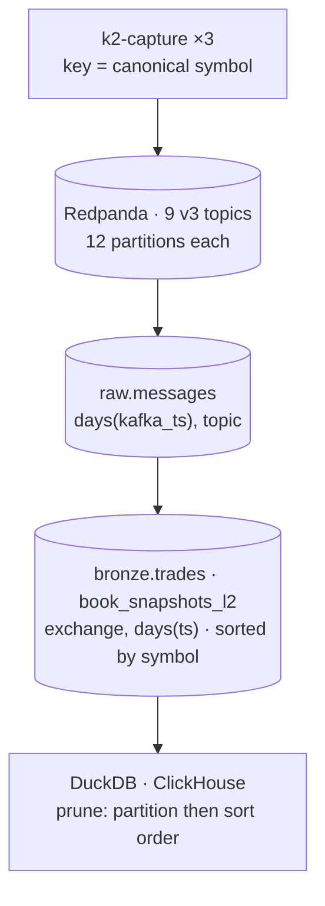

# Partitioning Strategy

Two tiers partition data in v3, and they solve different problems. **Redpanda partitions
buy producer and consumer parallelism, and decide what stays ordered.** **Iceberg
partitions control file count and prune scans; they evict nothing, because nothing in the
lake is ever evicted** ([ADR-021](../adr/ADR-021-raw-first-archive-and-lineage.md)). The
third tier — ClickHouse — serves the lake's gold layer; see [ClickHouse](#clickhouse) below.

What follows is what the DDL and the topic bootstrap actually configure:
[`docker/lake/ddl/lake.sql`](../../docker/lake/ddl/lake.sql) and
[`docker/redpanda/init.sh`](../../docker/redpanda/init.sh). Where a spec is a Phase D
plan rather than applied DDL, the row says so.



---

## Redpanda

Nine v3 topics, **12 partitions each** — `market.crypto.v3.{raw,trades,book}.<exchange>`
for Binance, Kraken and Coinbase. Verified on the running stack, 2026-08-26:

```console
$ docker exec k2-redpanda rpk topic list
NAME                               PARTITIONS  REPLICAS
market.crypto.v3.book.binance      12          1
market.crypto.v3.raw.binance       12          1
market.crypto.v3.trades.binance    12          1
…
```

The six v2 topics (`market.crypto.trades.<ex>{,.raw}`, 40/20/20 partitions) were deleted at
the Phase E cutover on 2026-08-27; the cluster now carries the nine v3 topics only, 108
partitions. Until then the count was `9 × 12 = 108` for v3 plus `2 × (40 + 20 + 20)` for v2.

### The key is the symbol, not the exchange

Trades and book snapshots are keyed on the **canonical symbol** (`BTC/USD`); raw frames
are keyed on the **venue-native symbol** (`BTCUSDT`, `XBT/USD`, `BTC-USD`), because the
raw archive must not carry a normalisation decision — `raw-message.avsc`'s `symbol` field
says so explicitly, and its value is read out of the payload. Frames that belong to no
single instrument — heartbeats, subscription acknowledgements, error envelopes — carry no
key at all and spread round-robin, which is correct: they have no ordering relationship
to anything (`services/capture-rust/src/record.rs:140-151`).

Keying on the symbol means every record for one instrument lands on one partition and
stays in the order the venue sent it. Ordering *across* instruments is not preserved and
is not needed: every downstream aggregation groups by symbol, and cross-instrument
ordering would in any case be a claim about three separate WebSocket connections that no
single clock can back.

**Why not key by exchange — because v2 did, and it cost two thirds of the fan-out.** The
v2 raw producer passes the exchange name as the key:

```kotlin
// services/feed-handler-kotlin/src/main/kotlin/com/k2/feedhandler/KafkaProducerService.kt:155
val record = ProducerRecord(topic, exchange, json)
```

One key value per topic hashes to one partition, so `market.crypto.trades.kraken.raw` and
`market.crypto.trades.coinbase.raw` have 20 partitions each and use **one**. The
partition count reads like headroom and is not — the topic is single-threaded end to end,
and no consumer group can ever parallelise past one member. This is on
[ADR-018](../adr/ADR-018-v3-lake-first-rust-capture.md)'s list of eight things v2 got
wrong, and it is the cheapest of them to fix: change the key.

**Why not one partition per symbol** (34 instruments → 34 partitions). It buys nothing
that 12 does not: ordering is already per-symbol, because the hash puts each symbol on
exactly one partition. What it costs is real — partition count is the one Kafka-family
setting that cannot be reduced without recreating the topic, every partition is a set of
files and an entry in every metadata exchange, and each additional consumer-group member
is a rebalance participant. 12 is chosen as headroom over the six-ish concurrent readers
this stack will plausibly want, at a metadata cost a single broker with `--smp 1` does not
notice.

**Skew is real and is accepted here.** BTC-quoted majors dominate volume, so the
partitions holding them are hotter than the tail. At the predicted ~700 frames/s in
([capacity model §2c](capacity-model.md#2c-raw-frames-in-and-records-out)) against a
broker sized for ~100 K msg/s ([ADR-010](../adr/ADR-010-resource-budget.md)'s "2 cores
handles 100K msg/s" — the figure rank 6 of [capacity model
§7](capacity-model.md#7-bottleneck-prediction) uses to put broker CPU at ~113× today's
rate), per-partition skew is not near anything that binds, and the fix if it ever is —
more partitions — is available only at topic-recreation cost, so it is a decision to make
once with headroom rather than to tune.

### Retention is not partitioning, but it interacts

`raw.*` topics carry 48 h *and* a 512 MiB-per-partition byte cap (`12 × 3 × 512 MiB ≈
18 GiB`, inside a 20 GB budget); `trades.*` and `book.*` carry 7 d and no byte cap. The
arithmetic and the reasoning are in `docker/redpanda/init.sh`. Which limit binds first is
an open question the Phase D burn-in settles. It matters to partitioning because the byte
cap is **per partition**: raising the partition count raises the disk floor
proportionally.

---

## Iceberg

Four tables across three namespaces — `raw.messages`, `bronze.trades`,
`bronze.book_snapshots_l2`, `audit.checks`. Applied by `docker/lake/apply_ddl.py` from
[`docker/lake/ddl/lake.sql`](../../docker/lake/ddl/lake.sql).

| Table | `PARTITIONED BY` | Local sort order | Target file size | Metrics on |
|---|---|---|---|---|
| `raw.messages` | `days(kafka_ts), topic` | `topic, partition, offset` | 256 MB | `offset`, `kafka_ts`, `partition` |
| `bronze.trades` | `exchange, days(exchange_ts)` | `symbol, exchange_ts` | 128 MB | `symbol`, `exchange_ts`, `seq`, `src_offset` |
| `bronze.book_snapshots_l2` | `exchange, days(snapshot_ts)` | `symbol, snapshot_ts` | 128 MB | `symbol`, `snapshot_ts`, `seq` |
| `audit.checks` | `days(run_ts)` | — | 128 MB | default |

All four: Parquet + zstd, `format-version = 2`, `write.distribution-mode = hash`,
copy-on-write for delete/update/merge. Three of the four also set
`write.metadata.metrics.default = none` and re-enable metrics per column, as the last
table column above records. `audit.checks` is the exception: its DDL sets no metrics
property at all, so it keeps Iceberg's `truncate(16)` default on every column — a table
of a few rows a night whose columns are all short strings pays nothing for it, and there
is no `payload`-shaped column to make the default expensive.

### `raw.messages`: time first, topic second

`days(kafka_ts)` leads because every access pattern the archive has is time-bounded — a
backfill, a replay window, a completeness audit for a day, an incremental read between two
snapshots. `topic` follows because a per-venue or per-stream read then prunes to a third
or a ninth of the files without touching the time bound.

The **sort order carries the offset range**. Files are locally sorted by `(topic,
partition, offset)`, so per-file min/max bounds on `offset` are tight, and the offset
continuity audit — which asks whether consecutive ingest snapshots' ranges abut per
`(topic, partition)`, including across the day seam
([ADR-022](../adr/ADR-022-exactly-once-via-snapshot-offsets.md)) — opens a handful of
files instead of scanning a day. The DDL writes `WRITE DISTRIBUTED BY PARTITION LOCALLY
ORDERED BY …` rather than a bare `WRITE ORDERED BY`, because the bare form silently
switches `write.distribution-mode` to `range` and buys a sampling job on every write.

**Metrics are off by default and on for three columns.** Iceberg's default is
`truncate(16)` on every column, which for `payload` means per-file bounds over frames up
to 5.2 MB (Coinbase's `level2` subscribe snapshot, spike S5) that no query will ever
filter on. Turning metrics on only for `offset`, `kafka_ts` and `partition` is a
statement about what prunes: the archive prunes on coordinates, never on anything inside
the frame. That is a direct consequence of `payload` being opaque bytes
([ADR-021](../adr/ADR-021-raw-first-archive-and-lineage.md)).

### `bronze.*`: exchange first, then the day, and symbol nowhere

`exchange` leads on both bronze tables. It has exactly three values, it will not grow
faster than roughly one a year, and it is the field almost every query filters on — so it
buys a two-thirds exact file skip for 3× the partition count. `days(...)` follows.

The two tables use **different time columns**, deliberately. `bronze.trades` partitions on
`exchange_ts` because every venue stamps a trade. `bronze.book_snapshots_l2` partitions on
`snapshot_ts` — K2's own 1 Hz sampler clock — because Binance's partial-depth stream
carries no venue timestamp at all, so `exchange_ts` is null for a third of the book rows
([ADR-027](../adr/ADR-027-book-snapshot-and-sequencing.md)), and a nullable column cannot
carry a partition. Using one column for symmetry would have put a third of the book data
in a null partition. The cost is stated where it lands: an as-of join from book snapshots
to trades crosses two different clocks, and any query doing it must say which.

### Why symbol is a sort key and not a partition field

This is the load-bearing partitioning decision in the lake, so the argument is worth
having in full.

**Partitioning by symbol would produce skew by construction.** The registry holds **34
(exchange, symbol) pairs** — binance 12, kraken 11, coinbase 11, 23 distinct canonical
symbols across them ([`config/instruments.yaml`](../../config/instruments.yaml)) — so
`exchange × day × symbol` is 34 partitions per day against a table that writes
**0.156 GB/day** for trades and **0.264 GB/day** for book snapshots
([capacity model §4c](capacity-model.md#4c-per-lake-table-per-day)). Even split evenly
that is `0.156 GB ÷ 34 = 4.6 MB` per trades partition per day, well under any file size
worth writing. And it would not split evenly: BTC-quoted majors would hold most of it;
the tail would hold partitions of a few hundred rows each. Those are files too small to
be worth opening, a metadata tree larger than the data it indexes,
and a compaction job that can never reach its 128 MB target because there is not 128 MB
in the partition to reach it with.

**The sort order does the same job at no file-count cost.** Files are locally sorted by
`(symbol, …)`, so each file's `symbol` min/max bounds cover a narrow, contiguous slice of
the alphabet. A single-instrument scan skips every file whose bounds exclude it, and
Parquet's row-group statistics narrow it again inside the files it does open. Metrics are
explicitly enabled on `symbol` for exactly this reason.

**The honest difference: partition pruning is exact, sort-order pruning is statistical.**
A partition filter is evaluated on metadata and is guaranteed; a sort-order skip depends
on how tightly the writer clustered the data, and it degrades if compaction falls behind
long enough for unsorted small files to accumulate. That failure shows up as *slow
queries*, not as an error, which is why the daily maintenance job sort-rewrites the last
two days of `bronze.*` rather than only binpacking them.

**And it is reversible.** Iceberg supports partition evolution: `ALTER TABLE …
ADD PARTITION FIELD symbol` applies to new data without rewriting old data. If the first
Phase D notebooks show single-symbol queries opening most of a day partition, that is the
answer, and it costs a DDL statement rather than a migration.

### Why not `hours()`

Considered for `raw.messages`, which is the only table with the volume to argue for it.
At the predicted 6.5 GB/day across 9 topics, `hours(kafka_ts), topic` is ~216 partitions
a day, ~79,000 a year, on a single host holding the catalog metadata for all of it. What
it would buy is a tighter time prune, and the day partition plus the `(topic, partition,
offset)` sort order already narrows an intraday read to a handful of files. Hourly is
metadata for a pruning gain that is already paid for. The arithmetic is redone in
[`scale-out-path.md`](scale-out-path.md) §3.3, where it comes out differently: an hourly
partition reaches one 256 MB target file at **8.5×** today's rate, and at the **400×** PB
case it is the right spec.

### File size: 256 MB for raw, 128 MB for bronze

`raw.messages` targets 256 MB because it is the high-volume table — 6.47 GB/day predicted
of the 6.89 GB/day all four lake tables write between them, **94 % of the lake's growth**
([capacity model §4c](capacity-model.md#4c-per-lake-table-per-day)) — and larger files
mean fewer manifest entries per snapshot and
fewer object-store round trips per scan. `bronze.*` target 128 MB because at 0.156 and
0.264 GB/day a 256 MB target would never be reached and compaction would produce one
undersized file per partition either way, with no benefit.

Both are targets, not guarantees. The ingest runs every 5 minutes, so each cycle writes
small files into the current day's partition — ~288 commits per day per table before
maintenance. Nightly compaction is what converges them
([ADR-017](../adr/ADR-017-iceberg-maintenance-pipeline.md)'s compact → expire → audit
ordering, carried into `docker/lake/maintenance.py`). Without it, small files accumulate
and both partition pruning and sort-order pruning get slower without getting wrong.

### What is not partitioned by, anywhere

- **Not by symbol.** Skew, above.
- **Not by hour.** File and manifest count, above.
- **Not by `conn_id`.** It is high-cardinality and unbounded — a new value on every
  reconnect — and it is a join key, not a filter.
- **Not by `schema_id`.** It changes only when a contract evolves, which is rare by
  design ([ADR-020](../adr/ADR-020-avro-fixed-point-contracts.md)); as a partition field
  it would be a near-constant that occasionally splits a day in two.

---

## ClickHouse

**Rewritten at the Phase E cutover, 2026-08-27.** The v2 hot tier (`k2.*`, 7-day TTL,
`SummingMergeTree` candles) is gone — [legacy/v2-clickhouse/](../../legacy/v2-clickhouse/README.md)
keeps its DDL, and `git log -p -- docs/architecture/partitioning-strategy.md` this page's
earlier description. What serves now is the `gold` database of
[ADR-026](../adr/ADR-026-four-layer-lake-and-gold-served-from-clickhouse.md):
[`docker/clickhouse/ddl/10-gold-tables.sql`](../../docker/clickhouse/ddl/10-gold-tables.sql).
No table has a TTL.

| Table | Engine | `PARTITION BY` | `ORDER BY` | Why |
|---|---|---|---|---|
| `gold.trades` | `ReplacingMergeTree(first_seen)` | `toYYYYMM(exchange_ts)` | `(exchange, canonical_symbol, exchange_ts, trade_id)` | the logical trade is the key; a venue replay or a feed/reload overlap collapses under `FINAL` to the **earliest delivery** (`first_seen` = inverted receive time). Monthly partitions keep `FINAL` a per-partition merge (the `quant` profile sets `do_not_merge_across_partitions_select_final`) and keep part counts flat at ~10 M rows/day |
| `gold.book_top20` | `ReplacingMergeTree(ver)` | `toYYYYMM(second)` | `(exchange, canonical_symbol, second)` | one row per venue-symbol-second; the later sample in a second wins, and a lake reload (state at the end of the second, `ver` = last nanosecond) out-ranks the feed's mid-second sample |
| `gold.ohlcv_{1m,5m,1h,1d}`, `gold.bbo_1s` | `ReplacingMergeTree(src_snapshot_id)` | `toYYYYMM(window_start)` / `toYYYYMM(second)` | `(exchange, canonical_symbol, window_start)` | loaded from the lake, never computed here; a reload carrying a newer lake snapshot for a bucket replaces the row |
| `gold.feed_errors` | `MergeTree` | — | `(topic, partition, offset)` | every record AvroConfluent could not decode, with its bytes |

**Why not partition by exchange, as the lake does.** ClickHouse's partition is a merge
boundary and a `FINAL` boundary, not a pruning device the way an Iceberg partition is;
`exchange` leads the `ORDER BY` instead, so a per-venue scan is a primary-key range and the
sparse index prunes it. Three venues in one monthly partition merge as one set of parts;
three per-venue partitions would triple the part count for the same rows.

**Why the sort key carries `exchange_ts` before `trade_id`.** A backtest reads a symbol's
trades in time order; the key makes that a sequential read of one primary-key range, and
`ohlcv_live(bucket)` groups on `toStartOfInterval(exchange_ts, …)` over the same order. The
trade id is last because it only has to make the key unique, and the venues number trades
sequentially per symbol so ties in `exchange_ts` resolve in venue order.

**OHLCV on read.** `gold.ohlcv_live(bucket = <seconds>)` is a parameterised view over
`gold.trades FINAL`; the materialised candles are the lake's and are loaded. The v2 tier
materialised candles into a `SummingMergeTree` whose open/close were resolved per insert
block, which is the wrong number when a minute spans two blocks; `make test-clickhouse`
asserts the view gets that minute right on every PR.

---

## Verifying

```bash
# Redpanda: partition counts, and whether the fan-out is actually being used.
docker exec k2-redpanda rpk topic list
docker exec k2-redpanda rpk topic describe -p market.crypto.v3.raw.binance
```

```sql
-- Iceberg: files, sizes and record counts per partition. Run in k2-spark-iceberg.
SELECT partition, count(*) AS files,
       sum(record_count) AS rows,
       round(avg(file_size_in_bytes) / 1048576, 1) AS avg_mb
FROM lake.raw.messages.files
GROUP BY partition ORDER BY partition;
```

```sql
-- Is the sort order doing its job? Tight symbol bounds per file mean a
-- single-symbol scan prunes. Wide bounds everywhere mean compaction is behind.
SELECT file_path, lower_bounds, upper_bounds
FROM lake.bronze.trades.files LIMIT 20;
```

Rules of thumb used here, and what each one means if it trips:

| Signal | Threshold | What it says |
|---|---|---|
| Average file size in a settled partition | < 10 MB | compaction is behind, or the partition spec is too fine |
| Files per day partition, `raw.messages`, after maintenance | > ~50 | the 256 MB target is not being reached — check the compaction job ran |
| Manifest count per snapshot | > ~100 | planning time is growing; rewrite manifests |
| Single-symbol scan opening > 10 % of a day partition's files | — | sort-order pruning is not working; `ADD PARTITION FIELD symbol` becomes the answer ([ADR-024](../adr/ADR-024-unified-bronze-tables-in-the-lake.md)) |

**None of these thresholds has been measured against a populated lake** — the tables were
created in Phase D and the burn-in that scores them is a labelled 2 h window
([Q6](../research/2026-08-26-v3-requirements-clarification.md#q6--burn-in-windows-real-wall-clock-duration-or-shortened)).
They are design expectations until then.

---

## Related

- [ADR-021](../adr/ADR-021-raw-first-archive-and-lineage.md) — why `raw.messages` is never evicted, and why it prunes on coordinates only
- [ADR-022](../adr/ADR-022-exactly-once-via-snapshot-offsets.md) — the offset continuity the raw sort order exists to serve
- [ADR-024](../adr/ADR-024-unified-bronze-tables-in-the-lake.md) — the unified bronze decision and the symbol-in-sort-order trade-off
- [ADR-026](../adr/ADR-026-four-layer-lake-and-gold-served-from-clickhouse.md) — the ClickHouse tier serves gold, indefinitely, from the lake
- [ADR-027](../adr/ADR-027-book-snapshot-and-sequencing.md) — why the book table's time axis is the sampler clock
- [capacity-model.md](capacity-model.md) — the bytes/day predictions every file-size argument above rests on
- [scale-out-path.md](scale-out-path.md) — the same partition arithmetic redone at PB scale
- [`docker/lake/ddl/lake.sql`](../../docker/lake/ddl/lake.sql) — the DDL this page describes, with per-column commentary
