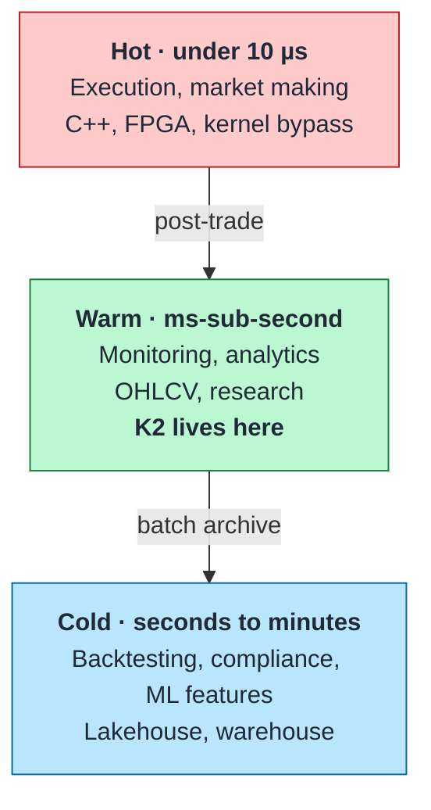

# Positioning

What this platform is for, what it is measurably good at, and the workloads it is deliberately wrong for. Knowing where a system does *not* belong is most of what makes it usable.

## What it is

A single-host crypto market-data platform that takes live exchange trades and makes them queryable as OHLCV candles in **under 200 ms p99**, then lands them in an open table format for history. It runs three exchanges on 15.1 CPU / 21.875 GB (v2 baseline); with the capture tier swapped for v3's Rust `k2-capture` ([ADR-019](../adr/ADR-019-rust-capture-tier.md)) and Phase D finished — the v2 ClickHouse→Iceberg offload deleted, the v3 lake the only lake ([ADR-018](../adr/ADR-018-v3-lake-first-rust-capture.md)) — the steady state is **14.60 CPU / 21.625 GiB across 15 long-running services** (bootstrap peak 16.10 CPU / 23.125 GiB across 19, with the four one-shots). The capture tier now carries L2 order books the v2 one never had. Source: `docker compose --env-file .env.example config`, limits summed ([command](../operations/docker-resources.md#how-these-numbers-are-produced)).

The design centre is the **warm path**: fast enough that a dashboard or a monitor reads current market state without feeling stale, durable enough that a year of history is one `SELECT` away, and small enough to run on one machine. That is a narrower target than "market data platform" usually implies, and the narrowness is the point.

## Where it sits

K2 spans the warm tier and the cold tier: ClickHouse is the warm store and Iceberg is the cold one. They are siblings rather than a chain — since Phase D both are fed from Redpanda, ClickHouse by its Kafka-engine consumers and the lake by a 5-minute Spark batch ([ADR-018](../adr/ADR-018-v3-lake-first-rust-capture.md)) — so the archive is not a copy of a serving database, and losing the hot tier costs a rebuild rather than data ([ADR-025](../adr/ADR-025-clickhouse-derived-hot-tier.md)). It is nowhere near the hot tier and is not trying to be — it sits after execution, never in front of it.

## Fits

**Live market monitoring.** Candles are current within ~200 ms of the trade. A dashboard on `ohlcv_1m` shows the market as it is, not as it was a batch window ago. This is the workload the architecture was actually shaped around.

**Intraday and historical research.** 30 days of validated tick-level trades in ClickHouse, unbounded history in Iceberg, six pre-aggregated timeframes maintained incrementally. Aggregations that would scan raw trades already exist as tables.

**Cross-exchange comparison.** Three venues normalized to one `canonical_symbol` in `silver_trades`. Comparing BTC/USD across Binance, Kraken and Coinbase is a `GROUP BY exchange` — the normalization that makes that work is the platform's main piece of domain logic.

**Learning the medallion pattern end to end.** Bronze/Silver/Gold, hot/cold tiering, idempotent batch ingest with the offsets in the snapshot summary, table-format maintenance — all present, all small enough to read in an afternoon.

## Does not fit

**Trade execution or market making.** Sub-10 µs needs FPGAs, kernel bypass and shared memory. A WebSocket, a broker hop and an OLAP insert are four orders of magnitude off. Nothing in this design closes that gap.

**Real-time risk and pre-trade checks.** Margin and position engines want single-digit-millisecond in-memory state. ClickHouse is a columnar store optimized for scans, not a state store optimized for point updates. kdb+, Flink or an in-memory grid is the right shape.

**Order management.** No FIX, no order lifecycle, no fills or allocations. K2 ingests public trade prints; it has no concept of *your* orders.

**Anything needing high availability.** One broker, one ClickHouse node, one host, no replication. Failure testing proved every component recovers from a restart in under 32 seconds — it proved nothing about surviving a dead disk, because nothing here would.

**Order-book depth, quotes, or non-crypto assets.** Trades only, crypto only. The Silver schema carries `asset_class` and `currency` so equities or futures *could* be added, but no such path has been built or tested.

## Measured, and honestly

| | Value | Confidence |
|---|---|---|
| Trade → queryable candle, p99 | 191 / 197 / 170 ms (Binance / Coinbase / Kraken) | Directional — n ≈ 12–13, cold start, 24 h burn-in unfinished |
| Cold-tier freshness | Under 15 minutes | Solid — scheduled cadence, verified running |
| Offload throughput | 3.78M rows in 16 s (236k rows/s) | Solid — measured on real data |
| Compression, Parquet + zstd 3 | ~12:1 | Solid |
| Warm/cold row consistency | 99.9%+ | Solid — audited 2026-02-15 and 02-18 |
| Recovery from component failure | Max MTTR 32 s across 6 injected failures | Solid — all six tested |
| Query latency | **Unmeasured** | No API exists; the "2–5 ms" figure in the v2 design was never verified |
| Sustained throughput ceiling | **Unmeasured** | Handlers run at the rate the exchanges send; 5x/10x load tests never run |

The last two rows are the honest limits of what can be claimed. Details and the full prediction scorecard: [MIGRATION-JOURNEY.md](../MIGRATION-JOURNEY.md).

## Choosing something else

| If you need | Use |
|---|---|
| Microsecond execution | Custom C++/Rust with FPGA or kernel bypass |
| In-memory time-series with millisecond point queries | kdb+ |
| Stateful streaming with exactly-once and large keyed state | Flink |
| Petabyte-scale warehousing with elastic compute | Snowflake, BigQuery, Databricks |
| Managed streaming you do not operate | Confluent Cloud, MSK, Redpanda Cloud |
| High availability | Any of the above, or this design across three hosts with replication |

K2's claim is narrow and specific: sub-second trade-to-candle, open formats end to end, three exchanges, on one 16-core machine, with the resource accounting shown ([ADR-010](../adr/ADR-010-resource-budget.md)). Outside that envelope, something on this list is a better answer.
