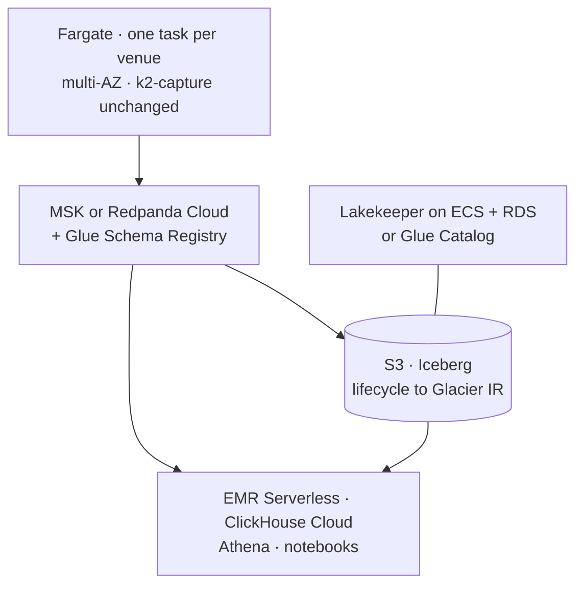

# Scale-out path — single host to AWS at TB/PB

> **Designed, not exercised.** Nothing on this page has been deployed, benchmarked or
> costed against a real AWS account. There is no account and the cloud deployment is
> explicitly out of scope
> ([Q9](../research/2026-08-26-v3-requirements-clarification.md#q9--scale-target)). This
> is a design document whose purpose is to keep the single-host implementation honest —
> every claim below is a claim about *this repository's code*, which can be checked, not
> about AWS behaviour, which cannot be checked from here.

Single-host Docker is a **stand-in**, not the design target. The question this answers is
narrow and worth answering precisely: *if this platform had to hold a petabyte, what
would change in the code, and what would not?* The answer the design is built toward is
"five environment variables and a Terraform repository", and the value of writing it down
now is that it fails loudly whenever a hard-coded endpoint sneaks in.

Scope: the v3 tiers as built in Phases B–D. The 16 CPU / 40 GB single-host constraint
([ADR-010](../adr/ADR-010-resource-budget.md)) is a *deliberate* constraint of the
project, not a ceiling on the architecture — ADR-018's non-goal list keeps *no HA on this
host*, which is a different sentence from *cannot scale*.



---

## 1. Per-tier mapping

Ten tiers, their AWS equivalent at TB/PB, and — the column that matters — what has to
change in this repository to get there.

| Tier | Today | At TB/PB on AWS | What changes in the code | What does not |
|---|---|---|---|---|
| **Capture** | 3 `k2-capture` containers, 0.25 CPU / 256–512 MB each | **ECS Fargate, one task per venue, spread across AZs.** Vertical, not horizontal: one WebSocket connection per venue is a correctness property ([ADR-019](../adr/ADR-019-rust-capture-tier.md)), so more venues means more tasks, never more replicas of one venue | broker endpoint (`K2_BROKERS`), registry URL (`K2_SCHEMA_REGISTRY_URL`), both already env-driven | **the binary.** The frame path, `recv_ts_ns`-before-parse, the book state machine, the resync policies, the metrics — none of it knows where it runs |
| **Bus** | single Redpanda broker, `--smp 1`, 9 v3 topics × 12 partitions | **MSK (3+ brokers, multi-AZ) or Redpanda Cloud.** Partition counts rise with symbol count, not with venue count — see §3 | `K2_BROKERS`, plus IAM/SASL auth on the producer and the Spark reader | the topic names, the keying (canonical symbol), the retention *intent* (raw is a buffer, not the archive) |
| **Schema registry** | Redpanda's built-in registry | **Glue Schema Registry, or the managed registry the bus ships.** `BACKWARD_TRANSITIVE` is a registry setting, not a code one | `K2_SCHEMA_REGISTRY_URL`; the Rust client's registry auth | **the Avro contracts.** `trade.avsc`, `book-snapshot-l2.avsc`, `raw-message.avsc` and the fixed-point `int64` @1e-8 rule ([ADR-020](../adr/ADR-020-avro-fixed-point-contracts.md)) are the interface, and they are already versioned by schema id |
| **Lake storage** | MinIO, one container, one bucket | **S3**, with a lifecycle policy on the data prefix (§4). This is what makes [Q8](../research/2026-08-26-v3-requirements-clarification.md#q8--raw-archive-retention-on-a-single-host)'s *keep forever* viable past one disk | `K2_S3_ENDPOINT` (unset → real S3), `K2_S3_REGION`, `K2_S3_PATH_STYLE=false` (virtual-hosted addressing on real S3) | `S3FileIO` is already the file IO. Not `s3a://`, not HadoopFileIO — the v3 lake has never used a filesystem path |
| **Catalog** | Lakekeeper v0.13.3 + PostgreSQL, one container each | **Lakekeeper on ECS + RDS PostgreSQL Multi-AZ**, or AWS Glue Data Catalog | `K2_LAKE_CATALOG_URI`, `K2_LAKE_WAREHOUSE`, catalog auth. Glue instead of Lakekeeper is a catalog-type change in `spark_conf.py` and an `ATTACH` change in the notebooks — the larger of the two options | the REST protocol, so Spark, DuckDB and ClickHouse keep addressing tables the same way ([ADR-023](../adr/ADR-023-lakekeeper-rest-catalog.md)) |
| **Ingest + maintenance** | one Spark container, Prefect-triggered every 5 min | **EMR Serverless**, one application, jobs submitted per run. Bursty compute is exactly its billing shape | the Prefect deployment's dispatch — `docker exec k2-spark-iceberg` becomes an EMR job submission; that line is the whole change | `ingest.py`, `offsets.py`, `maintenance.py` and the offsets-in-snapshot mechanism ([ADR-022](../adr/ADR-022-exactly-once-via-snapshot-offsets.md)). Exactly-once comes from the Iceberg commit, so it does not care what launched the job |
| **Hot tier** | ClickHouse 24.3 LTS, one node, 7-day TTL | **ClickHouse on EC2 (a cluster) or ClickHouse Cloud.** The TTL window is a cost dial, not a data decision, because the tier originates nothing | connection strings; the `iceberg()` rebuild path gains an S3 URL and IAM instead of MinIO keys | **the contract**: derived, rebuildable, reload-by-pull through `iceberg()`, the `s3()` glob banned ([ADR-025](../adr/ADR-025-clickhouse-derived-hot-tier.md)) |
| **Orchestration** | Prefect 3 server + worker + PostgreSQL, self-hosted | **Prefect Cloud**, or the same three containers on ECS + RDS | the API URL and the work-pool type | the flows, the schedules, and concurrency 1 on ingest — which is a correctness setting, not a politeness one |
| **Observability** | Prometheus + Grafana, self-hosted, no Alertmanager | **AMP + AMG** (managed Prometheus and Grafana), remote-write from the tasks | scrape config becomes remote-write; Alertmanager finally exists | the metric names, the alert rules, the `runbook:` annotations, the dashboards |
| **Notebooks** | DuckDB 1.4.4 + PyIceberg, local | **SageMaker / any notebook host**, same libraries; **Athena** for SQL over the same tables without a cluster | the `ATTACH` endpoint and credentials | DuckDB reads Iceberg through the same REST catalog it does today (spike S10); the queries are unchanged |

### The three things that do not change anywhere in that table

Stated separately because they are the design's actual load-bearing claims:

1. **The Avro contracts.** One wire format, fixed-point `int64` at 1e-8, `recv_ts_ns` in
   the body, `BACKWARD_TRANSITIVE` forever. A 2026 record decodes in 2030 by schema id,
   in a different cloud, with no migration.
2. **The capture binary.** `k2-capture` reads a WebSocket, stamps a receive time before
   parsing, keeps a book, samples it, and produces Avro. Nothing in it is
   single-host-shaped.
3. **The lake-as-system-of-record contract.** `raw.messages` verbatim and never expired;
   `bronze.*` pure functions of it; ClickHouse derived and rebuildable. Every tier above
   can be replaced without touching this, which is precisely why it was worth
   establishing on one host first.

---

## 2. What flips each endpoint

Every endpoint, region, path-style flag and catalog URI in `docker/lake/` is read from
the environment with today's single-host value as its default
([`docker/lake/spark_conf.py`](../../docker/lake/spark_conf.py)). This is the mechanical
form of the claim above: if the mapping needs a code edit, that is a bug in the code,
not a gap in this page.

| Variable | Default (this host) | On AWS | Effect |
|---|---|---|---|
| `K2_LAKE_CATALOG_URI` | `http://lakekeeper:8181/catalog` | the ECS service's URL, or a Glue endpoint | which catalog every Spark job and notebook resolves tables through |
| `K2_LAKE_WAREHOUSE` | `k2` | the warehouse registered in that catalog | which warehouse's storage profile is used |
| `K2_LAKE_CATALOG` | `lake` | unchanged | the Spark catalog name; also `spark.sql.defaultCatalog` |
| `K2_S3_ENDPOINT` | `http://minio:9000` | unset, or a VPC endpoint | which object store `S3FileIO` talks to |
| `K2_S3_REGION` | `local-01` | e.g. `eu-west-2` | S3 request signing region — required even for MinIO (spike S9) |
| `K2_S3_PATH_STYLE` | `true` | `false` | path-style addressing (MinIO) vs virtual-hosted (S3) |
| `K2_BROKERS` | `redpanda:9092` | MSK bootstrap brokers | where capture produces and Spark reads |
| `K2_SCHEMA_REGISTRY_URL` | `http://redpanda:8081` | the managed registry | where schema ids resolve |

Credentials are the one thing that is *not* a variable rename: `MINIO_ROOT_USER` /
`MINIO_ROOT_PASSWORD` become an IAM task role, and static keys stop being passed at all.
That is a deletion, which is the right direction.

---

## 3. The arithmetic at PB scale

Every number below derives from the predicted 1× rates in
[`capacity-model.md`](capacity-model.md), which are themselves **predictions, not
measurements** — §4c there predicts `raw.messages` at 6.47 GB/day, `bronze.trades` at
0.156 GB/day and `bronze.book_snapshots_l2` at 0.264 GB/day, and flags the raw
compression ratio (G3) as the row most likely to be wrong. Every multiplication of a
prediction inherits its error. The working is shown so a reader can substitute measured
inputs later and re-derive rather than re-guess.

### 3.1 What "PB scale" means here

**Assumption A1 — the scale factor.** 1 PB/year of lake data is the target size.

```
1,000,000 GB / 365 d          = 2,740 GB/day
2,740 GB/day ÷ 6.89 GB/day    = 398×   →  call it 400× today's rate
```

**Assumption A2 — the shape of that 400×.** It comes from breadth, not from a busier
BTC: roughly **20 venues × ~500 instruments ≈ 10,000 instruments**, against today's
3 venues × 34. That matters because it changes what scales — partition counts and topic
counts scale with venues and symbols; per-connection CPU does not.

At 400×: **~280,000 frames/s in**, **~354,000 records/s out**
(699.8 and 883.8 /s at 1×, capacity model §2c), and **2.59 TB/day** into `raw.messages`.

### 3.2 Files per day, and why the small-file problem inverts

**Assumption A3** — files land at the configured target size after compaction; the ingest
cadence stays 5 minutes (288 commits/day/table).

```
raw.messages, 400×:  2,588 GB/day ÷ 256 MB per file   = 10,109 files/day
per commit:          2,588 GB ÷ 288 commits           = 8.99 GB  → ~35 files
```

**Thirty-five files of 256 MB per commit, without compaction.** This is the single most
useful thing on the page: the small-file problem is a *small-scale* problem. On this host,
a 5-minute commit writes a few MB and the nightly binpack exists to fix that. At 400×,
every commit is already writing target-sized files, so raw compaction becomes a no-op
guarded by a minimum-file-size filter, and the maintenance job's real work shifts to
**sort rewrites** (clustering `bronze.*` by symbol) and **manifest rewrites**.

```
bronze.trades, 400×: 62.4 GB/day ÷ 20 exchange partitions = 3.12 GB/partition/day
                     3.12 GB ÷ 128 MB                     = ~25 files/partition/day
```

At that point `bronze.*` should move to a 256 MB target too — 128 MB exists today only
because 0.156 GB/day cannot fill a bigger file.

### 3.3 Partition spec, re-derived

The rule this design uses: **a partition should hold at least one target-sized file, and
a table should not accumulate partitions faster than its metadata can be planned.**

| Spec | 1× (today) | 400× | Verdict |
|---|---|---|---|
| `raw.messages` `days(kafka_ts), topic` | 9 partitions/day, ~26 files/day, ~0.72 GB per partition | 60 partitions/day (20 venues × 3 streams), ~43 GB per partition | holds at both ends |
| `raw.messages` `hours(kafka_ts), topic` | 216 partitions/day, **30 MB per partition** — a tenth of a target file | 1,440 partitions/day, **1.8 GB per partition** — 7 target files | wrong today, **right at scale** |
| `bronze.*` `exchange, days(ts)` | 3 partitions/day, ~50 MB each | 20 partitions/day, ~3.1 GB each | holds at both ends |
| `bronze.*` + `symbol` | ~100 partitions/day, most holding hundreds of rows | 10,000 symbols → **200,000 partitions/day** | wrong at both ends, catastrophically so at scale |

**The `hours()` crossover is a computable trigger, not a judgement.** A per-topic hour
partition holds `6.47 GB/day ÷ 9 topics ÷ 24 h = 30 MB` today. It reaches one 256 MB
target file at `256 ÷ 30 ≈ 8.5×` today's rate. That is the number in this page's
*Revisit when*, and it is why [`partitioning-strategy.md`](partitioning-strategy.md)
rejects `hours()` today without claiming it is wrong in general.

**Symbol stays out of the partition spec at every scale**, and the reason strengthens
rather than weakens: 10,000 symbols × 20 venues × 365 days is 73 million partitions a
year, against a table whose sort order already prunes by symbol at zero metadata cost
([ADR-024](../adr/ADR-024-unified-bronze-tables-in-the-lake.md)). Partition evolution
remains the escape hatch for a *specific* hot symbol, not for the dimension.

### 3.4 Manifests

**Assumption A4** — a manifest entry is ~500 bytes of Avro with metrics on 3–4 columns,
and Iceberg's default `commit.manifest.target-size-bytes` is 8 MB, so **~16,700 entries
per manifest**.

```
1×:    9,490 files/year   ÷ 16,700  = 1 manifest covers a year
400×:  3.69 M files/year  ÷ 16,700  = ~221 manifests for a year of raw
```

Two hundred manifests in a snapshot's manifest list is comfortable — planning reads the
list, prunes manifests by their partition summaries, and opens only the ones whose
`kafka_ts` and `topic` ranges intersect the query. It stops being comfortable when
manifests are *not* clustered by partition, which is what happens when hundreds of small
commits each add their own: 288 commits/day × 365 = 105,000 manifests a year if nothing
rewrites them. **`rewrite_manifests`, grouped by partition, is therefore a required
maintenance step at scale and merely a nice-to-have today** — the difference between 221
and 105,000 is entirely whether that job runs.

### 3.5 Compaction cadence

| Scale | Raw compaction | Bronze compaction | Manifest rewrite | Snapshot expiry |
|---|---|---|---|---|
| 1× (today) | nightly binpack → 256 MB; this is the job that matters | nightly sort rewrite, last 2 days | not needed (1 manifest) | nightly, keep 7 days |
| 400× | **skip** — files already land at target; run binpack with a min-file-size filter so it is a metadata scan, not 2.6 TB of rewriting | nightly sort rewrite, last 2 days, partition-parallel on EMR Serverless | **nightly, grouped by partition** — the job that matters at this scale | nightly; expiry now reclaims real money in S3 |

The point of the table: **the maintenance job's centre of gravity moves from data to
metadata as the platform grows.** A cadence tuned on this host and shipped unchanged to
400× would rewrite 2.6 TB a night to fix a problem that no longer exists, while leaving
the problem that does.

One constraint that survives every scale, and is easy to get wrong: **snapshot expiry must
never remove the newest ingest snapshot**, because its summary carries the Kafka offsets
that the next run resumes from ([ADR-022](../adr/ADR-022-exactly-once-via-snapshot-offsets.md)).

---

## 4. Storage lifecycle — what actually makes "keep forever" affordable

[Q8](../research/2026-08-26-v3-requirements-clarification.md#q8--raw-archive-retention-on-a-single-host)
keeps `raw.messages` forever and names the single-host disk as the honest limit. On S3 the
limit stops being capacity and becomes storage class, which is a lifecycle policy on the
data prefix — and this is the one place where the AWS mapping changes a *promise*, not
just a hostname, so it is written out rather than waved at.

| Age | Class | Readable by `iceberg()` / DuckDB? |
|---|---|---|
| 0–30 d | S3 Standard | yes |
| 30–90 d | Standard-IA | yes |
| 90 d – 1 y | **Glacier Instant Retrieval** | yes — millisecond access, which is what keeps the archive queryable |
| > 1 y | Glacier Deep Archive | **no** — a restore is required first, hours to ~48 h |

**Two rules that follow, and both are the kind that get discovered the hard way:**

1. **Never lifecycle the metadata prefix.** Iceberg's `metadata.json`, manifest lists and
   manifests must stay in Standard. Transitioning them makes table planning — not just
   reading old data — fail, because planning touches every live manifest regardless of
   which partitions the query wants.
2. **Deep Archive changes what "system of record" means.** Beyond a year, the archive is
   still complete and no longer *immediately* queryable: a research question about 2027
   becomes a restore request and a wait. That is a defensible trade at PB scale and it is
   a different promise from the one this platform makes today, so it belongs in an ADR
   when it is taken, not in a lifecycle rule someone adds quietly.

---

## 5. Cost shape

**No dollar figures appear on this page, and that is deliberate.** Every published number
in this repository cites the command or file that produced it; an AWS cost estimate for a
deployment that does not exist would have no provenance and would be quoted anyway. What
can be said honestly is the *shape* — which terms dominate, and which are noise:

- **Storage dominates, and it grows on a calendar.** `raw.messages` is 91 % of the bytes
  ([capacity model §4b](capacity-model.md#4b-per-topic-per-day)) and nothing deletes it,
  so the storage line rises monotonically while every other line is roughly flat in
  steady state. The lifecycle policy in §4 is therefore the single largest lever on total
  cost, and the only one that trades money against a stated guarantee.
- **Capture is negligible, and stays negligible.** Three tasks at a predicted 0.074 CPU
  and ~0.26 GB combined (capacity model §3b, §5); at 400× it is 20 tasks of the same
  size, because capture scales with *venues*, not with volume — one connection per venue
  is a correctness property, and the per-frame cost is ~20 µs against a 12,500 frames/s
  quota.
- **Compute is bursty and small relative to storage.** Ingest is 288 short jobs a day;
  maintenance is one nightly window. Serverless billing matches that shape, which is the
  reason EMR Serverless is the ingest mapping rather than a persistent cluster.
- **Two terms that are invisible on one host and are not on AWS:** per-request charges
  (millions of object GETs against millions of files — another argument for large target
  files) and cross-AZ data transfer between capture tasks, the bus and the ingest jobs.
  Both scale with *file count* and *topology*, not with bytes, so neither shows up in a
  capacity model built on GB/day.
- **The hot tier is a dial.** ClickHouse holds 7 days and originates nothing, so its cost
  is a retention choice with no data consequence — the only tier on this page where
  spending less loses nothing but freshness.

---

## 6. What this page does not answer

- **Whether any of it works.** Nothing here has been deployed. The first thing an actual
  migration would discover is which assumption in §3 is wrong, and A4 (manifest entry
  size) is the one with the least behind it.
- **Multi-region.** One region is assumed throughout. Cross-region replication of an
  Iceberg lake is a catalog problem before it is a storage problem, and it is not
  designed here.
- **HA below the AWS layer.** Managed services bring multi-AZ with them; the platform's
  own single-writer assumptions — Prefect concurrency 1 on ingest, one connection per
  venue — are unchanged and are still single points of failure inside a redundant
  substrate.
- **The migration itself.** Moving existing lake data to S3, re-registering tables in a
  new catalog, and running both stacks during a cutover are each their own piece of work.
  [Q7](../research/2026-08-26-v3-requirements-clarification.md#q7--v2-data-migrate-the-existing-clickhouse-and-iceberg-data-into-the-lake)'s
  reasoning — that data captured to a different standard should not be imported as if it
  were not — would need re-asking, and would probably answer differently, because this
  data *was* captured to the v3 standard.

**Revisit when:** a second host or an AWS account is provisioned (Q9's own trigger); or
sustained ingest passes **8.5× today's rate**, which is where the `hours()` partition
crossover in §3.3 falls and the first line of this design stops being hypothetical; or
`docker/lake/` gains a hard-coded endpoint, which is the failure this page exists to
make visible.

---

## Related

- [Q9, v3 requirements clarification](../research/2026-08-26-v3-requirements-clarification.md#q9--scale-target) — the question this answers, and the *designed, not exercised* label
- [Q8](../research/2026-08-26-v3-requirements-clarification.md#q8--raw-archive-retention-on-a-single-host) — keep forever, and why §4's lifecycle is what makes it viable past one disk
- [capacity-model.md](capacity-model.md) — every 1× input multiplied above, with its assumption
- [partitioning-strategy.md](partitioning-strategy.md) — the same specs argued at today's scale
- [ADR-021](../adr/ADR-021-raw-first-archive-and-lineage.md) — the archive contract that survives the move
- [ADR-022](../adr/ADR-022-exactly-once-via-snapshot-offsets.md) — why the ingest job does not care what launched it
- [ADR-023](../adr/ADR-023-lakekeeper-rest-catalog.md) — the catalog choice, and why it maps to ECS + RDS or Glue
- [ADR-025](../adr/ADR-025-clickhouse-derived-hot-tier.md) — why the hot tier's retention is a cost dial rather than a data decision
- [`docker/lake/spark_conf.py`](../../docker/lake/spark_conf.py) — the env-driven configuration §2 describes
