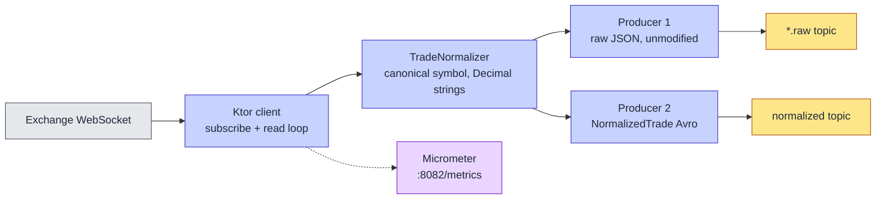

# Streaming Sources

How exchange data gets into the platform, and what a fourth exchange would cost. Three sources are live: **Binance (12 pairs), Kraken (11), Coinbase (11)** — the full list is [`config/instruments.yaml`](../../config/instruments.yaml), which is the single source of truth for all three.

Implementation: [`services/feed-handler-kotlin/`](../../services/feed-handler-kotlin/). One image, three containers, selected by `K2_EXCHANGE`.

---

## Shape of a feed handler

Four responsibilities, and deliberately no more:

1. **Connect and stay connected.** Ktor CIO WebSocket client, one connection per handler, all of that exchange's symbols on it. On disconnect: fixed 5 s delay, unlimited retries (`reconnect-delay-ms = 5000`, `max-reconnect-attempts = -1`). Ping interval 30 s. The KDoc in the clients calls this exponential backoff — it is not; it is a constant delay, which has been adequate at this scale.
2. **Parse.** `kotlinx.serialization` into an exchange-specific data class in `Models.kt`.
3. **Normalize.** `TradeNormalizer` maps to the canonical shape: exchange symbol *and* canonical symbol, price/quantity/quote-volume as strings to avoid float rounding, side from the taker's perspective, both an exchange timestamp and a platform timestamp.
4. **Produce twice.** The untouched payload to `market.crypto.trades.<exchange>.raw`, and the `NormalizedTrade` Avro record to `market.crypto.trades.<exchange>`.

Everything else — validation, deduplication, aggregation, retention — happens downstream in ClickHouse. The handler holds no state beyond the connection.

---

## Symbol normalization

The one piece of genuine per-exchange logic. Each exchange names the same instrument differently, and Silver joins across all three, so the mapping has to be exact.

| Exchange | WebSocket URL | Native symbol | `symbol` | `canonical_symbol` |
|---|---|---|---|---|
| Binance | `wss://stream.binance.com:9443/ws` | `BTCUSDT` | `BTCUSDT` | `BTC/USDT` |
| Kraken | `wss://ws.kraken.com` | `XBT/USD` | `XBT/USD` | `BTC/USD` (`XBT`→`BTC`, `XDG`→`DOGE`) |
| Coinbase | `wss://advanced-trade-ws.coinbase.com` | `BTC-USD` | `BTCUSD` | `BTC/USD` |

Kraken's aliases are the sharp edge: it uses the ISO-4217-style `XBT` for Bitcoin and `XDG` for Dogecoin. Both mappings are unit-tested in `TradeNormalizerTest`.

---

## Dual-produce, and why the Avro topic is currently unread

Both topics are live and the Avro schema is registered (`market.crypto.trades.<exchange>-value` in Redpanda's built-in registry). But the ClickHouse Kafka-engine tables consume the **`.raw` JSON topics** with `kafka_format = 'JSONAsString'`, and a materialized view does the JSON extraction and `Decimal(18,8)` casting inside the database.

That was not the original plan — the Avro path was meant to be the pipeline. It stayed anyway, for two reasons worth stating plainly: the raw topic is the only place a byte-exact exchange payload survives, which is what you want when a normalization looks wrong; and the Avro topic is the seam any non-ClickHouse consumer would attach to without re-implementing three JSON dialects. It costs one extra produce per trade. If it were still unread in six months, it should go.

---

## Topics and partitions

Created explicitly by the `redpanda-init` one-shot service, not by auto-create, so partition counts are deterministic:

| Topic | Partitions |
|---|---|
| `market.crypto.trades.binance.raw` / `market.crypto.trades.binance` | 40 each |
| `market.crypto.trades.kraken.raw` / `market.crypto.trades.kraken` | 20 each |
| `market.crypto.trades.coinbase.raw` / `market.crypto.trades.coinbase` | 20 each |

Rationale in [partitioning-strategy.md](partitioning-strategy.md). The same init job hardens `_schemas` to `cleanup.policy=compact` with infinite retention — without it, a schema-registry restart after the default 24 h local retention window produced `offset_out_of_range` and the registry came up empty.

---

## Metrics

Micrometer on `:8082/metrics`, scraped by Prometheus as `feed-handler-{binance,kraken,coinbase}`:

| Metric | Notes |
|---|---|
| `feed_handler_trades_produced_total` | Tagged `type="raw"` / `type="normalized"` — divergence between the two means one producer is stuck |
| `feed_handler_errors_total` | Drives `FeedHandlerHighErrorRate` |
| `feed_handler_reconnects_total` | Drives `FeedHandlerFrequentReconnects` |
| `up{job=~"feed-handler-.+"}` | Drives `FeedHandlerDown` |

`:8082/health` backs the Compose healthcheck. Alert definitions: `docker/prometheus/rules/feed-handler-alerts.yml`.

---

## Adding a fourth exchange

Coinbase was added this way in Phase 7 ([ADR-016](../decisions/ADR-016-add-coinbase-exchange.md)). The full procedure is [operations/adding-new-exchanges.md](../operations/adding-new-exchanges.md); the shape of it:

1. Add the exchange and its symbols to `config/instruments.yaml`.
2. Add a `<Exchange>WebSocketClient.kt` and its payload models; add a `normalize<Exchange>` to `TradeNormalizer` plus tests for the symbol mapping.
3. Add topics to the `redpanda-init` command with a partition count matched to expected volume.
4. Add a ClickHouse DDL file: Kafka-engine queue, bronze table, normalizing MV, and a `bronze_<exchange>_to_silver_mv`. The bronze column set is fixed — match it exactly.
5. Add the service to `docker-compose.yml` (0.5 CPU / 512 MB, `K2_EXCHANGE=<exchange>`) and a Prometheus scrape job.
6. Add an Iceberg `cold.bronze_trades_<exchange>` table, seed its row in `offload_watermarks`, and register it in the offload flow's table config.

Two traps, both hit for real:

- **Bind-mount inode staleness.** `config/instruments.yaml` is a file-level bind mount, so the container pins the inode. Editing the file with a write-then-rename editor gives it a new inode and the container keeps reading the old one. `docker restart` does not fix it — `docker compose up -d --force-recreate --no-deps <service>` does.
- **Schema-registry startup race.** All three handlers race the registry at cold start; Binance and Kraken retry out of it, Coinbase once got stuck in a permanent retry loop with the schema correctly registered. Same fix: force-recreate for a fresh JVM.

---

## Deliberately absent

No dead-letter queue, no producer batching layer, no backpressure signalling, no order-book or quote ingestion, no authenticated/private channels. Every handler subscribes to public trade streams only, and a message that fails to parse is logged and dropped. At three exchanges and 34 instruments this has not cost anything; at a hundred instruments across ten venues, the DLQ is the first thing to add.
