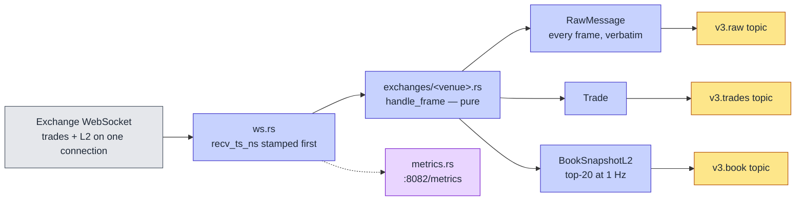

# Streaming Sources

How exchange data gets into the platform, and what a fourth exchange would cost. Three sources are live: **Binance (12 pairs), Kraken (11), Coinbase (11)** — the full list is [`config/instruments.yaml`](../../config/instruments.yaml), which is the single source of truth for all three.

Implementation: [`services/capture-rust/`](../../services/capture-rust/README.md). One image, three containers, selected by `--exchange` / `K2_EXCHANGE`. The crate README is the reference for the code; this page is the tier's shape and the per-venue dialects.

> **The v2 Kotlin feed handlers this page used to describe are retired** ([ADR-019](../adr/ADR-019-rust-capture-tier.md), 2026-08-26) and archived at [`legacy/v2-kotlin/`](../../legacy/v2-kotlin/README.md). They were the only producers of `market.crypto.trades.<ex>` and `market.crypto.trades.<ex>.raw`, so those six topics are frozen — retained and readable, no longer written. See the top of [README.md](README.md).

---

## Shape of a capture process

Four responsibilities, and deliberately no more:

1. **Connect and stay connected.** One `tokio-tungstenite` connection per process, carrying every stream that venue offers for the whole instrument list. Reconnect is exponential backoff with a cap (`ws.rs`); Binance additionally reconnects on a schedule before the venue's 24 h connection lifetime expires (`BINANCE_MAX_CONNECTION_AGE`), and `k2_capture_reconnects_total` carries a `reason` label of `scheduled` or `involuntary` so the two are distinguishable in a postmortem.
2. **Stamp, then parse.** `recv_ts_ns` is `SystemTime::now()` as the first statement on frame receipt, before a byte is deserialised. This is the one property the whole latency-decomposition story rests on, and it is why the JVM tier could not be extended into it.
3. **Derive, without losing the original.** `handle_frame` returns the `RawMessage` first and anything derived from it after, so a normalisation bug is repairable by reprocessing the archive rather than by losing the day. Arithmetic is fixed-point `i64` at 1e-8 throughout — no `f64` on any record path ([ADR-020](../adr/ADR-020-avro-fixed-point-contracts.md)).
4. **Produce three streams.** `market.crypto.v3.raw.<ex>`, `.trades.<ex>` and `.book.<ex>`, all Confluent-framed Avro against Redpanda's built-in registry, keyed by the canonical symbol.

`handle_frame` is pure — no I/O, no clock reads, no `HashMap` iteration on an emit path — which is what lets [`tests/replay.rs`](../../services/capture-rust/tests/replay.rs) push archived frames back through the live code and assert the bytes out are identical. The process holds no state beyond the connection and the L2 book.

### Streams per venue

| Venue | WebSocket | Channels on the one connection | Book |
|---|---|---|---|
| Binance | `wss://stream.binance.com:9443/stream` | combined `<sym>@trade` + `<sym>@depth20@100ms` | stateless top-20 from the venue; `lastUpdateId` must not regress |
| Kraken | `wss://ws.kraken.com/v2` | `instrument` (precision, first), `book` at `depth=25`, `trade` | locally maintained, CRC32 verified on every update |
| Coinbase | `wss://advanced-trade-ws.coinbase.com` | `market_trades`, `level2`, `heartbeats` | locally maintained full depth in a `BTreeMap`, truncated to top-20 on emit |

Depth beyond 20 exists to keep the book correct — Kraken's checksum is defined over 25 levels, Coinbase gives no depth parameter — not to be stored. Per-venue sequencing and resync policy: [`services/capture-rust/README.md`](../../services/capture-rust/README.md#sequencing-and-resync-per-venue) and [ADR-027](../adr/ADR-027-book-snapshot-and-sequencing.md).

---

## Symbol normalization

Each exchange names the same instrument differently, and any cross-venue join needs one key, so the mapping has to be exact — and it is **data, not code**. [`config/instruments.yaml`](../../config/instruments.yaml) lists every instrument as a `native` (the bytes on the wire, byte for byte) and a `canonical` (`BASE/QUOTE`). A symbol the registry does not list is a hard error, never a guess.

| Exchange | WebSocket URL | `native` | `canonical` |
|---|---|---|---|
| Binance | `wss://stream.binance.com:9443/stream` | `BTCUSDT` | `BTC/USDT` |
| Kraken | `wss://ws.kraken.com/v2` | `BTC/USD` | `BTC/USD` |
| Coinbase | `wss://advanced-trade-ws.coinbase.com` | `BTC-USD` | `BTC/USD` |

`BTC/USDT` and `BTC/USD` are different instruments and are never folded together — different venues, different collateral, and the basis between them is itself a research subject. What *is* folded is a venue's private ticker for an asset.

**Kraken's spellings moved with the retirement.** Kraken WS v1 spelled Bitcoin `XBT/USD` and Dogecoin `XDG/USD`; v2 — what `capture-kraken` speaks — spells them `BTC/USD` and `DOGE/USD` and answers `{"error":"Currency pair not supported XBT/USD"}` to the old ones. The registry carried the v1 spellings while the Kotlin v1 handlers read the same file, and `kraken.rs` held a two-row alias table to bridge them; both went with the handlers. Nothing translates a symbol anywhere in the capture tier now, which is what makes a registry typo present as a venue error rather than as silent aliasing. Asserted by `exchanges::kraken::tests::a_v1_spelling_is_not_aliased_and_matches_nothing` and `tests/test_contracts.py::test_kraken_natives_are_the_ws_v2_spellings`.

---

## Why v2's Avro topic was never read

Worth keeping as a lesson rather than a design note, because the mistake is easy to repeat.

The Kotlin tier dual-produced: the untouched exchange payload to `market.crypto.trades.<ex>.raw`, and a `NormalizedTrade` Avro record to `market.crypto.trades.<ex>`, with the schema registered. The Avro path was meant to be the pipeline. It never became one — the ClickHouse Kafka-engine tables consumed the **`.raw` JSON topics** with `kafka_format = 'JSONAsString'` and a materialized view did the extraction and `Decimal(18,8)` casting inside the database. So the Avro topic had a producer, a registered schema and no consumer for its entire life, and the schema shipped with `logicalType` as a sibling of `type` — where Avro ignores it — for six months without anything noticing ([ADR-020](../adr/ADR-020-avro-fixed-point-contracts.md)).

v3 does not repeat the shape. `market.crypto.v3.trades.<ex>` is Avro, and it is what the v3 hot tier reads; `market.crypto.v3.raw.<ex>` is the archive rather than a second copy of the same trade. A registry with no consumer proves nothing.

---

## Topics and partitions

Created explicitly by [`docker/redpanda/init.sh`](../../docker/redpanda/init.sh) as the `redpanda-init` one-shot service, not by auto-create, so partition counts are deterministic:

| Topic | Partitions | Retention | State |
|---|---|---|---|
| `market.crypto.v3.raw.<ex>` | 12 each | 48 h, 512 MiB/partition, `max.message.bytes=8 MiB` | live |
| `market.crypto.v3.trades.<ex>` | 12 each | 7 d | live |
| `market.crypto.v3.book.<ex>` | 12 each | 7 d | live |
| `market.crypto.trades.binance[.raw]` | 40 each | default | **frozen** |
| `market.crypto.trades.kraken[.raw]` | 20 each | default | **frozen** |
| `market.crypto.trades.coinbase[.raw]` | 20 each | default | **frozen** |

12 partitions is one per instrument at the current registry — enough for per-symbol ordering with parallel consumers, and uniform across venues on purpose, where v2's 40/20/20 encoded an instrument count that had already drifted. The six frozen v2 topics are still created (the `k2` Kafka-engine queues error on a missing topic) and still hold their retained data; Phase E deletes them. The 8 MiB message cap on `raw` is not optional: a Coinbase `level2` subscribe snapshot measured 5,195,904 bytes, and Redpanda's 1 MiB default silently rejected it. Rationale in [partitioning-strategy.md](partitioning-strategy.md). The same init job hardens `_schemas` to `cleanup.policy=compact` with infinite retention — without it, a schema-registry restart after the default 24 h local retention window produced `offset_out_of_range` and the registry came up empty.

---

## Metrics

`metrics-exporter-prometheus` on `:8082/metrics`, scraped as `capture-{binance,kraken,coinbase}`. Every series carries the venue's own `exchange` label, which is why the scrape jobs deliberately set no `exchange` target label. The full list is in [`services/capture-rust/README.md`](../../services/capture-rust/README.md#metrics-and-liveness); the ones alerts read:

| Metric | Notes |
|---|---|
| `k2_capture_records_delivered_total` | Incremented from the **delivery report**, not the enqueue — `records_produced_total` climbs at full rate through a broker outage, which is why `CaptureProduceStalled` reads this one |
| `k2_capture_last_message_ts_seconds` | Per *continuous* stream only, seeded at process start. Drives `CaptureFeedStale` |
| `k2_capture_gaps_total`, `_resyncs_total` | Sequence continuity; drive `CaptureSequenceGaps` and `CaptureResyncStorm` |
| `k2_capture_checksum_failures_total` | Kraken only — the other two venues publish no checksum, so no series is seeded for them |
| `k2_capture_exchange_to_recv_seconds` | Histogram. Its HELP text states the exchange-skew and public-internet caveat |
| `up{job=~"capture-.+"}` | Drives `CaptureDown` — `up` is synthetic and has no venue label of its own, so that alert identifies the venue by `job` |

The `k2-capture healthcheck` subcommand backs the Compose healthcheck; the distroless image has no `curl`. Alert definitions: [`docker/prometheus/rules/capture-alerts.yml`](../../docker/prometheus/rules/capture-alerts.yml), with `promtool` unit tests in `docker/prometheus/tests/capture-alerts.test.yml` (`make check-alerts`).

---

## Adding a fourth exchange

Coinbase was added this way in Phase 7 ([ADR-016](../adr/ADR-016-add-coinbase-exchange.md)). The full procedure is [operations/adding-new-exchanges.md](../operations/adding-new-exchanges.md); the shape of it:

1. Add the exchange and its instruments to `config/instruments.yaml` — `native` exactly as the venue spells it on the wire, `canonical` as `BASE/QUOTE`.
2. Add an `Exchange` enum variant and its default WebSocket URL in `services/capture-rust/src/config.rs`.
3. Add `services/capture-rust/src/exchanges/<exchange>.rs` implementing `handle_frame`, `subscribe_messages`, `snapshot` and the venue's own continuity check, and wire it into the `Adapter` enum in `exchanges/mod.rs`.
4. Record a fixture with `k2-capture record --exchange <exchange>` and add a `tests/replay_<exchange>.rs` that hashes two passes over it against a committed golden value.
5. Add the three v3 topics and their Avro subjects to `docker/redpanda/init.sh`.
6. Add the `capture-<exchange>` service to `docker-compose.yml` (0.25 CPU / 256M, more if the venue sends full-depth books) and a Prometheus scrape job with no `exchange` target label.
7. Extend the `exchange=~` selectors in `docker/prometheus/rules/capture-alerts.yml` and the capture dashboard.

The full procedure, including the frozen v2 medallion's own steps: [operations/adding-new-exchanges.md](../operations/adding-new-exchanges.md).

Two traps, both hit for real:

- **Bind-mount inode staleness.** `config/instruments.yaml` is bind-mounted, so the container pins the inode. Editing it with a write-then-rename editor gives it a new inode and the container keeps reading the old one. `docker restart` does not fix it — `docker compose up -d --force-recreate --no-deps <service>` does.
- **Schema-registry startup race.** `redpanda-init` registers the Avro subjects and every capture container gates on it with `service_completed_successfully`; the sink then warms one subject per record kind before the first WebSocket connect, with a 5 s timeout, so a registry that accepts a connection and never answers cannot stall the socket read indefinitely.

---

## Deliberately absent

No dead-letter queue, no spill-to-disk when librdkafka's 32 MB queue fills (records are dropped and counted instead — blocking the frame loop would stop us reading the socket and the venue would drop us, losing more than it saved), no authenticated or private channels, no quote or ticker ingestion. Every process subscribes to public streams only. A frame that fails to parse is still archived verbatim to the `raw` topic and counted in `k2_capture_unknown_frames_total` — it is not dropped, which is the one thing v2 did here that v3 does not. At three exchanges and 34 instruments this has not cost anything; at a hundred instruments across ten venues, the DLQ is the first thing to add.
