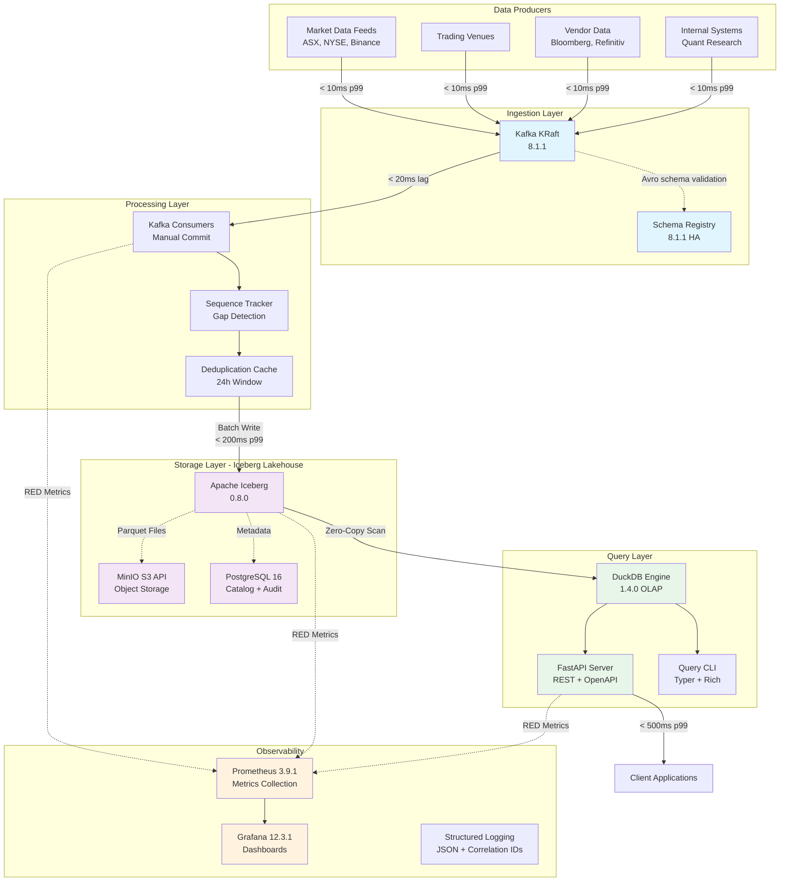
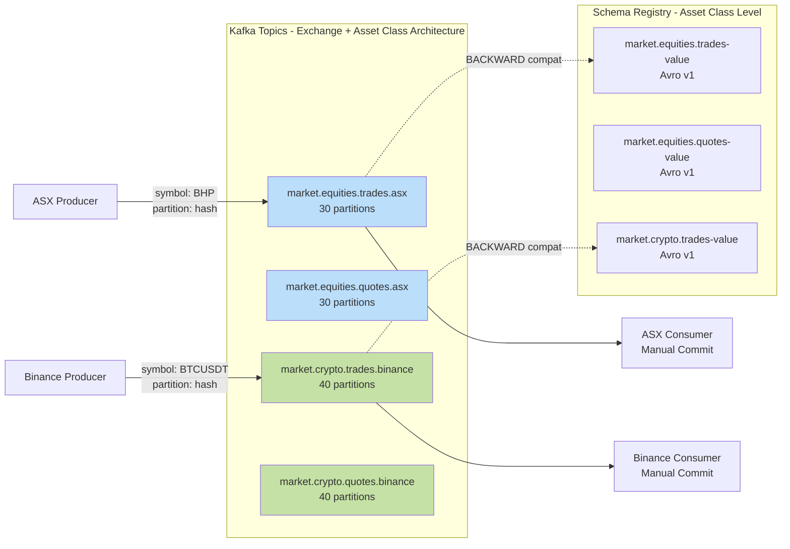
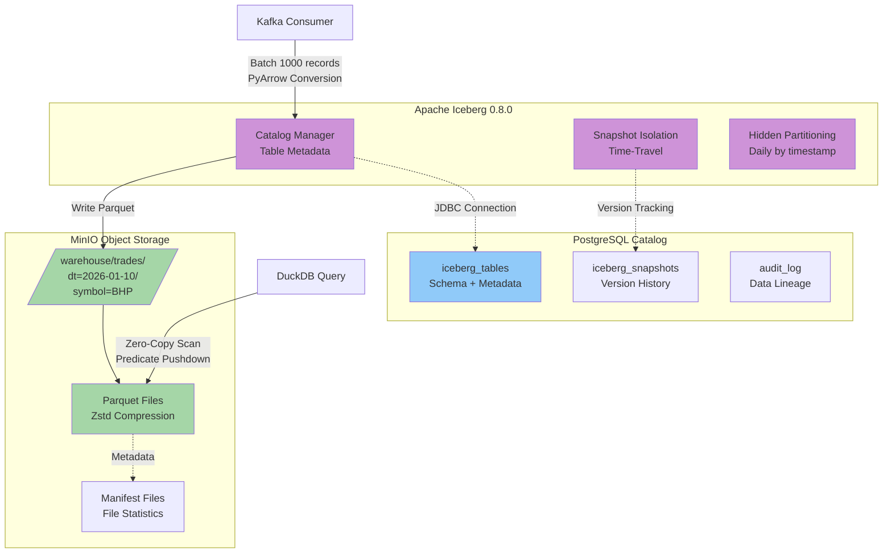
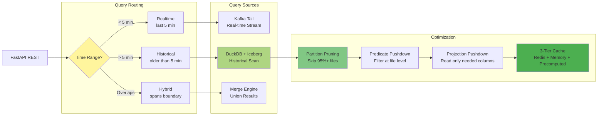
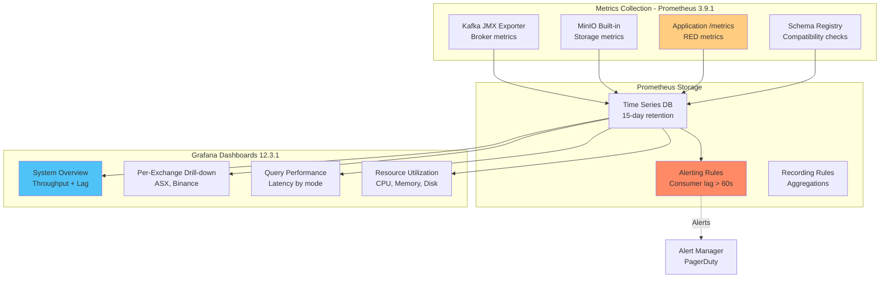
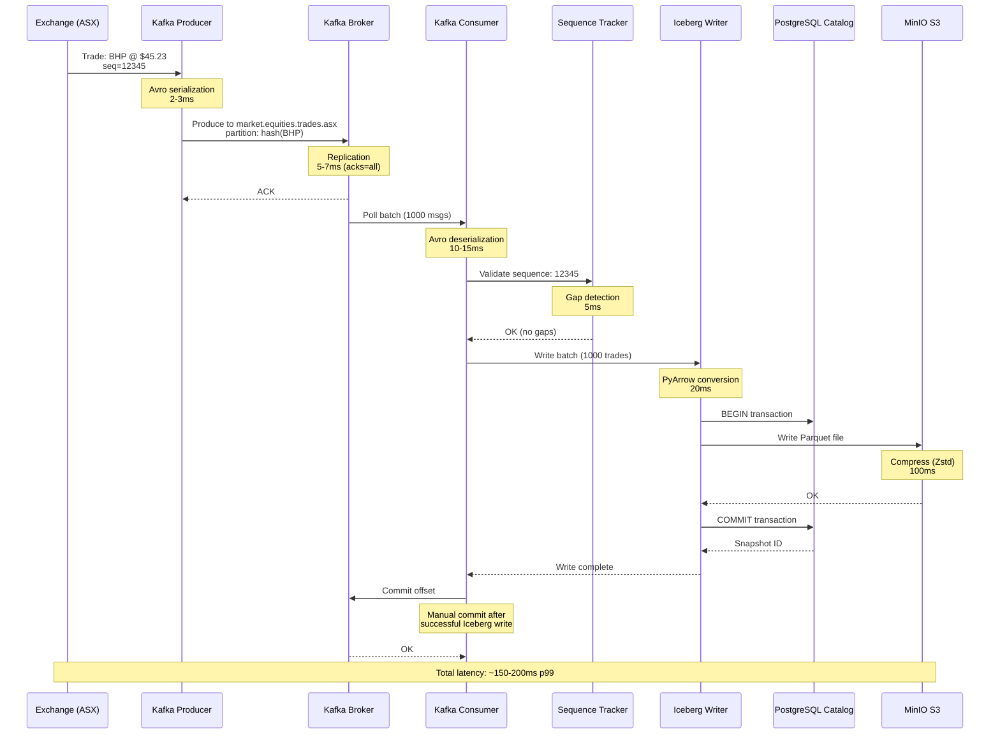
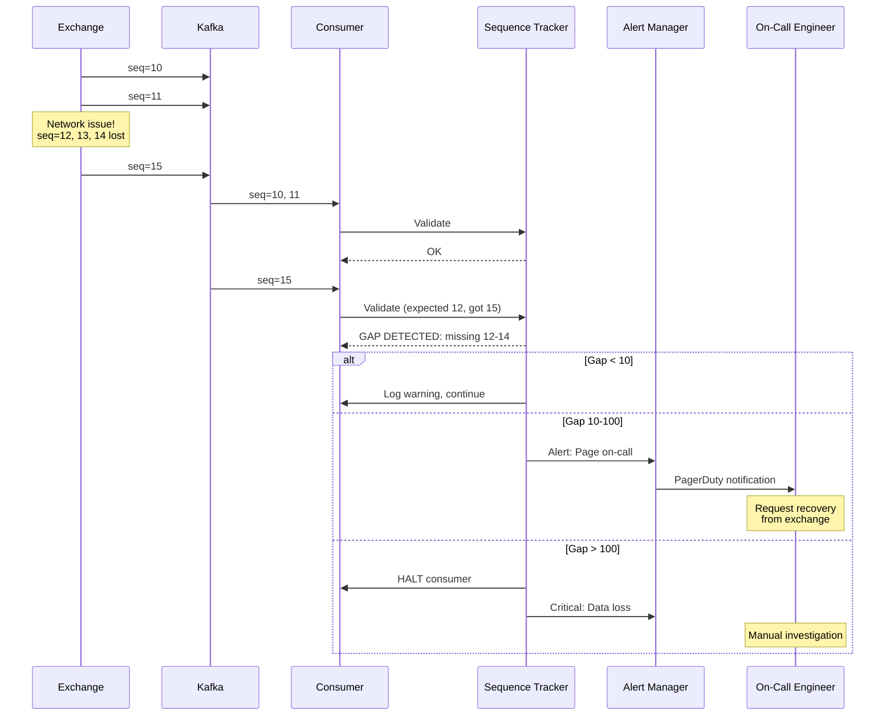
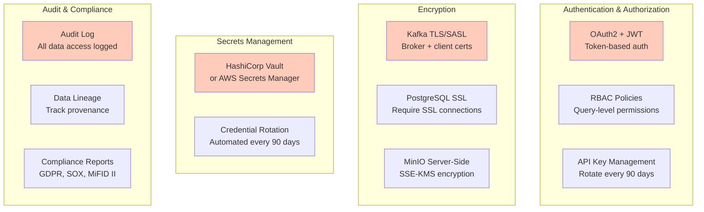

# K2 Market Data Platform - System Architecture

**Last Updated**: 2026-01-10
**Status**: Active
**Audience**: Staff/Principal Engineers, System Architects

---

## Executive Summary

This document provides a comprehensive visual architecture of the K2 Market Data Platform, including component interactions, data flow, latency budgets, and technology decisions. The platform implements a modern lakehouse architecture combining real-time streaming (Kafka) with ACID-compliant storage (Iceberg) for market data processing at scale.

**Design Goals**:
1. **Sub-500ms p99 latency** from exchange → query API
2. **Petabyte-scale storage** with ACID guarantees
3. **Time-travel queries** for compliance and backtesting
4. **Graceful degradation** under load (4-level cascade)
5. **Operational simplicity** (boring technology, embedded query engine)

---

## High-Level Architecture



### Latency Annotations

| Path | Target p99 | Components | Degrades To |
|------|------------|------------|-------------|
| **Ingestion** | 10ms | Feed Handler → Kafka | Drop non-critical symbols |
| **Kafka Lag** | 20ms | Producer → Consumer | Increase batch size |
| **Processing** | 50ms | Sequence tracking + dedup | Skip enrichment |
| **Storage Write** | 200ms | Iceberg ACID commit | Spill to NVMe disk |
| **Query** | 300ms | DuckDB scan + API response | Reduce query complexity |
| **End-to-End** | **500ms** | Exchange → Query API | Circuit breaker |

---

## Detailed Component Architecture

### 1. Ingestion Layer - Kafka with Exchange-Level Topics



**Key Design Decisions**:
- **Exchange-level topics**: Consumers subscribe only to needed exchanges (10-100x data reduction)
- **Symbol-based partitioning**: Preserves per-symbol message ordering (required for sequence tracking)
- **Asset-class schemas**: Shared schema evolution across exchanges (equities.trades used by ASX, NYSE, etc.)
- **BACKWARD compatibility**: New producers can add optional fields without breaking existing consumers

**Configuration**: `config/kafka/topics.yaml`
```yaml
asset_classes:
  equities:
    exchanges:
      asx:
        partitions: 30
      nyse:
        partitions: 100
  crypto:
    exchanges:
      binance:
        partitions: 40
```

---

### 2. Storage Layer - Iceberg Lakehouse



**Table Schema** (`trades` table):
```sql
CREATE TABLE trades (
  symbol STRING,
  exchange STRING,
  exchange_timestamp TIMESTAMP,
  exchange_sequence_number BIGINT,
  price DECIMAL(18,8),
  volume DECIMAL(18,8),
  -- Partitioned by: day(exchange_timestamp)
  -- Sorted by: (exchange_timestamp, exchange_sequence_number)
)
PARTITIONED BY (days(exchange_timestamp))
SORTED BY (exchange_timestamp, exchange_sequence_number)
```

**Partition Strategy**:
- **Daily partitioning**: Optimizes time-range queries (query 1 day = scan 1 partition)
- **Sorting**: Per-symbol sequence validation, efficient range scans
- **Target**: < 100 symbols per partition (manageable file sizes)

**ACID Guarantees**:
- **Atomicity**: All-or-nothing writes (1000 records commit together or rollback)
- **Consistency**: Schema evolution enforced by catalog
- **Isolation**: Snapshot isolation (concurrent readers see consistent view)
- **Durability**: Committed data persisted to S3 before ACK

---

### 3. Query Layer - DuckDB Embedded OLAP



**Query Performance Targets**:
| Query Type | Data Size | p99 Target | Achieved | Method |
|------------|-----------|------------|----------|--------|
| Realtime | Last 5 min | 200ms | TBD | Kafka tail consumer |
| Historical | 100K rows | 1s | TBD | DuckDB vectorized scan |
| Time-travel | 1M rows | 5s | TBD | Iceberg snapshot_id |
| Aggregation | 10M rows | 10s | TBD | DuckDB parallel execution |

**Pre-built Queries**:
```python
# High-performance query implementations
get_trades(symbol, start_time, end_time) → DataFrame
get_market_summary(symbol, date) → OHLCV
get_latest_price(symbol) → Scalar
replay_day(symbol, date) → Iterator[Trade]
```

---

### 4. Observability Stack



**Critical Alerts** (Page on-call):
```yaml
# Consumer lag
kafka_consumer_lag_seconds > 60

# Data loss detection
sequence_gaps_total > 100

# Storage bottleneck
iceberg_write_duration_p99 > 1000ms

# Circuit breaker
circuit_breaker_state == "OPEN"

# API degradation
http_request_duration_p99{endpoint="/trades"} > 500ms
```

**RED Metrics** (Rate, Errors, Duration):
- `http_requests_total{method, endpoint, status_code}` - Request rate
- `http_request_errors_total{method, endpoint, error_type}` - Error rate
- `http_request_duration_seconds{method, endpoint}` - Response time distribution

---

## Data Flow: End-to-End

### Happy Path - Trade Ingestion



### Failure Scenario - Sequence Gap Detected



---

## Scaling Considerations

### Current State (Local Dev)

| Metric | Value | Hardware |
|--------|-------|----------|
| Throughput | 10K msg/sec | M1 Max, 32GB RAM |
| Kafka | 1 broker, 6 partitions | Docker (2 CPU, 3GB) |
| Storage | < 1GB | MinIO local |
| Latency p99 | < 100ms | NVMe SSD |
| Query Engine | DuckDB embedded | Single process |

### 100x Scale (Production)

| Metric | Target | Architecture Changes |
|--------|--------|---------------------|
| Throughput | 1M msg/sec | Kafka: 3-5 brokers, 50+ partitions |
| Storage | TBs | MinIO distributed cluster |
| Latency p99 | < 50ms | SSD storage, PostgreSQL read replicas |
| Query | Concurrent users | DuckDB + Presto (distributed) |
| HA | 99.9% uptime | Multi-AZ deployment |

**Bottleneck Mitigation**:
1. **Kafka throughput**: Add brokers, increase partitions (linear scaling)
2. **Storage writes**: Horizontal scaling of consumers (each writes to different partitions)
3. **Query latency**: Add Presto cluster (distributed parallel queries)
4. **Metadata**: PostgreSQL read replicas + caching (99%+ cache hit rate)

### 1000x Scale (Multi-Region)

| Metric | Target | Architecture Changes |
|--------|--------|---------------------|
| Throughput | 10M+ msg/sec | Kafka: 10+ brokers, 500+ partitions |
| Storage | PBs | S3 with lifecycle policies (Glacier) |
| Latency p99 | < 20ms | Edge caching, pre-aggregations |
| Query | Global users | Presto/Trino (100+ nodes) |
| HA | 99.99% uptime | Active-active multi-region |

---

## Technology Decision Matrix

| Component | Choice | Alternatives Considered | Decision Rationale |
|-----------|--------|-------------------------|-------------------|
| **Message Queue** | Kafka 8.1.1 (KRaft) | Pulsar, RabbitMQ | Industry standard, KRaft simplifies ops |
| **Schema Registry** | Confluent 8.1.1 | Apicurio, AWS Glue | Best Kafka integration, mature |
| **Lakehouse** | Apache Iceberg 0.8.0 | Delta Lake, Hudi | ACID + time-travel, proven at scale |
| **Object Store** | MinIO (S3 API) | Native S3, Azure Blob | S3-compatible, easy cloud migration |
| **Catalog DB** | PostgreSQL 16 | MySQL, DynamoDB | ACID guarantees for metadata |
| **Query Engine** | DuckDB 1.4.0 | Spark, Presto, Trino | Embedded simplicity, sub-second queries |
| **API Framework** | FastAPI 0.128.0 | Django, Flask | Modern async, auto OpenAPI docs |
| **Metrics** | Prometheus 3.9.1 | Datadog, New Relic | Open-source, de facto standard |
| **Dashboards** | Grafana 12.3.1 | Kibana, Tableau | Best Prometheus integration |

**Philosophy**: "Boring Technology" - Prefer proven systems over novel solutions.

---

## Security Architecture

### Current State (Phase 1 - Local Dev)

- ⚠️ No authentication (localhost-only access)
- ⚠️ No encryption in transit (plaintext Kafka, HTTP)
- ⚠️ Default credentials (MinIO: admin/password)
- ⚠️ No audit logging

### Production Requirements (Phase 2+)



---

## Disaster Recovery Strategy

### Backup Strategy

| Data Type | Backup Frequency | Retention | RTO | RPO |
|-----------|-----------------|-----------|-----|-----|
| Kafka Messages | N/A (ephemeral) | 7 days in topic | N/A | 0 (replay from Iceberg) |
| Iceberg Data | Continuous (S3) | 90 days hot, 7 years cold | 4 hours | < 5 minutes |
| Iceberg Metadata | Daily snapshots | 30 days | 1 hour | 24 hours |
| PostgreSQL | Hourly WAL backup | 30 days | 1 hour | 1 hour |

### Multi-Region Replication (Phase 3)

```
Primary Region (us-east-1)      Secondary Region (us-west-2)
┌──────────────────────┐        ┌──────────────────────┐
│ Kafka Cluster        │        │ Kafka Cluster        │
│ (Active)             │◄──────►│ (Active)             │
└──────────────────────┘  MirrorMaker 2.0  └──────────────────────┘
         │                                          │
         ▼                                          ▼
┌──────────────────────┐        ┌──────────────────────┐
│ Iceberg + S3         │        │ Iceberg + S3         │
│ (Active Writes)      │────────►│ (Read Replicas)      │
└──────────────────────┘  S3 Cross-Region  └──────────────────────┘
                             Replication
```

**Failover Procedure**: See [Disaster Recovery Runbook](../operations/runbooks/disaster-recovery.md)

---

## References

### Related Documentation
- [Platform Principles](./platform-principles.md) - Core design philosophy
- [Kafka Topic Strategy](./kafka-topic-strategy.md) - Exchange-level topic architecture
- [Alternative Architectures](./alternatives.md) - Lambda vs Kappa vs K2 approach

### External Resources
- [Apache Iceberg Documentation](https://iceberg.apache.org/docs/latest/)
- [Kafka KRaft Mode](https://kafka.apache.org/documentation/#kraft)
- [DuckDB Iceberg Extension](https://duckdb.org/docs/extensions/iceberg.html)

---

**Last Updated**: 2026-01-10
**Maintained By**: Platform Engineering Team
**Next Review**: 2026-04-10 (quarterly)
