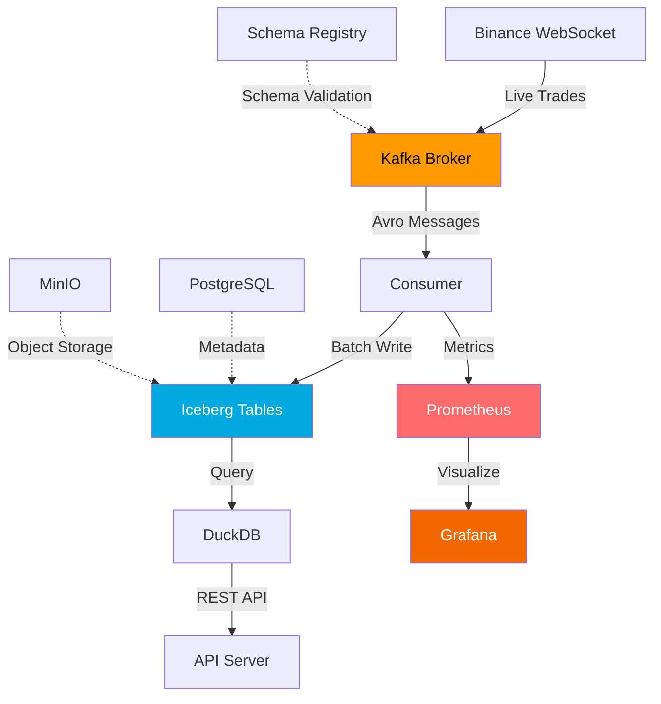
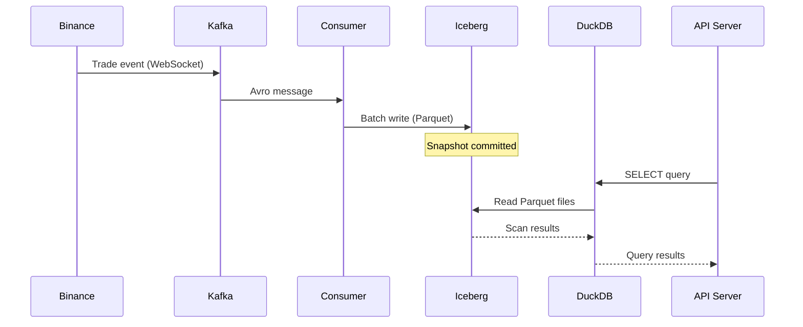
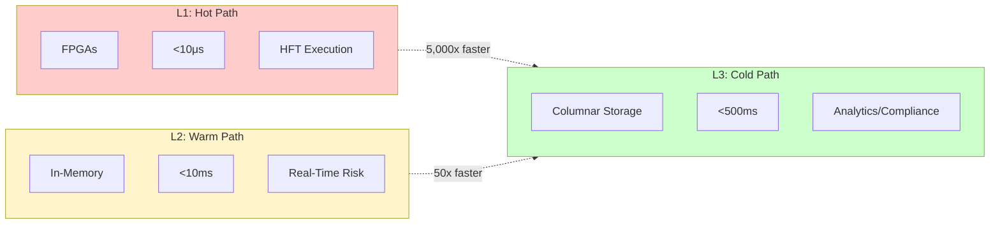

# Step 08: Visual Enhancements (Optional)

**Status**: ⬜ Not Started
**Priority**: 🟢 NICE-TO-HAVE (Optional)
**Estimated Time**: 3-4 hours
**Dependencies**: Steps 01-06
**Last Updated**: 2026-01-14

---

## Goal

Add visual polish to architecture explanations with diagrams, charts, and terminal recordings.

**Why Optional**: This step adds visual appeal but isn't critical for demo success. Complete only if time permits and other steps are done.

---

## Deliverables

1. ✅ Mermaid diagrams for architecture
2. ✅ Visual tier diagram (L1/L2/L3)
3. ✅ Data flow visualization
4. ✅ Enhanced Grafana dashboard
5. ✅ Terminal recording with Asciinema

---

## Implementation

### 1. Add Mermaid Architecture Diagrams

Add to `docs/architecture/system-design.md`:

```markdown
## System Architecture



## Data Flow


```

### 2. Create L1/L2/L3 Latency Tier Visual

Create visual showing latency tiers:

```
Tool: draw.io, Excalidraw, or create with code

Visual Elements:
+-------------------+
| L1 Hot Path       |
| <10μs             |
| FPGAs, Colocated  |
| RED               |
+-------------------+

+-------------------+
| L2 Warm Path      |
| <10ms             |
| In-Memory, CEP    |
| YELLOW            |
+-------------------+

+-------------------+
| L3 Cold Path (K2) |
| <500ms            |
| Columnar Storage  |
| GREEN             |
+-------------------+

Save as: docs/architecture/images/latency-tiers.png
```

### 3. Create Terminal Recording with Asciinema

```bash
# Install asciinema
brew install asciinema  # macOS
# or: pip install asciinema

# Record terminal session
asciinema rec docs/phases/phase-4-demo-readiness/reference/dataflow.cast

# Show in recording:
# 1. docker compose ps (all services up)
# 2. docker logs k2-binance-stream --follow (live ingestion)
# 3. kafka-console-consumer (messages flowing)
# 4. curl API endpoints (query results)
# 5. Ctrl+C to stop

# Press Ctrl+D to finish recording

# Test playback
asciinema play docs/phases/phase-4-demo-readiness/reference/dataflow.cast

# Embed in README.md:
# [](https://asciinema.org/a/ID)
```

### 4. Enhanced Grafana Dashboard

Add new panels to Grafana dashboard:

```json
{
  "dashboard": {
    "title": "K2 Platform - Enhanced Demo Dashboard",
    "panels": [
      {
        "title": "Real-Time Ingestion Rate",
        "type": "graph",
        "targets": [
          {
            "expr": "rate(k2_kafka_messages_produced_total[1m])"
          }
        ]
      },
      {
        "title": "Degradation Level",
        "type": "gauge",
        "targets": [
          {
            "expr": "k2_degradation_level"
          }
        ],
        "thresholds": [
          {"value": 0, "color": "green"},
          {"value": 1, "color": "yellow"},
          {"value": 3, "color": "red"}
        ]
      },
      {
        "title": "Consumer Lag",
        "type": "graph",
        "targets": [
          {
            "expr": "k2_kafka_consumer_lag"
          }
        ]
      },
      {
        "title": "Query Latency (p99)",
        "type": "graph",
        "targets": [
          {
            "expr": "histogram_quantile(0.99, k2_query_latency_seconds_bucket)"
          }
        ]
      },
      {
        "title": "Top 5 Symbols by Volume",
        "type": "bargauge",
        "targets": [
          {
            "expr": "topk(5, sum by (symbol) (k2_trades_total))"
          }
        ]
      },
      {
        "title": "Circuit Breaker State Timeline",
        "type": "state-timeline",
        "targets": [
          {
            "expr": "k2_degradation_level"
          }
        ]
      }
    ]
  }
}
```

Export dashboard:
```bash
# Save as: docs/operations/monitoring/grafana-k2-dashboard-enhanced.json
```

### 5. Add Mermaid Diagram to Platform Positioning

Add to `docs/architecture/platform-positioning.md`:

```markdown
## Latency Tier Comparison


```

---

## Validation

```bash
# Check Mermaid diagrams render
# View in GitHub or use Markdown preview

# Check images exist
ls docs/architecture/images/latency-tiers.png

# Test asciinema recording
asciinema play docs/phases/phase-4-demo-readiness/reference/dataflow.cast

# Verify enhanced Grafana dashboard
# Import JSON into Grafana, check all panels load
```

---

## Success Criteria

**Bonus Points** (Optional, doesn't affect 100/100 score)

- [ ] 3 Mermaid diagrams added to architecture docs
- [ ] L1/L2/L3 tier visual created
- [ ] Asciinema recording captured
- [ ] Grafana dashboard enhanced with 6 panels
- [ ] All visuals embedded in docs

---

## Demo Talking Points

> "I've added some visual enhancements to make the architecture easier to
> understand at a glance.
> 
> **Mermaid Diagrams**: System architecture and data flow shown visually
> in the documentation. These are living diagrams - they're in markdown,
> so they stay in sync with the code.
> 
> **Latency Tier Visual**: This chart shows where K2 fits - L3 cold path,
> not competing with L1 execution or L2 risk. Honest positioning.
> 
> **Enhanced Grafana**: I've added panels for real-time ingestion rate,
> degradation level (with color thresholds), consumer lag, and top symbols
> by volume. Makes operational state immediately visible.
> 
> These visuals aren't just aesthetic - they communicate complex concepts
> quickly and make the system more maintainable."

---

**Last Updated**: 2026-01-14
