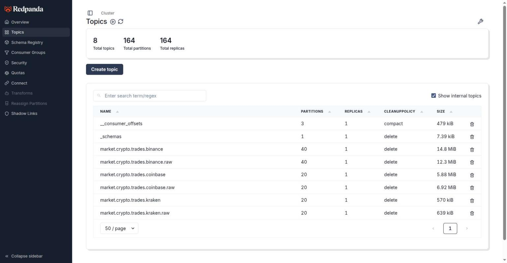

# Observability

Prometheus scrapes the stack, Grafana renders it, and 34 alert rules (13 v2 + 10 v3 capture + 11 v3 lake)
cover the things that actually break: capture goes down or silent, sequence gaps and book
checksum failures, ClickHouse struggles, the cold-tier offload falls behind, and the lake
ingest stops committing.

- Prometheus — http://localhost:9090 (`/targets`, `/alerts`)
- Grafana — http://localhost:3000, `admin` / `$GRAFANA_PASSWORD`

Config lives in [`docker/prometheus/prometheus.yml`](../../docker/prometheus/prometheus.yml),
[`docker/prometheus/rules/`](../../docker/prometheus/rules/) and
[`docker/grafana/dashboards/`](../../docker/grafana/dashboards/) — all provisioned at
container start, no click-ops.

## Scrape targets

| Job | Target | Interval | Source |
|-----|--------|----------|--------|
| `prometheus` | `localhost:9090` | 15s | self |
| `redpanda` | `redpanda:9644` | 10s | Redpanda admin API |
| `clickhouse` | `clickhouse:9363` | 15s | `<prometheus>` block in [`docker/clickhouse/config.xml`](../../docker/clickhouse/config.xml) |
| `grafana` | `grafana:3000` | 15s | Grafana internal metrics |
| `capture-{binance,kraken,coinbase}` | `capture-<x>:8082` | 15s | `k2-capture`, see below |
| `iceberg-scheduler` | `iceberg-metrics:8000` | 15s | `docker/offload/metrics.py --serve`, see below |

Port 8082 is **not published to the host**, and the capture image is distroless — no curl,
no shell. Read the series through Prometheus:

```bash
curl -sG localhost:9090/api/v1/query \
  --data-urlencode 'query=sum by (exchange, kind) (rate(k2_capture_records_produced_total[5m]))' | jq
curl -s localhost:9090/api/v1/targets | jq '.data.activeTargets[] | {job: .labels.job, health}'

# Liveness without Prometheus: the binary reads its own /metrics over loopback
docker exec k2-capture-binance /k2-capture healthcheck
```

## Capture metrics

Emitted by [`metrics.rs`](../../services/capture-rust/src/metrics.rs) on `:8082/metrics`,
overridable with `K2_METRICS_PORT`. Every family is `k2_capture_*`; every series an alert
reads is seeded at zero on startup, so a counter's *first* event is detectable.

| Metric | Type | Labels | Meaning |
|--------|------|--------|---------|
| `messages_total`, `bytes_total` | counter | `exchange`, `stream` | Frames and bytes off the WebSocket, per venue subscription |
| `records_produced_total` | counter | `exchange`, `kind=raw\|trade\|book` | Records enqueued into librdkafka's queue |
| `records_delivered_total` | counter | `exchange` | Records the broker actually acknowledged — the one that goes flat in an outage |
| `produce_errors_total` | counter | `exchange`, `reason` | Records that failed to produce. There is no spill-to-disk, so these are lost |
| `gaps_total`, `resyncs_total` | counter | `exchange` | Sequence continuity broke; book rebuilt |
| `checksum_failures_total` | counter | `exchange`, `symbol` | Kraken CRC32 mismatch. Kraken only — the other two publish no checksum |
| `reconnects_total` | counter | `exchange`, `reason=scheduled\|involuntary` | `scheduled` is Binance's 23 h pre-emptive recycle |
| `precision_loss_total` | counter | `exchange`, `reason` | A venue quoted finer than the fixed-point 1e-8 scale |
| `unknown_frames_total` | counter | `exchange`, `stream` | Frames the adapter did not recognise (still archived verbatim) |
| `last_message_ts_seconds` | gauge | `exchange`, `stream` | Per-stream liveness. What `CaptureFeedStale` and `healthcheck` both read |
| `exchange_to_recv_seconds` | histogram | `exchange` | Venue stamp → our receive. **Trades only.** Transit + clock skew, not a platform SLO |
| `book_depth` | gauge | `exchange`, `symbol` | Resting levels for one symbol, across **both** sides. `CaptureBookDepthDegraded`'s input |
| `book_levels_total` | gauge | `exchange` | Resting levels summed over every book on that venue |
| `build_info` | gauge | `version`, `git_sha` | `K2_GIT_SHA` at image build; `unknown` if unset |

Metric names are the family above prefixed with `k2_capture_`. There are no
recording rules for this tier.

## Dashboards

| Dashboard | UID | What it shows |
|-----------|-----|---------------|
| K2 Pipeline Overview | `k2-pipeline-overview` | The one to open first. Four rows: stack health (service up/down, trade records produced per exchange), ClickHouse (insert rate, memory, merge queue), Iceberg offload (lag, cycle duration, rows/sec), Redpanda (throughput, connections) |
| ClickHouse Overview (v2) | `clickhouse-v2` | Query rate, memory gauge, insert rate, background merges — the warm tier in isolation |
| Iceberg Offload Pipeline | `iceberg-offload` | Offload lag, success rate, rows/sec, duration quantiles, error rate, cycle status |
| K2 Platform v2 — Migration Tracker | `k2-v2-migration` | Total CPU/RAM gauges against the 16-core budget, service up/down, Redpanda and ClickHouse rates |
| K2 Capture (v3) | `k2-l2-capture` | The Rust capture tier, now the only ingestion tier: health (up, staleness, reconnects, gaps, checksum failures, resyncs), throughput (messages/bytes/records/produce errors), exchange→recv latency p50/p95/p99, book depth/levels/precision loss. `exchange` template variable filters all panels |
| K2 Lake (v3) | `k2-lake` | Iceberg lake tier (Phase D): ingest lag and commit age per table, rows/files/bytes and mean file size, rows added by the last commit, audit failures, disk headroom, exporter scrape errors, and a maintenance row plotting compaction age per table and the exporter's own refresh age — the two alertable gauges that had no panel. Every panel reads an Iceberg snapshot summary — nothing here is an in-process counter |



## Alert rules

34 rules across four files. Every annotation carries the diagnostic commands and a
runbook link; the tables below are the index. The three `FeedHandler*` rules retired with
the Kotlin handlers ([ADR-019](../adr/ADR-019-rust-capture-tier.md)); their file is
archived at [`legacy/v2-kotlin/runbooks/feed-handler-alerts.yml`](../../legacy/v2-kotlin/runbooks/feed-handler-alerts.yml)
and `capture-alerts.yml` below is what replaced them.

### `clickhouse-alerts.yml` — warm tier (4)

| Alert | Severity | Fires when |
|-------|----------|-----------|
| `ClickHouseDown` | critical | `up{job="clickhouse"} == 0` for 2m |
| `ClickHouseHighMemoryUsage` | critical | Resident memory >85% of system RAM for 5m |
| `ClickHouseQueryFailureRateHigh` | critical | `rate(FailedQuery[5m]) > 0.1` for 3m |
| `ClickHouseMergeQueueLarge` | warning | >10 background merge tasks queued for 5m |

Recording rule: `clickhouse:query_duration_mean:5m`. (`clickhouse:insert_rate:5m` was archived with
`ClickHouseBronzeInsertRateLow` — same expression, and no dashboard ever read it.)

### `iceberg-offload-alerts.yml` — cold tier (9)

| Alert | Severity | Fires when |
|-------|----------|-----------|
| `IcebergOffloadConsecutiveFailures` | critical | ≥3 errors for one table within 15m |
| `IcebergOffloadLagCritical` | critical | `offload_lag_minutes > 30` for 5m (SLO breach) |
| `IcebergOffloadCycleTooSlow` | critical | A table's last run took >600s — risks overlapping the 15-min schedule |
| `IcebergOffloadWatermarkStale` | critical | Watermark unchanged for >26h — hung-pipeline backstop |
| `IcebergOffloadSchedulerDown` | critical | `iceberg-metrics` scrape target unreachable for 2m |
| `IcebergOffloadSuccessRateLow` | warning | Success rate <95% over 15m |
| `IcebergOffloadLagElevated` | warning | Lag between 20 and 30 min for 10m |
| `IcebergOffloadThroughputLow` | warning | bronze/silver <0.1 rows/sec averaged over 1h |
| `IcebergOffloadCycleSlow` | warning | A table's last run took 300–600s for 10m |

The two lag alerts scope to `bronze_*`, `silver_trades`, `ohlcv_1m` and `ohlcv_5m`. A gold
table's watermark tracks the last *completed* window, so `ohlcv_15m`/`30m`/`1h`/`1d` lag by
design and can never satisfy a 30-minute SLO; `IcebergOffloadWatermarkStale` is their
backstop. `IcebergOffloadThroughputLow` uses a 1-hour window because offloads run on a
15-minute batch cadence — a 5-minute rate is zero most of the time for every table.

Recording rules: `iceberg_offload:cycle_count:5m`, `iceberg_offload:duration_avg:5m`,
`iceberg_offload:rows_rate:5m`.

### `capture-alerts.yml` — v3 capture tier, the live ingestion path (10)

| Alert | Severity | Fires when |
|-------|----------|-----------|
| `CaptureDown` | critical | Metrics endpoint unreachable for 2m |
| `CaptureFeedStale` | critical | No frames on a *continuous* stream for its own bound, sustained `for: 2m` — 60s for `book`/`depth20`/`l2_data`/`heartbeat(s)`, 300s for `trade`/`market_trades`, the same two numbers `CONTINUOUS` in `main.rs` gives the watchdog and the healthcheck. No `up` guard: a dead target's series are stale-marked, so this alert has no input to fire on and the incident is `CaptureDown`'s by construction |
| `CaptureSequenceGaps` | critical | Any sequence gap in 10m, sustained 5m |
| `CaptureChecksumFailure` | critical | Kraken CRC32 book mismatch in 10m, sustained 5m. Kraken only — Binance and Coinbase publish no checksum and have no series |
| `CaptureProduceErrors` | critical | `increase(k2_capture_produce_errors_total[10m]) > 0` for 5m — any produce error at all; there is no spill-to-disk, so a rate floor would tolerate permanent loss |
| `CaptureProduceStalled` | critical | Enqueueing records but zero **delivered** for 1m — early warning before `CaptureProduceErrors`. `records_produced_total` counts the local enqueue and climbs right through a broker outage; `records_delivered_total` is the one that goes flat |
| `CaptureResyncStorm` | warning | More than 3 book resyncs in 15m, sustained 5m |
| `CaptureIngressLatencyHigh` | warning | Exchange→receive p99 above 2s for 10m — a "something changed" signal, not a latency SLO. **Trades only**, on every venue; no book frame enters the histogram |
| `CaptureBookDepthDegraded` | warning | `max_over_time(k2_capture_book_depth[10m]) < 20` for 10m — the gauge is total levels across **both** sides, so 20 is 10 a side |
| `CapturePrecisionLoss` | warning | A venue quoted finer than the fixed-point 1e-8 scale in the last hour |

These are evaluated against live series, but **not one has yet been shown to fire on the
fault it names** — `make chaos` is what proves that and the recovery cost, and it has not
run (`scripts/chaos/results/` does not exist). Thresholds move then, not before.
`CaptureFeedStale`, `CaptureProduceStalled` and `CaptureBookDepthDegraded` additionally
carry `promtool` unit tests in
[`docker/prometheus/tests/capture-alerts.test.yml`](../../docker/prometheus/tests/capture-alerts.test.yml)
(`make check-alerts`); those pin the expression, never the recovery time.

The three `capture-*` scrape jobs set no `exchange` target label, unlike the retired
`feed-handler-*` jobs did: the capture binary emits its own `exchange` on every series,
and a target label of the same name would win and rename the sample's to
`exported_exchange`.
Alerts on capture series get `exchange` from the binary; alerts on `up` name the venue
through `job` (`capture-<exchange>`).

### `lake-alerts.yml` — v3 lake tier, Phase D (11)

Every staleness expression is `time() - <a timestamp gauge>`, never a pre-computed age.
`docker/lake/metrics.py` only recomputes on a successful catalog read, so an age gauge
freezes at its last small value during exactly the outage it is the backstop for.

| Alert | Severity | Fires when |
|-------|----------|-----------|
| `LakeIngestFailed` | critical | `raw.messages` has taken no commit for 30m, sustained 5m — the data-loss clock, against Redpanda's 48 h raw retention |
| `LakeAuditFailed` | critical | The last maintenance run stamped a non-zero failed-check count into the `audit.checks` snapshot summary |
| `LakeDiskUsageCritical` | critical | `k2_lake_disk_used_ratio > 0.90` for 5m |
| `LakeUnresolvableSchemaId` | warning | `k2_lake_unresolvable_schema_ids_total > 0` for 15m — a record names a writer schema the registry will not serve, so stage 2 skips that id and files an `audit.checks` row with `job='ingest'`. Its own gauge, keyed on `k2.job`, so it can neither clear nor be cleared by `LakeAuditFailed` |
| `LakeIngestLagHigh` | warning | The newest Kafka record in `raw.messages` is over 15m old, sustained 10m |
| `LakeCommitAgeHigh` | warning | A `bronze.*` table has taken no commit for 30m while the archive keeps moving — stage 2 is the failing half |
| `LakeCompactionStale` | warning | No file-rewrite snapshot on `raw.messages` for 36 h: the nightly compaction has missed a run. Measures the job, not its side effect on file size — an alert on mean file size fires by construction for the table's first ~15 days. Can be secondary: a stalled ingest produces no small files, so the rewrite finds nothing to merge and commits no snapshot. Check `LakeIngestFailed` first |
| `LakeExporterDown` | warning | `up{job="lake-metrics"} == 0` for 5m |
| `LakeExporterStalled` | warning | The exporter is scraped but has completed no refresh for 5m. The fast Lakekeeper-outage signal at ~10m: the prefix lookup throws before any table is read, so `up` stays 1 and scrape errors stay 0 |
| `LakeScrapeErrors` | warning | `k2_lake_scrape_errors_total > 0` for 5m — the catalog is up and a table is not |
| `LakeDiskUsageHigh` | warning | `k2_lake_disk_used_ratio > 0.80` for 15m. **The rule is tested, the metric is host-dependent** — on a Docker Desktop host `os.statvfs` sees the VM's thin-provisioned disk (0.344) and not the machine's (0.79). See `docker/lake/README.md` |

These ten are the only rules in the repo with unit tests:
`docker/prometheus/rules/tests/lake-alerts_test.yml`, run by `make check-docs` gate (c2).
Each case is either "must fire on a synthetic series" or "must not fire on healthy
input" — an alert that cannot fire and an alert that always fires are the same bug, and
this file had one of each before it was written.

### How the offload metrics are produced

The `offload_*` metrics come from the **`iceberg-metrics`** service, which runs
[`docker/offload/metrics.py`](../../docker/offload/metrics.py) `--serve` and is scraped on
`iceberg-metrics:8000` as Prometheus job `iceberg-scheduler`.

Every metric is derived from the PostgreSQL `offload_watermarks` table, re-read every 15s
— not from counters inside the flow. Prefect runs each flow in a short-lived subprocess
that exits long before Prometheus scrapes it, so in-process counters were never
observable. The watermark row is the durable record of what the pipeline did.

It is a separate service rather than a sidecar in `prefect-worker` on purpose: if the
worker crashes, the exporter keeps reporting the rising offload lag that these alerts
exist to catch.

| Metric | Type | Source column |
|--------|------|---------------|
| `offload_lag_minutes{table}` | gauge | `now() - last_offload_timestamp` |
| `watermark_timestamp_seconds{table}` | gauge | `last_offload_timestamp` |
| `offload_last_duration_seconds{table}` | gauge | `last_run_duration_seconds` |
| `offload_last_rows_per_second{table}` | gauge | `last_offload_row_count / last_run_duration_seconds` |
| `offload_tables_configured` | gauge | row count |
| `offload_rows_total{table,layer}` | counter | `last_offload_row_count`, added once per finished run |
| `offload_cycles_total{status}` | counter | one increment per finished run |
| `offload_errors_total{table,error_type}` | counter | one increment per failed run |
| `offload_duration_seconds{table,layer}` | histogram | observed once per finished run |

Runs are counted exactly once by tracking `updated_at` per table; rows still in `running`
are skipped until they resolve. Counters restart at zero if the exporter restarts, which
Prometheus handles as a normal counter reset.

Sanity-check the exporter's counting logic offline with
`python docker/offload/metrics.py --self-check`.

## SLOs

| Signal | Target | SLO | Measured |
|--------|--------|-----|----------|
| Exchange → silver latency (p99) | <200 ms | <500 ms | 170–197 ms (2026-02-19, v2 Kotlin path — now frozen) — see [latency-budgets.md](./latency-budgets.md) |
| Offload lag | <15 min | <30 min | 9 min (2026-02-15) |
| Offload success rate | >99% | >95% | no failures observed to date |
| Offload cycle duration | <30 s | <10 min | 5–7 s per table (2026-08-26) |
| Warm/cold consistency | 100% | >99% | 99.9%+ (2026-02-15, 2026-02-18) |
| Failure-mode MTTR | <2 min | <5 min | ≤32 s across all 6 modes tested 2026-02-19 on the v2 stack — see [../runbooks/failure-recovery.md](../runbooks/failure-recovery.md). **Unmeasured for the capture tier**: `make chaos` has never run |

## Not wired up

Honest gaps, in priority order:

1. **No Alertmanager.** `alerting.alertmanagers.targets` is empty — alerts are visible in
   the Prometheus UI and Grafana but nothing routes to a pager or Slack.
2. **No exporters for MinIO, PostgreSQL or Spark.** Their health is only observable via
   `docker compose ps` and container logs.
3. **No query-latency percentiles for ClickHouse.** Its Prometheus endpoint exposes
   counters only — no native histograms — so `clickhouse:query_duration_mean:5m` is a mean,
   not a p99.

## Related

- [quick-reference.md](./quick-reference.md) — health-check one-liners
- [../runbooks/failure-recovery.md](../runbooks/failure-recovery.md) — what to do when one of these fires
- [latency-budgets.md](./latency-budgets.md) — the latency targets behind the SLO table
