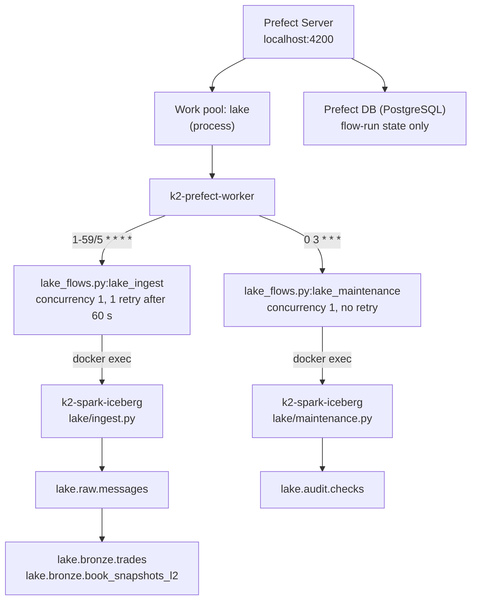

# Prefect Schedules

**Status:** not yet deployed — verify at the Phase D cutover. `prefect deployment ls` must
show both deployments on work pool `lake`; nothing on this host has registered them yet,
because Phase C's burn-in owns the containers they run in. Everything below is the design
the code implements, not an observed state.

Two Prefect 3.x deployments drive the v3 lake, both executing against the shared
`k2-spark-iceberg` container:

| Deployment | Cron (UTC) | Purpose |
|------------|------------|---------|
| `lake-ingest/lake-ingest-5min` | `1-59/5 * * * *` | Redpanda → `lake.raw.messages` → `lake.bronze.*`, every 5 minutes |
| `lake-maintenance/lake-maintenance-daily` | `0 3 * * *` | Compact, expire snapshots, remove orphans, audit — all four lake tables |

Both run at **concurrency 1** on the `lake` work pool, claimed by the
`k2-prefect-worker` process worker. Confirm they are live — this is the cutover check, and
it has not been run:

```bash
docker exec k2-prefect-server prefect deployment ls
```

The deployments are registered (upserted) by
[`docker/lake/flows/deploy_lake.py`](../../docker/lake/flows/deploy_lake.py), which the
`prefect-worker` service runs at start, before the worker itself starts — so a fresh
`docker compose up` arrives with both schedules armed and nothing to deploy by hand.

> A stack **upgraded in place** from v2 keeps the old, now-empty work pool in the Prefect UI
> after its deployments and their code are gone. `prefect work-pool ls` shows it;
> `prefect work-pool delete <name>` removes it. A fresh clone never sees it.

---

## Architecture



**The flows add no logic.** Position, idempotency and exit codes all live in
`docker/lake/{ingest,maintenance}.py`; the flow contributes a schedule, a concurrency limit
and a failure Prometheus can see. There is no watermark table — both stages write their
position into the Iceberg snapshot summary in the same commit as the data
([ADR-022](../adr/ADR-022-exactly-once-via-snapshot-offsets.md)).

---

## Ingest (`lake-ingest-5min`)

### What it does

One bounded cycle over the nine v3 topics, in two stages inside one Spark session:

1. **Stage 1 — Kafka → `raw.messages`.** Every topic read as a bounded batch from the
   offsets the last ingest committed, to `endingOffsets=latest`. The Kafka value is stored
   byte for byte, Confluent framing included ([ADR-021](../adr/ADR-021-raw-first-archive-and-lineage.md)).
2. **Stage 2 — `raw.messages` → `bronze.*`.** An Iceberg incremental read of the snapshots
   stage 1 just added, header stripped, Avro decoded against the writer schema fetched from
   the registry **by id**, in FAILFAST mode. Only `trades.*` and `book.*` are decoded;
   `raw.*` frames stay verbatim.

Re-running with no new data is a no-op: an empty offset range and an empty snapshot range
both commit nothing.

**Why minute 1 and not minute 0.** The cron is `1-59/5`, offset one minute from `*/5`. The
offset originally kept the ingest off v2's `*/15` offload in the same 2 CPU / 4 GiB
container; that path is gone, and the offset is kept because it costs nothing (the ingest
resumes from the offsets in its own last snapshot, so *when* a cycle runs changes nothing
about what it reads) and keeps the job off the top of the minute every other cron crowds
into.

**Concurrency 1 is a correctness setting, not a politeness one.** Two ingests over the same
window both commit and the second one's offsets overwrite the first's. The deployment limit
only gates runs *Prefect* launched, so the real guard is the exclusive `flock` on
`/tmp/k2-lake-ingest.lock` taken at the top of `ingest.py`'s `main()` — it covers the
runbooks, the chaos scripts and `make lake-verify` too. A run refused by the lock exits 2
and wrote nothing; see [lake-ingest-lag.md §5](../runbooks/lake-ingest-lag.md#5-a-flow-run-failed-with-exited-2--the-ingest-lock-held).

### Key files

| File | Purpose |
|------|---------|
| [`docker/lake/ingest.py`](../../docker/lake/ingest.py) | The two-stage ingest (invoked via `docker exec`) |
| [`docker/lake/offsets.py`](../../docker/lake/offsets.py) | Offset encode/decode and the gap arithmetic the audit reuses |
| [`docker/lake/spark_conf.py`](../../docker/lake/spark_conf.py) | The one Spark session builder — Lakekeeper REST catalog over MinIO |
| [`docker/lake/flows/lake_flows.py`](../../docker/lake/flows/lake_flows.py) | Both Prefect flows |
| [`docker/lake/flows/deploy_lake.py`](../../docker/lake/flows/deploy_lake.py) | Registers both deployments |

### Deploy

```bash
docker exec k2-prefect-worker python3 /opt/prefect/lake-flows/deploy_lake.py
```

It is an upsert and it is idempotent — the worker runs the same command at every start.

### Monitor

```bash
# Prefect UI
open http://localhost:4200

# Ingest lag and per-table commit age, both aged in PromQL from timestamp gauges
curl -s --get localhost:9090/api/v1/query \
  --data-urlencode 'query=time() - k2_lake_max_kafka_ts_seconds' | \
  jq -r '.data.result[].value[1]'

curl -s --get localhost:9090/api/v1/query \
  --data-urlencode 'query=time() - k2_lake_last_commit_ts_seconds' | \
  jq -r '.data.result[] | "\(.metric.table) \(.value[1])"'

# What the last few cycles committed, and where they got to
docker logs k2-spark-iceberg --tail 200 | grep -iE 'stage 1|stage 2|error|exception'
```

### Run manually (one-off)

```bash
# A full cycle, exactly what the schedule runs
docker exec k2-spark-iceberg python3 /home/iceberg/lake/ingest.py

# One stage only
docker exec k2-spark-iceberg python3 /home/iceberg/lake/ingest.py --stage raw

# A bounded backlog slice, oldest first
docker exec k2-spark-iceberg python3 /home/iceberg/lake/ingest.py \
  --end-timestamp '2026-08-26T10:00:00Z'

# Framing check — reports one recent record per topic, writes nothing
docker exec k2-spark-iceberg python3 /home/iceberg/lake/ingest.py --probe
```

---

## Maintenance (`lake-maintenance-daily`)

### What it does

Runs once per day at 03:00 UTC with `days=2`, `retain_days=7`. Four stages, in order:

| Stage | Action |
|-------|--------|
| `compact` | Binpack `raw.messages` to 256 MB; **sort**-rewrite every `bronze.*` table (the unified pair and the six per-venue tables) to 128 MB, bounded to the last `--days` of partitions |
| `expire` | Drop snapshots older than `--retain-days` on every table, retaining at least 10 |
| `remove_orphans` | Delete objects under each table's prefix that no snapshot references, with a **24-hour floor** |
| `audit` | Offset continuity, duplicate identifiers, sequence monotonicity, the informational venue-replay rate; per venue table, `bronze_unparseable` and `bronze_schema_drift` |

**Exit code is the product.** Any failed audit exits non-zero → the flow run fails →
`LakeAuditFailed` fires. Every check also lands as a row in `lake.audit.checks`, including
a check that *raised*, and the failed-check count rides in that commit's snapshot summary —
which is what `docker/lake/metrics.py` reads. The task has **no retry**: a failed audit is a
finding, not a blip.

`--retain-days` below 7 and `--orphan-hours` below 24 are both refused by argparse. Seven
days is the floor the `bronze.*` incremental read needs; 24 hours is what keeps
`remove_orphan_files` from deleting a concurrent writer's staged files.

### Key files

| File | Purpose |
|------|---------|
| [`docker/lake/maintenance.py`](../../docker/lake/maintenance.py) | Compact, expire, orphan removal, audits |
| [`docker/lake/ddl/lake.sql`](../../docker/lake/ddl/lake.sql) | The table definitions whose sort orders and identifier fields the audits assert |

### Monitor

```sql
-- Last night's checks. `job` separates the nightly run from an ingest's findings.
SELECT run_ts, job, check_name, scope, passed, observed, detail
FROM lake.audit.checks ORDER BY run_ts DESC LIMIT 20;

-- Anything that failed, most recent first
SELECT run_ts, check_name, scope, observed, detail
FROM lake.audit.checks WHERE passed = false ORDER BY run_ts DESC LIMIT 10;
```

```bash
# Compaction age per table — LakeCompactionStale is the alert over this
curl -s --get localhost:9090/api/v1/query \
  --data-urlencode 'query=time() - k2_lake_last_compaction_ts_seconds' | \
  jq -r '.data.result[] | "\(.metric.table) \(.value[1])"'
```

### Run manually (one-off)

```bash
# The full nightly pass
docker exec k2-spark-iceberg python3 /home/iceberg/lake/maintenance.py

# Audits only — no compaction, no expiry, no orphan removal
docker exec k2-spark-iceberg python3 /home/iceberg/lake/maintenance.py --audit-only

# Catch up after a missed night: widen the compaction window
docker exec k2-spark-iceberg python3 /home/iceberg/lake/maintenance.py --days 3
```

---

## Deployment reference

There is no `prefect.yaml`. Both deployments are defined in Python, in
[`deploy_lake.py`](../../docker/lake/flows/deploy_lake.py), because the same file is what
the worker runs at boot:

```python
lake_ingest.from_source(source=SOURCE, entrypoint="lake_flows.py:lake_ingest").deploy(
    name="lake-ingest-5min",
    work_pool_name="lake",
    cron="1-59/5 * * * *",
    concurrency_limit=1,
    parameters={"end_timestamp": ""},
)

lake_maintenance.from_source(source=SOURCE, entrypoint="lake_flows.py:lake_maintenance").deploy(
    name="lake-maintenance-daily",
    work_pool_name="lake",
    cron="0 3 * * *",
    concurrency_limit=1,
    parameters={"days": 2, "retain_days": 7},
)
```

Timeouts live in [`lake_flows.py`](../../docker/lake/flows/lake_flows.py): 3600 s for an
ingest (a backlog slice reads far more than a five-minute window), 7200 s for maintenance.
On a non-zero exit the flow raises with the last 20 lines of both streams in the message,
so the Prefect UI shows *why* without opening the run.

---

## Troubleshooting

### Ingest lag growing

```bash
# Is it slow runs, or no runs? Lag high with commit age low means runs are
# happening and not keeping up; both high means runs are not happening.
curl -s --get localhost:9090/api/v1/query \
  --data-urlencode 'query=time() - k2_lake_max_kafka_ts_seconds' | \
  jq -r '.data.result[].value[1]'

# How much of the 48 h broker buffer is left?
docker exec k2-redpanda rpk topic describe -p market.crypto.v3.raw.binance

# Is Spark starved, or is the batch simply large?
docker stats --no-stream k2-spark-iceberg
```

**Do not raise the cadence to catch up** — a faster schedule against a concurrency-1
deployment queues runs rather than parallelising them, and raising the concurrency is the
one change that breaks the exactly-once argument. Slice the window with `--end-timestamp`
instead.

See also: [lake-ingest-lag.md](../runbooks/lake-ingest-lag.md).

### A run failed with `exited 2`

The ingest lock was held by another run — a hand-run ingest, a chaos script, or a backlog
slice still going when the cycle fired. **The refused run wrote nothing** and the next cycle
succeeds normally. Nothing to repair;
[lake-ingest-lag.md §5](../runbooks/lake-ingest-lag.md#5-a-flow-run-failed-with-exited-2--the-ingest-lock-held)
covers the case where it repeats.

### A run failed on `failOnDataLoss`

The committed offsets point below what the broker still holds — a permanent hole, not a
restartable error. **Stop and read**
[lake-ingest-lag.md §3](../runbooks/lake-ingest-lag.md#3-failondataloss--the-offsets-point-below-what-the-broker-holds)
before doing anything: the deliverable is a recorded gap window, not a restart.

### The audit failed

```sql
SELECT run_ts, check_name, scope, observed, detail
FROM lake.audit.checks WHERE passed = false ORDER BY run_ts DESC LIMIT 10;
```

`offset_continuity` failing means the archive has a hole or an overlap;
`duplicate_identifiers` means the ingest wrote a record twice. `venue_replay` is
informational and cannot fail — a venue replaying trades after a reconnect is expected.
See [lake-audit-failed.md](../runbooks/lake-audit-failed.md).

### Worker not picking up runs

```bash
docker ps --filter name=k2-prefect-worker --format '{{.Names}}\t{{.Status}}'
docker logs k2-prefect-worker --tail 20

docker exec k2-prefect-server prefect deployment resume 'lake-ingest/lake-ingest-5min'
docker exec k2-prefect-server prefect deployment run    'lake-ingest/lake-ingest-5min'
```

The `lake` pool is created by the worker's own compose command
(`prefect work-pool create lake --type process`) before `deploy_lake.py` runs, so a missing
pool is fixed by restarting the worker container.

---

## Quick Reference

| Task | Command |
|------|---------|
| List deployments | `docker exec k2-prefect-server prefect deployment ls` |
| Recent flow runs | `docker exec k2-prefect-server prefect flow-run ls --limit 5` |
| (Re)deploy both schedules | `docker exec k2-prefect-worker python3 /opt/prefect/lake-flows/deploy_lake.py` |
| Trigger an ingest now | `docker exec k2-prefect-server prefect deployment run 'lake-ingest/lake-ingest-5min'` |
| Trigger maintenance now | `docker exec k2-prefect-server prefect deployment run 'lake-maintenance/lake-maintenance-daily'` |
| Pause a schedule | `docker exec k2-prefect-server prefect deployment pause 'lake-ingest/lake-ingest-5min'` |
| Resume a schedule | `docker exec k2-prefect-server prefect deployment resume 'lake-ingest/lake-ingest-5min'` |
| Ingest by hand | `docker exec k2-spark-iceberg python3 /home/iceberg/lake/ingest.py` |
| Maintenance by hand | `docker exec k2-spark-iceberg python3 /home/iceberg/lake/maintenance.py` |
| Audits only | `docker exec k2-spark-iceberg python3 /home/iceberg/lake/maintenance.py --audit-only` |
| Prefect UI | http://localhost:4200 |

---

## Related

- [ADR-022 — exactly-once via snapshot offsets](../adr/ADR-022-exactly-once-via-snapshot-offsets.md) — why there is no watermark table and why concurrency 1 is a correctness setting
- [ADR-018 — v3 lake-first architecture](../adr/ADR-018-v3-lake-first-rust-capture.md) — why the archive is the system of record
- [ADR-023 — Lakekeeper REST catalog](../adr/ADR-023-lakekeeper-rest-catalog.md) — the catalog both jobs commit through
- [../runbooks/lake-ingest-lag.md](../runbooks/lake-ingest-lag.md) — lag, a stopped scheduler, `failOnDataLoss`, missed compaction, the ingest lock
- [../runbooks/lake-recovery.md](../runbooks/lake-recovery.md) — a killed run, Lakekeeper down, MinIO down
- [../runbooks/lake-audit-failed.md](../runbooks/lake-audit-failed.md) — when the nightly audit fails
