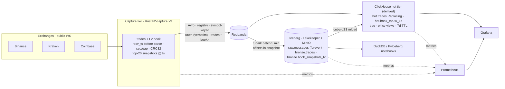

# Plan: K2 v3 — quantitative-research market data platform (Rust-first, lake-first)

> Design document and phase gates. Status lives in ADRs and git, not here (see CLAUDE.md doc conventions).
> Authored 2026-08-26 with Claude Code; decisions confirmed by the maintainer.

## Context
Repo is public-ready as v2 (PR #56 merged, tag v2.0.0; PR #65 with monitoring fixes open). User wants a **best-in-class quantitative-research market data platform** to discuss with HFT/prop-firm CTOs. Audit of v2 found structural gaps: serving DB (ClickHouse) is the system of record and the lake is a lossy JDBC copy; no receive timestamps, no sequence/gap detection, Kraken on WS v1 with synthesised colliding trade IDs; bronze plain MergeTree (duplicates on replay); OHLCV SummingMergeTree with open/high/low/close resolving *arbitrarily* across blocks (a real correctness bug); Avro topic unread while ClickHouse consumes raw JSON; Hadoop catalog on a bind mount; trades only, no book.

**Decisions (user-confirmed):** quant research platform, NOT a trading path (public WS feeds, internet latency — say so explicitly). **Rust as much as possible**: one `k2-capture` binary per exchange doing trades + L2 book (Kotlin retired to `legacy/v2-kotlin/` after parity). Top-20 book is the canonical L2 product. Lake-first: Spark batch reads Redpanda → Iceberg raw/bronze (system of record); ClickHouse is a derived hot tier (trades, BBO, OHLCV, top-20 @1s, 7d TTL). Lakekeeper REST catalog (Rust) + MinIO. DuckDB + PyIceberg notebooks as quant query layer; no query service. Keep 16 CPU / 40 GB single-host constraint. Same repo, v3 phases, ADR-018+. **Flip public now with v2 + roadmap; build v3 in the open.**

**Execution model:** Fable plans/orchestrates/reviews; opus for design-heavy code (Rust capture, Spark ingest, ClickHouse DDL, ADRs), sonnet for mechanical work (compose, docs sweeps, tests scaffolding, CI). Every phase leaves the stack green; new paths run parallel to old, cut over after comparison.

## Ground truth (from exploration — cite when implementing)
- Kotlin handlers `services/feed-handler-kotlin/src/main/kotlin/com/k2/feedhandler/*`: no Kafka headers; only Kraken has a receive ts; Kraken WS v1 (`wss://ws.kraken.com`); Kraken `trade_id = "KRAKEN-${ms}-${hash}"` (collides); Coinbase drops `snapshot` events, never compares `sequence_num`; Kraken/Coinbase raw key = exchange name → single partition; `schemas/avro/normalized-trade.avsc` has `logicalType` as sibling of `type` (ignored), numerics as strings. ClickHouse consumes only `.raw` JSON topics.
- Exchange L2: Binance `<sym>@depth20@100ms` partial stream (lastUpdateId, bids, asks; combined `/stream?streams=`; 5 inbound msg/s, 1024 streams, 24h conn life). Kraken v2 `wss://ws.kraken.com/v2` `book` depth 25, snapshot+update, CRC32 checksum over top-10 asks then bids (precision from `instrument` channel; doc example `3310070434`); `trade` channel has real `trade_id`. Coinbase `level2`: `sequence_num` per-connection +1, snapshot/update, `new_quantity` absolute, side `bid|offer`, per-level `event_time`; subscribe `heartbeats`; JWT optional. Coinbase WS rate limits unverified.
- Rust crates: tokio 1.53, tokio-tungstenite 0.30 (rustls), rdkafka 0.39 (vendored librdkafka, no ssl feature), apache-avro 0.22, schema_registry_converter 5.0 (check avro compat — else hand-roll 5-byte framing), serde_json/simd-json, crc32fast 1.5, metrics-exporter-prometheus 0.18, reqwest 0.13, serde_yaml, proptest.
- Lake: Spark image `tabulario/spark-iceberg:3.5.0_1.4.2` lacks spark-sql-kafka-0-10, spark-avro; has iceberg-aws-bundle 1.4.2; pyiceberg 0.5.1/duckdb 0.9.1 too old. Bump to `tabulario/spark-iceberg:3.5.6_1.9.0` (verify exists; fallback `apache/spark:3.5.6` + iceberg 1.9.x jars). Lakekeeper v0.13.3 `quay.io/lakekeeper/catalog`, PG≥15 + ext uuid-ossp,pgcrypto,pg_trgm,btree_gin,btree_gist; `migrate` → `serve :8181` → `POST /management/v1/bootstrap` → warehouse create (s3 profile, `flavor: s3-compat`, `path-style-access: true`, `sts-enabled: false`, static keys). Spark conf `type=rest, uri=http://lakekeeper:8181/catalog, warehouse=k2, io-impl=S3FileIO, s3.endpoint=http://minio:9000, s3.path-style-access=true`. Kafka batch read: `format("kafka")` + `startingOffsets/endingOffsets` JSON per partition; Confluent header strip `substring(value, 6)`; `from_avro(schema_json)`; offsets stored via `.option("snapshot-property.k2.kafka-offsets", json)` (Iceberg ≥1.4). ClickHouse 24.3 cannot use REST catalog; reload via `icebergS3()` table function (verify) or `s3()` over parquet paths.
- ClickHouse 24.3: `AvroConfluent` + `format_avro_schema_registry_url` supported; ReplacingMergeTree(ver)+FINAL+`do_not_merge_across_partitions_select_final`; AggregatingMergeTree; no TimeSeries engine. `config.xml` `max_memory_usage` 10 GB > 8 GB container; `max_server_memory_usage_to_ram_ratio` reads host RAM. Kafka engine virtual columns `_partition/_offset/_headers` — verify in TO-MV on 24.3.
- Budget: compose limits 15.1 CPU / 21.9 GB (14 services); measured usage tiny (Kotlin 0.03 CPU / 134 MiB vs 0.5/512M). CPU is binding.
- Existing 18 alert rules (`docker/prometheus/rules/{clickhouse,feed-handler,iceberg-offload}-alerts.yml`), 4 dashboards, CI jobs kotlin/python/docker/security. Prefect deploy pattern `docker/offload/flows/deploy_production.py`; `docker exec k2-spark-iceberg python3 …` dispatch; `iceberg-metrics` exporter pattern (`docker/offload/metrics.py`).

## Target architecture (v3)

Principles: (1) capture everything verbatim, timestamp before parse; (2) lake is system of record, everything else derived and rebuildable; (3) one wire format (Avro + registry), fixed-point int64 @1e-8; (4) correctness proven, not claimed (checksums, gap counters, audits, CI regression for the OHLCV bug); (5) honest non-goals.

## Phase A — Ship v2 public now (this week)
0. **Doc-accuracy fixes from adversarial review (31 findings; sonnet, one PR, then re-review by opus):**
   - BLOCKER: `docs/development/setup.md:31-47` "apply schema by hand" block → DDL auto-applies from `docker/clickhouse/ddl/01-k2-schema.sql`; delete the 8 stale "iceberg-scheduler scrape commented out / 9 alerts blind" blockquotes (`docs/architecture/README.md:145`, `MIGRATION-JOURNEY.md:128`, `platform-principles.md:59`, runbooks `failure-recovery:111`, `iceberg-offload-{failure,lag,performance}:13`, `iceberg-scheduler-recovery:17`).
   - HIGH: remove invented `FeedHandlerDown` "cannot fire" gap (`observability.md:48-51,76,167`, `failure-recovery.md:81`); dedupe `FeedHandlerDown`/`FeedHandlerMetricsDown` (delete the duplicate, fix description, headline becomes **17 alert rules** everywhere); repoint all `docker/clickhouse/schema/` references to `ddl/01-k2-schema.sql` (`README.md:187`, `architecture/README.md:118`, `clickhouse-database-standard.md:41-47`, `adding-new-exchanges.md`); recompute budget once from compose — **14 long-running + 2 one-shot, 15.1 CPU / 21.875 GB, headroom 0.9 / 18.1 GB** — propagate to README, architecture, docker-resources, decisions/README, platform-principles, operations/README, cost-model, positioning, legacy/v1/README, ADR-010/016 outcomes, compose summary comment; `clickhouse:query_duration_p99` → `_mean`; delete "no gradlew" claims (`docs/README.md:35`, `technology-stack.md:36`); "Hadoop catalog on MinIO" → bind-mounted local warehouse (`decisions/README.md:3,19`, `ADR-007:253`, `ADR-006:263`).
   - MED/LOW: README quickstart add `set -a && . ./.env && set +a`; README mermaid bronze+silver+gold → Spark, `:9363` on CH; `docker/README.md:14,29`; one-shot count `architecture/README.md:209`; `docker-resources.md:3-4,73`; Phase 7 status reconcile (`MIGRATION-JOURNEY.md:50,129` vs README); 2 broken anchors `#scenario-1-worker-not-running`; `testing.md:10,39`; `latency-budgets.md:32` rebase to ~150 msg/s; `prefect-schedules.md:49` TTL; `technology-stack.md:45`; `observability.md:17-23,88`; `decisions/README.md:3` wording; `streaming-sources.md:113` 34 instruments; `CLAUDE.md:73-75`; `README.md:114` count.
   - Gate: re-run the adversarial review (same prompt) → zero BLOCKER/HIGH; relative-link + anchor check clean.
0b. **CLAUDE.md upgrade + skills (borrow from `../sailflow`):** rewrite `CLAUDE.md` in sailflow's shape — thin, honest ("none of these are enforced; main unprotected by ADR"), tiered doc surfaces (Tier 0 ADRs+runbooks, Tier 2 audits/benchmarks since public), one-skill-per-surface pointing at each surface's README, verification habits ("verify or drop", "revisit when: metric/date/event"), project guardrails (numbers need provenance; schema changes move Avro+CH+Iceberg together; never commit session logs). Add `.claude/skills/`: `adr` (K2 template `ADR-NNN-slug.md`, sections Context/Decision/Rationale/Consequences/Outcome/Related, immutability + supersession, updates `docs/adr/README.md`), `runbook` (K2 shape: symptom/detection/steps/measured MTTR/last-verified), `schema-change` (Avro + registry compat + CH DDL + Iceberg DDL + docs in lockstep, checklist), `benchmark-report` (dated numbers snapshot `docs/benchmarks/<date>.md`, every number traceable to a command), `release-check` (fresh-clone verify: clone → `make up` → health → smoke queries → README numbers hold), `audit` (point-in-time surface audit, severity-coded, verify-or-drop). Skip `plan` (conflicts with no-progress-files rule). Brief `.claude/README.md` explaining the AI-assisted workflow for reviewers. Keep `.claude/settings.local.json` ignored.
1. Merge PR #65 (monitoring/UI fixes) after CI green.
2. Commit screenshots `docs/images/{grafana-pipeline-overview,redpanda-console-topics,prefect-deployments}.jpg`; replace README `<!-- screenshot -->` comments with images (pipeline overview in README; others in `docs/operations/observability.md`). Fix README diagram (bronze+silver+gold → Spark; Exchanges colour; registry).
3. Add **"Where v2 falls short / v3 roadmap"** section to README + `docs/architecture/README.md` (the 7 gaps, the v3 target diagram above, link to ADR-018..); ADR-018 `Proposed: v3 lake-first, Rust capture` as the umbrella ADR. Tag `v2.1.0`.
4. User flips visibility; enables secret scanning/push protection/Dependabot alerts.
Verify: fresh-clone quickstart still green; link check; grep sweep.

## Phase B — v3 foundations (P0/P1, ~1 week)
**Verify-first spikes (do all before code; write answers into `docs/adr/ADR-018` appendix):**
S1 Kraken checksum test from doc example (`3310070434`) — red test first. S2 Kraken `instrument` channel gives `price_precision/qty_precision`. S3 `schema_registry_converter` 5.0 ↔ `apache-avro` 0.22 compat (else hand-roll framing). S4 ClickHouse 24.3 `AvroConfluent` + Redpanda registry + `Array(Int64)`; `_partition/_offset` in TO-MV. S5 Coinbase `level2` without JWT + rate limits. S6 rdkafka vendored build on distroless-cc. S7 `tabulario/spark-iceberg:3.5.6_1.9.0` exists & has iceberg-aws-bundle. S8 Lakekeeper 0.13.3 ↔ Iceberg 1.9 Spark client create/insert/select. S9 Lakekeeper warehouse-create body on MinIO (`sts-enabled:false`). S10 DuckDB ≥1.4 `ATTACH … TYPE ICEBERG` to Lakekeeper with `ACCESS_DELEGATION_MODE 'none'`. S11 `icebergS3()` on CH 24.3 reads Iceberg v2 table. S12 MinIO tag with console still present.

**Contracts & registry:**
- `config/instruments.yaml` → per-instrument objects `{native, canonical, book_depth?}` (breaking; canonical mapping becomes data). Consumers: Rust (serde_yaml), Kotlin loader (until retired), Spark mappers.
- `schemas/avro/{trade,book-snapshot-l2,raw-message}.avsc` (replace `normalized-trade.avsc`): fixed-point `long` @1e-8 (`decimal.rs`, no f64, reject >8 dp with counter); `exchange_ts` `timestamp-micros` properly nested; `recv_ts_ns long` **in body** (+ one header `recv_ts_ns`); `seq`, `checksum_ok`, `depth`, parallel arrays `bid_px/bid_qty/ask_px/ask_qty`; `RawMessage{exchange,stream,symbol?,recv_ts_ns,conn_id,conn_msg_seq,payload bytes}`. Subject strategy TopicNameStrategy; compatibility BACKWARD_TRANSITIVE.
- Topics (`redpanda-init`): `market.crypto.raw.{ex}` (RawMessage, 48h + bytes cap), `market.crypto.trades.{ex}` (Trade, 7d), `market.crypto.book.{ex}` (BookSnapshotL2, 7d); 12 partitions each; key = canonical symbol; delete `.raw` JSON topics only after CH cutover.
- Lakekeeper + MinIO in compose: `lakekeeper-migrate` (one-shot), `lakekeeper` (0.25/256M, healthcheck), `lake-init` one-shot (`mc mb k2-lake`, bootstrap, warehouse `k2`), `docker/postgres/ddl/10-lakekeeper-db.sql` (separate DB on prefect-db + extensions), MinIO tag bump, `LAKEKEEPER_ENCRYPTION_KEY` in `.env.example`. `lake-ddl` one-shot replaces `iceberg-init`.
- Spark image: bump base, add pinned+sha256 jars (spark-sql-kafka-0-10, token-provider, kafka-clients, commons-pool2, spark-avro), drop clickhouse-jdbc & psycopg2; `docker/lake/spark_conf.py` single catalog config.
Exit: registry + schemas registered; Lakekeeper table create/read from Spark works; old v2 pipeline still green.

## Phase C — Rust capture tier (`services/capture-rust/`, ~2 weeks)
Single crate `k2-capture` (split to workspace only when a second binary needs `book.rs`). Layout: `main.rs, config.rs, book.rs, decimal.rs, record.rs, sink.rs (rdkafka + registry), metrics.rs, ws.rs, exchanges/{mod,binance,kraken,coinbase}.rs`, `tests/{fixtures/*.jsonl, replay.rs}`. Runtime `current_thread` tokio (cgroup quota); no internal channels — librdkafka queue is the only buffer (`queue.buffering.max.kbytes=32768`, idempotent, acks=all, lz4); drop-on-full with counter (`// ponytail: spill-to-file when an outage costs data`). SIGTERM → flush 5s.
- Adapters expose `handle_frame(&mut self, bytes, recv_ts_ns) -> Vec<OutRecord>` (pure; no Sink trait/mocks). `recv_ts_ns` from `SystemTime::now()` first statement on frame receipt; monotonic `Instant` for internal histograms only.
- **Streams per exchange (trades + book on ONE connection):** Binance combined `/stream?streams=` with `@trade` + `@depth20@100ms` (no book state; `lastUpdateId` regression check; 23h scheduled reconnect; pong). Kraken v2 `trade` + `book depth=25` + `instrument`; CRC32 verify every update, mismatch → `checksum_failures_total`, per-symbol resubscribe, `checksum_ok=false` emitted. Coinbase `market_trades` + `level2` + `heartbeats`; full-depth `BTreeMap<i64,i64>` book; `sequence_num` gap → reconnect + fresh snapshot; keep snapshot events.
- Emit: `Trade` per trade; `BookSnapshotL2` top-20 at 1 Hz per symbol (env `K2_SNAPSHOT_INTERVAL_MS`); `RawMessage` for every frame (`conn_id`, `conn_msg_seq`).
- Metrics on :8082 (`metrics-exporter-prometheus`): `k2_capture_{messages,bytes,records_produced,produce_errors,gaps,checksum_failures,resyncs,reconnects,precision_loss}_total`, `k2_capture_exchange_to_recv_seconds` histogram (HELP states skew+internet caveat), `k2_capture_book_{depth,levels_total}`, `k2_capture_last_message_ts_seconds`. `k2-capture healthcheck` subcommand (distroless has no curl). `k2-capture record --exchange X --seconds N` fixture recorder (stdout JSONL).
- Tests: `decimal.rs` table; `book.rs` apply/remove/top_n; Kraken checksum doc example; parser fixture tests; proptest invariants (best_bid<best_ask, no zero levels, monotonic top_n); `tests/replay.rs` over recorded sessions. CI `rust` job (fmt, clippy -D warnings, test, Swatinem cache) + docker matrix entry.
- Dockerfile: cargo-chef + `gcr.io/distroless/cc-debian12:nonroot`, `[profile.release] lto="thin", codegen-units=1, panic="abort", strip=true`; target ~40 MB. Compose ×3 `capture-{ex}` 0.25 CPU / 256M (coinbase 512M), `cpuset` pinned away from CH/Spark, depends on redpanda-init only; Prometheus jobs `capture-{ex}`; `capture-alerts.yml` (CaptureDown, SequenceGaps, ChecksumFailure, ResyncStorm, FeedStale per stream, IngressLatencyHigh, BookDepthDegraded, ProduceErrors); dashboard `k2-l2-capture.json`.
- **Parity & retirement:** run Rust trades alongside Kotlin for 24h; compare per-symbol counts/ids in ClickHouse and lake; then `git mv services/feed-handler-kotlin legacy/v2-kotlin/` with README, remove from compose/CI; ADR records why (one connection per exchange, one language for capture, 3 JVMs gone).
Order: Kraken first (checksum showcase) → Binance → Coinbase. Exit: 3 exchanges × 24h clean (gaps=0 or explained, checksum failures=0), limits measured and cut.

## Phase D — Lake tier (`docker/lake/`, ~1.5 weeks; replaces `docker/offload/`)
- Tables (`docker/lake/ddl/lake.sql`): `raw.messages` (topic, partition, offset, kafka_ts, ingest_ts, key, schema_id, payload BINARY verbatim, headers; `PARTITIONED BY days(kafka_ts), topic`; zstd; metrics on offset/kafka_ts/partition; never expired); `bronze.trades` (unified, `exchange` partition field, DECIMAL(28,10), `src_{topic,partition,offset}` lineage, identifier fields exchange,symbol,trade_id); `bronze.book_snapshots_l2` (arrays of struct px/sz, `seq`, lineage; metrics none except event_ts/symbol/seq); `audit.checks`. No gold in lake; no `book_deltas` (raw holds them). `write.distribution-mode=hash`, 128–256 MB targets, sort orders. Schema-evolution policy: add nullable only; vendor map for exchange extras; `raw.messages` frozen.
- Ingest `docker/lake/ingest.py` (+ pure `offsets.py`, `spark_conf.py`): one Spark session, two stages: (1) Kafka → `raw.messages`, `startingOffsets` from latest ingest snapshot summary property `k2.kafka-offsets` (skip compaction snapshots), `endingOffsets=latest`, `failOnDataLoss=true`, commit with `snapshot-property.k2.kafka-offsets` + `k2.max-kafka-ts`; (2) `raw.messages` incremental read (`start-snapshot-id`→new) → decode (`substring(payload,6)` + `from_avro` with schema fetched by id from registry, FAILFAST) → `bronze.*`, commit with `k2.src-snapshot-id`. `--end-timestamp` for backlog slicing. Prefect deployments `lake-ingest-5min` (concurrency 1), `lake-maintenance-daily`; keep `docker exec k2-spark-iceberg` dispatch.
- Maintenance `docker/lake/maintenance.py` (~180 lines): binpack compaction raw, sort rewrite bronze (last 2 days), expire snapshots; audits → `audit.checks`: offset continuity per topic/partition (+cross-day seam), duplicates on identifier fields, sequence gaps (lag over seq); fail → non-zero exit → Prefect fail → alert.
- Metrics `docker/lake/metrics.py` via PyIceberg snapshot summaries (`k2_lake_ingest_lag_seconds`, `last_commit_age`, `rows_total`, `files_total`, `added_records`, `audit_failures`) + `clickhouse_active_parts{table}` gauge; `lake-alerts.yml` (LagHigh, AuditFailed, SmallFiles, ExporterDown); dashboard `k2-lake.json` replaces iceberg-offload.
- Recovery runbook `docs/runbooks/lake-recovery.md`: CH rebuild via `icebergS3()` (fallback `s3()` globs); Redpanda replay = cold start.
- Tests: `tests/test_lake_offsets.py`, `tests/test_wire_format.py` (pure python, existing conftest pattern); `make lake-verify` integration script (offsets property present/gapless, raw count == bronze count, idempotent double-run adds 0).
- Delete: `docker/offload/*` (offload_generic, watermark_pg, create_*, generate/verify, old maintenance/flows), `docker/postgres/ddl/offload-watermarks.sql`, `docker/iceberg/ddl/0{2,3,4}-*.sql`, warehouse bind mount, `spark-jars/`. Parallel-run old offload vs new ingest for 24h before deletion.
Exit: two consecutive ingests, second adds 0; kill mid-run → no dupes/gaps; audits pass 3 days.

## Phase E — Hot tier (ClickHouse, ~1 week)
- New database `hot` built alongside `k2`; DDL split `docker/clickhouse/ddl/{01-tables.sql,02-kafka.sql}` (CI applies 01 only).
- `hot.q_trades` Kafka engine `AvroConfluent` over 3 trade topics (2 consumers, thread_per_consumer) → MV → `hot.trades` `ReplacingMergeTree(recv_ts)` `ORDER BY (exchange, canonical_symbol, exchange_ts, trade_id)` `PARTITION BY toDate(exchange_ts)` TTL 7d; `kafka_partition/offset` from virtual columns if S4 passes else omit. `hot.q_book` → `hot.book_top20_1s` `ReplacingMergeTree(recv_ts)` `ORDER BY (exchange, canonical_symbol, second)` with `Array(Float64)` levels. Views: `hot.bbo_1s` (bid/ask/mid/spread_bps/imbalance/microprice), `hot.ohlcv` parameterized view over `hot.trades FINAL` (argMin/argMax/max/min/sum/count) — **compute on read**; materialize `ohlcv_1m` (AggregatingMergeTree) only if measured 7-day p99 > 1 s.
- `config.xml`: `max_memory_usage` 6 GB, explicit `max_server_memory_usage` 6.5 GB, `max_concurrent_queries` 32, `background_pool_size` 8; `users.xml` readonly `quant` profile with `do_not_merge_across_partitions_select_final=1` (mount line already in compose, commented). Grafana/notebooks use `quant`.
- CI `clickhouse-schema` job: `docker run clickhouse:24.3-alpine` with `01-tables.sql`, JSONEachRow fixtures, asserts: OHLCV correct across two insert blocks (regression for v2 bug), FINAL count == distinct, book downsample keeps latest, BBO math.
- Cutover: dashboards repointed to `hot`; verify `hot.ohlcv` == DuckDB-over-Iceberg for same window; drop `k2` db + old queue MVs; delete `.raw` JSON topics.
- `clickhouse-alerts.yml` + `ClickHouseDedupBacklog`, `ClickHouseFinalQuerySlow`; `clickhouse-overview.json` hot-tier row.

## Phase F — Notebooks, audits, numbers, docs (~1 week)
- `notebooks/` uv project (duckdb ≥1.4 w/ iceberg ext, pyiceberg ≥0.9, polars, matplotlib, jupyterlab); `01_connect`, `02_book_at_time`, `03_asof_trades_book` (DuckDB ASOF JOIN), `04_completeness_audit`; `make notebooks`; README notes host→minio resolution.
- 24h burn-in; publish numbers table (`docs/operations/performance.md`): msg/s per stream, gaps/24h, Kraken checksum pass rate with denominator, resyncs, duplicate rate (count vs count FINAL), exchange→recv p50/p95/p99 with n, recv→CH p99, recv→lake p99, bytes/day per table + compression, CPU/RSS per service vs limits (all 17), `hot.ohlcv` 1h/1d/7d p50/p99, FINAL overhead ratio, DuckDB scan timings, time to rebuild `hot.*` from lake.
- Resource budget v3 (target ≤13.6 CPU / ≤23 GB steady): clickhouse 4/8G (cpuset 0-3), redpanda 2/2G, spark 1.5/3G, prometheus 1/2G, minio 0.5/1G, prefect-db 0.5/1G, prefect-server 0.5/1G, prefect-worker 0.5/512M, grafana 0.5/512M, console 0.25/256M, lake-metrics 0.1/128M, lakekeeper 0.25/256M, capture ×3 0.25/256M (coinbase 512M, cpuset 12-14); Kotlin removed. Update ADR-010 outcome.
- ADRs `docs/adr/ADR-018..028` (one paragraph each: decision / rejected / consequences): 018 v3 lake-first umbrella (supersedes 014); 019 Rust capture tier replaces Kotlin (supersedes 002; triggers, non-latency rationale); 020 Avro-only contracts, fixed-point int64 @1e-8, recv_ts in body; 021 raw-first archive + lineage, no delta schema; 022 exactly-once via offsets in Iceberg snapshot summary (replaces watermark table); 023 Lakekeeper REST catalog + MinIO (supersedes 013, explains 013's failure); 024 unified bronze tables (supersedes 011 for lake only); 025 ClickHouse derived hot tier (supersedes 009), reload-by-pull; 026 OHLCV on read + ReplacingMergeTree dedup contract (v2 SummingMergeTree post-mortem); 027 book snapshot model (1 Hz, Float64 arrays, BBO view) + per-exchange sequencing/resync policy; 028 non-goals & honest limits (not trading path, internet feeds, single host, no HA, Prefect/Spark retained). `docs/adr/README.md` supersession chain. README/architecture/MIGRATION-JOURNEY v3 sections (OHLCV bug post-mortem is the centrepiece); runbooks `capture-gap-recovery.md`, `clickhouse-rebuild-from-lake.md`, `lake-recovery.md`; retire iceberg-offload runbooks.
- Tag `v3.0.0`.

## Verification (end-to-end)
- Every phase: `make test` (rust/python/clickhouse-schema), CI green, `docker compose up -d --build` from clean clone → all services healthy.
- Capture: `rpk topic consume market.crypto.book.kraken` shows 1 Hz snapshots with `checksum_ok=true`; `curl :8082/metrics` counters; induced failures (corrupt level → resync; `kill -STOP` → Coinbase gap+reconnect).
- Lake: snapshot summary offsets gapless; raw count == bronze count; double-run adds 0; audits pass; DuckDB notebook 01–04 run clean.
- Hot: CI schema tests; `hot.ohlcv` matches DuckDB over Iceberg; FINAL vs non-FINAL counts; rebuild `hot.*` from lake timed.
- Numbers table complete and traceable to commands; grep sweep (no "Spring Boot", no `docker-compose.v2`, no TODO in published docs).

## Risks / verify-first
Lakekeeper↔Iceberg client (S8; escape: 1.8.1/1.10.1 runtime jars); CH `AvroConfluent` arrays/virtual columns (S4; fallback flat columns); Coinbase rate limits/JWT (S5); rdkafka+distroless (S6; fallback debian-slim); tabulario image tag (S7); `icebergS3()` on 24.3 (S11; fallback `s3()` globs). Phase C is the long pole; Coinbase full-depth memory watched via `book_levels_total`. Public-in-the-open: keep `main` green; v3 work on `feat/v3-*` branches with PRs.
