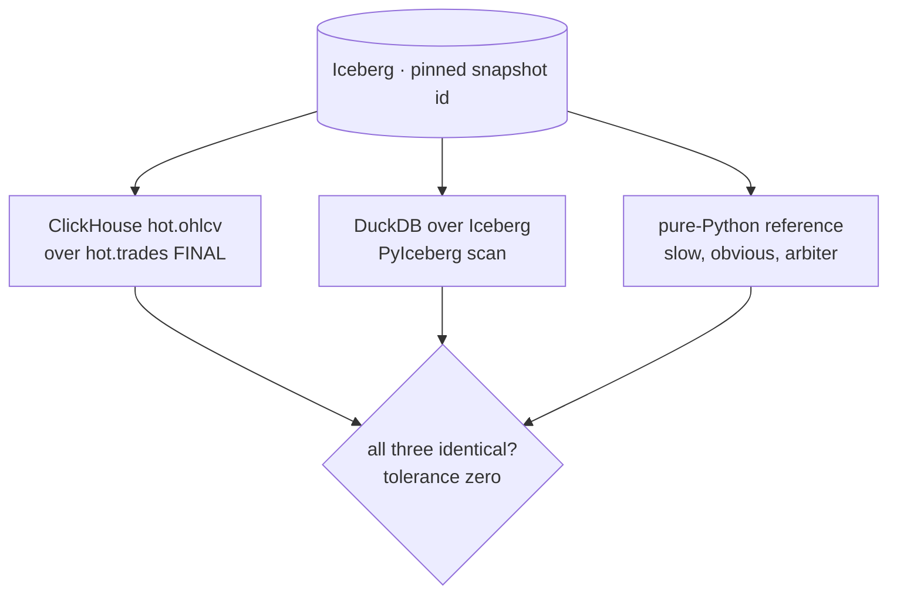

# Phase G — Replay + the research/production parity contract (~1 week)

**Depends on:** Phase E
**Delivers:** `k2-replay` — recorded frames pushed through the *same* adapter code as live capture, deterministic to a content hash — plus ADR-029, the contract that keeps research and production from drifting apart: one parser, three-way OHLCV parity at tolerance zero, pinned snapshot ids, golden fixtures shared by Rust tests and notebooks.
**Exit:** replay of the golden fixtures reproduces the committed output hash byte for byte; three-way OHLCV parity green in CI at tolerance zero on a pinned snapshot id; no notebook reads `latest`; ADR-029 Accepted.

Sequenced after E because parity needs both derived tiers to compare (`hot.ohlcv`
and DuckDB-over-Iceberg); it does not depend on Phase F, and can run in parallel
with it.

## Scope

**`k2-replay` — a subcommand of the capture crate, not a second implementation.**
The whole point is that no replay-only parser exists. `k2-capture replay` (thin
`src/bin/k2-replay.rs` if the arg surface gets noisy) reads either
`raw.messages` from the lake at an explicit `--snapshot-id` (PyIceberg-exported
JSONL, or Parquet via `arrow`/`parquet` — decided by whichever keeps the crate's
dependency set smaller, recorded in ADR-029) or a `--fixture *.jsonl` recorded by
the existing `k2-capture record` subcommand (`002-phase-c-rust-capture.md` Scope).
Each frame goes through the identical `handle_frame(&mut self, bytes, recv_ts_ns)
-> Vec<OutRecord>` the live path calls — same adapter struct, same book state
machine, same decimal conversion, no trait indirection introduced to "support"
replay. `--sink jsonl|avro|kafka`, default `jsonl` to stdout so the common case
touches no infrastructure.

- **Virtual clock.** Time comes from the recorded `recv_ts_ns` on each frame, never
  from `SystemTime::now()`. `--speed realtime|max` (default `max`): `realtime`
  sleeps the recorded inter-frame delta for demos, `max` runs as fast as the CPU
  allows for tests — and both must produce identical output, which is itself a
  test. Anything on the emit path that reads a wall clock is a bug; the 1 Hz book
  snapshot tick is driven off the virtual clock, so snapshot boundaries fall on the
  same frames every run.
- **Determinism, asserted not asserted-to.** Same input → byte-identical output.
  `tests/replay_determinism.rs` runs each golden fixture through replay and
  compares a SHA-256 of the serialized records against a hash committed under
  `tests/golden/<exchange>/<name>.sha256`. Known determinism hazards, all closed
  in code rather than documented around: no `HashMap` iteration on any emit path
  (`BTreeMap` only — the Coinbase book already uses one), no `f64` anywhere on the
  record path (fixed-point `int64` @1e-8 per ADR-020), Avro map fields sorted by
  key before encode, and no thread-ordering dependence — replay is single-threaded
  by construction. A hash mismatch prints the first differing record index and a
  diff of that record, not just "hashes differ".
- **Reproducibility is a recorded pair.** Every replay run writes one row to
  `audit.checks`: input snapshot id (or fixture path + its hash), the crate's git
  sha, the output content hash, record count, wall duration. Reproducing a result
  six months on is then re-running the same snapshot id and comparing one hash,
  not re-deriving what the inputs were. The notebooks read the same table to
  report which snapshot a chart was built from.

**The parity contract (ADR-029).** One parser for live and replay; the same golden
fixtures behind Rust tests and notebooks; every notebook and CI query pins a
snapshot id. Written as an ADR because it constrains future work — a research-only
reimplementation of the parser is exactly what it forbids, and the reason belongs
on the record (`docs/research/2026-08-26-v3-requirements-clarification.md`, Q1).

- **Three-way OHLCV parity in CI.** `tests/parity/test_ohlcv_parity.py` computes
  1-minute candles three ways over the *same* pinned Iceberg snapshot id and one
  fixed `[start, end)` window: (a) ClickHouse `hot.ohlcv` over `hot.trades FINAL`,
  (b) DuckDB over Iceberg via PyIceberg, (c) a pure-Python reference — a sorted
  scan over the deduplicated trades, ~30 lines, deliberately the slowest and most
  obviously-correct implementation, written to be read rather than optimised.
  Tolerance is **zero**: `open`/`high`/`low`/`close` are exact fixed-point integers
  and `volume` is a `Decimal` sum, so "close enough" would only hide the bug class
  this test exists to catch (`docker/clickhouse/ddl/01-k2-schema.sql:178`). The
  reference implementation is the arbiter when two disagree.
- **Golden fixtures, one copy.** `tests/golden/{binance,kraken,coinbase}/*.jsonl` —
  a few minutes of recorded frames each, including at least one Kraken checksum
  mismatch, one Coinbase sequence gap, one Binance `lastUpdateId` regression, and
  one trade at 8-dp precision. Rust tests, the parity job and the notebooks read
  these same files; a fixture is never regenerated to make a test pass — a
  changed expectation means a new fixture with a new name, and the old one stays.
- **Notebooks pin snapshots.** `01`–`04` take a `SNAPSHOT_ID` at the top and pass
  it explicitly to every scan; `latest` is banned and the ban is a grep in CI.
  Each notebook prints the snapshot id and the crate sha it ran against in its
  first cell output, so a shared chart carries its own provenance.
- **Drift guard.** The CI `rust` job replays the golden fixtures and compares the
  hash; the `python` job runs the three-way parity test. Together they fail the
  build on any behavioural change to the parser, the book state machine or the
  aggregation — including changes that are *improvements*, which then land with a
  deliberate fixture-hash update and a line in the PR saying what moved and why.

**Fidelity limits, written down before anyone builds a simulation on this.**
`docs/research/<date>-replay-fidelity-limits.md` states what this archive can and
cannot honestly support: top-20 depth only (deeper resting liquidity is absent —
`raw.messages` holds the deltas verbatim, so deeper reconstruction is a *replay*
away, but no queryable product claims it); 1 Hz book snapshots lose all
intra-second book dynamics; `recv_ts_ns` is a receive stamp over the public
internet, so exchange-clock skew and network latency are inseparable in any
single row; no queue position, no hidden or iceberg liquidity, no cancel
attribution; exchange-side batching and conflation upstream of the socket are
invisible by construction. Therefore: candle and daily-bar research, spread and
imbalance studies at 1 s granularity, completeness and gap analysis, and
strategy *signal* backtests are supportable; queue-position models, fill
simulation with realistic adverse selection, latency-arbitrage studies and
microstructure work below one second are not — and the document says so in those
words rather than hedging. Cited from ADR-028 (non-goals) and from the notebooks
README so the limits arrive with the data.

**Cross-referencing.** ADR-029 links the fidelity research doc, the parity test
path and the fixture directory; `docs/architecture/failure-modes.md` gains two
rows (replay hash mismatch → parser drift, blast radius = research results
diverge silently; parity job disabled or skipped → the guard is gone).

## Verification

- Every phase: `make test` (rust/python/clickhouse-schema), CI green, `docker compose up -d --build` from clean clone → all services healthy.
- Determinism, twice over: `cargo test -p k2-capture --test replay_determinism` passes, and by hand
  `k2-capture replay --fixture tests/golden/kraken/book-checksum-fail.jsonl --sink jsonl | sha256sum`
  equals `cat tests/golden/kraken/book-checksum-fail.sha256`; running it a second
  time, and once more with `--speed realtime`, prints the same digest.
- One parser, provably: `grep -rn "handle_frame" services/capture-rust/src/` shows exactly one definition per exchange adapter and no replay-only variant; `rg -n "SystemTime::now|Instant::now" services/capture-rust/src/` returns no hit inside the replay or record-emit path.
- Lake replay: `k2-capture replay --snapshot-id <id> --exchange kraken --sink jsonl | wc -l` equals the row count of that snapshot's `raw.messages` for the same topic, and the run appends one row to `audit.checks` — `SELECT snapshot_id, output_hash, records FROM audit.checks WHERE check = 'replay' ORDER BY ts DESC LIMIT 1`.
- Three-way parity: `uv run --no-project --with pytest --with duckdb --with pyiceberg --with clickhouse-connect pytest tests/parity -q` exits 0 with zero rows differing; deliberately corrupting one candle in the reference makes it fail (run once to prove the test can fail).
- No unpinned reads: `grep -rniE "snapshot.?id\s*=\s*['\"]?latest|current_snapshot\(\)" notebooks/ tests/parity/` prints nothing.
- Fixtures are shared, not duplicated: `grep -rn "tests/golden" services/capture-rust tests notebooks` shows all three consumers pointing at the same directory.
- ADR-029 is Accepted and reachable from `docs/adr/README.md`; the fidelity research doc is indexed in `docs/research/README.md`.
