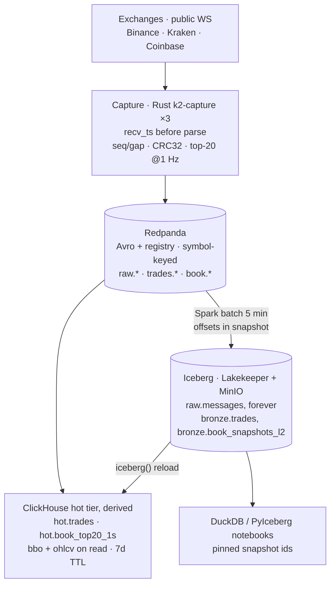
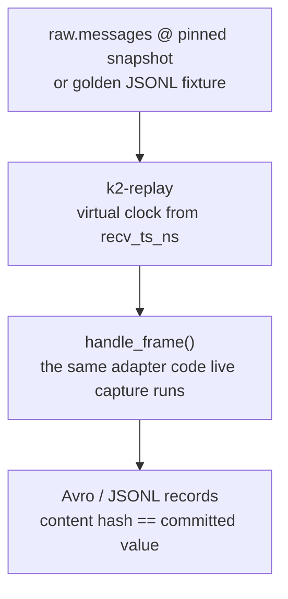
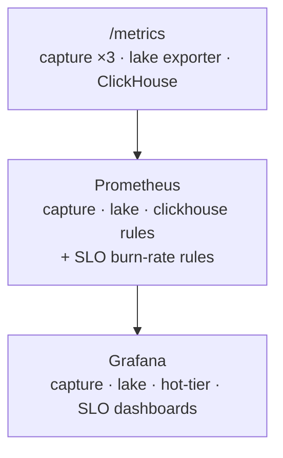

# Plan: K2 v3 — quantitative-research market data platform (Rust-first, lake-first)

> Design document and phase gates. Status lives in ADRs and git, not here (see CLAUDE.md doc conventions).
> Authored 2026-08-26 with Claude Code; decisions confirmed by the maintainer.

## Context

Repo is public-ready as v2 (PR #56 merged, tag v2.0.0; PR #65 with monitoring fixes open). User wants a **best-in-class quantitative-research market data platform** to discuss with HFT/prop-firm CTOs. Audit of v2 found structural gaps: serving DB (ClickHouse) is the system of record and the lake is a lossy JDBC copy; no receive timestamps, no sequence/gap detection, Kraken on WS v1 with synthesised colliding trade IDs; bronze plain MergeTree (duplicates on replay); OHLCV SummingMergeTree with open/high/low/close resolving *arbitrarily* across blocks (a real correctness bug); Avro topic unread while ClickHouse consumes raw JSON; Hadoop catalog on a bind mount; trades only, no book.

## Decisions

**Decisions (user-confirmed):** quant research platform, NOT a trading path (public WS feeds, internet latency — say so explicitly). **Rust as much as possible**: one `k2-capture` binary per exchange doing trades + L2 book (Kotlin retired to `legacy/v2-kotlin/` after parity). Top-20 book is the canonical L2 product. Lake-first: Spark batch reads Redpanda → Iceberg raw/bronze (system of record); ClickHouse is a derived hot tier (trades, BBO, OHLCV, top-20 @1s, 7d TTL). Lakekeeper REST catalog (Rust) + MinIO. DuckDB + PyIceberg notebooks as quant query layer; no query service. Keep 16 CPU / 40 GB single-host constraint. Same repo, v3 phases, ADR-018+. **Flip public now with v2 + roadmap; build v3 in the open.**

## Execution model

**Execution model:** Fable plans/orchestrates/reviews; opus for design-heavy code (Rust capture, Spark ingest, ClickHouse DDL, ADRs), sonnet for mechanical work (compose, docs sweeps, tests scaffolding, CI). Every phase leaves the stack green; new paths run parallel to old, cut over after comparison.

## Ground truth (from exploration — cite when implementing)

A snapshot of the repo as it stood on 2026-08-26, before any v3 phase landed. It is left as
written; where a phase moved something, the phase file's divergence section says so.

- Kotlin handlers `services/feed-handler-kotlin/src/main/kotlin/com/k2/feedhandler/*`: no Kafka headers; only Kraken has a receive ts; Kraken WS v1 (`wss://ws.kraken.com`); Kraken `trade_id = "KRAKEN-${ms}-${hash}"` (collides); Coinbase drops `snapshot` events, never compares `sequence_num`; Kraken/Coinbase raw key = exchange name → single partition; `schemas/avro/normalized-trade.avsc` has `logicalType` as sibling of `type` (ignored), numerics as strings. ClickHouse consumes only `.raw` JSON topics.
- Exchange L2: Binance `<sym>@depth20@100ms` partial stream (lastUpdateId, bids, asks; combined `/stream?streams=`; 5 inbound msg/s, 1024 streams, 24h conn life). Kraken v2 `wss://ws.kraken.com/v2` `book` depth 25, snapshot+update, CRC32 checksum over top-10 asks then bids (precision from `instrument` channel; doc example `3310070434`); `trade` channel has real `trade_id`. Coinbase `level2`: `sequence_num` per-connection +1, snapshot/update, `new_quantity` absolute, side `bid|offer`, per-level `event_time`; subscribe `heartbeats`; JWT optional. Coinbase WS rate limits unverified.
- Rust crates: tokio 1.53, tokio-tungstenite 0.30 (rustls), rdkafka 0.39 (vendored librdkafka, no ssl feature), apache-avro 0.22, schema_registry_converter 5.0 (check avro compat — else hand-roll 5-byte framing), serde_json/simd-json, crc32fast 1.5, metrics-exporter-prometheus 0.18, reqwest 0.13, serde_yaml, proptest.
- Lake: Spark image `tabulario/spark-iceberg:3.5.0_1.4.2` lacks spark-sql-kafka-0-10, spark-avro; has iceberg-aws-bundle 1.4.2; pyiceberg 0.5.1/duckdb 0.9.1 too old. Bump to `tabulario/spark-iceberg:3.5.6_1.9.0` (verify exists; fallback `apache/spark:3.5.6` + iceberg 1.9.x jars). Lakekeeper v0.13.3 `quay.io/lakekeeper/catalog`, PG≥15 + ext uuid-ossp,pgcrypto,pg_trgm,btree_gin,btree_gist; `migrate` → `serve :8181` → `POST /management/v1/bootstrap` → warehouse create (s3 profile, `flavor: s3-compat`, `path-style-access: true`, `sts-enabled: false`, static keys). Spark conf `type=rest, uri=http://lakekeeper:8181/catalog, warehouse=k2, io-impl=S3FileIO, s3.endpoint=http://minio:9000, s3.path-style-access=true`. Kafka batch read: `format("kafka")` + `startingOffsets/endingOffsets` JSON per partition; Confluent header strip `substring(value, 6)`; `from_avro(schema_json)`; offsets stored via `.option("snapshot-property.k2.kafka-offsets", json)` (Iceberg ≥1.4). ClickHouse 24.3 cannot use REST catalog; reload via `iceberg()` table function (verified S11; the `s3()` parquet-glob fallback is banned — it resurrects deleted rows).
- ClickHouse 24.3: `AvroConfluent` + `format_avro_schema_registry_url` supported; ReplacingMergeTree(ver)+FINAL+`do_not_merge_across_partitions_select_final`; AggregatingMergeTree; no TimeSeries engine. `config.xml` `max_memory_usage` 10 GB > 8 GB container; `max_server_memory_usage_to_ram_ratio` reads host RAM. Kafka engine virtual columns `_partition/_offset/_headers` — verify in TO-MV on 24.3.
- Budget: compose limits 15.1 CPU / 21.9 GB (14 services); measured usage tiny (Kotlin 0.03 CPU / 134 MiB vs 0.5/512M). CPU is binding.
- Existing 18 alert rules in `docker/prometheus/rules/` (ClickHouse, feed-handler, and the v2 cold-tier file), 4 dashboards, CI jobs kotlin/python/docker/security. Reusable patterns from the v2 cold-tier path: its Prefect deploy script, `docker exec k2-spark-iceberg python3 …` dispatch, and its standalone metrics-exporter service. All three were copied into `docker/lake/` and the originals deleted in Phase D — see 003's divergence section.

## Target architecture (v3)

**Data path.**

**Replay path — one parser, two clocks.**

**Observability.**

Principles: (1) capture everything verbatim, timestamp before parse; (2) lake is system of record, everything else derived and rebuildable; (3) one wire format (Avro + registry), fixed-point int64 @1e-8; (4) correctness proven, not claimed (checksums, gap counters, audits, CI regression for the OHLCV bug); (5) honest non-goals.

## Engineering standards

Five standards the platform is built to demonstrate. Each names its artefacts and
the phase they land in; an artefact that does not exist means that phase is not done.

- **Depth with explicit trade-offs, not defaults.** `docs/architecture/14-partitioning-strategy.md`
  rewritten across all three tiers — Kafka key + partition count, Iceberg partition spec +
  sort order, ClickHouse `ORDER BY`/`PARTITION BY` — every row carrying the rejected
  alternative and why it lost (Kafka + Iceberg rows in Phase D, ClickHouse rows in Phase E).
  `docs/architecture/16-failure-modes.md` as an FMEA table: component × failure × detection
  signal × blast radius × recovery step (naming its runbook) × the test or `make chaos`
  script that proves it (capture/lake rows Phase D, hot-tier rows Phase E).
  `docs/architecture/15-capacity-model.md`: per-core msg/s, bytes/day per table, headroom
  arithmetic against 16 CPU / 40 GB (predicted column Phase C, measured column Phase F).
  Resource isolation is `cpuset` pinning (`002-phase-c-rust-capture.md` Scope) *plus* one
  measured noisy-neighbour experiment — Spark compaction on its cpuset while capture
  ingress latency is sampled (Phase D). Every number carries the command that produced it.
- **Replay and simulation, with the limits stated.** Phase G delivers `k2-replay`: a
  subcommand of the capture crate that reads `raw.messages` from the lake (or a JSONL
  fixture) and pushes frames through the *same* `handle_frame` adapter code as live
  capture, with a virtual clock driven by recorded `recv_ts_ns`. Determinism is a test,
  not a claim: same input → byte-identical Avro/JSONL output, asserted by content hash.
  Reproducibility is a pinned Iceberg snapshot id plus that output hash, recorded in
  `audit.checks`. `docs/research/<date>-replay-fidelity-limits.md` states what this data
  can and cannot honestly simulate (Phase G).
- **Research/production divergence controlled by a contract.** ADR-029, the
  research/production parity contract (Phase G): one parser for live and replay; a
  three-way OHLCV parity test in CI — ClickHouse `hot.ohlcv` vs DuckDB-over-Iceberg vs a
  pure-Python reference, same pinned snapshot id, tolerance zero; golden fixtures shared
  by the Rust tests and the notebooks; notebooks pin snapshot ids and never read `latest`;
  behavioural drift guarded by replaying the golden fixtures in CI to a fixed hash.
- **Requirements clarified, not assumed.** `docs/research/2026-08-26-v3-requirements-clarification.md`
  records the four questions put to the maintainer before this plan was amended, the
  answers, and the option rejected in each — replay scope, estimation discipline, fault
  injection, and SLOs — plus the non-goals reaffirmed. The plan implements those answers;
  it does not re-derive them.
- **Scale, automation, estimation confidence, systems ownership.** The predicted-vs-measured
  capacity table with its error column, kept in the document even where the prediction was
  wrong (Phase C predicts, Phase F measures). Three SLOs — capture freshness, lake ingest
  lag, hot-tier query p99 — each with an error budget, burn-rate alerts and a runbook
  (Phase F). `make chaos` as a local fault-injection target (Phase D/E). A blameless
  post-mortem of the v2 OHLCV `SummingMergeTree` bug
  (`docker/clickhouse/ddl/01-k2-schema.sql:178`) published on the audits surface, and the
  centrepiece of the v3 narrative (Phase F). Release automation already exists — the
  `/release-check` fresh-clone gate — and runs before the `v3.0.0` tag.

## Design documents

The written output of v3, one row per document, with the phase that produces it.
Each lands in the same PR as the code it describes; none is a status log.

| Document | Surface | What it settles | Phase |
|---|---|---|---|
| `docs/architecture/15-capacity-model.md` | architecture | msg/s per core, bytes/day per table, headroom against 16 CPU / 40 GB — predicted before measurement, then scored | C predicts · F measures |
| `docs/architecture/14-partitioning-strategy.md` (rewrite) | architecture | Kafka key + partition count, Iceberg spec + sort order, ClickHouse `ORDER BY`/`PARTITION BY`, each with its rejected alternative | D (Kafka, Iceberg) · E (ClickHouse) |
| `docs/architecture/16-failure-modes.md` | architecture | FMEA: component × failure × detection signal × blast radius × recovery × the proof script | D (capture, lake) · E (hot tier) |
| `docs/architecture/17-scale-out-path.md` | architecture | per-tier AWS mapping to TB/PB (S3 + Glacier lifecycle, MSK/Redpanda Cloud, ClickHouse EC2/Cloud, EMR Serverless, Fargate capture, Lakekeeper on ECS + RDS); what changes vs what does not; partition/file-size/compaction justified at PB — designed, not exercised (Q9) | D |
| `docs/operations/slos.md` | operations | three SLOs, their error budgets, and what spending a budget forces | F |
| `docs/audits/<date>-ohlcv-correctness.md` | audits | blameless post-mortem of the v2 OHLCV `SummingMergeTree` bug — what was claimed, what ran, why no test caught it | F |
| `docs/research/<date>-replay-fidelity-limits.md` | research | what top-20 @1 Hz over public WS can and cannot honestly simulate | G |
| `docs/adr/ADR-029-research-production-parity-contract.md` | adr | one parser, three-way parity at tolerance zero, pinned snapshots, drift guard | G |
| [`docs/research/2026-08-26-v3-requirements-clarification.md`](../../research/2026-08-26-v3-requirements-clarification.md) | research | the four questions behind this amendment, their answers and the rejected option in each | done — this amendment |
| `docs/adr/ADR-019..028` | adr | the per-phase decisions under the ADR-018 umbrella | F |

## Phases

| File | Phase | Scope | Exit |
|---|---|---|---|
| `000-phase-a-ship-v2-public.md` | A | Ship v2 public now (this week) | Fresh-clone quickstart green; links and grep sweep clean |
| `001-phase-b-foundations.md` | B | v3 foundations (P0/P1, ~1 week) | Registry + schemas registered; Lakekeeper works; v2 still green |
| `002-phase-c-rust-capture.md` | C | Rust capture tier (services/capture-rust/, ~2 weeks) | 3 exchanges × 2 h window clean (labelled; 24 h continuous run is a Phase F+ revisit trigger); limits measured and cut |
| `003-phase-d-lake-tier.md` | D | Lake tier (docker/lake/, ~1.5 weeks; replaces the v2 cold-tier path) | Two ingests, second adds 0; no dupes/gaps; audits pass |
| `004-phase-e-hot-tier.md` | E | Four lake layers + gold served from ClickHouse (ADR-026, ~2 weeks) | Every layer rebuilt from raw with audits green; three-way OHLCV parity at a pinned snapshot; `k2` dropped |
| `005-phase-f-notebooks-numbers-docs.md` | F | Notebooks, audits, numbers, docs (~1 week) | v3.0.0 tagged; numbers table published and traceable |
| `006-phase-g-replay-parity.md` | G | `k2-replay` + the research/production parity contract (~1 week) | Replay byte-identical to a fixed hash; three-way OHLCV parity green in CI at tolerance zero |

## Verification (end-to-end)

- Every phase: `make test` (rust/python/clickhouse-schema), CI green, `docker compose up -d --build` from clean clone → all services healthy.
- Capture: `rpk topic consume market.crypto.v3.book.kraken` shows 1 Hz snapshots with `checksum_ok=true`; `curl :8082/metrics` counters; induced failures (corrupt level → resync; `kill -STOP` → Coinbase gap+reconnect).
- Lake: snapshot summary offsets gapless; raw count == bronze count; double-run adds 0; audits pass; DuckDB notebook 01–04 run clean.
- Hot: CI schema tests; `hot.ohlcv` matches DuckDB over Iceberg; FINAL vs non-FINAL counts; rebuild `hot.*` from lake timed.
- Numbers table complete and traceable to commands; grep sweep (no "Spring Boot", no `docker-compose.v2`, no TODO in published docs).
- Standards: `make chaos` runs every injected fault and each one's expected alert fires, with the recovery time recorded in `docs/architecture/16-failure-modes.md`; `15-capacity-model.md` shows predicted, measured and error % for every row; `k2-replay` of the golden fixtures reproduces the committed output hash; the three-way OHLCV parity job is green in CI at tolerance zero.

## Risks / verify-first

Lakekeeper↔Iceberg client (S8; escape: 1.8.1/1.10.1 runtime jars); CH `AvroConfluent` arrays/virtual columns (S4; fallback flat columns); Coinbase rate limits/JWT (S5); rdkafka+distroless (S6; fallback debian-slim); tabulario image tag (S7); `iceberg()` on 24.3 (S11; no glob fallback — `iceberg()` only; if it ever fails, that is a stop-the-line bug). Phase C is the long pole; Coinbase full-depth memory watched via `book_levels_total`. Public-in-the-open: keep `main` green; v3 work on `feat/v3-*` branches with PRs. Replay determinism is itself a verify-first item (S13, Phase G): any `HashMap` iteration order, wall-clock read or float formatting on the emit path breaks the byte-identical hash — escape hatch is `BTreeMap` ordering plus fixed-point only, never `f64`, on the record path.
