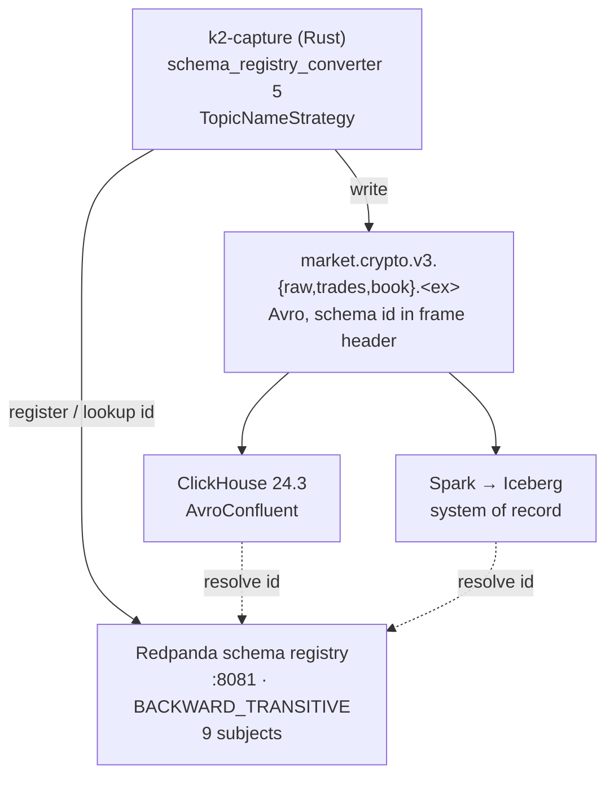

# Avro schemas — the v3 wire contract

Every byte that moves between K2 services is an Avro record described here and
registered in Redpanda's built-in schema registry. There is one wire format and
no exceptions: no JSON topics, no "just this once" string payloads.

| File | Record | Topic | Subject |
|------|--------|-------|---------|
| [`avro/raw-message.avsc`](avro/raw-message.avsc) | `RawMessage` | `market.crypto.v3.raw.<ex>` | `market.crypto.v3.raw.<ex>-value` |
| [`avro/trade.avsc`](avro/trade.avsc) | `Trade` | `market.crypto.v3.trades.<ex>` | `market.crypto.v3.trades.<ex>-value` |
| [`avro/book-snapshot-l2.avsc`](avro/book-snapshot-l2.avsc) | `BookSnapshotL2` | `market.crypto.v3.book.<ex>` | `market.crypto.v3.book.<ex>-value` |

`<ex>` ∈ {`binance`, `kraken`, `coinbase`} — 9 subjects. Namespace for all three
is `com.k2.market.v3`. Registration is done by
[`docker/redpanda/init.sh`](../docker/redpanda/init.sh), which is idempotent and
runs on every stack start.

> **Why the `v3` segment.** `market.crypto.trades.<ex>` was taken: it is the v2
> normalized Avro topic, and its `-value` subject already holds
> `NormalizedTrade`. Registering `Trade` there returned `{"is_compatible":false}`
> (verified against the running stack, 2026-08-26), which would have failed
> `redpanda-init` and blocked every feed handler from starting; the parallel-run
> window ADR-018 committed to needed two topics regardless. Those topics and
> subjects are frozen now rather than gone — Phase E deletes them — so the prefix
> stays until then, and comes off afterwards if anyone wants it to. It is applied
> to all nine uniformly rather than only to the one that collided.

> **Still present:** [`avro/normalized-trade.avsc`](avro/normalized-trade.avsc)
> is the **v2** contract, superseded by `trade.avsc` and not to be used for new
> work. Its producers — the Kotlin feed handlers — retired to
> [`legacy/v2-kotlin/`](../legacy/v2-kotlin/README.md) on 2026-08-26
> ([ADR-019](../docs/adr/ADR-019-rust-capture-tier.md)), and the file did **not**
> go with them. Three reasons it stays here: the three
> `market.crypto.trades.<ex>-value` subjects are still registered and the frozen
> topic data is still decodable against it; the archived handler loads it from
> `/app/schemas` at producer start (`KafkaProducerService.kt:115`), so a run from
> the archive needs it on the repo-root build context; and four current documents
> cite it by line number as the worked example of a contract nothing enforced.
> It is deleted with the `k2` database and the v2 topics at the Phase E cutover.

---

## Subject naming — TopicNameStrategy

Subject = `<topic>-value`. Nothing else. This is the Confluent default and what
`schema_registry_converter` 5 uses out of the box on the Rust side, so the
mapping needs no configuration at either end:

```
topic   market.crypto.v3.trades.kraken
subject market.crypto.v3.trades.kraken-value
```

The consequence worth stating: **one topic carries exactly one record type.**
TopicNameStrategy has no way to express "this topic holds `Trade` or
`BookSnapshotL2`", so trades and book snapshots get separate topics even though
they come off the same connection. That is the intended trade-off — RecordName
and TopicRecordName strategies buy multiplexing at the price of a per-consumer
configuration that has to agree everywhere, and nothing here needs multiplexing.

Keys are the **canonical symbol as a plain UTF-8 string**, not Avro. A key
schema would buy a schema-registry round trip per producer for a value that is
already constrained by `config/instruments.yaml` and validated by
`tests/test_contracts.py`. No `-key` subjects are registered.

---

## Compatibility — `BACKWARD_TRANSITIVE`

Set globally, not per subject:

```bash
curl -s -X PUT http://localhost:8081/config \
  -H 'Content-Type: application/vnd.schemaregistry.v1+json' \
  -d '{"compatibility":"BACKWARD_TRANSITIVE"}'
```

`BACKWARD` means a consumer on the new schema can read data written with the
*previous* schema. `BACKWARD_TRANSITIVE` extends that to **every** previous
schema, and that is the property a lake-first platform actually needs: the
archive is never rewritten, so a reader in 2028 will encounter version 1 bytes
sitting next to version 9 bytes in the same Iceberg table. Plain `BACKWARD`
would let a chain of individually-safe changes drift until the oldest files
became unreadable — one field dropped per version, nine versions apart.

The cost is real and accepted: **a field can never be removed and never be
renamed**, for the life of the record type.

### Evolution rules

1. **Add nullable-with-default only.** New fields are
   `["null", T]` with `"default": null`. Anything else fails the compatibility
   check, and it should — an old record has no value to supply.
2. **Never rename.** Avro matches fields by name; a rename reads as *drop one,
   add one*, which loses the data in every existing file rather than moving it.
   An alias fixes the reader and not the archive. If a name is wrong, it stays
   wrong and the `doc` explains it.
3. **Never change a type.** `int` → `long` is promotable in the Avro spec and is
   still not allowed here, because Iceberg and ClickHouse do not agree on
   promotion rules and the failure would land at the lake ingest boundary hours
   later. Add a new field instead.
4. **A new record shape is a new topic.** Reshaping `Trade` into something
   version 1 cannot be read as is not an evolution — it is `TradeV2` on
   `market.crypto.v4.trades.<ex>`, with both running until consumers move. The
   namespace already carries `v3` for exactly this reason.
5. **Check before you deploy**, against the running registry:
   ```bash
   curl -s -X POST http://localhost:8081/compatibility/subjects/market.crypto.v3.trades.kraken-value/versions/latest \
     -H 'Content-Type: application/vnd.schemaregistry.v1+json' \
     -d "{\"schema\": $(jq -Rs . < schemas/avro/trade.avsc)}"
   # {"is_compatible":true}  — anything else stops the change
   ```
6. **Every field carries a `doc`.** Enforced by `tests/test_contracts.py`, which
   fails the build on a missing one. A field nobody can explain is a field
   nobody can safely use, and the registry is the only place that explanation
   travels with the data.

A schema change moves in one PR with everything downstream of it — see
[`.claude/skills/schema-change/SKILL.md`](../.claude/skills/schema-change/SKILL.md).

---

## The fixed-point contract

**Every price and quantity on every v3 topic is an `int64` holding the value
scaled by 1e-8.** No floats anywhere on the wire.

```
wire_value = round(decimal_value × 100_000_000)
decimal_value = wire_value / 100_000_000
```

Worked example, a BTC/USD trade at 45285.2 for 0.00184 BTC:

| Field | Exchange sends | On the wire | Reconstructed |
|-------|----------------|-------------|---------------|
| `price` | `"45285.2"` | `4528520000000` | 45285.20000000 |
| `qty` | `"0.00184"` | `184000` | 0.00184000 |

Check the arithmetic: `45285.2 × 1e8 = 4_528_520_000_000`, which is ~4.5e12
against an `int64` ceiling of ~9.22e18. The headroom is ~2 million ×, so the
binding limit is precision, not range: 8 decimal places is one satoshi, and no
venue we capture quotes finer.

**More than 8 decimal places is rejected at capture and counted** — never
silently rounded. A rounded price is a wrong price that looks right forever; a
counter that ticks is a bug someone fixes. The counter is the alert.

### Why not `logicalType: decimal`

`decimal` is the textbook answer and it is the wrong one here.

- Avro `decimal` is `bytes` or `fixed` plus a scale. Every consumer has to
  reconstruct a `BigDecimal`/`Decimal128` from a byte array, and each does it
  differently: ClickHouse 24.3's `AvroConfluent` handling of `decimal` is not
  something this project verified, `apache-avro` 0.22 on the Rust side hands
  back a `BigDecimal` that then needs converting for arithmetic, and Spark maps
  it to `DecimalType` with its own precision rules.
- A plain `long` is decoded **identically and without ambiguity** by all three —
  `Int64` in ClickHouse, `i64` in Rust, `LongType` in Spark — and arithmetic on
  it is exact integer arithmetic in every one.
- The scale is fixed at 1e-8 for the life of the contract, so the one thing
  `decimal` adds over a `long` — a scale that can vary per field — is a
  degree of freedom this system does not want.

**What it costs:** the scale lives in the `doc` and in reader code rather than
in the type, so a consumer that forgets it reads a price ~1e8 too large. That is
a loud failure, not a quiet one, and `tests/test_contracts.py` asserts every
`_px`/`price`/`qty` field is a `long` so the convention cannot rot on the
producer side. Recorded as a deliberate trade-off, not an oversight.

### The other silent-failure guard

`logicalType` must be nested **inside** the type object, never a sibling of
`type`:

```jsonc
// right — Avro applies it, ClickHouse 24.3 decodes DateTime64(6)
{"name": "exchange_ts", "type": {"type": "long", "logicalType": "timestamp-micros"}}

// wrong — Avro silently ignores it, and this exact mistake shipped in v2
{"name": "exchange_ts", "type": "long", "logicalType": "timestamp-micros"}
```

The wrong form parses, validates, registers and serialises cleanly; it just
loses the type. `tests/test_contracts.py` fails on any sibling `logicalType`.

---

## How it fits together



Producers and consumers never exchange schemas directly — a 5-byte Confluent
frame header carries a schema **id**, and both sides resolve it against the
registry. That is what makes `BACKWARD_TRANSITIVE` load-bearing rather than
ceremonial: the id in a two-year-old Iceberg file still resolves, and the
current reader has to be able to handle whatever comes back.

---

## Registering by hand

Normally `docker/redpanda/init.sh` does this. To do one subject manually:

```bash
# rpk is in the redpanda image and needs no JSON escaping
docker exec k2-redpanda rpk registry schema create \
  market.crypto.v3.trades.kraken-value --schema /schemas/trade.avsc \
  -X registry.hosts=redpanda:8081

# or over REST, from the host, where jq is available
curl -s -X POST http://localhost:8081/subjects/market.crypto.v3.trades.kraken-value/versions \
  -H 'Content-Type: application/vnd.schemaregistry.v1+json' \
  -d "{\"schemaType\":\"AVRO\",\"schema\": $(jq -Rs . < schemas/avro/trade.avsc)}"

curl -s http://localhost:8081/subjects                       # what is registered
curl -s http://localhost:8081/config                         # global compatibility
```

---

## Testing

```bash
uv run --no-project --with pytest --with pyyaml pytest tests/test_contracts.py -q
```

Structural only, and deliberately so: `doc` on every field, `logicalType`
nesting, `long` on every price/quantity, and the instrument registry's shape and
count. It needs no running stack and no Avro library, so it gates a PR rather
than a deploy. Round-trip encode/decode against a live registry belongs to the
capture tier's own tests in Phase C.

---

**Last updated:** 2026-08-26 · **Contract version:** v3 (`com.k2.market.v3`)
