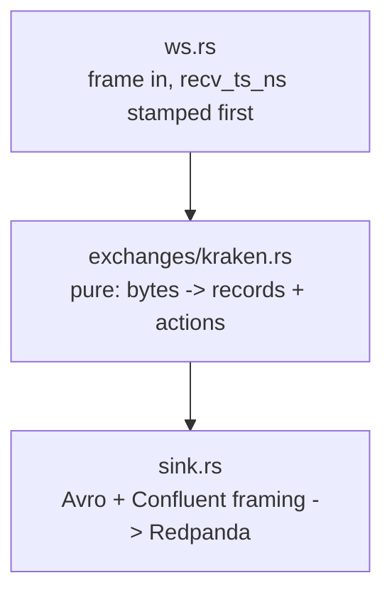

# `k2-capture` — the v3 capture tier

One process per venue. One WebSocket per process. Three topics out.

`k2-capture` reads a venue's public WebSocket, stamps every frame with a receive
time before parsing it, and produces three Confluent-framed Avro streams:
`market.crypto.v3.raw.<ex>` (every frame, verbatim — the system of record),
`market.crypto.v3.trades.<ex>`, and `market.crypto.v3.book.<ex>` (top-20 L2
snapshots at 1 Hz). Everything but `raw` is derived from `raw`, so a
normalisation bug is repairable by reprocessing rather than by losing the day —
that is the whole argument of [ADR-018](../../docs/adr/ADR-018-v3-lake-first-rust-capture.md).



Only `ws.rs` and `sink.rs` touch the network. The adapter in between is pure,
which is what lets `tests/replay.rs` — and `k2-replay` in Phase G — feed the
archived frames back through the same code and assert the bytes out are
identical.

---

## Module map

| Module | What it is |
|--------|------------|
| `main.rs` | clap subcommands, the reconnect loop, the 1 Hz snapshot sampler, metric plumbing |
| `config.rs` | `config/instruments.yaml` loader and the `Exchange` enum |
| `decimal.rs` | decimal text → `i64` at 1e-8, and Kraken's checksum digit formatting. No `f64`, anywhere |
| `book.rs` | `BTreeMap` L2 book: absolute-quantity updates, `top_n`, depth truncation |
| `record.rs` | the three wire records, mirroring `schemas/avro/*.avsc` field for field |
| `exchanges/mod.rs` | the adapter contract — read this before writing Binance or Coinbase |
| `exchanges/kraken.rs` | Kraken spot WS v2: `instrument` + `trade` + `book depth=25`, CRC32 verified |
| `sink.rs` | rdkafka `FutureProducer` + `schema_registry_converter`, drop-on-full |
| `metrics.rs` | Prometheus exposition on `:8082`, every metric `describe_`d |
| `ws.rs` | the socket, the `recv_ts_ns` stamp, backoff, and a ten-line HTTP GET |

---

## The adapter contract

Adapters are an `enum Adapter`, not a `trait`. There are three venues and there
will not be a fourth this year; a trait would buy dynamic dispatch nobody needs
and — the real cost — make a mock adapter possible, at which point the tests
stop exercising the code that runs in production.

```rust
adapter.begin_connection(&conn_id);                      // once per (re)connect
for msg in adapter.subscribe_messages() { feed.send(&msg).await?; }

let handled = adapter.handle_frame(&bytes, recv_ts_ns);  // pure
//   handled.stream   -> the `stream` metric label and RawMessage.stream
//   handled.records  -> Raw first, then anything derived from it
//   handled.actions  -> Action::Resubscribe(symbol), for the caller to perform

adapter.snapshot(&symbol, now_ns)                        // driven by the sampler
```

`handle_frame` must be **pure**: no I/O, no clock reads, no randomness, no
`HashMap` iteration on an emit path. Everything time-dependent is passed in.
Counters (`metrics::counter!`) are fine — they are write-only and cannot change
what the function returns.

Four obligations, spelled out in `src/exchanges/mod.rs`:

1. A `RawMessage` for **every** frame, first, payload byte-for-byte — including
   frames that failed to parse. A frame we did not understand is the one most
   worth keeping.
2. The adapter owns `conn_msg_seq`; `begin_connection` resets it and every
   per-connection fact with it.
3. Book state is internal and leaves only through `snapshot()`. The adapter
   never decides *when* to emit.
4. Return an `Action`; never perform one.

---

## Environment

| Variable | Default | Meaning |
|----------|---------|---------|
| `K2_EXCHANGE` | *required* | `kraken` \| `binance` \| `coinbase` |
| `K2_INSTRUMENTS_FILE` | `/app/config/instruments.yaml` | the instrument registry |
| `K2_KAFKA_BROKERS` | `redpanda:9092` | bootstrap servers |
| `K2_SCHEMA_REGISTRY_URL` | `http://redpanda:8081` | Confluent-compatible registry |
| `K2_METRICS_PORT` | `8082` | Prometheus listener |
| `K2_SNAPSHOT_INTERVAL_MS` | `1000` | book sampler cadence |
| `K2_TOPIC_PREFIX` | `market.crypto.v3` | topic namespace |
| `K2_WS_URL` | venue default | endpoint override |
| `RUST_LOG` | `info` | `tracing-subscriber` filter; logs go to stderr |

Every one is also a `--flag`; `k2-capture run --help` is the authority.

## Subcommands

```bash
k2-capture run                       # capture and produce
k2-capture healthcheck               # exit 0 if any stream saw a frame in 60 s
k2-capture record --exchange kraken --seconds 20 --symbols BTC/USD > f.jsonl
```

`healthcheck` reads our own `/metrics` over loopback and looks at
`k2_capture_last_message_ts_seconds` — the same number the staleness alert
reads, so the two cannot disagree. It exists as a subcommand because the runtime
image is distroless: no shell, no curl.

---

## Building and testing

There is no local toolchain requirement; everything runs in a container. Build
the builder image once:

```bash
docker build -t k2-rust-builder - <<'EOF'
FROM rust:1-bookworm
RUN apt-get update && apt-get install -y --no-install-recommends cmake clang libclang-dev
RUN rustup component add clippy rustfmt
EOF
```

Then, from the repository root:

```bash
docker run --rm -v "$PWD:/repo" -w /repo/services/capture-rust \
  -v k2-capture-cargo:/usr/local/cargo/registry \
  -v k2-capture-target:/repo/services/capture-rust/target \
  k2-rust-builder cargo test
```

Swap `cargo test` for `cargo fmt --check`, `cargo clippy --all-targets -- -D warnings`
or `cargo build --release`. The named volumes are what keep a rebuild at ten
seconds instead of four minutes — librdkafka and rustls are compiled from
source.

`cmake`, `clang` and `libclang-dev` are not optional: rdkafka is built from
source and `zstd-sys` runs bindgen (spike S6).

### The image

```bash
docker build -t k2-capture:v3 -f services/capture-rust/Dockerfile .
```

**From the repository root**, exactly as the Kotlin handlers build. The crate
compiles `schemas/avro/*.avsc` in with `include_str!` and those live outside the
crate, so a crate-directory context cannot see them, and copying them in would
create a second source of truth for the wire contract.
`Dockerfile.dockerignore` next to the Dockerfile trims the context to this
service plus `schemas/avro` — BuildKit prefers a `<dockerfile>.dockerignore`
over the root `.dockerignore`, so the whole arrangement stays inside this
directory.

Measured 2026-08-26: **39.5 MB** as the sum of uncompressed layers, 14.1 MB
compressed (`docker save | wc -c`), of which 11.6 MB is the binary.

---

## Fixtures and replay

`tests/replay.rs` drives `tests/fixtures/kraken-20s.jsonl` — 1185 real frames,
recorded with `k2-capture record` — through `KrakenAdapter::handle_frame` and
asserts every book update reproduced Kraken's own CRC32, the top-20 invariants
hold, and two passes hash identically against the golden value in
`tests/fixtures/kraken-20s.sha256`.

Two things about that fixture are worth knowing before you regenerate it:

- One line is not verbatim. The `instrument` snapshot's `pairs` array is
  filtered to the recorded symbol and `assets` emptied, taking the frame from
  639 KB to under 1 KB. Its shape and every field the adapter reads are intact.
- It uses `tests/fixtures/instruments-kraken-v2.yaml`, which spells the symbols
  the way the v2 wire does. `config/instruments.yaml` works equally well — see
  the alias table below — but the fixture registry keeps the recorded frames and
  the file that produced them spelled identically.

---

## The v1/v2 symbol alias

**Kraken WS v2 does not accept `XBT/USD` or `XDG/USD`** — it answers
`{"error":"Currency pair not supported XBT/USD"}`. Those are the v1 spellings,
and they are correct in `config/instruments.yaml` for as long as the Kotlin
handlers read the same file: `KrakenWebSocketClient.kt` speaks the v1 channelID
protocol, where `XBT/USD` is the right name.

So `KrakenAdapter::new` translates the registry's natives once, through an
explicit two-row table — `XBT/` → `BTC/`, `XDG/` → `DOGE/`, a prefix match on the
base asset only. Everything downstream sees the v2 spelling: the subscribe frame
sends `BTC/USD`, and `Trade.symbol` / `BookSnapshotL2.symbol` carry `BTC/USD`,
which is what "as the exchange spells it on the wire" means in the `.avsc`. The
registry's `canonical` is untouched and stays authoritative. A registry that
listed both spellings of one instrument fails at construction rather than
silently losing one.

`// ponytail: remove with the Kotlin handlers — instruments.yaml then carries v2 spellings`

---

## Deliberate simplifications

- **No spill-to-disk.** When librdkafka's 32 MB queue fills, records are dropped
  and `k2_capture_produce_errors_total{reason="queue_full"}` ticks. Blocking the
  frame loop instead would stop us reading the socket, and the venue would drop
  us — losing more than we were trying to save.
  `// ponytail: spill-to-file when an outage costs data.`
- **No internal channel** between the frame loop and the producer. librdkafka's
  queue is the only buffer, so there is one place records can back up and one
  number to size against the memory limit.
- **Kraken `seq` is 0.** The venue publishes no sequence on v2; the checksum
  does that job, and better — it catches a mis-applied update, not just a
  missing one.
