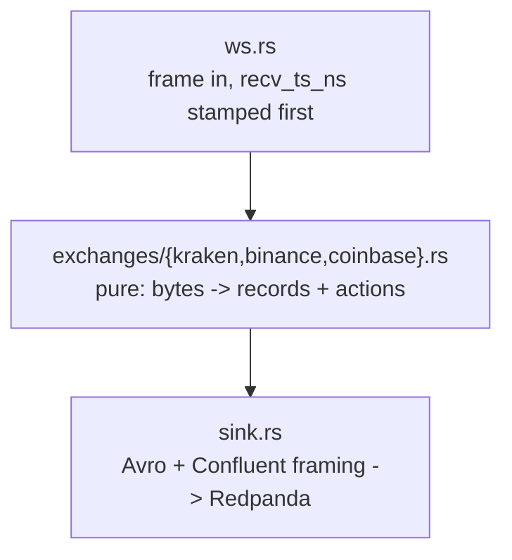

# `k2-capture` — the v3 capture tier

One process per venue. One WebSocket per process. Three topics out.

`k2-capture` reads a venue's public WebSocket, stamps every frame with a receive
time before parsing it, and produces three Confluent-framed Avro streams:
`market.crypto.v3.raw.<ex>` (every frame, verbatim — the system of record),
`market.crypto.v3.trades.<ex>`, and `market.crypto.v3.book.<ex>` (top-20 L2
snapshots at 1 Hz). Everything but `raw` is derived from `raw`, so a
normalisation bug is repairable by reprocessing rather than by losing the day —
that is the whole argument of [ADR-018](../../docs/adr/ADR-018-v3-lake-first-rust-capture.md).



Only `ws.rs` and `sink.rs` touch the network. The adapter in between is pure,
which is what lets `tests/replay.rs` — and `k2-replay` in Phase G — feed the
archived frames back through the same code and assert the bytes out are
identical.

---

## Module map

| Module | What it is |
|--------|------------|
| `main.rs` | clap subcommands, the reconnect loop, the 1 Hz snapshot sampler, metric plumbing |
| `config.rs` | `config/instruments.yaml` loader and the `Exchange` enum |
| `decimal.rs` | decimal text → `i64` at 1e-8, and Kraken's checksum digit formatting. No `f64`, anywhere |
| `book.rs` | `BTreeMap` L2 book: absolute-quantity updates, `top_n`, depth truncation |
| `record.rs` | the three wire records, mirroring `schemas/avro/*.avsc` field for field |
| `exchanges/mod.rs` | the adapter contract, the `Adapter` enum, and the helpers every venue shares (`parse_micros`, the precision-loss and unknown-frame counters) |
| `exchanges/kraken.rs` | Kraken spot WS v2: `instrument` + `trade` + `book depth=25`, CRC32 verified |
| `exchanges/binance.rs` | Binance spot combined stream: `<sym>@trade` + `<sym>@depth20@100ms`, stateless top-20, `lastUpdateId` monotonic |
| `exchanges/coinbase.rs` | Coinbase Advanced Trade: `level2` (full depth) + `market_trades` + `heartbeats`, connection-wide `sequence_num` |
| `sink.rs` | rdkafka `FutureProducer` + `schema_registry_converter`, drop-on-full, delivery reports counted on a detached task |
| `metrics.rs` | Prometheus exposition on `:8082`, every metric `describe_`d |
| `ws.rs` | the socket, the `recv_ts_ns` stamp, backoff, and a ten-line HTTP GET |

---

## The adapter contract

Adapters are an `enum Adapter`, not a `trait`. There are three venues and there
will not be a fourth this year; a trait would buy dynamic dispatch nobody needs
and — the real cost — make a mock adapter possible, at which point the tests
stop exercising the code that runs in production.

```rust
let feed = Feed::connect(&adapter.ws_url(base)).await?;   // Binance: base + "?streams=..."
adapter.begin_connection(&conn_id);                      // once per (re)connect
for msg in adapter.subscribe_messages() { feed.send(&msg).await?; }

let handled = adapter.handle_frame(&bytes, recv_ts_ns);  // pure
//   handled.stream   -> the `stream` metric label and RawMessage.stream
//   handled.records  -> Raw first, then anything derived from it
//   handled.actions  -> Action::{Resubscribe(symbol), Reconnect}, for the caller to perform

adapter.snapshot(&symbol, now_ns)                        // driven by the sampler
```

`handle_frame` must be **pure**: no I/O, no clock reads, no randomness, no
`HashMap` iteration on an emit path. Everything time-dependent is passed in.
Counters (`metrics::counter!`) are fine — they are write-only and cannot change
what the function returns.

Four obligations, spelled out in `src/exchanges/mod.rs`:

1. A `RawMessage` for **every** frame, first, payload byte-for-byte — including
   frames that failed to parse. A frame we did not understand is the one most
   worth keeping.
2. The adapter owns `conn_msg_seq`; `begin_connection` resets it and every
   per-connection fact with it.
3. Book state is internal and leaves only through `snapshot()`. The adapter
   never decides *when* to emit.
4. Return an `Action`; never perform one.

`ws_url(base)` is the one place the URL is venue-shaped: Binance's combined
endpoint carries the subscription as `?streams=btcusdt@trade/btcusdt@depth20@100ms/...`
and sends no subscribe frame, so `subscribe_messages()` is empty there. Kraken
and Coinbase return `base` unchanged. Both `run` and `record` go through it, so
a fixture is the same conversation the live path has.

### Sequencing and resync, per venue

| Venue | Continuity signal | On failure | Counters |
|-------|-------------------|------------|----------|
| Binance | `lastUpdateId` strictly increasing per symbol on `@depth20@100ms` | drop that book; `Action::Resubscribe` with **no frames** — the next in-order partial frame is a complete top-20 | `gaps_total`, `resyncs_total` |
| Kraken | CRC32 checksum on every `book` frame (no sequence numbers) | emit one last snapshot marked `checksum_ok=false`, **then** drop that book; unsubscribe + subscribe that symbol with `snapshot: true` | `checksum_failures_total{symbol}`, `resyncs_total` |
| Coinbase | `sequence_num`, connection-wide across every channel | drop **every** book; `Action::Reconnect` — `main.rs` closes the socket and takes the backoff path | `gaps_total`, `resyncs_total`, `reconnects_total{reason="involuntary"}` |

Coinbase reconnects rather than resubscribes because a gap cannot be attributed
to a product: the missing frame could have carried any of them, and `level2`
has no per-product resync short of a fresh snapshot.

The marked Kraken snapshot is emitted **before** the book is dropped, and the
order is the point. `snapshot()` returns `None` on an empty book, so clearing
first would leave `checksum_ok` reachable only as `true` or `null` and a
consumer filtering `checksum_ok = false` would find nothing, ever. Between the
marked snapshot and the resync landing, that symbol emits no snapshots at all —
a gap, rather than a plausible-looking lie.

**Binance also reconnects on a schedule.** The venue closes any combined stream
24 h after it opens, mid-frame; `connection_expired()` gets there first at 23 h
(`BINANCE_MAX_CONNECTION_AGE`), closing the socket cleanly between frames and
counting the result as `reconnects_total{reason="scheduled"}`. Kraken and
Coinbase publish no connection lifetime, so they get no timer and only ever
report `reason="involuntary"`.

---

## Environment

| Variable | Default | Meaning |
|----------|---------|---------|
| `K2_EXCHANGE` | *required* | `kraken` \| `binance` \| `coinbase` |
| `K2_INSTRUMENTS_FILE` | `/app/config/instruments.yaml` | the instrument registry |
| `K2_KAFKA_BROKERS` | `redpanda:9092` | bootstrap servers |
| `K2_SCHEMA_REGISTRY_URL` | `http://redpanda:8081` | Confluent-compatible registry |
| `K2_METRICS_PORT` | `8082` | Prometheus listener |
| `K2_SNAPSHOT_INTERVAL_MS` | `1000` | book sampler cadence |
| `K2_TOPIC_PREFIX` | `market.crypto.v3` | topic namespace |
| `K2_WS_URL` | venue default | endpoint override |
| `RUST_LOG` | `info` | `tracing-subscriber` filter; logs go to stderr |

Every one is also a `--flag`; `k2-capture run --help` is the authority.

Fixed producer limits (not configurable — `sink.rs`): `message.max.bytes=8388608`
(8 MiB, equal to the WebSocket cap in `ws.rs`; Coinbase's BTC-USD `level2`
snapshot is 5.2 MB, ADR-018 S5, and `market.crypto.v3.raw.*` carries the same
`max.message.bytes`), `queue.buffering.max.kbytes=32768`, `compression.type=zstd`
— a captured 4,803,578-byte snapshot compressed to 383,011 bytes (12.5:1, `zstd -3`).

## Subcommands

```bash
k2-capture run                       # capture and produce
k2-capture healthcheck               # exit 0 if EVERY continuous stream is inside its own bound
k2-capture record --exchange kraken --seconds 20 --symbols BTC/USD > f.jsonl
```

`healthcheck` reads our own `/metrics` over loopback and looks at
`k2_capture_last_message_ts_seconds` — the same number the staleness alert
reads, so the two cannot disagree. It exists as a subcommand because the runtime
image is distroless: no shell, no curl.

It checks **every** stream against **its own** bound from `CONTINUOUS`, and both
halves of that have been wrong. Taking the newest meant Kraken's 1 Hz heartbeat
reported the container healthy while `book` and `trade` were both silent — green
on exactly the failure the check exists for. Taking the oldest against a flat
60 s reports a healthy container unhealthy every time trades go quiet for a
minute, which on a thin instrument is a market state and not a fault. An absent
gauge is a failure too, not a pass. `--max-age-seconds` overrides every bound
with one number, for a one-off `docker exec`; compose passes nothing.

The bounds: 60 s for `book`, `depth20`, `l2_data`, `heartbeat` and `heartbeats`,
which run at 1 Hz or better on all three venues whatever the market is doing;
300 s for `trade` and `market_trades`, where silence can be a thin instrument.
Kraken `trade`'s longest measured gap was 20.4 s over a 3 h window. The same
table is what the session watchdog recycles the socket on, and what
`CaptureFeedStale` is written against.

---

## Metrics and liveness

Prometheus exposition on `:8082/metrics`. The port is **not** published to the
host and the image has no `curl`, so read it through Prometheus or a one-shot
`curlimages/curl` container on the compose network.

Two rules govern everything in `metrics.rs`, and both exist because of alerts
that could not fire:

**Every series an alert reads is created at zero on startup.** `increase(x[1h]) > 0`
needs two samples of `x`; a series born at 1 and flat afterwards yields 0, so the
*first* event is the one an unseeded counter misses — and for
`k2_capture_precision_loss_total` the first event is the one whose alert says the
contract needs an ADR. Seeded: `messages_total` and `bytes_total` and
`unknown_frames_total` per stream, `records_produced_total` per kind,
`records_delivered_total`, `produce_errors_total` per reason,
`precision_loss_total` per reason, `reconnects_total` per reason, `gaps_total`,
`resyncs_total`. `k2_capture_last_message_ts_seconds` is seeded at process start
for every continuous stream, so a subscription the venue silently rejects goes
stale rather than never existing. `checksum_failures_total` is seeded **only for
Kraken** — Binance and Coinbase publish no checksum, and 23 permanently-zero
series implied a capability that does not exist.

**Produced is not delivered.** `k2_capture_records_produced_total` counts the
local enqueue into librdkafka's queue and keeps climbing at full rate through a
broker outage. `k2_capture_records_delivered_total` is incremented from the
delivery report and is the counter that goes flat — it is what
`CaptureProduceStalled` alerts on.

Only *continuous* streams stamp `k2_capture_last_message_ts_seconds`, and they
are the same set the session watchdog and the healthcheck watch. Left out
deliberately: one-shot acknowledgements (Kraken `status`/`control`, Coinbase
`subscriptions`), which arrive once per subscribe and never again; and Kraken
`instrument`, a reference channel measured at 0.0017 frames/s over a 10-minute
sample on 2026-08-26 against a 60 s threshold, while every continuous stream on
all three venues ran at 1.0/s or more.

---

## Building and testing

There is no local toolchain requirement; everything runs in a container. Build
the builder image once:

```bash
docker build -t k2-rust-builder - <<'EOF'
FROM rust:1-bookworm
RUN apt-get update && apt-get install -y --no-install-recommends cmake clang libclang-dev
RUN rustup component add clippy rustfmt
EOF
```

Then, from the repository root:

```bash
docker run --rm -v "$PWD:/repo" -w /repo/services/capture-rust \
  -v k2-capture-cargo:/usr/local/cargo/registry \
  -v k2-capture-target:/repo/services/capture-rust/target \
  k2-rust-builder cargo test
```

Swap `cargo test` for `cargo fmt --check`, `cargo clippy --all-targets -- -D warnings`
or `cargo build --release`. The named volumes are what keep a rebuild at ten
seconds instead of four minutes — librdkafka and rustls are compiled from
source.

`cmake`, `clang` and `libclang-dev` are not optional: rdkafka is built from
source and `zstd-sys` runs bindgen (spike S6).

### The image

```bash
make build-capture          # docker compose build capture-binance, sha stamped
```

or by hand, which is the same thing compose does:

```bash
docker build -t k2-capture:v3 -f services/capture-rust/Dockerfile \
  --build-arg K2_GIT_SHA="$(git describe --always --dirty)" .
```

`K2_GIT_SHA` lands in `k2_capture_build_info` and defaults to `unknown`.
`git describe --always --dirty` rather than a bare `rev-parse`: an image built
from a dirty tree must not claim to be the commit it was started from. All three
`capture-*` compose services declare this build, so
`docker compose up -d --build` and a selective
`docker compose up -d capture-kraken` both work from a fresh clone.

**From the repository root**, exactly as the Kotlin handlers build. The crate
compiles `schemas/avro/*.avsc` in with `include_str!` and those live outside the
crate, so a crate-directory context cannot see them, and copying them in would
create a second source of truth for the wire contract.
`Dockerfile.dockerignore` next to the Dockerfile trims the context to this
service plus `schemas/avro` — BuildKit prefers a `<dockerfile>.dockerignore`
over the root `.dockerignore`, so the whole arrangement stays inside this
directory.

Measured 2026-08-26: **39.5 MB** as the sum of uncompressed layers, 14.1 MB
compressed (`docker save | wc -c`), of which 11.6 MB is the binary.

---

## Fixtures and replay

One replay test per venue drives a recorded JSONL session through the live
adapter's `handle_frame`, asserts the book invariants (top-20, sorted,
uncrossed, no zero quantities) and every venue's own continuity check, then
hashes two passes against a committed golden value. All three were recorded
with `k2-capture record` on 2026-08-26.

| Fixture | Test | Frames | Size | Symbol | Not verbatim |
|---------|------|--------|------|--------|--------------|
| `kraken-20s.jsonl` | `tests/replay.rs` | 1185 | 329 KB | BTC/USD (20 s) | the `instrument` snapshot's `pairs` filtered to the recorded symbol and `assets` emptied: 639 KB → under 1 KB |
| `binance-10s.jsonl` | `tests/replay_binance.rs` | 539 (438 trade, 101 depth20) | 269 KB | BTCUSDT (10 s) | none — 10 s of one symbol is the whole budget at 100 ms depth frames |
| `coinbase-20s.jsonl` | `tests/replay_coinbase.rs` | 159 (`sequence_num` 0..158) | 320 KB | ATOM-USD (20 s) | the `level2` snapshot event trimmed to 1,250 of 3,440 levels (all 450 bids, best 800 offers): 582 KB → 320 KB. Every `sequence_num` intact |

The Kraken fixture uses `tests/fixtures/instruments-kraken-v2.yaml`, which
spells the symbols the way the v2 wire does. `config/instruments.yaml` works
equally well — see the alias table below — but the fixture registry keeps the
recorded frames and the file that produced them spelled identically. Binance
and Coinbase natives are the wire spelling already, so those tests load the
repo registry directly.

---

## The v1/v2 symbol alias

**Kraken WS v2 does not accept `XBT/USD` or `XDG/USD`** — it answers
`{"error":"Currency pair not supported XBT/USD"}`. Those are the v1 spellings,
and they are correct in `config/instruments.yaml` for as long as the Kotlin
handlers read the same file: `KrakenWebSocketClient.kt` speaks the v1 channelID
protocol, where `XBT/USD` is the right name.

So `KrakenAdapter::new` translates the registry's natives once, through an
explicit two-row table — `XBT/` → `BTC/`, `XDG/` → `DOGE/`, a prefix match on the
base asset only. Everything downstream sees the v2 spelling: the subscribe frame
sends `BTC/USD`, and `Trade.symbol` / `BookSnapshotL2.symbol` carry `BTC/USD`,
which is what "as the exchange spells it on the wire" means in the `.avsc`. The
registry's `canonical` is untouched and stays authoritative. A registry that
listed both spellings of one instrument fails at construction rather than
silently losing one.

`// ponytail: remove with the Kotlin handlers — instruments.yaml then carries v2 spellings`

---

## Deliberate simplifications

- **No spill-to-disk.** When librdkafka's 32 MB queue fills, records are dropped
  and `k2_capture_produce_errors_total{reason="queue_full"}` ticks. Blocking the
  frame loop instead would stop us reading the socket, and the venue would drop
  us — losing more than we were trying to save.
  `// ponytail: spill-to-file when an outage costs data.`
- **No internal channel** between the frame loop and the producer. librdkafka's
  queue is the only buffer, so there is one place records can back up and one
  number to size against the memory limit.
- **Kraken `seq` is 0.** The venue publishes no sequence on v2; the checksum
  does that job, and better — it catches a mis-applied update, not just a
  missing one.
- **The schema registry is off the frame path, and where it is not, the bound
  is stated.** `sink.send()` awaits the Avro encoder, which calls the registry
  the first time it meets a subject. `reqwest`'s default is no timeout, so that
  call could stall the socket read indefinitely. `Sink::warm_up()` fetches all
  three subjects (`OutRecord::TOPIC_KINDS`) before the first WebSocket connect
  and `run` treats a failure as fatal, so a healthy session never touches the
  registry at all. `REGISTRY_TIMEOUT` still caps one encode at 5 s, for the one
  case warm-up cannot pre-empt: a mid-session schema evolution against a sick
  registry, where it is 5 s *per record* for as long as it stays sick — the
  converter does not cache retriable errors. Bounded per record, unbounded in
  aggregate; `sink.rs`'s header carries the negative-cache upgrade path.
