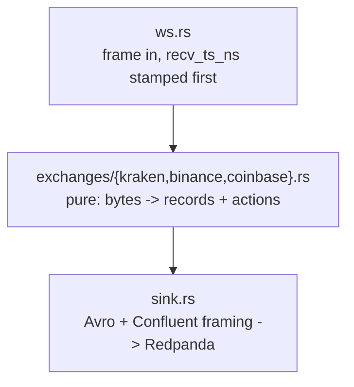

# `k2-capture`: the v3 capture tier

One process per venue. One WebSocket per process. Three topics out.

`k2-capture` reads a venue's public WebSocket, stamps every frame with a receive
time before parsing it, and produces three Confluent-framed Avro streams:
`market.crypto.v3.raw.<ex>` (every frame, verbatim, the system of record),
`market.crypto.v3.trades.<ex>`, and `market.crypto.v3.book.<ex>` (top-20 L2
snapshots at 1 Hz). Everything but `raw` is derived from `raw`, so a
normalisation bug is repairable by reprocessing rather than by losing the day , 
that is the whole argument of [ADR-018](../../docs/adr/ADR-018-v3-lake-first-rust-capture.md).



Only `ws.rs` and `sink.rs` touch the network. The adapter in between is pure,
which is what lets `tests/replay.rs`, and `k2-replay` in Phase G, feed the
archived frames back through the same code and assert the bytes out are
identical.

---

## Module map

| Module | What it is |
|--------|------------|
| `main.rs` | clap subcommands, the reconnect loop, the 1 Hz snapshot sampler, metric plumbing |
| `config.rs` | `config/instruments.yaml` loader and the `Exchange` enum |
| `decimal.rs` | decimal text → `i64` at 1e-8, and Kraken's checksum digit formatting. No `f64`, anywhere |
| `book.rs` | `BTreeMap` L2 book: absolute-quantity updates, `top_n`, depth truncation |
| `record.rs` | the three wire records, mirroring `schemas/avro/*.avsc` field for field |
| `exchanges/mod.rs` | the adapter contract, the `Adapter` enum, and the helpers every venue shares (`parse_micros`, the precision-loss and unknown-frame counters) |
| `exchanges/kraken.rs` | Kraken spot WS v2: `instrument` + `trade` + `book depth=25`, CRC32 verified |
| `exchanges/binance.rs` | Binance spot combined stream: `<sym>@trade` + `<sym>@depth20@100ms`, stateless top-20, `lastUpdateId` monotonic |
| `exchanges/coinbase.rs` | Coinbase Advanced Trade: `level2` (full depth) + `market_trades` + `heartbeats`, connection-wide `sequence_num` |
| `sink.rs` | rdkafka `FutureProducer` + `schema_registry_converter`, drop-on-full (`send` returns whether the record was enqueued), delivery reports counted on a detached task |
| `resync.rs` | resubscribe a symbol's book once the producer queue drains after dropping one of its raw frames, the archive's replay, not the capture's book, is what a drop breaks |
| `metrics.rs` | Prometheus exposition on `:8082`, every metric `describe_`d |
| `ws.rs` | the socket, the `recv_ts_ns` stamp, backoff, and a ten-line HTTP GET |

---

## The adapter contract

Adapters are an `enum Adapter`, not a `trait`. There are three venues and there
will not be a fourth this year; a trait would buy dynamic dispatch nobody needs
and, the real cost, make a mock adapter possible, at which point the tests
stop exercising the code that runs in production.

```rust
let feed = Feed::connect(&adapter.ws_url(base)).await?;   // Binance: base + "?streams=..."
adapter.begin_connection(&conn_id);                      // once per (re)connect
for msg in adapter.subscribe_messages() { feed.send(&msg).await?; }

let handled = adapter.handle_frame(&bytes, recv_ts_ns);  // pure
//   handled.stream   -> the `stream` metric label and RawMessage.stream
//   handled.records  -> Raw first, then anything derived from it
//   handled.actions  -> Action::{Resubscribe(symbol), Reconnect}, for the caller to perform

adapter.snapshot(&symbol, now_ns)                        // driven by the sampler
```

`handle_frame` must be **pure**: no I/O, no clock reads, no randomness, no
`HashMap` iteration on an emit path. Everything time-dependent is passed in.
Counters (`metrics::counter!`) are fine, they are write-only and cannot change
what the function returns.

Four obligations, spelled out in `src/exchanges/mod.rs`:

1. A `RawMessage` for **every** frame, first, payload byte-for-byte, including
   frames that failed to parse. A frame we did not understand is the one most
   worth keeping.
2. The adapter owns `conn_msg_seq`; `begin_connection` resets it and every
   per-connection fact with it.
3. Book state is internal and leaves only through `snapshot()`. The adapter
   never decides *when* to emit.
4. Return an `Action`; never perform one.

`ws_url(base)` is the one place the URL is venue-shaped: Binance's combined
endpoint carries the subscription as `?streams=btcusdt@trade/btcusdt@depth20@100ms/...`
and sends no subscribe frame, so `subscribe_messages()` is empty there. Kraken
and Coinbase return `base` unchanged. Both `run` and `record` go through it, so
a fixture is the same conversation the live path has.

### Sequencing and resync, per venue

| Venue | Continuity signal | On failure | Counters |
|-------|-------------------|------------|----------|
| Binance | `lastUpdateId` strictly increasing per symbol on `@depth20@100ms` | drop that book; `Action::Resubscribe` with **no frames**, the next in-order partial frame is a complete top-20 | `gaps_total`, `resyncs_total` |
| Kraken | CRC32 checksum on every `book` frame (no sequence numbers) | emit one last snapshot marked `checksum_ok=false`, **then** drop that book; unsubscribe + subscribe that symbol with `snapshot: true` | `checksum_failures_total{symbol}`, `resyncs_total` |
| Coinbase | `sequence_num`, connection-wide across every channel | drop **every** book; `Action::Reconnect`, `main.rs` closes the socket and takes the backoff path | `gaps_total`, `resyncs_total`, `reconnects_total{reason="involuntary"}` |

Coinbase reconnects rather than resubscribes because a gap cannot be attributed
to a product: the missing frame could have carried any of them, and `level2`
has no per-product resync short of a fresh snapshot.

The marked Kraken snapshot is emitted **before** the book is dropped, and the
order is the point. `snapshot()` returns `None` on an empty book, so clearing
first would leave `checksum_ok` reachable only as `true` or `null` and a
consumer filtering `checksum_ok = false` would find nothing, ever. Between the
marked snapshot and the resync landing, that symbol emits no snapshots at all , 
a gap, rather than a plausible-looking lie.

**A dropped raw book frame is a resync too, for the archive's sake.** When the producer
queue is full, `sink.send` drops the record and returns `false`; the capture's own book is
unharmed (it saw the frame), but `raw.messages` now has a hole, and the lake replays every
book from `raw.messages`. Measured on 2026-08-26: after the `capture-queue-full` and
`redpanda-stop` chaos runs, 386,962 Kraken frames failed the lake's replayed checksum, every
one downstream of a drop, and the failures ran to the end of each connection because
nothing ever took a fresh snapshot (`docker/lake/README.md` § Books). `resync.rs` remembers
the symbol of every dropped `book` / `l2_data` raw frame and, at the first 1 Hz tick after
a tick with **no** drop, the queue has demonstrably drained, sends
`resubscribe_messages` for each, counted in `resyncs_total`. Not on the drop itself: the
queue is full because the broker is slow, and a Coinbase snapshot is 5 MB; resubscribing
into a full queue turns one hole into a storm. Binance `depth20` frames are complete
snapshots, so a hole there costs one sample and is not resynced.

**Binance also reconnects on a schedule.** The venue closes any combined stream
24 h after it opens, mid-frame; `connection_expired()` gets there first at 23 h
(`BINANCE_MAX_CONNECTION_AGE`), closing the socket cleanly between frames and
counting the result as `reconnects_total{reason="scheduled"}`. Kraken and
Coinbase publish no connection lifetime, so they get no timer and only ever
report `reason="involuntary"`.

---

## Environment

| Variable | Default | Meaning |
|----------|---------|---------|
| `K2_EXCHANGE` | *required* | `kraken` \| `binance` \| `coinbase` |
| `K2_INSTRUMENTS_FILE` | `/app/config/instruments.yaml` | the instrument registry |
| `K2_KAFKA_BROKERS` | `redpanda:9092` | bootstrap servers |
| `K2_SCHEMA_REGISTRY_URL` | `http://redpanda:8081` | Confluent-compatible registry |
| `K2_METRICS_PORT` | `8082` | Prometheus listener |
| `K2_SNAPSHOT_INTERVAL_MS` | `1000` | book sampler cadence |
| `K2_TOPIC_PREFIX` | `market.crypto.v3` | topic namespace |
| `K2_WS_URL` | venue default | endpoint override |
| `RUST_LOG` | `info` | `tracing-subscriber` filter; logs go to stderr |

Every one is also a `--flag`; `k2-capture run --help` is the authority.

Fixed producer limits (not configurable, `sink.rs`): `message.max.bytes=8388608`
(8 MiB, equal to the WebSocket cap in `ws.rs`; Coinbase's BTC-USD `level2`
snapshot is 5.2 MB, ADR-018 S5, and `market.crypto.v3.raw.*` carries the same
`max.message.bytes`), `queue.buffering.max.kbytes=32768`,
`message.timeout.ms=300000`, `compression.type=zstd`, a captured 4,803,578-byte
snapshot compressed to 383,011 bytes (12.5:1, `zstd -3`). The four numbers are
asserted by `sink.rs::producer_config_carries_the_numbers_the_docs_quote`, because
they are quoted here, in ADR-019 and in the FMEA's delayed→lost arithmetic.

## Subcommands

```bash
k2-capture run                       # capture and produce
k2-capture healthcheck               # exit 0 if EVERY continuous stream is inside its own bound
k2-capture record --exchange kraken --seconds 20 --symbols BTC/USD > f.jsonl
k2-capture replay --exchange kraken --fixture f.jsonl > records.jsonl   # same adapter, clock from the file
```

`replay` is Phase G's `k2-replay` ([ADR-029](../../docs/adr/ADR-029-research-production-parity-contract.md)):
a fixture or a lake export (`scripts/replay_export.py`, one archived connection out
of `raw.messages` at a pinned snapshot) through the *same* `handle_frame` the socket
loop calls, with the 1 Hz sampler ticking off the recorded `recv_ts_ns`. No socket,
no producer, no exporter. Records go to stdout as JSONL, one per line, raw frame
before what was derived from it; the SHA-256 of those bytes is logged at the end,
and `replay ... | sha256sum` prints the same digest. `--speed realtime` sleeps the
recorded gaps and changes nothing else (`tests/replay_cli.rs` asserts the bytes are
identical). `--depth N` and `--interval-ms M` are the "deeper and faster by replay"
[ADR-027](../../docs/adr/ADR-027-book-snapshot-and-sequencing.md) promised, bounded
by what the venue sent: Binance 20, Kraken the subscribed 25, Coinbase full depth.
`--conn-id` stamps the archived connection id back on so the records join to the
archive. There is no Kafka sink on purpose: the raw topic is what the lake ingests,
and a replayed frame produced there would be archived a second time.

Measured 2026-08-28, one archived Kraken connection (`1dfb9139…`, 23 s, 5,891 frames,
`scripts/replay-lake.sh`): 6,030 records (132 snapshots, all `checksum_ok = true`) in
under a second, the same digest on the second run; `--depth 25 --interval-ms 100`
gave 1,140 snapshots at depth 25 from the same frames.

`healthcheck` reads our own `/metrics` over loopback and looks at
`k2_capture_last_message_ts_seconds`, the same number the staleness alert
reads, so the two cannot disagree. It exists as a subcommand because the runtime
image is distroless: no shell, no curl.

It checks **every** stream against **its own** bound from `CONTINUOUS`, and both
halves of that have been wrong. Taking the newest meant Kraken's 1 Hz heartbeat
reported the container healthy while `book` and `trade` were both silent, green
on exactly the failure the check exists for. Taking the oldest against a flat
60 s reports a healthy container unhealthy every time trades go quiet for a
minute, which on a thin instrument is a market state and not a fault. An absent
gauge is a failure too, not a pass. `--max-age-seconds` overrides every bound
with one number, for a one-off `docker exec`; compose passes nothing.

The bounds: 60 s for `book`, `depth20`, `l2_data`, `heartbeat` and `heartbeats`,
which run at 1 Hz or better on all three venues whatever the market is doing;
300 s for `trade` and `market_trades`, where silence can be a thin instrument.
Kraken `trade`'s longest measured gap was 20.4 s over a 3 h window. The same
table is what the session watchdog recycles the socket on, and what
`CaptureFeedStale` is written against.

---

## Metrics and liveness

Prometheus exposition on `:8082/metrics`. The port is **not** published to the
host and the image has no `curl`, so read it through Prometheus or a one-shot
`curlimages/curl` container on the compose network.

Two rules govern everything in `metrics.rs`, and both exist because of alerts
that could not fire:

**Every series an alert reads is created at zero on startup.** `increase(x[1h]) > 0`
needs two samples of `x`; a series born at 1 and flat afterwards yields 0, so the
*first* event is the one an unseeded counter misses, and for
`k2_capture_precision_loss_total` the first event is the one whose alert says the
contract needs an ADR. Seeded: `messages_total` and `bytes_total` and
`unknown_frames_total` per stream, `records_produced_total` per kind,
`records_delivered_total`, `produce_errors_total` per reason,
`precision_loss_total` per reason, `reconnects_total` per reason, `gaps_total`,
`resyncs_total`. `k2_capture_last_message_ts_seconds` is seeded at process start
for every continuous stream, so a subscription the venue silently rejects goes
stale rather than never existing. `checksum_failures_total` is seeded **only for
Kraken**, Binance and Coinbase publish no checksum, and 23 permanently-zero
series implied a capability that does not exist.

**Produced is not delivered.** `k2_capture_records_produced_total` counts the
local enqueue into librdkafka's queue and keeps climbing at full rate through a
broker outage. `k2_capture_records_delivered_total` is incremented from the
delivery report and is the counter that goes flat, it is what
`CaptureProduceStalled` alerts on.

Only *continuous* streams stamp `k2_capture_last_message_ts_seconds`, and they
are the same set the session watchdog and the healthcheck watch. Left out
deliberately: one-shot acknowledgements (Kraken `status`/`control`, Coinbase
`subscriptions`), which arrive once per subscribe and never again; and Kraken
`instrument`, a reference channel measured at 0.0017 frames/s over a 10-minute
sample on 2026-08-26 against a 60 s threshold, while every continuous stream on
all three venues ran at 1.0/s or more.

---

## Measured: 2 h window, 2026-08-26 14:15Z–16:15Z

Binary `git_sha=v3-phase-b-33-gf808d87`; all three `capture-*` containers started
2026-08-26T14:13:12Z, cpuset 12-14. Every rate below is
`increase(<counter>[7200s])` evaluated at `2026-08-26T16:15:00Z`, i.e. Prometheus's
own extrapolation over the full two hours, not a hand count, divided by 7200 s
where a rate is shown. **Zero container restarts** (`docker inspect` restart count
+ health status, all three `healthy`) and **zero alerts fired**
(`count(ALERTS{alertstate="firing"})` range query, 14:15Z–16:15Z, empty result).

### Throughput per exchange

| Exchange | msg/s | Query |
|----------|-------|-------|
| Binance | 306.2 | `sum(increase(k2_capture_messages_total{job="capture-binance"}[7200s]))/7200` |
| Coinbase | 167.1 | `sum(increase(k2_capture_messages_total{job="capture-coinbase"}[7200s]))/7200` |
| Kraken | 947.4 | `sum(increase(k2_capture_messages_total{job="capture-kraken"}[7200s]))/7200` |

### msg/s and bytes/s per stream

`increase(k2_capture_messages_total[7200s])/7200` and
`increase(k2_capture_bytes_total[7200s])/7200`, by `(job, stream)`:

| Exchange | Stream | msg/s | B/s |
|----------|--------|------:|----:|
| Binance | `trade` | 218.0 | 36,394 |
| Binance | `depth20` | 88.2 | 118,066 |
| Coinbase | `l2_data` | 153.7 | 226,608 |
| Coinbase | `market_trades` | 12.4 | 7,088 |
| Coinbase | `heartbeats` | 1.0 | 206 |
| Coinbase | `subscriptions` | 0.0 | 0 |
| Kraken | `book` | 944.2 | 189,789 |
| Kraken | `trade` | 2.2 | 705 |
| Kraken | `heartbeat` | 1.0 | 23 |
| Kraken | `control` | 0.006 | 1.2 |
| Kraken | `instrument` | 0.001 | 158 |
| Kraken | `status` | 0.0003 | 0.04 |

### Records produced per kind (2 h total)

`increase(k2_capture_records_produced_total[7200s])`, by `(job, kind)`, the
local-enqueue counter, not `records_delivered_total`:

| Exchange | `raw` | `trade` | `book` |
|----------|------:|--------:|-------:|
| Binance | 2,204,389 | 1,569,527 | 86,398 |
| Coinbase | 1,202,812 | 287,203 | 79,191 |
| Kraken | 6,821,057 | 29,205 | 79,132 |

### Produce errors, gaps, checksum failures, resyncs

All zero, every exchange, over the full 2 h window:

| Metric | Query | Binance | Coinbase | Kraken |
|--------|-------|--------:|---------:|-------:|
| Produce errors (`delivery`+`encode`+`enqueue`+`queue_full`) | `increase(k2_capture_produce_errors_total[7200s])` | 0 | 0 | 0 |
| Gaps | `increase(k2_capture_gaps_total[7200s])` | 0 | 0 | 0 |
| Checksum failures | `increase(k2_capture_checksum_failures_total[7200s])` | n/a (no checksum) | n/a | 0 |
| Resyncs | `increase(k2_capture_resyncs_total[7200s])` | 0 | 0 | 0 |

### Reconnects

`increase(k2_capture_reconnects_total[7200s])`, by `(job, reason)`:

| Exchange | `involuntary` | `scheduled` |
|----------|--------------:|------------:|
| Binance | 0 | 0 |
| Coinbase | 0 | 0 |
| Kraken | **2** | 0 |

Both Kraken reconnects were the venue closing the socket, not a local fault:
`docker logs k2-capture-kraken` shows `reconnecting wait=500ms` at
`15:01:55.617Z` and `15:55:48.305Z`, each preceded by a clean connection close
from Kraken's side. Neither correlates with a gap, checksum failure, or resync
the CRC32-verified `book` stream and `trade` sequencing came back clean on
both reconnects.

### Exchange → recv latency (trades only)

**Caveat: this is venue clock skew plus the internet path to this host, not a
platform-internal latency**, there is no way to separate the two from a
single timestamp pair, and the exchange clock is not one we control.
`histogram_quantile({0.5,0.95,0.99}, sum by (job, le) (rate(k2_capture_exchange_to_recv_seconds_bucket[7200s])))`
at `2026-08-26T16:15:00Z`:

| Exchange | p50 | p95 | p99 |
|----------|----:|----:|----:|
| Binance | 68 ms | 99 ms | 224 ms |
| Kraken | 178 ms | 247 ms | 494 ms |
| Coinbase | 193 ms | 474 ms | 2,297 ms |

Coinbase's p99 is the widest of the three at every percentile; see the
startup-transient note below for why its tail is heavier still in the first
minutes after a connect.

**Startup transient (Coinbase, separate earlier window, previous binary).**
A prior 1 h window (12:40Z–13:40Z, before this binary, `git_sha` differs from
the one this section measures) caught a Coinbase connect: `exchange_to_recv`
p99 pinned at the histogram's top bucket for about 2 minutes while ~30 MB of
`level2` snapshot frames drained, then fell back under 1 s by +4 minutes.
Query: `histogram_quantile(0.99, sum by (le) (rate(k2_capture_exchange_to_recv_seconds_bucket{job="capture-coinbase"}[1m])))`,
`query_range` 13:43Z–13:49Z. This is a cold-connect artefact of Coinbase's full-depth
snapshot, not a steady-state number, the 2 h window above starts well after
that container's connect and shows no equivalent spike.

### Book depth / levels (instant, at window end)

Point-in-time gauges read at `2026-08-26T16:15:00Z`, not averaged over the
window:

| Exchange | `sum(k2_capture_book_levels_total)` (all books) | `avg(k2_capture_book_depth)` (per book) |
|----------|-------------------------------------------------:|------------------------------------------:|
| Binance | 480 | 40 |
| Kraken | 550 | 50 |
| Coinbase | 140,120 | 3,448 |

Binance and Kraken are fixed-depth (top-20 and depth-25 respectively, both
sides), so the per-book figure is constant across symbols; Coinbase carries
full-depth `level2` books, so its per-book average moves with each
instrument's real liquidity.

### RSS and CPU vs the Kotlin handlers

`docker stats --no-stream` at `2026-08-26T16:15:00Z`. Docker reports `%CPU`
as a fraction of **one host core**, not of the container's cgroup quota, the
"% of quota" column divides that figure by the 0.25 CPU limit each `capture-*`
container carries (`docker-compose.yml`, and `docs/architecture/README.md`'s
resource table).

| Container | %CPU (of 1 host core) | % of 0.25 CPU quota | RSS | Mem limit |
|-----------|----------------------:|---------------------:|-----|-----------|
| `k2-capture-binance` | 3.14% | 12.6% | 10.54 MiB | 256 MiB |
| `k2-capture-kraken` | 3.22% | 12.9% | 12.02 MiB | 256 MiB |
| `k2-capture-coinbase` | 3.57% | 14.3% | 30.65 MiB | 512 MiB |
| `k2-feed-handler-binance` (Kotlin) | 3.05% |, | 158.3 MiB | 512 MiB |
| `k2-feed-handler-kraken` (Kotlin) | 1.39% |, | 144.3 MiB | 512 MiB |
| `k2-feed-handler-coinbase` (Kotlin) | 1.58% |, | 151.7 MiB | 512 MiB |

Same `docker stats` line, same two minutes: the Rust binary's RSS is **15.0x**
smaller than Kotlin's for Binance, **12.0x** for Kraken, **5.0x** for Coinbase
Coinbase's ratio is the smallest of the three because its full-depth book
(140,120 levels, above) is the only one of the three actually large enough to
show up in heap size. CPU is not directly comparable: the two runtimes measure
against different limits (0.25 CPU capture vs 0.5 CPU feed-handler, per
`docs/architecture/README.md`'s resource table) and neither is saturating its
quota in this window.

---

## Building and testing

There is no local toolchain requirement; everything runs in a container. Build
the builder image once:

```bash
docker build -t k2-rust-builder - <<'EOF'
FROM rust:1-bookworm
RUN apt-get update && apt-get install -y --no-install-recommends cmake clang libclang-dev
RUN rustup component add clippy rustfmt
EOF
```

Then, from the repository root:

```bash
docker run --rm -v "$PWD:/repo" -w /repo/services/capture-rust \
  -v k2-capture-cargo:/usr/local/cargo/registry \
  -v k2-capture-target:/repo/services/capture-rust/target \
  k2-rust-builder cargo test
```

Swap `cargo test` for `cargo fmt --check`, `cargo clippy --all-targets -- -D warnings`
or `cargo build --release`. The named volumes are what keep a rebuild at ten
seconds instead of four minutes, librdkafka and rustls are compiled from
source.

`cmake`, `clang` and `libclang-dev` are not optional: rdkafka is built from
source and `zstd-sys` runs bindgen (spike S6).

### The image

```bash
make build-capture          # docker compose build capture-binance, sha stamped
```

or by hand, which is the same thing compose does:

```bash
docker build -t k2-capture:v3 -f services/capture-rust/Dockerfile \
  --build-arg K2_GIT_SHA="$(git describe --always --dirty)" .
```

`K2_GIT_SHA` lands in `k2_capture_build_info` and defaults to `unknown`.
`git describe --always --dirty` rather than a bare `rev-parse`: an image built
from a dirty tree must not claim to be the commit it was started from. All three
`capture-*` compose services declare this build, so
`docker compose up -d --build` and a selective
`docker compose up -d capture-kraken` both work from a fresh clone.

**From the repository root.** The crate
compiles `schemas/avro/*.avsc` in with `include_str!` and those live outside the
crate, so a crate-directory context cannot see them, and copying them in would
create a second source of truth for the wire contract.
`Dockerfile.dockerignore` next to the Dockerfile trims the context to this
service plus `schemas/avro`, BuildKit prefers a `<dockerfile>.dockerignore`
over the root `.dockerignore`, so the whole arrangement stays inside this
directory.

Measured 2026-08-26: **39.5 MB** as the sum of uncompressed layers, 14.1 MB
compressed (`docker save | wc -c`), of which 11.6 MB is the binary.

---

## Fixtures and replay

One replay test per venue drives a recorded JSONL session through the live
adapter's `handle_frame`, asserts the book invariants (top-20, sorted,
uncrossed, no zero quantities) and every venue's own continuity check, then
hashes two passes against a committed golden value. All three were recorded
with `k2-capture record` on 2026-08-26.

| Fixture | Test | Frames | Size | Symbol | Not verbatim |
|---------|------|--------|------|--------|--------------|
| `kraken-20s.jsonl` | `tests/replay.rs` | 1185 | 329 KB | BTC/USD (20 s) | the `instrument` snapshot's `pairs` filtered to the recorded symbol and `assets` emptied: 639 KB → under 1 KB |
| `binance-10s.jsonl` | `tests/replay_binance.rs` | 539 (438 trade, 101 depth20) | 269 KB | BTCUSDT (10 s) | none, 10 s of one symbol is the whole budget at 100 ms depth frames |
| `coinbase-20s.jsonl` | `tests/replay_coinbase.rs` | 159 (`sequence_num` 0..158) | 320 KB | ATOM-USD (20 s) | the `level2` snapshot event trimmed to 1,250 of 3,440 levels (all 450 bids, best 800 offers): 582 KB → 320 KB. Every `sequence_num` intact |

`replay_is_deterministic` in each file runs the fixture through `replay::run`, the
driver the `replay` subcommand uses, and hashes the JSONL bytes it writes, so the
committed `.sha256` is exactly what `k2-capture replay --fixture <f> | sha256sum`
prints. `tests/replay_cli.rs` covers the driver's own properties: speed does not
change a byte, `--depth`/`--interval-ms` reach the snapshots.

All three tests load `config/instruments.yaml` directly. The Kraken one used to
need its own copy of the registry (`tests/fixtures/instruments-kraken-v2.yaml`)
because the repo file had to keep Kraken's WS v1 spellings while the Kotlin v1
handlers read it; that file and the alias table it existed for went with the
handlers ([ADR-019](../../docs/adr/ADR-019-rust-capture-tier.md)). Kraken natives
in the registry are now `BTC/USD` and `DOGE/USD`, the v2 wire spellings, and
nothing translates a symbol anywhere in this crate.

---

## Deliberate simplifications

- **No spill-to-disk, and two caps decide when the loss starts.** When
  librdkafka's 32 MiB queue fills, records are dropped and
  `k2_capture_produce_errors_total{reason="queue_full"}` ticks, 194 / 204 /
  446 s into a broker outage for binance / kraken / coinbase at the modelled wire
  rates. Independently, `message.timeout.ms=300000` fails any record still
  undelivered 5 minutes after enqueue, counted `reason="delivery"`. Whichever
  comes first is the loss; for coinbase that is the timeout, for the other two
  the queue. Blocking the frame loop instead of dropping would stop us reading
  the socket, and the venue would drop us, losing more than we were trying to
  save. **The timeout used to be 30 s**, which made the 32 MiB unreachable: the
  2026-08-26 chaos run lost 231,744 kraken records with a first drop at 102 s and
  *zero* of them `queue_full`
  ([`scripts/chaos/results/2026-08-26.tsv`](../../scripts/chaos/results/2026-08-26.tsv)).
  `// ponytail: spill-to-file when an outage costs data.`
- **No internal channel** between the frame loop and the producer. librdkafka's
  queue is the only buffer, so there is one place records can back up and one
  number to size against the memory limit.
- **Kraken `seq` is 0.** The venue publishes no sequence on v2; the checksum
  does that job, and better, it catches a mis-applied update, not just a
  missing one.
- **The schema registry is off the frame path, and where it is not, the bound
  is stated.** `sink.send()` awaits the Avro encoder, which calls the registry
  the first time it meets a subject. `reqwest`'s default is no timeout, so that
  call could stall the socket read indefinitely. `Sink::warm_up()` fetches all
  three subjects (`OutRecord::TOPIC_KINDS`) before the first WebSocket connect
  and `run` treats a failure as fatal, so a healthy session never touches the
  registry at all. `REGISTRY_TIMEOUT` still caps one encode at 5 s, for the one
  case warm-up cannot pre-empt: a mid-session schema evolution against a sick
  registry, where it is 5 s *per record* for as long as it stays sick, the
  converter does not cache retriable errors. Bounded per record, unbounded in
  aggregate; `sink.rs`'s header carries the negative-cache upgrade path.
